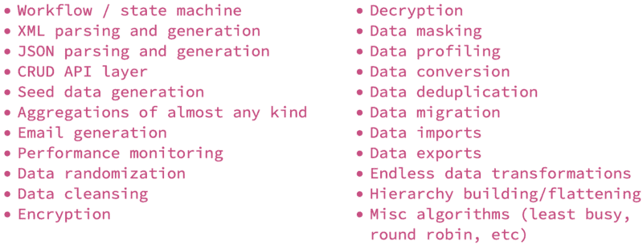
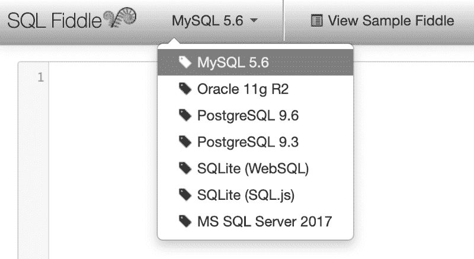
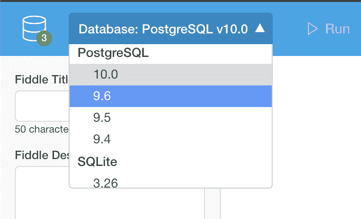

# 出于对 SQL 的热爱:为什么你应该学习它，它将如何帮助你

> 原文：<https://www.freecodecamp.org/news/for-the-love-of-sql-why-you-should-learn-it-and-how-itll-help-you-out-22fe307a253/>

我最近读了受人尊敬的 [@craigkerstiens](http://twitter.com/craigkerstiens) 写的一篇很棒的文章，描述了为什么他认为 SQL 对于开发人员来说是一项如此宝贵的技能。这个话题真的引起了我的共鸣。这与我已经开始为一篇类似的关于培养对数据的热爱的文章草拟的笔记很吻合。

然而，我越是充实我的主题，就越是意识到我的许多观点和例子似乎都是围绕 SQL 展开的。阅读 Craig 的文章使我改变了我的关注点，更多地谈论为什么我个人对 SQL 如此着迷。

简而言之，Craig 对 SQL 做了如下断言(我引用一下):

> 1.它对不同的角色和学科都很有价值

> 2.学过一次真的不需要重新学

> 3.你看起来像个超级英雄。当你知道这一点时，你似乎格外强大，因为有很多人说得不流利

我发现所有这些观点在我自己的经历中都是正确的，我想对每一点进行重新阐述和扩展。

#### 多功能效应

事实证明，SQL 技能是我职业生涯中极其宝贵的财富。事实上，我认为 SQL 是我所知道的最强大、最通用的“编程”语言。

我已经能够使用 SQL 来解决许多问题，每当我面临新的挑战时，它都是我的首选工具。事实上，我在我的笔记本电脑上运行了一个 PostgreSQL 的实例，这样每当我需要测试一些东西时，我就可以快速进入我最喜欢的 SQL GUI。

以下是我用 SQL 做的一些很酷的事情:

SQL FTW!

你很难相信上面的列表吗？我向你保证没有一点夸张。现在，是否有一些项目依赖于我当时使用的 RDBMS 的其他功能？当然可以。不管怎样，这些解决方案都是用 SQL 实现的。

#### 自行车效应

虽然结构化查询语言多年来经历了变化和扩展，但我同意 Craig 的观点，即基本原理没有改变。与其他语言相比，总体波动水平相对较低。

我认为这一事实只会加强人们应该花时间学习 SQL 的论点。您可以确信，您将从这样的投资中获得大量收益，而不必在下次需要使用它时查找最新的约定。

所以，学 SQL 吧！以下是一些开始的好地方:

[**SQL 教程—初学者必备 SQL**](http://www.sqltutorial.org/)
[*本 SQL 教程通过许多实际例子帮助你快速有效地入门 SQL。之后……*www.sqltutorial.org](http://www.sqltutorial.org/)

甚至还有互动教程:

[**SQLBolt —学习 SQL—SQL 简介**](https://sqlbolt.com/)
[*SQLBolt 提供了一套互动式的课程和练习，帮助你学习 SQL*sqlbolt.com](https://sqlbolt.com/)

也有一些通用的沙箱，允许您在各种方言中运行 SQL，而无需安装任何东西。比如 [SQL 拨弄](http://sqlfiddle.com/):

SQL Fiddle

或者， [DB 提琴](https://www.db-fiddle.com/):

DB Fiddle

#### 超级英雄效应

我记得一个同事曾经说过，每次他不得不写 SQL 的时候，他都会吓出一身冷汗。？

这听起来有些夸张，但是对于那些将数据库视为敏感资产并且不熟悉如何安全地与它交互的人来说，SQL 可能是一种威胁。作为房间里的成年人之一，SQL 也没有像其他闪亮的新编程语言一样受到关注。这意味着它仍然是当代和新兴开发人员中不太常见的技能。

因此，对 SQL 有扎实的理解，并能洞察给定问题或挑战的基于集合的方面，这为成为英雄提供了机会。

我最喜欢的个人经历之一是帮助客户调试一个缓慢而复杂的 SAS 程序。这个程序的目标是从审计表中提取一个状态转换列表，以便测量一个小部件在给定业务工作流的每个阶段所花费的平均持续时间。这些计算的实施很复杂，需要建立多个本地数据集。

我记得对这个程序进行了逆向工程，并意识到我可以使用一个 SQL 查询和神奇的 [LAG](http://www.sqltutorial.org/sql-window-functions/sql-lag/) 窗口函数更容易地解决这个问题。

这位顾客简直被惊呆了。

不仅仅是因为他了解了 LAG 函数，还因为他看到了 SQL 有多么强大。

一个更戏剧性的例子是在一次大型数据仓库迁移中，我替换了整个 Java 程序(花了 20 多分钟才完成！)只需几秒钟运行一个 SQL 查询。节目原作者惊呆了！那真是美好的一天。？

因此，我鼓励您今天就开始钻研 SQL，并使用我有幸使用过的最通用的工具之一来扩展您的技能。如果您已经了解 SQL 并同意，或者如果我已经说服您尝试一下，请考虑给我留下评论。