# JavaScript 中的扩展语法介绍

> 原文：<https://www.freecodecamp.org/news/an-introduction-to-spread-syntax-in-javascript-fba39595922c/>

作者阿莎·曼德瓦娅？️?？

# JavaScript 中的扩展语法介绍

#### 它是什么，我们为什么需要它？

Photo by [Anton Darius | @theSollers](https://unsplash.com/@thesollers?utm_source=medium&utm_medium=referral) on [Unsplash](https://unsplash.com?utm_source=medium&utm_medium=referral)

JavaScript 的 ES6 规范中引入了 spread 语法。事实证明，它是一段有价值的代码，使代码变得清晰易懂。

MDN 将 **…** 定义为:

> **Spread 语法**允许在需要零个或多个参数(用于函数调用)或元素(用于数组文字)的地方扩展一个可迭代对象，例如一个数组表达式或字符串，或者在需要零个或多个键值对(用于对象文字)的地方扩展一个对象表达式。

让我们都同意，上述定义是屈指可数的，我们没有人抓住它想说的一个词。因此，让我们从关于 spread 语法的最基本的东西开始。

*   扩展操作符只有 3 个点`...`
*   它可以用在像数组或字符串这样的可迭代对象上。
*   它将一个 iterable 扩展为它的单个元素
*   它可以提供带有数组(或任何其他可迭代的数组)的函数调用，其中应该有 0 个或多个参数。

**例子**

下面的代码片段包含一个名为 sum 的函数，它需要 3 个参数 x、y 和 z。我们有一个包含 3 个元素的数组，我们希望将数组中的元素作为函数的参数传递。

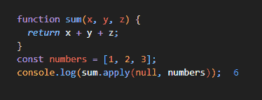

在引入 spread 操作符之前，这是通过 apply 函数实现的。

引入扩展操作符后，这可以非常简单地完成:

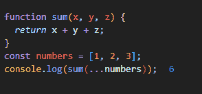

从上面带有 spread 操作符的代码片段中可以看出，我们不必使用 apply 函数。这使我们不必编写更多的代码。

上面的例子给出了一个关于 spread 操作符的非常粗略和简单的概念。首先，让我们进入更多的细节，然后我们将看到更多的例子。

### 句法

扩展运算符可用于多种方式和场景，例如

*   **内部函数调用**

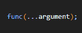

在上述场景中使用时，`…`被称为 rest 参数。我们将在示例部分看到与此相关的示例。

*   **创建/扩展数组/iterable:**

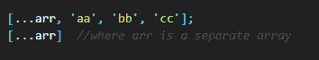

### 例子

*   **作为休息**

…用作变量函数的参数。一个变量函数是一个参数个数可变的函数。

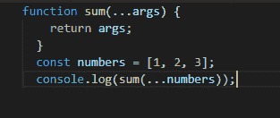

在这里，当我们返回参数时，我们看到我们得到了数组，我们在调用中把它作为单独的值传递。这表明 rest 操作符实际上与 spread 语法完全相反。一个扩展，一个浓缩价值。

还有一点需要指出的是，函数定义中并没有提到具体的参数个数。这意味着使用…函数可以有 n 个参数。我们不需要预先指定参数。

对于像 Math.max 和 Math.min 函数那样不确定参数具体数量的函数，这是一种非常灵活的接收参数的方式。它们是变量函数，因为对它们来说输入的数目可以是无限的。

回到这个例子，得到所有参数的和

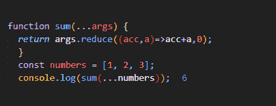

我们必须迭代数组并添加所有单个元素来产生结果。

*   **推送数组中的元素**

push()函数用于将元素推入数组。push 的局限性是我们必须一个一个地推送元素(push(1，2，3))。如果有一个数组的元素要使用 push 插入到数组中，我们将得到一个多维数组，这不是我们要求的。

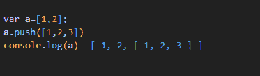

再次申请救援

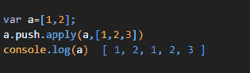

正如我们所看到的，使用 apply 看起来并不优雅，我们需要一个简单的小语法来做到这一点。让我们用传播…

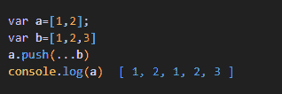

优雅！

*   **复制数组**

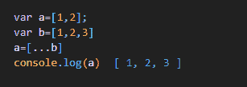

简单！

使用对象可以产生相同的结果

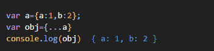

*   **连接两个数组**

连接是使用 concat 函数完成的

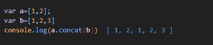

使用…运算符也可以达到同样的效果

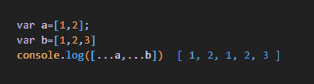

*   **将字符串转换成数组**

这可以使用 split 函数和…运算符来完成

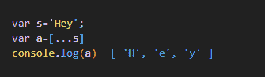

*   **在最大和最小功能中使用**

下面的代码片段倾向于寻找数组中的最大元素，所以我们在函数中传递整个数组，但是我们得到的结果是 NaN

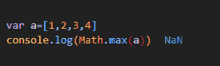

我们可以使用 apply，但是从前面的例子可以看出，我讨厌使用它

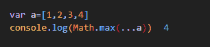

分钟相同

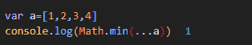

### 结论

我们看到了许多情况，spread 操作符派上了用场，减少了我们的代码，也使它变得非常容易理解。

如果你喜欢鼓掌？然后跟着？为了更多。

Google