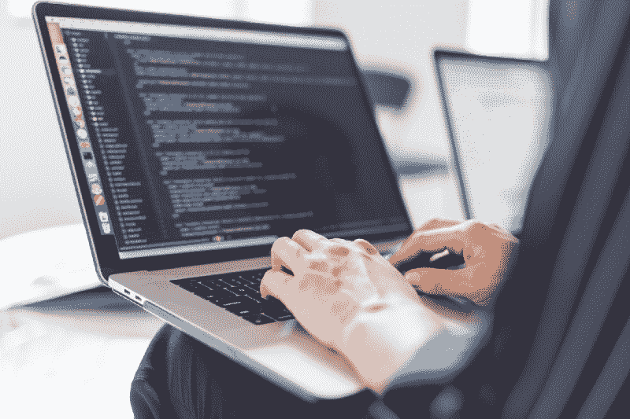

# 从机械师到程序员:追寻梦想如何改变我的生活

> 原文：<https://www.freecodecamp.org/news/from-mechanic-to-coder-how-following-my-dreams-changed-my-life-ef93b796ca72/>

大卫·布鲁诺

# 从机械师到程序员:追寻梦想如何改变我的生活

我仍然记得我指甲下的泥土，海湾的声音，锤子的叮当声，引擎的转速。漫长的工作时间，酸痛的背部，持续 30-40 分钟的淋浴。

今天，我在家里写这篇文章，为我作为一名程序员的最新任务做准备。这与过去大相径庭——并且表明了追随梦想和改变现实生活的目的。别担心:这不傻。开始了。

### 进入汽车

从小到大，我没什么特别的。我没有让自己与众不同的特质——无论是在学校还是在我自己的家里。唯一让我与众不同的是多动症。如果有什么东西是我想学的并锁定在我的记忆中，我必须重读或练习很多次。我在学校成绩一直不好——我是一个 C 和 D 的学生——我只是做了一些勉强过得去的事情。我不一定不同意学习；我只是不喜欢被人告诉做什么或学什么。

我也很难确定自己的兴趣或者我可能对什么充满热情。我唯一真正喜欢的事情是玩电子游戏。然后第一部《速度与激情》电影出来了。我记得看那部电影时，对汽车、所有的引擎、涡轮、颜色、车轮脱离路面的声音感到兴奋。当时我 15 岁。我记得特别着迷于进口调音师文化。

从那天起，我开始对赛车生活产生了兴趣。我最终通过购买我的第一辆——2000 款本田思域 Si，对进口调谐器产生了兴趣。这是一辆老爷车，也没人管理。但它有一个五速手动变速器，可以跑来跑去。

### 发现我的超能力

当我 18 岁的时候(那一年是 2012 年)，我就读于瓦特罗特学院。我的目标是成为一名专业的汽车技师，很快我就发现自己上了学校的光荣榜。但大约在那个时候，我退学了。这是因为我意识到我有一种特殊的能力:自学任何东西的能力。

例如:97 年的本田 Prelude。我没有请老师或比我高一级的学生帮忙修理，而是下载了一本维修手册，把车开到学校的停车场，把车拆开，修理坏掉的东西。学习是通过反复试验进行的，但我意识到——我完全有能力自学。

甚至商店的老师也印象深刻:他们会告诉其他学生在我工作的时候看着我。

然后是债务。在大学注册的三个月里，我欠下了 8000 多美元的学生贷款，如果我在那里呆了整整两年，我会欠下超过 40000 美元的债务，利率非常高。

这证实了我的认识:我完全有能力自学，我可以在外面找到一份能让我边学边付的工作。

我做到了。离开大学后不久，我找到了当地的一家汽车性能商店，他们修理任何有发动机的东西。他们还改装汽车，安装性能部件。为他们工作，我能够在十个月内还清 8000 美元的债务。

我从 2013 年 8 月到 2017 年 10 月担任汽车技术员。我变得非常擅长我所能做的，并且有一个非常棒的老板；然而，这是一项艰苦的劳动，因为我们有一个小的五湾店，它需要提前 2-3 周预订，以便人们将他们的汽车送去维修。

每天，我都要移动 15 到 30 辆车来打开商店，然后把它们都搬回原处，关门大吉。大约 90%的时间，我都在户外，不管天气如何——热或冷，雨或雪，拉发动机，放下变速器和许多其他劳动密集型的工作。

大约就在那个时候，我的身体和思想都感到疲倦了。我厌倦了在这样的条件下工作，而且工资也不是很高。我想从生活中得到更多，因为我是一个有昂贵汽车爱好的房主，作为一名机械师的收入是不够的。

我知道还有更多:一份能让我舒适生活的工作，不用为了支付账单而拼命工作。大约是在 2017 年初，我终于开始认真起来。我知道要改变我的生活，我需要采取行动。

尽管我每天都在工作，我会变得疲惫不堪，筋疲力尽，而且十次有九次被肮脏的工作弄得脏兮兮的，但我会回家并开始学习我能做什么。我看了很多东西:在线买卖产品，零售套利，创办直运公司，建立被动收入。我还研究了职业，那些能让我过上高薪舒适生活的职业。

目标是远程工作，赚大钱。我尝试了很多东西，但是似乎没有一样对我有用。我从未放弃。我知道有些东西会吸引我，让我感兴趣，让我过上梦想的生活。

### 做出改变

后来，我的一个朋友，他和我一起在汽车修理厂工作，得到了一份配置、诊断和修理路由器的夜间工作。他在做思科 CCNA 的工作，没有大学学历，也没有工作经验来获得这份工作。他的报酬很高(如果他全职为公司做这件事，他会赚到六位数的薪水)，而且仅仅是通过推荐人就得到这份工作。我简直不敢相信。

那时，我第一个家的账单给了我压力。而他就在这里，远程工作，不做任何体力劳动，而且报酬很高。他基本上是伪造的，直到他成功了——你可以打赌，他确实成功了。

他告诉我，“开始学习思科 CCNA 的工作。如果有职位空缺，我会设法让你进去。”

所以我开始研究在线课程和提供 CCNA 认证课程的学校。大约在 2017 年 7 月，我偶然发现了一所开设该课程的当地学校。它被称为新视野计算机技术。我提交了我的信息，然后接到了招聘人员的电话。

我们聊了足足 30 分钟，他解释说我想要的课程很贵:两周的课程总共 6000 美元。我很失望。我过着一张接一张的生活，通常我的钱只够支付账单和存一点点。

招聘人员理解。他告诉我，田纳西州有一个特殊的资助项目，为 25 岁以下、年收入不到 3 万美元的成年人提供免费课程。我只有 24 岁，这给了我希望。

他让我去参加一个迎新会，我带来了一些具体的文件，比如高中学位、出生证明和工资单，以证明我是合格的。他们收集了信息并发送出去。将近三个星期过去了，我终于接到了电话。

他们会支付课程费用。

这个新的可能性让我兴奋不已，我开始满足这所学校的所有入学要求。几个星期过去了，学校和我达成了一项协议，因为我以前没有从事思科计算机工作的经验，我将在前两周参加 Comptia A+,在第二周加入思科。

即使我没有什么经验，我也会尽我所能去学习，这样当一个职位空缺时，我就会准备好去得到它。

这些课程就像一个典型的工作周:周一到周五，早上 8 点到下午 5 点，总共四周。让这在经济上可行的好的一面是，我可以选择哪几周去上课。这给我带来了希望:“我有办法，”我想，“摆脱这种日复一日的辛苦工作和靠薪水过活的循环。”

日期定在 2017 年 10 月。

但是我也知道我的工作不允许我离开这么长时间。这是一步，而且是很大的一步。我选择在十月的第一个星期一递交两周前的通知。

我把所有的钱都押在这套卡片上——这是一种新的职业选择的新可能性。不要误解我的意思:我从未在没有找到下一份工作的情况下离职。我有几份兼职工作，如果事情变得太困难，主管愿意当场雇用我。

在离开工作的几个月前，我制定了一个计划。我尽可能多地存下我的工资。我削减成本和账单，那些我不需要的东西，比如网飞法案。我意识到，如果我想改变我的生活，我必须暂时搁置我所有的需求。

我也很会计时。我把课程分散开，这样我就可以兼职做电工、木匠、电脑修理工和汽车技师。作为一个“如果一切都失败了”的备用计划，我有一个命名的品牌性能零件库存，这是我多年来为一个项目车积累的。如果没有别的，我可以卖这些。

我有一个计划，正在向前推进，但是很困难。我不能再为我爱的人买东西，而且我的头上还有抵押贷款。这是非常令人生畏的，我很害怕，但我不能让我的恐惧接管我。我努力增强自己。

我开始研究成功人士，不仅仅是富人。一些灵感来自那些建立成功公司的人。苹果、戴尔、特斯拉、Space X，埃隆马斯克是一个巨大的灵感。

激励视频和自我提升视频不断在我的手机和电脑上播放。当成功人士发言时，我会注意他们的习惯，因为我知道成功始于日常的小习惯，这是我立即应用的洞察力。

2017 年 12 月临近了。我上思科课程的最后一周，我意识到，对于一个人来说，在短短两周内掌握两项认证考试——ICND-1 和 ICND-2——的所有知识几乎是不可能的。

与此同时，学校的顾问正在通知我任何初级 IT 职位的空缺。但我气馁了。我参加了面试和招聘活动，却被告知我的起始时薪是 14 美元，因为我没有神奇的 IT 背景或大学学位。

我相信你能感受到我的沮丧。我努力工作到现在，冒了很大的风险。最后一天的课来了又去。我死记硬背了所有的知识，很快发现我讨厌思科课堂上的东西。天气干燥、无聊，而且我患有多动症，很难集中注意力。

当时的情况是这样的:第一轮测试由于拨款而得到了支付；然而，如果我失败了，我必须支付测试的费用。一次测试大概要 300 美元，即使我通过了，我开始的时候挣的钱还是比全职机械师少。我知道，就我的账单而言，这是行不通的。

为他们学习需要三到六个月。我决定不服用它们，这是难以下咽的苦果。我已经在这个课程上投入了如此多的时间，以至于我认为这是我的“黄金门票”

失望刺痛了我。

12 月底临近了，我仍然没有一个新年的行动计划。我想在 IT 领域找份工作，但我不能在底层工作几年，收入很少。但是我相信我的动机。我需要不断尝试不同的事情，投资自己，做兼职，直到我找到我想要的。

### 游戏规则改变者

2018 年 1 月来了。我在听一个非常成功的人的励志视频。他说，“如果你想成功，那么你需要和成功的人在一起。”然后他提到了一些具体的东西:一个叫 MeetUp 的 app。

不久后我下载了它，它成了我一生中最好的决定。

在 app 里，我很快搜索了技术，找到了一个子类别，叫做区块链。我对此知之甚少，只是有一个 coinbase 钱包，里面有少量的钱投资于比特币、以太坊、莱特币。但这引发了我的好奇心。它引起了我的注意。

弹出一个本地聚会列表。会员最多的一个叫 Blockchain901 (901 是孟菲斯的区号)，他们计划在一月底开会，就在我下载应用程序的三天后。

你相信命运吗？

我认为这就是它发挥作用的地方。

因为，在我调查区块链的同时，我也在探索房地产的选择。人们在房地产上赚了很多钱，这是积累大量被动收入的一种方式。而且，你可能已经猜到了，最快的聚会被安排在与区块链聚会完全相同的日期，完全相同的时间。

我沉思着。两起事件都发生在城市的不同地方。我选的那个将会是我坚持的那个。

那天到来时，正下着倾盆大雨。这要么是一个信号:不要去或克服障碍。我不知道我会让自己陷入什么样的境地，我知道任何一个选择都会让我脱离自己的舒适区。但这是必要的:为了实现我的梦想，我必须全力以赴，走出去。

我写下了房地产聚会和区块链聚会的利弊。对于房地产，我知道我会挣扎。我几乎没有积蓄用于投资。但是区块链会议提供了机会。我可以投身于对区块链的了解，这可能会带来一份报酬更高的工作。我觉得我和区块链在一起的机会更大，于是我坚持到底。

我穿过暴风雨来到联邦快递技术学院，它位于孟菲斯大学校园内。当我到达时，我很紧张。我不知道会发生什么。我早到了几分钟，穿过校园，房间已经满了。我被吹走了。

幸运的是，房间的最前面有一个空位。我赶紧走到它跟前，拿着笔记本坐了下来。这么多人可能是因为一个特殊的原因:有一位专程从台湾飞来的特邀演讲者(他是区块链业界的一个大人物，名叫 Everex)。在演讲嘉宾旁边的是一位名叫布莱恩的本地 Memphian。

当聚会开始的门关上时，我环顾了一下四周。这是一个巨大的教室，每个座位都坐满了，人们站在墙边，准备听演讲。一个 60 人左右的教室里必须有 100 人。

有介绍。Brian 自我介绍说，他是孟菲斯当地的一名软件开发人员，专攻区块链，同时还在孟菲斯创办了一家区块链公司。

随着两个小时的聚会飞逝而过，我做了很多笔记，并问了几个问题。当它结束时，人们开始分散，我鼓起勇气接近布莱恩。

我无视自己的紧张、害羞和焦虑，径直走上前说道:“嘿，伙计，我喜欢你的演讲和课上的内容。我想问问你们是否有职位空缺，或者我是否可以过来跟你们一起学习。”

布莱恩困惑不解，猝不及防。

就在他犹豫的时候，另一名男子迅速走过来，介绍自己叫亚伦。他说，“你真的想学这些东西？”

“当然，”我说。

“好，那这是我的联系方式。你要在市中心这个地址见我。”

我的情绪非常复杂。一方面，我对未来的发展充满了兴奋，但另一方面，我又对未知充满了怀疑和恐惧。

布莱恩和亚伦聊了一会儿，然后对我说，“完全和亚伦一起去。他是个好人，会告诉你需要开始做什么。”

在聚会和我与亚伦的预定会面之间，我做了我应该做的事情。2018 年 2 月 2 日，我写了第一行代码，第一次 Git 推送到 github。我联系了亚伦，确认了时间和地点。

朝着孟菲斯市区的方向，我走近给我的地址。它把我带到了一座巨大的 19 层摩天大楼。他告诉我在 19 楼见面。我记得我当时觉得多么疯狂——我在一座巨大摩天大楼的顶层遇见了这个男人。

我走近房间，敲了敲门。亚伦打开它，很快我注意到所有的窗户俯瞰几乎所有的孟菲斯市中心。房间里有一张桌子，上面放着他的 MacBook。

他让我坐下，向我展示了他正在做的项目。有前端和代码的变化是基本的 HTML 和 CSS，我没有任何经验。他指示我找出如何改变前端，并添加一些风格。

不知道该怎么办，我谷歌了我的心脏。我寻找完成这项任务所需要的知识，一种复杂的情绪在我体内流动——绝望、害怕失败、兴奋。令人惊讶的是，我很快就明白了。那种古老的能力——自学任何东西——占据了主导地位。

艾伦看到了我的潜力。他给了我一些建议:利用空闲时间在一个名为 freeCodeCamp 的网站上学习。然后，和他一起工作了几天后，他给了我一个机会，让我按小时付费，继续帮助他完成他的项目。这并不多，但也是值得的，而且拿工资学习比其他方式要好的多。

几周过去了。我继续在周末的深夜会见 Aaron，连续 8 个多小时不停地编码。在工作日，我做兼职，利用空闲时间学习。

这个机会给了我对未来的希望。

### 终于成功了

最终，我再次见到了布莱恩和 Web3Devs 团队的其他成员。他们给了我更多的任务，看我如何处理，我超出了预期——因为我决心不失败。

2018 年 8 月 21 日，我收到了我作为 Web3Devs 初级软件开发人员的第一份工资支票。从那以后，我被赋予了更多的责任，接待客户、处理会议、安排活动等等——仍然是在编码和学习的时候。

很快，他们带我去参加黑客马拉松。

2018 年 9 月 6 日，我们飞往怀俄明州参加区块链黑客马拉松。我很兴奋——一边旅行一边领工资。黑客马拉松大获成功。我们赢得了四项奖金，包括一等奖。当活动现场直播时，站在舞台上是一个神圣的时刻。

两周后，我们去了亚特兰大参加 ETH-Atlanta 黑客马拉松，在那里我们再次获得了第一名。

随着这些事件的发生，更多的工作机会向我走来，更多的大门向我敞开。很快，11 月 9 日到了，我们飞往旧金山参加 EOS-Hackathon。竞争是巨大的，因为有来自世界各地的旅行者和大量的现金奖励。

虽然我们没有获得第一名，但这是我最喜欢的旅行。我们建立了大量的联系，我向团队证明了自己。对我来说这是一个巨大的成功。

然后，随着 2019 年新年夜的到来，我回顾了 2018 年，它是如何开始的，又是如何结束的。我开始时没有固定的薪水，也没有如何让我的生活变得更好的计划。事情变得艰难了——抵押贷款的支付，收入的损失，前进的挑战。

但是事情变好了。我研究了成功人士的习惯。我应用了他们所说的。合适的机会出现了，我向前迈进，有时带着疑问，有时需要勇气，但我做到了，我实现了我想要实现的目标——成为一名远程软件开发人员，过上我想要并开始过的生活。

### 最后的想法

在这个故事中，我想说的是——也希望分享和传达的是——无论事情有多艰难，无论你肩上的担子有多重，无论你失败或挣扎了多少次，都不要放弃。永远不要放弃为你生活中真正想要的东西而奋斗。不管你受过什么教育，做什么工作，你都可以实现你的梦想。如果那是编码，那就是编码，但也可以是其他任何东西。这个故事中的教训可以应用到你所热爱的任何事情上。你是你命运的创造者。

鳍。(下面的额外部分是为那些希望开始编码的人准备的)

#### 给你一些建议

如果你刚开始(或打算开始)做程序员，这里有一些额外的建议。

第一，对于一门编程语言，我建议追求 **JavaScript** 。JavaScript 是一种脚本语言，允许你在网页上实现复杂的事情。它由 HTML、CSS 和各种其他框架组成，如 nodeJS 和 React(一种流行的脸书语言)。JavaScript 可以应用于很多东西，包括区块链应用程序。与其他编程语言相比，使用 JavaScript 也更容易获得入门级工作。

我推荐的**网站**如下:

freeCodeCamp.org 是一个完全免费的网站，你可以在这里详细了解 JavaScript、NodeJS、React 以及其他很多东西。你必须自学，因为没有任何视频。只是简单的代码。

另一个网站，**uDemy.com**，如果你喜欢和老师一起学习代码，也有很好的课程。这些课程既深入又冗长，有些课程超过 40 个小时。双显示器方法有助于教师的视频。我参加并推荐的一门好课程是安德鲁·米德的《现代 JavaScript Bootcamp (2019)》。uDemy.com 也有定期促销，所以你可以以低至 10 美元的价格买到课程。

最后，如果你对作为一名程序员开始在区块链工作感到好奇，那么在学习了一些 JavaScript 之后，我推荐一个名为**隐僵尸的网站。这是一个完全免费的游戏，教你如何使用 Solidity 作为编程语言编写 Ethereum 智能合同，同时构建一个僵尸军队。这个游戏是为了启发和教中学的孩子如何编码而设计的，游戏的创作者总是在增加更多的章节。坚固性很像 Javascript，这让它成为区块链的一个良好开端。**

列出的这三件事会让你成为一个知识渊博的程序员。永远记住习惯就是一切。每天练习 30 分钟会让你在年底前进步很多。进展可能会让你吃惊。