# 如何用 Firebase 和 Redux 连接 React 设计系统

> 原文：<https://www.freecodecamp.org/news/how-to-connect-a-react-design-system-with-firebase-and-redux-9646ca1c733f/>

by Nazare Emanuel Ioan

# 如何用 Firebase 和 Redux 连接 React 设计系统


在与 [Creative-Tim](https://www.creative-tim.com/?ref=trrfadr-medium) 的 [ReactJS](https://reactjs.org/) 一起工作了将近两年之后，这些年来我一直在创建简单的前端 ReactJS 项目、前端模板，我已经开始学习更多关于 React 的知识，并创建一些教程。

在长时间观看和阅读 firebase 教程、firebase & react 教程以及 firebase 的官方文档后，我准备给自己写一个教程。

**我将在这篇小教程文章中使用:**

*   [npm@6.4.1](https://www.npmjs.com/package/npm)
*   [nodejs @ 10 . 15 . 3(lt 版本)](https://nodejs.org/en/)
*   [Atom 编辑器版本 1.35.0](https://atom.io/)
*   [反应陷阱](https://reactstrap.github.io/)

我们将使用 Redux 和 Firebase 进行登录、注册和创建一些动态统计卡。

我将把我的注意力集中在 Firebase 上，并就此给出解释。如果你不知道 Redux，最好看看我的另一个教程[关于 Redux 是什么，它做什么](https://medium.freecodecamp.org/how-to-use-redux-in-reactjs-with-real-life-examples-687ab4441b85)。之后，你可以很容易地回到这里。

### React 设计系统入门

由于我们没有时间来创建我们自己的设计系统——这需要几天、几周甚至几个月的时间——我们将采用一个我已经做过的系统。

要获得这个项目，你可以做以下之一(我将使用第一个选项):

*   从 Github 克隆:

```
git clone https://github.com/creativetimofficial/argon-dashboard-react.git
```

*   [从 Github](https://github.com/creativetimofficial/argon-dashboard-react/archive/master.zip) 下载(按下链接，会自动开始下载)
*   [从 Creative-Tim](https://www.creative-tim.com/product/argon-dashboard-react) 下载(你需要在那里有一个账户)

拿到项目后，将 cd 放入其中(在我的情况下将是):

```
cd argon-dashboard-react
```

让我们启动产品，看看它是什么样子的:

```
npm run install:clean
```

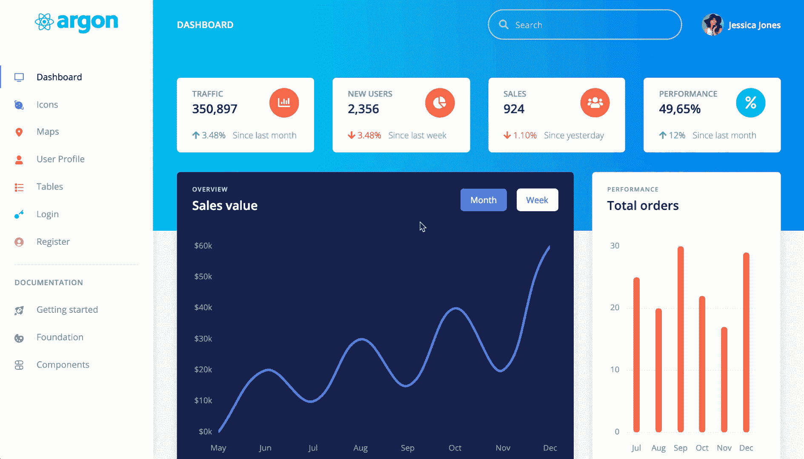

npm run install:clean — output

### 将 Redux 添加到这个 starter 模板

#### 动作、减少器和存储

让我们回到终端并运行:

```
npm i -E redux redux-thunk react-redux
```

当我运行这个命令时，我的机器上安装的版本如下:

*   redux@4.0.1
*   redux-thunk@2.3.0
*   react-redux@6.0.1

在本教程的开始，我们已经设定了目标，要实现两件事:登录和注册(auth)以及能够从我们的数据库添加一些动态卡(简单的 add)。这意味着我们将有两个归约器，一个用于认证，一个用于动态卡(此外，我们将需要一个根归约器来组合这两个归约器)。我们还将有四个动作，一个用于登录，一个用于注册，一个用于将卡片添加到我们的数据库(您可以将这些视为一些待办事项)，一个用于从数据库获取所有这些卡片(我们将在我们的应用程序中呈现)。而且，只是一个商店。

也就是说，让我们运行以下命令:

1 — Linux/Mac 命令

```
mkdir src/actionsmkdir src/reducerstouch src/actions/addStatCardAction.jstouch src/actions/getAllStatCardsAction.jstouch src/actions/loginAction.jstouch src/actions/registerAction.jstouch src/reducers/statCardReducer.jstouch src/reducers/authReducer.jstouch src/reducers/rootReducer.jstouch src/store.js
```

2 — Windows 命令

```
mkdir src\actionsmkdir src\reducersecho "" > src\actions\addStatCardAction.jsecho "" > src\actions\getAllStatCardsAction.jsecho "" > src\actions\loginAction.jsecho "" > src\actions\registerAction.jsecho "" > src\reducers\statCardReducer.jsecho "" > src\reducers\authReducer.jsecho "" > src\reducers\rootReducer.jsecho "" > src\store.js
```

#### 行动

**src/actions/addstatcardaction . js**

我们想要动态创建的 stat 卡是其中之一:


stat cards to dynamically create

正如我们所看到的，它们有一个名称、一个统计数据、一个图标(颜色不同)、一个页脚图标和百分比(颜色也不同)以及一个页脚文本。

因此，我们需要创建接受上述所有内容的操作，如下所示:

```
const addStatCardAction = (  statName,  statDescription,  statIcon,  statIconColor,  statFooterIcon,  statFooterIconState,  statFooterPercentage,  statFooterText) => async dispatch => {  // here we'll make a call to our database (firebase)  // to add our new stat card with the above details
```

```
 dispatch({    type: "addStatCard",    payload: {      statName: statName,      statDescription: statDescription,      statIcon: statIcon,      statIconColor: statIconColor,      statFooterIcon: statFooterIcon,      statFooterIconState: statFooterIconState,      statFooterPercentage: statFooterPercentage,      statFooterText: statFooterText    }  });};
```

```
export default addStatCardAction;
```

正如我们所看到的，我们将使用异步动作创建者，因为我们要调用数据库。通话结束后，我们需要将刚刚添加到 firebase 数据库中的数据发送到我们的商店。

**src/actions/getallstatcardsaction . js**

这个不需要任何参数，因为它只从数据库中检索一些东西。因此，代码将如下所示:

```
const getAllStatCardsAction = () => async dispatch => {  // here we'll make a call to our database (firebase)  // that will retrieve all of our stat cards
```

```
 dispatch({ type: "getAllStatCards" , payload: {}});};
```

```
export default getAllStatCardsAction;
```

**src/actions/loginaction . js**

对于登录，我们将有一个电子邮件和一个密码，所以这是此操作的代码(我们的登录表单也有一个电子邮件和一个密码):

```
const loginAction = (email, password) => async dispatch => {  // at the moment, since we haven't yet connected to the database  // we are going to say that each time we try to login  // we should not be able to log in (that is why we send false)
```

```
 dispatch({ type: "login", payload: false });};
```

```
export default loginAction;
```

**src/actions/register action . js**

```
const registerAction = (name, email, password) => async dispatch => {  // at the moment, since we haven't yet connected to the database  // we are going to say that each time we try to register  // we should not be able to register (that is why we send false)
```

```
 dispatch({ type: "register", payload: false });};
```

```
export default registerAction;
```

#### 还原剂

**src/reducers/statcarddreducer . js**

因为我们有两个关于 stat 卡的动作，所以在这个 reducer 中有两种情况:

```
export default (state = {}, action) => {  switch (action.type) {    case "addStatCard":      console.log("adding ", action.payload);      // since we will always fetch our stat cards      // from firebase, each time we add one new      // we will just return the state      return state;    case "getAllStatCards":      console.log("getting ", action.payload);      console.log(action.payload);      return {        // keep the old state        ...state,        // add all the cards from the database        // they will come in a json format,        // so we need to convert them to array        statCardState: Object.values(action.payload)      };    default:      return state;  }};
```

我们还记录了我们添加的内容以及我们试图从 firebase 中获取的内容。

**src/reducers/auth reducer . js**

```
export default (state = {}, action) => {  switch (action.type) {    // in both cases, we want to tell our app,    // if the user is logged in or not    // if the user registers, he will automatically be logged in
```

```
 case "register":      console.log("register is ",action.payload);      return {        // keep old state        ...state,        // add true/false if the user is or not logged in        loggedIn: action.payload      };    case "login":      console.log("login is ",action.payload);      return {        // keep old state        ...state,        // add true/false if the user is or not logged in        loggedIn: action.payload      };    default:      return state;  }};
```

当我们注册新用户时，我们会自动让他们登录。我们还添加了一些日志来查看注册或登录是否成功。

**src/reducers/root reducer . js**

这是为了结合上述减速器:

```
import { combineReducers } from "redux";
```

```
import authReducer from "reducers/authReducer";import statCardReducer from "reducers/statCardReducer";
```

```
export default combineReducers({  // the authReducer will work only with authState  authState: authReducer,  // the statCardReducer will work only with statCardState  statCardState: statCardReducer});
```

#### 商店

**src/store.js**

由于我们有异步动作创建器，我们需要一个中间件来允许我们使用这些动作创建器，因此使用了 redux-thunk:

```
import { createStore, applyMiddleware } from "redux";import reduxThunk from "redux-thunk";
```

```
import rootReducer from "reducers/rootReducer";
```

```
function configureStore(  state = { authState: {}, statCardState: {} }) {  return createStore(rootReducer, state, applyMiddleware(reduxThunk));}
```

```
export default configureStore;
```

#### 将我们的应用连接到我们的商店

目前，如果我们要启动我们的应用程序，什么也不会发生，因为所有的动作和我们的商店都不会在我们的应用程序中呈现。这就是我们现在要做的。

首先，让我们添加我们的商店，为此，我们需要 fo inside **src/index.js** 。

在 **ReactDOM.render()** 函数之前，我们需要添加以下导入:

```
import { Provider } from "react-redux";import configureStore from "store";
```

之后，我们将把来自 **ReactDOM.render()** 函数的 **BrowserRouter** 包装在 **Provider** 标签内，如下所示:

```
<Provider store={configureStore()}>  <BrowserRouter>    <Switch>      <Route path="/admin" render={          props => <AdminLayout {...props} />      } />      <Route path="/auth" render={          props => <AuthLayout {...props} />      } />      <Redirect from="/" to="/admin/index" />    </Switch>  </BrowserRouter></Provider>,
```

我们的下一个关注点是让我们的用户在没有经过身份验证的情况下被重定向到登录页面，如果经过身份验证，则被重定向到用户页面。基本上，如果他们登录，他们将无法访问授权布局( **src/layouts/Auth.jsx** )，如果他们没有登录，他们将无法访问管理布局( **src/layouts/Admin.jsx** )。

让我们进入 **src/layouts/Auth.jsx** ，在 **React** 导入之后，进行如下导入:

```
import { connect } from "react-redux";import { Redirect } from "react-router-dom";
```

之后，让我们将该组件的导出更改如下:

```
const mapStateToProps = state => ({  ...state});
```

```
export default connect(  mapStateToProps,  {})(Auth);
```

之后，我们进入这个组件的**渲染函数**，在**返回**之前，添加下面的代码:

```
if (this.props.authState.loggedIn) {  return <Redirect to="/admin/user-profile" />;}
```

因此，如果用户通过身份验证，他们将被重定向到他们的个人资料页面。

接下来，我们进入 **src/layouts/Admin.jsx** 并对 **Auth** 布局进行同样的修改。因此，添加以下导入:

```
import { connect } from "react-redux";import { Redirect } from "react-router-dom";
```

将其导出更改为:

```
const mapStateToProps = state => ({  ...state});
```

```
export default connect(  mapStateToProps,  {})(Admin);
```

再次，在**渲染函数**中，在**返回**之前我们添加:

```
if (!this.props.authState.loggedIn) {  return <Redirect to="/auth/login" />;}
```

这次，我们说**！this . props . authstate . logged in**，因为我们希望用户在未经身份验证的情况下被重定向到登录页面。

让我们重新开始我们的项目，看看每次当我们试图导航到**仪表板**或**个人资料**时，我们是如何被禁止的，因为我们没有登录。

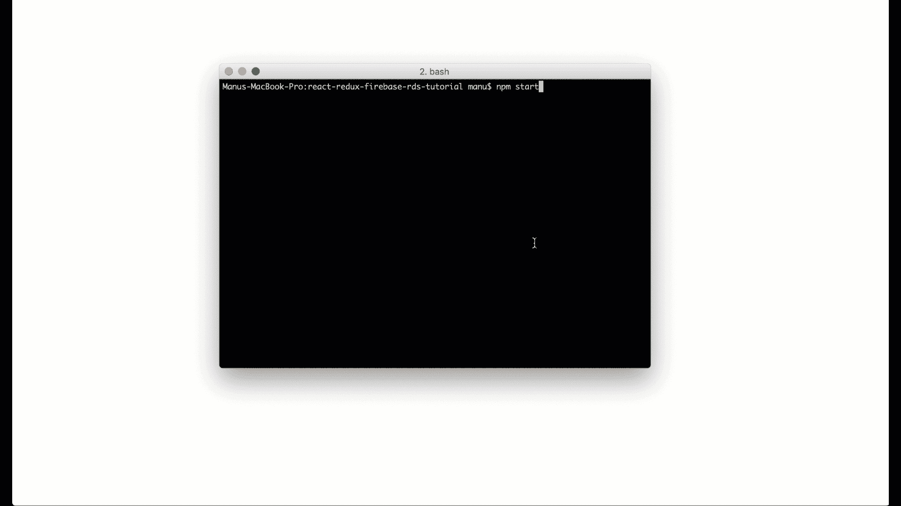

Project after adding the redirects

现在，我们需要进入**登录**和**注册**视图页面，并向它们添加 Redux。

#### 使用 loginAction 将我们的登录页面连接到 redux

首先，让我们进入**src/views/examples/log in . jsx**，在 **React** 导入之后，添加这些导入:

```
import { connect } from "react-redux";
```

```
import loginAction from "actions/loginAction";
```

然后，将文件末尾的导出更改为:

```
const mapStateToProps = state => ({  ...state});
```

```
const mapDispatchToProps = dispatch => ({  loginAction:   (email, password) => dispatch(loginAction(email, password))});
```

```
export default connect(  mapStateToProps,  mapDispatchToProps)(Login);
```

现在，在渲染函数之前，我们写:

```
state = {  email: "",  password: ""};onChange = (stateName, value) => {  this.setState({    [stateName]: value  });};
```

我们需要为电子邮件和密码保存一个本地状态，并将这两个发送到我们的 firebase。

然后，我们需要将*行 85* 从:

```
<Input placeholder="Email" type="email" />
```

收件人:

```
<Input  placeholder="Email"  type="email"  onChange={e => this.onChange("email", e.target.value)}/>
```

我们还会将第 99 行的*从:*

```
<Input placeholder="Password" type="password" />
```

收件人:

```
<Input  placeholder="Password"  type="password"  onChange={e => this.onChange("password", e.target.value)}/>
```

我们差不多准备好登录了。接下来我们需要更改按钮中的**符号，这样当我们按下它时，它将调用**登录操作**。所以把它从:**

```
<Button className="my-4" color="primary" type="button">  Sign in</Button>
```

收件人:

```
<Button  className="my-4"  color="primary"  type="button"  onClick={() =>    this.props.loginAction(      this.state.email,      this.state.password    )  }>  Sign in</Button>
```

现在回到您的浏览器，在**登录**页面，打开您的控制台，尝试登录。你应该得到一个输出**登录是*假*。所以我们知道我们的**动作**和我们的**减速器**工作。**

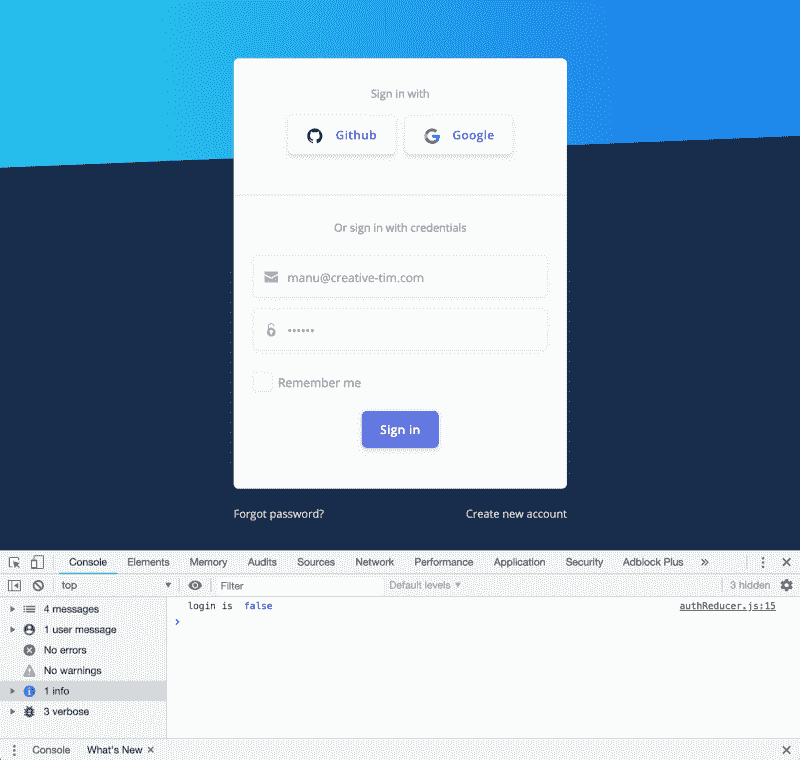

**login is false**

#### 使用注册将我们的注册页面连接到 redux

进入**src/views/examples/register . jsx**内部，进行与上面相同的操作。所以首先添加导入(这次是用**注册动作**):

```
import { connect } from "react-redux";
```

```
import registerAction from "actions/registerAction";
```

然后，导出到:

```
const mapStateToProps = state => ({  ...state});
```

```
const mapDispatchToProps = dispatch => ({  registerAction: (name, email, password) => dispatch(registerAction(name, email, password))});
```

```
export default connect(  mapStateToProps,  mapDispatchToProps)(Register);
```

在**渲染函数**前添加以下内容:

```
state = {  name: "",  email: "",  password: ""};onChange = (stateName, value) => {  this.setState({    [stateName]: value  });};
```

改变:

```
<Input placeholder="Name" type="text" />
```

收件人:

```
<Input placeholder="Name" type="text" onChange={e => this.onChange("name", e.target.value)}/>
```

然后:

```
<Input placeholder="Email" type="email" />
```

收件人:

```
<Input placeholder="Email" type="email" onChange={e => this.onChange("email", e.target.value)}/>
```

最后，还有密码:

```
<Input placeholder="Password" type="password" />
```

收件人:

```
<Input placeholder="Password" type="password" onChange={e => this.onChange("password", e.target.value)}/>
```

还有一件事—按钮，我们需要将其从:

```
<Button className="mt-4" color="primary" type="button">  Create account</Button>
```

收件人:

```
<Button className="mt-4" color="primary" type="button"   onClick={() =>  this.props.registerAction(    this.state.name,    this.state.email,    this.state.password  )}>  Create account</Button>
```

所以，我们都设置了 Redux。同样，转到注册页面，在表单中键入一些内容，然后在控制台打开的情况下按下 Create account 按钮。你应该得到的**寄存器是*假*T3。**

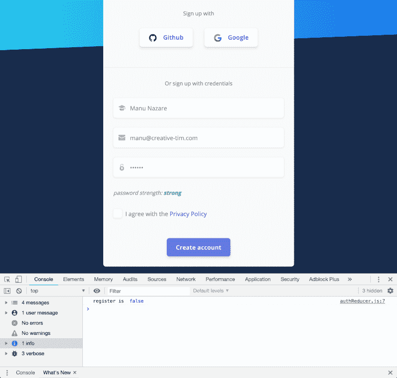

**register is *false***

#### 使用 addStatCardAction 和 getAllStatCardsAction 操作将我们的 Header 组件连接到 redux

现在，我们需要从**标题**组件(该组件可以在**仪表板**页面中看到)中制作我们的**统计卡**，以便从我们的**商店/firebase** 中呈现，并且，让它们动态创建——例如在**按钮上点击**。

进入**src/components/Headers/header . jsx**，添加以下**导入**(在**反应导入**之后):

```
import {connect} from "react-redux";
```

```
import addStatCardAction from "actions/addStatCardAction";import getAllStatCardsAction from "actions/getAllStatCardsAction";
```

```
import { Button } from "reactstrap";
```

将**默认导出**更改为:

```
const mapStateToProps = state => ({  ...state});const mapDispatchToProps = dispatch => ({  getAllStatCardsAction: () => dispatch(getAllStatCardsAction()),  addStatCardAction: (    statName,    statDescription,    statIcon,    statIconColor,    statFooterIcon,    statFooterIconState,    statFooterPercentage,    statFooterText  ) =>    dispatch(      addStatCardAction(        statName,        statDescription,        statIcon,        statIconColor,        statFooterIcon,        statFooterIconState,        statFooterPercentage,        statFooterText      )    )});
```

```
export default connect(  mapStateToProps,  mapDispatchToProps)(Header);
```

然后，让我们在**渲染**函数之前添加一个 **componentDidMount** 函数，如下所示:

```
componentDidMount(){  this.props.getAllStatCardsAction();}
```

现在，在**渲染**函数的**返回**语句中的第一个 **div** 之后，我们将添加一个**按钮**，它将把我们的统计卡添加到我们的 firebase 中:

```
<Container>  <Row>    <Col lg="6" xl="3">      <Button        color="primary"        onClick={() =>          this.props.addStatCardAction(            "Performance",            "49,65%",            "fas fa-percent",            "bg-info text-white rounded-circle shadow",            "fas fa-arrow-up",            "text-success",            " 12%",            "Since last month"          )        }      >        Add stat card      </Button>    </Col>  </Row></Container><br />
```

并且，我们现在需要删除**行**标签的全部内容(~ *行 48–165*—from**<R**ow&g**t；到** < /Row >)，替换为:

```
{// we first verify if the statCardState is undefined  this.props.statCardState &&  // then verify if the statCardState.statCardState is  // populated with cards from our firebase  this.props.statCardState.statCardState &&  // and lastly, we render them using the map function  this.props.statCardState.statCardState.map((prop, key) => {    return (      <Col lg="6" xl="3" key={key}>        <Card className="card-stats mb-4 mb-xl-0">          <CardBody>            <Row>              <div className="col">                <CardTitle                  tag="h5"                  className="text-uppercase text-muted mb-0"                >                  {prop.statName}                </CardTitle>                <span className="h2 font-weight-bold mb-0">                  {prop.statDescription}                </span>              </div>              <Col className="col-auto">                <div                  className={                    "icon icon-shape " + prop.statIconColor                  }                >                  <i className={prop.statIcon} />                </div>              </Col>            </Row>            <p className="mt-3 mb-0 text-muted text-sm">              <span                className={"mr-2 " + prop.statFooterIconState}              >                <i className={prop.statFooterIcon} />{" "}                {prop.statFooterPercentage}              </span>{" "}              <span className="text-nowrap">                {prop.statFooterText}              </span>            </p>          </CardBody>        </Card>      </Col>    );  })}
```

### 添加 Firebase

#### 设置 Firebase 帐户

为此，你需要有一个[谷歌账户](https://myaccount.google.com/)。如果你没有，谷歌为你提供了一个快速(1 分钟)[指南](https://support.google.com/mail/answer/56256?hl=en)。

创建帐户后，请登录该帐户，如果您有帐户，请登录该帐户。

之后，导航到[这个页面](https://firebase.google.com/)(这是 firebase 的主页)并按下**转到控制台**按钮，或者直接导航到[这个链接](https://console.firebase.google.com/u/0/)。

之后，按下**添加项目**按钮。你将被提示一个模态，输入一个**名字**(你可以输入任何你喜欢的名字)。对我来说，将是**react-redux-firebase-tutorial**。你可以让其他一切保持原样。**接受条款**，然后按下**创建项目**按钮。您必须等待一段时间，直到它创建项目(大约 30 秒)。

之后，按下**继续**按钮。这将自动将您重定向到新项目页面。在左侧菜单中按下**认证**链接。在那按下**设置签到方法**。您将拥有一个带有**提供者**和**状态**的表。按下线路上的**电子邮件/密码**。检查第一个**开关**然后按下**保存**按钮。

现在，进入**数据库**链接，向下滚动页面，按下**实时数据库**下的**创建数据库**按钮。此后，在打开的模式提示上，选择**在测试模式下启动**无线电，然后按下**启用**并等待几秒钟。

接下来，您需要获得您的配置文件(在下一节中，我们将把它添加到我们的项目中)。为此，按下左侧菜单中的**项目概述**链接，然后按下**<**；/ > (Web)按钮。复制**配置变量**并**初始化防火墙。在下一节中，我们将把它粘贴到一个新文件中。**

我们在一起

我们不需要为我们的用户、我们的用户详细信息或我们的动态卡创建任何表，因为 firebase 会自动创建它们——我们将在下一节讨论这一点。

下面是上面的步骤，作为图像:

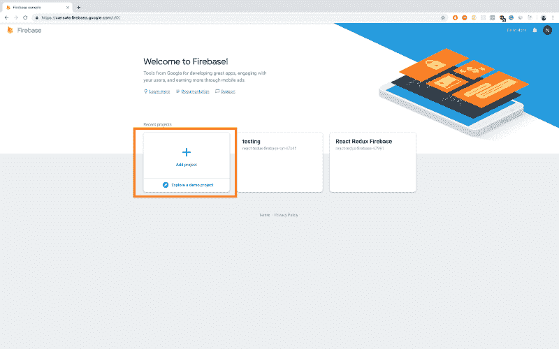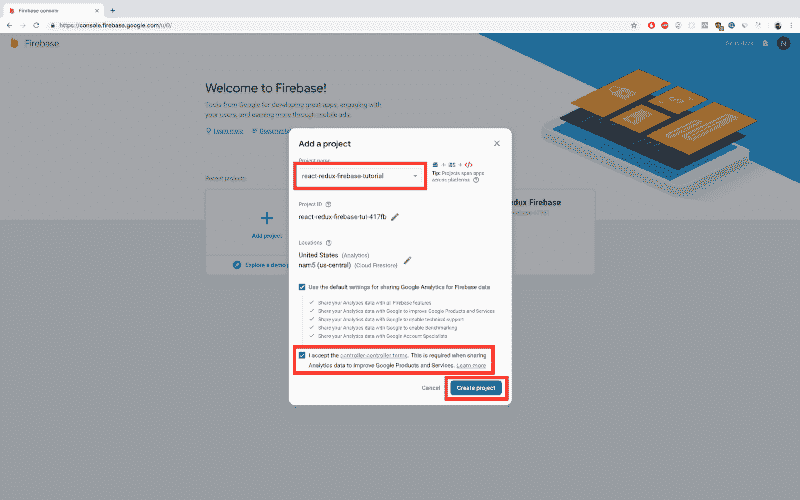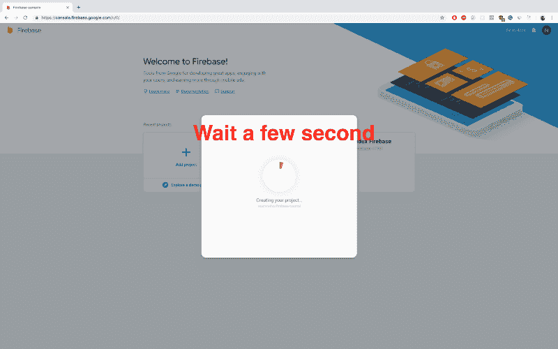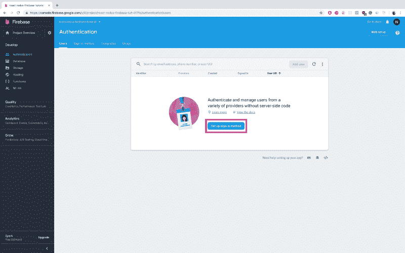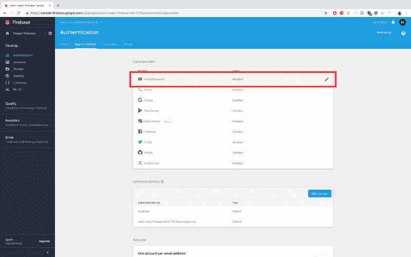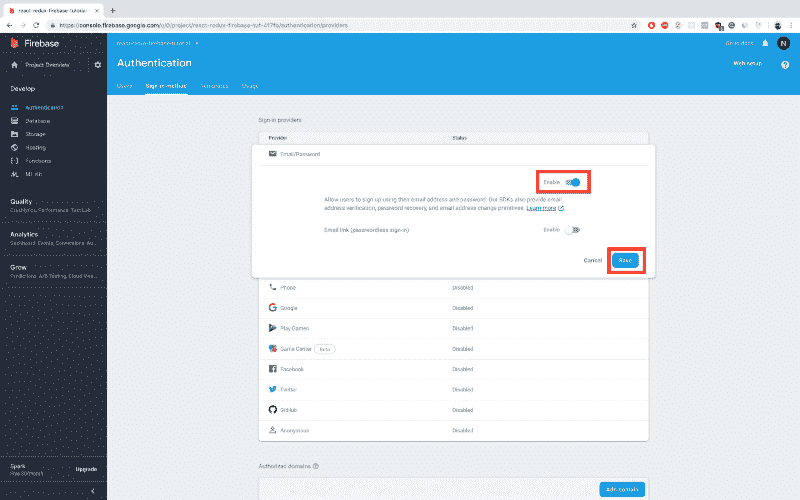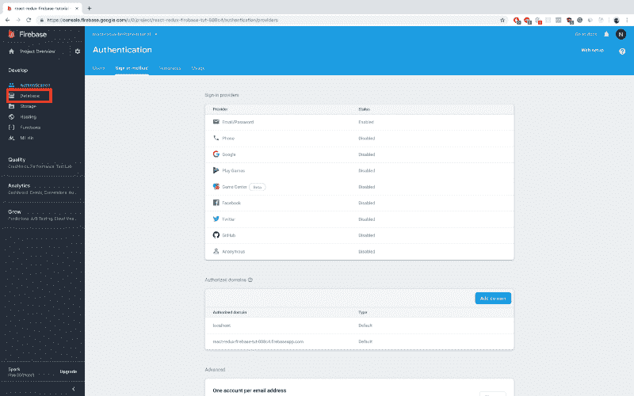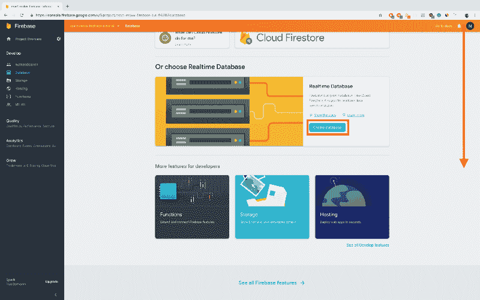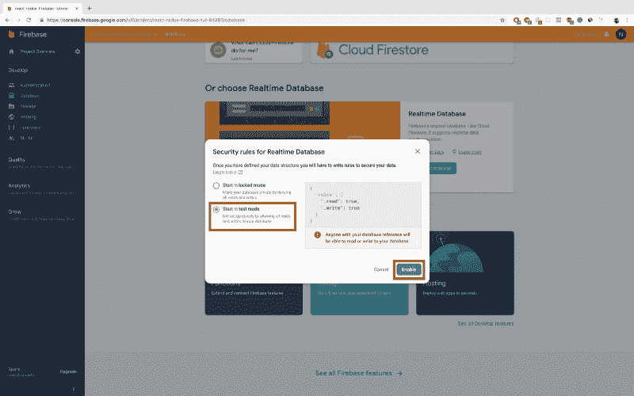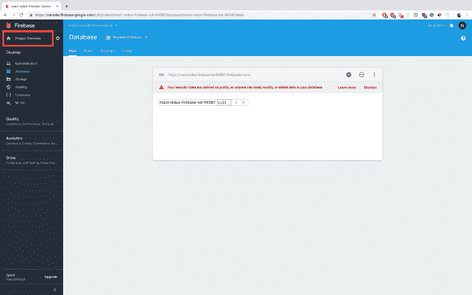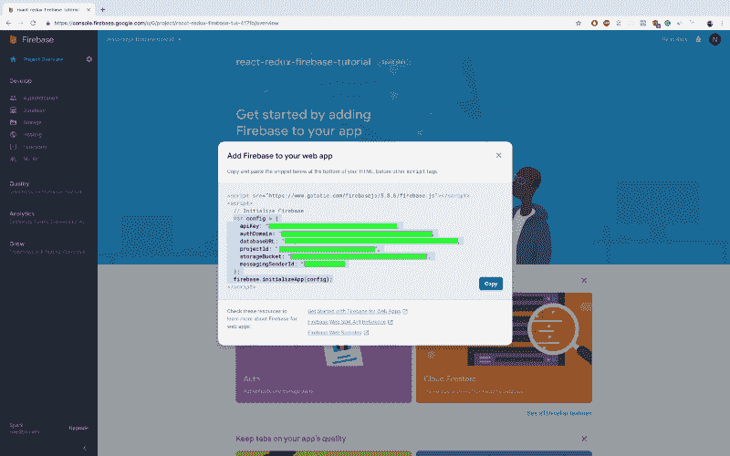

**Setting up a firebase project**

#### 将 Firebase 添加到我们的项目中

让我们在应用程序中安装 **firebase** :

```
npm i -E firebase
```

在这之后，我们需要创建一个文件来配置我们的应用程序中的 firebase，所以:

1 — Linux/Mac 命令

```
touch src/firebaseConfig.js
```

2 — Windows 命令

```
echo "" > src\firebaseConfig.js
```

让我们在这个文件中导入 **firebase** ，然后导出 firebase 并进行初始化(您需要上一节中的代码—参见最后一张图片):

```
import * as firebase from "firebase";
```

```
// replace this variable, with your own config variable// from your firebase projectvar config = {  apiKey: "YOUR_KEY_HERE",  authDomain: "YOUR_DOMAIN_HERE",  databaseURL: "YOUR_URL_HERE",  projectId: "YOUR_ID_HERE",  storageBucket: "YOUR_BUCKET_HERE",  messagingSenderId: "YOUR_ID_HERE"};
```

```
let firebaseConfig = firebase.initializeApp(config);
```

```
export default firebaseConfig;
```

现在，我们可以在任何需要的地方导入我们的 **firebaseConfig** 。

#### 注册

让我们首先使我们的**注册操作**起作用。因此，我们进入**src/actions/register action . js**，在文件的开头导入我们的 firebase 配置:

```
import firebase from "firebaseConfig";
```

在这之后，我们可能需要我们的用户保留的东西，像他们的名字，他们的照片等。因此，我们将创建一个名为 user-details 的新表。如果它不存在，在其中添加我们的用户名。

我们的表单只有电子邮件、密码和姓名——firebase 将自动创建一个数据库表，其中只放入帐户的凭证(电子邮件和密码)。因此，如果我们希望保留更多关于用户的详细信息，我们需要创建一个新表——我的表将包含用户的 ID，来自包含凭据的表，以及用户名。

所以在上面的导入之后，我们说:

```
// get me the firebase database
```

```
const databaseRef = firebase.database().ref();
```

```
// get me the table named user-details// if it does not exist, firebase will// automatically create it
```

```
const userDetailsRef = databaseRef.child("user-details");
```

之后，我们将把我们的派遣代码从:

```
dispatch({ type: "register", payload: false });
```

收件人:

```
// firebase offers us this function createUserWithEmailAndPassword// which will automatically create the user for us// it only has two arguments, the email and the password
```

```
firebase.auth().createUserWithEmailAndPassword(email, password)
```

```
// then() function is used to know when the async call has ended// that way, we can notify our reducers that register was succesful
```

```
.then(function(user) {
```

```
 // we take the user id and it's name and we add it in our  // user-details table
```

```
 userDetailsRef.push().set({userId: user.user.uid, userName: name});
```

```
 // after that we dispatch to our reducers the fact that  // register was succesful by sending true
```

```
 dispatch({type:"register", payload: true});
```

```
// if the register was not succesful we can catch the erros here
```

```
}).catch(function(error) {
```

```
 // if we have any erros, we'll throw an allert with that error
```

```
 alert(error);
```

```
});
```

所以最后，我们的**注册操作**将看起来像这样:

```
import firebase from "firebaseConfig";
```

```
const databaseRef = firebase.database().ref();const userDetailsRef = databaseRef.child("user-details");
```

```
const registerAction = (name, email, password) => async dispatch => {  firebase    .auth()    .createUserWithEmailAndPassword(email, password)    .then(function(user) {      userDetailsRef.push().set(        { userId: user.user.uid, userName: name }      );      dispatch({ type: "register", payload: true });    })    .catch(function(error) {      alert(error);    });};
```

```
export default registerAction;
```

再次打开应用程序，并转到注册页面。键入一个名字、一个有效的电子邮件和一个密码(一些容易记住的东西，比如 **qwerty** )。在您按下**创建账户**按钮后，您应该会被重定向到**用户资料**页面——这意味着我们的注册成功了。我们现在可以回到我们的 **firebase 项目**([https://console.firebase.google.com/u/0/](https://console.firebase.google.com/u/0/)—点击你的项目)，点击**认证**链接，我们将会看到我们刚刚写的那封电子邮件。此外，如果我们转到**数据库**链接，我们将看到我们的**用户详细信息**表。

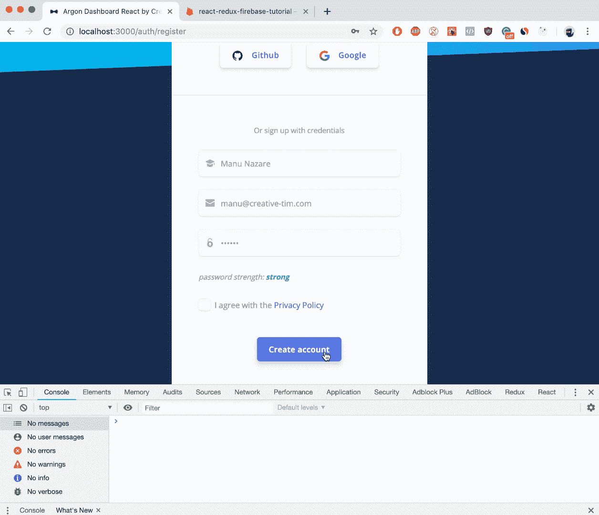

**Register action is now working**

#### **登录**

我们进入**src/actions/loginaction . js**内部，在文件的开头导入我们的 firebase 配置:

```
import firebase from "firebaseConfig";
```

对于这个操作，我们不需要任何其他东西，所以接下来要做的是将我们的调度代码从:

```
dispatch({ type: "login", payload: false });
```

收件人:

```
// firebase offers us this function signInWithEmailAndPassword// which will automatically create the user for us// it only has two arguments, the email and the password
```

```
firebase  .auth()  .signInWithEmailAndPassword(email, password)  // then() function is used to know when the async call has ended  // that way, we can notify our reducers that login was succesful    .then(function(user) {    // if the login was succesful, then     // we dispatch to our reducers the fact that    // login was succesful by sending true    dispatch({type:"login", payload: "true"});  })
```

```
// if the login was not succesful we can catch the erros here    .catch(function(error) {
```

```
// if we have any erros, we'll throw an allert with that error        alert(error);  });
```

所以最后，我们的**登录操作**应该是这样的:

```
import firebase from "firebaseConfig";
```

```
const loginAction = (email, password) => async dispatch => {  firebase    .auth()    .signInWithEmailAndPassword(email, password)    .then(function(user) {      dispatch({ type: "login", payload: "true" });    })    .catch(function(error) {      alert(error);    });};
```

```
export default loginAction;
```

如果我们再次打开我们的应用程序(默认情况下，我们应该被重定向到**登录**页面)，如果我们输入我们的电子邮件和密码，我们将能够登录到我们的新帐户。

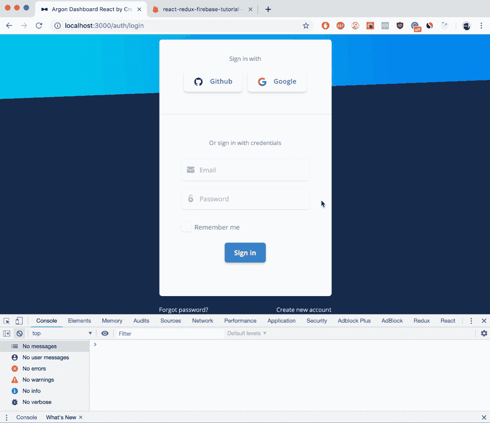

**Login action working**

#### 添加统计卡并渲染它们

现在，我们需要对我们关于统计卡的操作进行一些更改。

在**src/actions/getallstatcardsaction . js**中，我们需要添加以下**导入**:

```
import firebase from "firebaseConfig";
```

```
const databaseRef = firebase.database().ref();// this is to get the stat-cards table from firebaseconst statCardsRef = databaseRef.child("stat-cards");
```

然后我们需要将**调度**从:

```
dispatch({ type: "getAllStatCards", payload: {} });
```

收件人:

```
// this function will get all the entires of the// stat-cards table, in a json formatstatCardsRef.on("value", snapshot => {  dispatch({    type: "getAllStatCards",    // if the json returns null, i.e. the    // stat-cards table is blank - empty    // then we'll return an empty object    payload: snapshot.val() || {}  });});
```

该操作现在应该是这样的:

```
import firebase from "firebaseConfig";
```

```
const databaseRef = firebase.database().ref();const statCardsRef = databaseRef.child("stat-cards");
```

```
const getAllStatCardsAction = () => async dispatch => {  statCardsRef.on("value", snapshot => {    dispatch({      type: "getAllStatCards",      payload: snapshot.val() || {}    });  });};
```

```
export default getAllStatCardsAction;
```

接下来是**src/actions/addstatcardaction . js**。像前一个一样，我们需要一些导入:

```
import firebase from "firebaseConfig";
```

```
const databaseRef = firebase.database().ref();const statCardsRef = databaseRef.child("stat-cards");
```

现在，我们将从以下位置覆盖它，而不是简单的派单:

```
dispatch({  type: "addStatCard",  payload: {    statName: statName,    statDescription: statDescription,    statIcon: statIcon,    statIconColor: statIconColor,    statFooterIcon: statFooterIcon,    statFooterIconState: statFooterIconState,    statFooterPercentage: statFooterPercentage,    statFooterText: statFooterText  }});
```

收件人:

```
statCardsRef  // the push function will send to our firebase the new object  .push()  // and will set in a new row of the table stat-cards  // with the bellow object  .set({    statName: statName,    statDescription: statDescription,    statIcon: statIcon,    statIconColor: statIconColor,    statFooterIcon: statFooterIcon,    statFooterIconState: statFooterIconState,    statFooterPercentage: statFooterPercentage,    statFooterText: statFooterText  })  // when the push has terminated, we will dispatch to our  // reducer that we have successfully added a new row  .then(() => {    dispatch({      type: "addStatCard"    });  });
```

因此，它现在应该看起来像:

```
import firebase from "firebaseConfig";
```

```
const databaseRef = firebase.database().ref();const statCardsRef = databaseRef.child("stat-cards");
```

```
const addStatCardAction = (  statName,  statDescription,  statIcon,  statIconColor,  statFooterIcon,  statFooterIconState,  statFooterPercentage,  statFooterText) => async dispatch => {  statCardsRef    .push()    .set({      statName: statName,      statDescription: statDescription,      statIcon: statIcon,      statIconColor: statIconColor,      statFooterIcon: statFooterIcon,      statFooterIconState: statFooterIconState,      statFooterPercentage: statFooterPercentage,      statFooterText: statFooterText    })    .then(() => {      dispatch({        type: "addStatCard"      });    });};
```

```
export default addStatCardAction;
```

我们都准备好了。再次运行应用程序，登录您的帐户，导航到**仪表板**页面，然后按下**添加统计卡**按钮。统计现在应该开始添加到你的**头球**中。

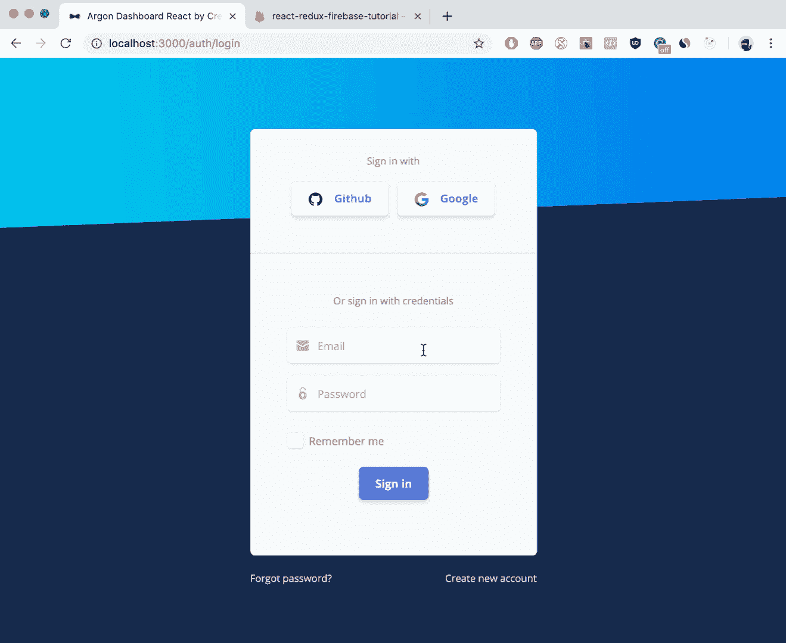

**App is done**

### 感谢阅读！

如果你喜欢阅读本教程，请鼓掌。我很想听听你对这件事的看法。只要给这个帖子一个评论，我会非常乐意回复。

有用的链接:

*   从 [Github](https://github.com/EINazare/react-redux-firebase-rds-tutorial) 获取本教程的代码
*   在 ReactJS 官方网站上阅读更多关于 react js 的信息
*   点击阅读更多关于 [Redux 的信息](https://redux.js.org/)
*   阅读更多关于 [React-Redux](https://react-redux.js.org/) 的信息
*   阅读更多关于 [Firebase](https://firebase.google.com/docs/) 的信息
*   查看我们的平台，看看[我们在做什么](https://www.creative-tim.com/)和[我们是谁](https://www.creative-tim.com/presentation)
*   阅读更多关于氩气仪表盘 React 的核心 [Reactstrap](https://reactstrap.github.io/)
*   阅读我的 [Webpack 教程](https://medium.freecodecamp.org/how-to-use-reactjs-with-webpack-4-babel-7-and-material-design-ff754586f618)和/或我的 [Redux 教程](https://medium.freecodecamp.org/how-to-use-redux-in-reactjs-with-real-life-examples-687ab4441b85)

在以下位置找到我:

*   https://www.facebook.com/NazareEmanuel
*   insta gram:[https://www.instagram.com/manu.nazare/](https://www.instagram.com/manu.nazare/)
*   领英:[https://www.linkedin.com/in/nazare-emanuel-ioan-4298b5149/](https://www.linkedin.com/in/nazare-emanuel-ioan-4298b5149/)
*   电子邮件:[manu@creative-tim.com](mailto:manu@creative-tim.com)