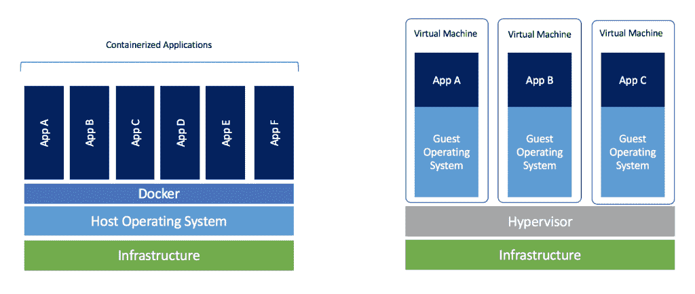

# Docker 初学者指南——如何创建你的第一个 Docker 应用程序

> 原文：<https://www.freecodecamp.org/news/a-beginners-guide-to-docker-how-to-create-your-first-docker-application-cc03de9b639f/>

#### 你是开发者，想从 Docker 入手？这篇文章是为你写的。

在简单介绍了 Docker 是什么以及为什么使用它之后，你将能够用 Docker 创建你的第一个应用程序。

#### **Docker 是什么？**

Docker 是由 Docker Inc .开发的一款免费软件，于 2013 年 3 月 13 日面向公众发布，自此成为 It 开发领域的必备软件。

它允许用户创建独立和隔离的环境来启动和部署其应用程序。这些环境被称为容器。

这将允许开发者在任何机器上运行容器。

如您所见，有了 Docker，就不再有依赖性或编译问题了。你所要做的就是启动你的容器，你的应用程序将立即启动。

#### **但是，Docker 是虚拟机吗？**

这里有一个关于 Docker 的最常见的问题。答案是:其实，不完全是。

一开始它可能看起来像一个虚拟机，但功能是不一样的。

与 Docker 不同，虚拟机将包含一个完整的操作系统。它将独立工作，像计算机一样工作。

Docker 只会共享主机的资源，以便运行它的环境。



Docker VS Virtual machines (Copyright to [Docker blog](https://blog.docker.com/2018/08/containers-replacing-virtual-machines/))

#### **为什么要用 Docker 做开发者？**

这个工具真的可以改变一个开发者的日常生活。为了最好地回答这个问题，我写了一个非详尽的清单，列出了你会发现的好处:

*   Docker 很快。与虚拟机不同，您的应用程序可以在几秒钟内启动，也可以很快停止。
*   Docker 是多平台的。您可以在任何系统上启动您的容器。
*   容器的构建和销毁速度比虚拟机更快。
*   设置您的工作环境不再困难。一旦你的 Docker 被配置，你就再也不用手动重新安装你的依赖项了。如果您更换电脑或有员工加入您的公司，您只需向他们提供您的配置。
*   您保持工作空间整洁，因为您的每个环境都是隔离的，您可以随时删除它们，而不会影响其他环境。
*   将您的项目部署到您的服务器上以便使其联机会更容易。

### 现在让我们创建您的第一个应用程序

现在你知道 Docker 是什么了，是时候创建你的第一个应用程序了！

这个简短教程的目的是创建一个显示句子的 Python 程序。这个程序必须通过 docker 文件启动。

你会发现，一旦你理解了这个过程，它并不复杂。

> 注意:你不需要在你的电脑上安装 Python。为了执行您的代码，将由 Docker 环境来包含 Python。

#### 1.在你的机器上安装 Docker

*对于 Ubuntu:*

首先，更新您的软件包:

```
$ sudo apt update
```

接下来，用 apt-get 安装 docker:

```
$ sudo apt install docker.io
```

最后，验证 Docker 是否安装正确:

```
$ sudo docker run hello-world
```

*   *对于 MacOSX:* 可以关注[这个链接](https://docs.docker.com/docker-for-mac/install/)。
*   *对于 Windows:* 可以关注[这个链接](https://docs.docker.com/docker-for-windows/install/)。

#### 2.创建您的项目

为了创建你的第一个 Docker 应用程序，我邀请你在你的电脑上创建一个文件夹。它必须包含以下两个文件:

*   一个' *main.py* '文件(将包含要执行的代码的 python 文件)。
*   一个' *Dockerfile* '文件(将包含创建环境的必要指令的 Docker 文件)。

通常情况下，您应该有这样的文件夹结构:

```
.
├── Dockerfile
└── main.py
0 directories, 2 files
```

#### 3.编辑 Python 文件

您可以将以下代码添加到' *main.py* '文件中:

```
#!/usr/bin/env python3

print("Docker is magic!")
```

没什么特别的，但是一旦你看到" *Docker 就是魔法！*“显示在你的终端你就知道你的码头工人正在工作。

#### 3.编辑 Docker 文件

一些理论:当你想创建你的 docker 文件时，首先要做的是问你自己你想做什么。我们的目标是发布 Python 代码。

为此，我们的 Docker 必须包含启动 Python 所需的所有依赖项。一个安装了 Python 的 linux (Ubuntu)应该就够了。

创建 Docker 文件的第一步是访问 [DockerHub](https://hub.docker.com/) 网站。这个网站包含了许多预先设计好的图像来节省你的时间(例如:所有用于 linux 或代码语言的图像)。

在我们的例子中，我们将在搜索栏中输入“Python”。第一个结果是[为执行 Python 而创建的官方图像](https://hub.docker.com/_/python)。太好了，我们会用它的！

```
# A dockerfile must always start by importing the base image.
# We use the keyword 'FROM' to do that.
# In our example, we want import the python image.
# So we write 'python' for the image name and 'latest' for the version.
FROM python:latest

# In order to launch our python code, we must import it into our image.
# We use the keyword 'COPY' to do that.
# The first parameter 'main.py' is the name of the file on the host.
# The second parameter '/' is the path where to put the file on the image.
# Here we put the file at the image root folder.
COPY main.py /

# We need to define the command to launch when we are going to run the image.
# We use the keyword 'CMD' to do that.
# The following command will execute "python ./main.py".
CMD [ "python", "./main.py" ]
```

#### 4.创建 Docker 图像

一旦您的代码准备好了，docker 文件也写好了，您所要做的就是创建您的映像来包含您的应用程序。

```
$ docker build -t python-test . 
```

“ *-t* ”选项允许您定义图像的名称。在我们的例子中，我们选择了“ *python-test* ”，但是你可以把你想要的。

#### 5.运行 Docker 映像

一旦创建了映像，您的代码就可以启动了。

```
$ docker run python-test
```

您需要将图像的名称放在' *docker run* '之后。

就这样，就这样。你通常应该看到“Docker 是魔术！”显示在您的终端上。

### 代码可用

如果您想检索完整的代码以便轻松发现或执行它，我已经将它放在我的 GitHub 上供您使用。

**- >** [GitHub: Docker 第一应用示例](https://github.com/gael-thomas/Docker-First-Application-example)

### Docker 的有用命令

在离开您之前，我在 Docker 上准备了一个可能对您有用的命令列表。

*   列出你的图片。

```
$ docker image ls
```

*   删除特定图像。

```
$ docker image rm [image name]
```

*   删除所有现有图像。

```
$ docker image rm $(docker images -a -q)
```

*   列出所有现有容器(运行和未运行)。

```
$ docker ps -a
```

*   停止特定容器。

```
$ docker stop [container name]
```

*   停止所有运行的容器。

```
$ docker stop $(docker ps -a -q)
```

*   删除特定容器(仅当停止时)。

```
$ docker rm [container name]
```

*   删除所有容器(仅当停止时)。

```
$ docker rm $(docker ps -a -q)
```

*   显示容器的日志。

```
$ docker logs [container name]
```

#### 下一步是什么？

在所有你的反馈之后，我决定写这个初学者指南的下一部分。在本文中，您将发现如何使用 docker-compose 创建您的第一个带有 docker 的客户机/服务器端应用程序。

->[Docker 初学者指南——如何用 docker-compose 创建客户端/服务器端](https://herewecode.io/blog/a-beginners-guide-to-docker-how-to-create-a-client-server-side-with-docker-compose/)

## 结论

每当你需要一个关于如何创建你的第一个 Docker 应用程序的简单而具体的例子时，你可以参考这篇文章。如果您有任何问题或反馈，请随时提问。

如果你想要更多这样的内容，你可以[在 Twitter](https://twitter.com/gaelgthomas/) 上关注我，在那里我会发关于 web 开发、自我完善和我作为一个全栈开发人员的旅程的推文！

你可以在我的网站上找到其他类似的文章: [herewecode.io](https://www.freecodecamp.org/news/a-beginners-guide-to-docker-how-to-create-your-first-docker-application-cc03de9b639f/herewecode.io) 。