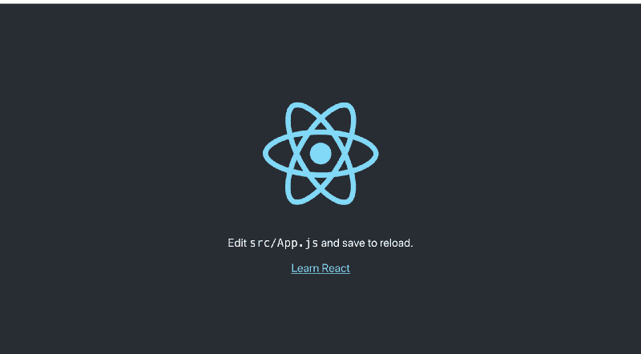
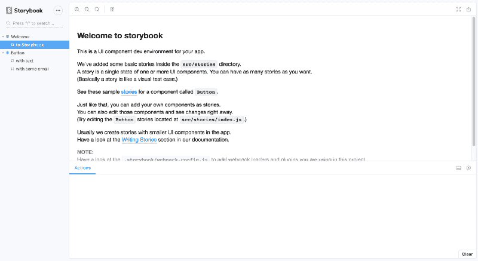
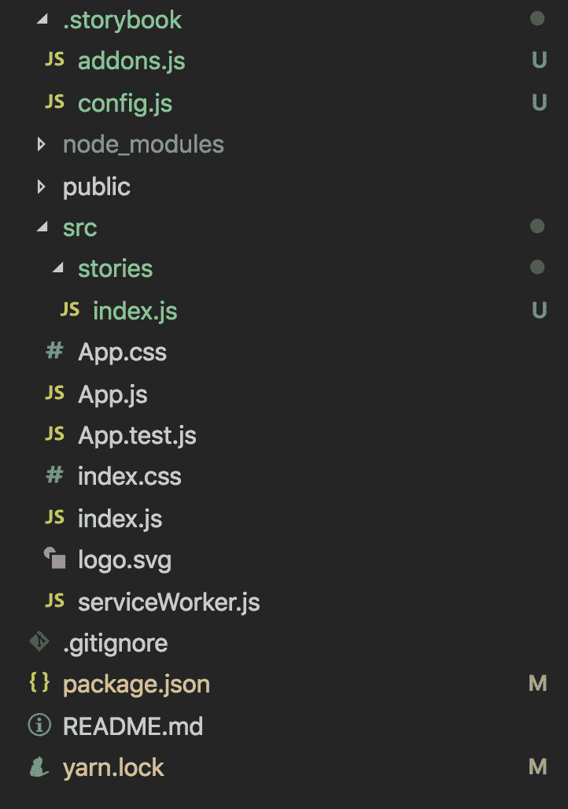
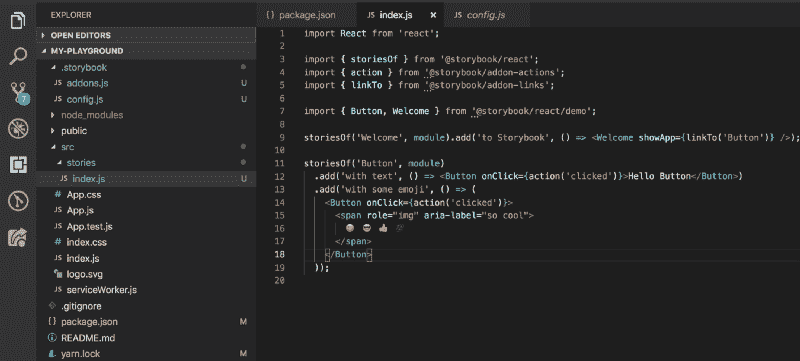
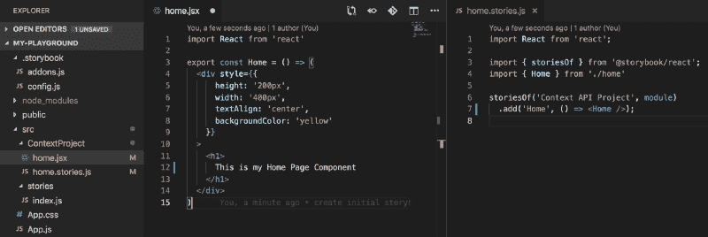
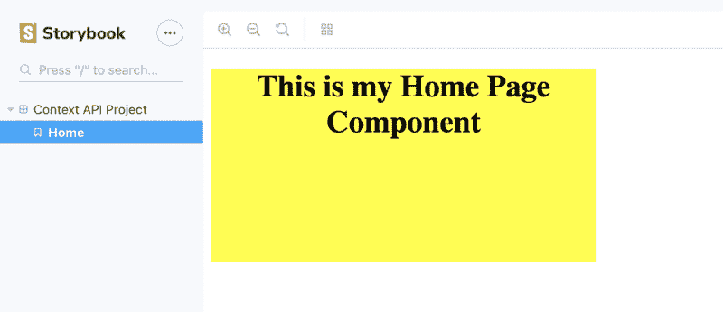

# 如何使用 Storybook 构建 React 开发平台

> 原文：<https://www.freecodecamp.org/news/how-to-build-a-react-development-playground-using-storybook-667ef9808e9f/>

莎拉·斯维特

# 如何使用 Storybook 构建 React 开发平台


Photo by [Joshua Aragon](https://unsplash.com/@goshua13?utm_source=medium&utm_medium=referral) on [Unsplash](https://unsplash.com?utm_source=medium&utm_medium=referral)

最近，我一直想尝试新事物，在我的 React 组件中测试新技术或模式。我需要一个地方来测试这些东西，而不是每次都启动新的应用程序。

我最近开始在工作中使用 React storybook，以便为未来的项目建立一个新的设计系统。我还用它为我们团队正在开发的新内容创作工具的几个版本制作了原型。将这个工具与我创建组件并以一种低风险的方式尝试新事物的愿望结合在一起，似乎是完美的。这些新“事物”的几个例子是 React Context、SlateJs 和 React Hooks。

这也可以用作作品集，是展示你作品的好方法。由于 Storybook 可以作为自己的应用程序进行部署，因此您可以托管一个网页，在该网页上您可以向潜在的雇主或客户展示各种项目和组件。一旦部署完成，就像给他们发送一个你的故事书的链接一样简单！

这篇文章的重点是为 React 环境创建故事书，我的目标是在将来发布我在里面创建的东西！

### 什么是故事书？

直接取自故事书网站，因为我自己说不出更好的:

> “Storybook 是一个用户界面开发环境和 UI 组件的游乐场。该工具使开发人员能够独立创建组件，并在一个隔离的开发环境中交互展示组件。
> 
> Storybook 在主应用程序之外运行，因此用户可以独立开发 UI 组件，而不必担心应用程序特定的依赖性和要求。”

这意味着…我可以独立于实际运行 React 应用程序来创建和显示组件/与组件交互！由于这个项目不会专注于单个应用程序的性能或干度，我可以有多个原型和组件版本，以便我可以完善它们，允许利益相关者批准等等。然后将它们放入应用程序中。我还可以用它来练习制作组件，测试如何使用我之前提到的新技术。

让我们现在就开始建造吧！

### 创建一个基础 React 应用程序

```
npx create-react-app my-playground
```



您可以通过运行`yarn start`来确保您的应用程序创建成功。一个新的窗口应该出现在你的浏览器上，看起来像上面的图片。一旦确认，你可以通过按⌘ + C 来停止它

### 添加故事书

首先，在项目的命令行中，您需要使用以下命令添加 storybook:

```
npx -p @storybook/cli sb init
```

然后，您可以使用以下命令运行 storybook:

```
yarn storybook
```

现在您应该已经启动并运行了，在浏览器中看到如下所示的屏幕:



browser view of storybook

如果您查看项目文件夹，您会注意到一些文件已被添加，而另一些文件已被更新:



文件夹是你为你的故事书配置很多设置的地方。有各种各样的附加组件可以应用到您的项目中来添加更多的特性。`config.js`文件通常是你应用附加组件的地方，也告诉 storybook 在哪里可以找到你的故事。配置默认如下:

```
import { configure } from '@storybook/react';

function loadStories() {
  require('../src/stories');
}

configure(loadStories, module);
```

这是告诉 storybook 在`../src/stories`文件夹中查找你写的故事。现在，storybook 已经为你添加了一些默认的故事。你可以看看这些来了解如何写故事。你最终只是在它们自己的函数中呈现你的组件，你可以传递任何你喜欢的道具给它们。

正如你在下面的例子中看到的，你可以创建同一个组件的多个版本，只需要用不同的道具渲染它。



你可以想象，一旦你开始创建更多的组件，这个文件可能会变得非常大，你不希望在你的配置中拼写出你想要渲染的每个包含故事的文件…相反，一个方便的方法是用`stories.js`命名你的`src`文件夹中的任何文件，并让 storybook 动态地找到所有以`stories.js`结尾命名的文件，在你的`src`文件夹中，你可以在你的配置文件中放入以下内容:

```
import { configure } from '@storybook/react'

function loadStories() {
  const req = require.context('../src', true, /\.stories\.js$/)
  req.keys().forEach(filename => req(filename))
}

configure(loadStories, module)
```

这允许一个更干净的文件结构，你可以在你的 src 文件夹中通过项目甚至组件来组织你的故事。

### 构建您的迷你项目

让我们构建一个小组件作为示例，展示如何快速启动一个示例项目，开始学习 React 的上下文 API。在我的`src`文件夹中，我将创建一个 ContextProject 文件夹，我将在其中添加一个定义组件的文件，然后再添加一个定义故事的文件:



现在，当我检查我的故事书时，我会看到我的上下文 API 项目有一个菜单选项，在它下面，我可以单击查看我创建的 Home 组件:



现在我可以开始在`src`的这个文件夹中构建我的上下文和其他组件。我将能够到处玩并渲染我构建的组件，使我能够快速看到我的更改，而不必担心每次我只想测试特定功能或新想法时启动新的 React 应用程序。

这也允许在尝试快速原型化一个新想法时有很大的灵活性。您已经有了一个运行的环境，并且可以有您喜欢的库，比如已经安装的样式组件，或者有预定义的主题，可以很容易地导入到新项目中。您还可以预定义一些基线组件，如样式化的标题、div、按钮等，您可以在项目间共享这些组件，以使开发进行得更快。

希望这有所帮助，并关注未来关于我最喜欢的插件和我在故事书中构建的测试项目的细节的帖子。

编码快乐！

参考资料:

[**Storybook:面向前端开发者的 UI 组件工作坊**](https://storybook.js.org/)
[*Storybook 是一款开源工具，用于独立开发 React、Vue 和 Angular 的 UI 组件。这让……*](https://storybook.js.org/)
[storybook.js.org](https://storybook.js.org/)

我的 github Repo:

[**sarahsweat/my-playground**](https://github.com/sarahsweat/my-playground)
[*通过在 GitHub 上创建账号，为 sarahsweat/my-playground 的发展做贡献。*](https://github.com/sarahsweat/my-playground)
[github.com](https://github.com/sarahsweat/my-playground)