# 我是如何为我的第一个自由职业客户构建我的第一个 React 原生应用的

> 原文：<https://www.freecodecamp.org/news/how-i-built-my-first-react-native-app-for-my-first-freelance-client-d78bdab795e1/>

作者查理·杰普森

# 我是如何为我的第一个自由职业客户构建我的第一个 React 原生应用的


[https://www.pexels.com/@nietjuh](https://www.pexels.com/@nietjuh)

我最近推出了我的第一个用 React Native 构建的原生移动应用。碰巧的是，这也是我作为自由职业开发者为客户开发的第一个应用。这是从 react-native init 到 app store 发布的一路坎坷。

#### 目录

1.  为什么是自由职业者？
2.  为什么反应原生？
3.  应用规格
4.  向最好的人学习
5.  开发环境
6.  航行
7.  闪屏
8.  状态管理
9.  会议
10.  列表
11.  形象
12.  时间
13.  自定义字体和图标
14.  CI/CD 和监控
15.  添加对 Android 的支持
16.  因为苹果
17.  摘要

#### 为什么是自由职业者？

去年五月，我偶然发现了这个令人兴奋的自由职业机会。当时，我是一家位于斯德哥尔摩的初创公司的全栈 web 开发人员。这是我的第一份开发工作，我在不到一年前得到了这份工作(你可以在本文中了解更多)。

夏天很快就要到了，原本相当高的工作节奏一天比一天慢。在一周的时间里，当产品团队的轮值技术支持职责由我承担时，我对我被分配的一些 bug 感到有点无聊和沮丧。

正是在这种沮丧的情绪下，我父亲联系了我，告诉我他打算为公司的客户开发一款移动应用。尽管他知道我的工作让我很忙，也不指望我会全职工作，但他还是问我是否愿意以更具顾问性质的角色参与这个项目。有点智力匮乏的我答应了。虽然这不是我的初衷，但这个顾问角色最终让我成为了这款应用的首席开发人员。

现在，你可能会问自己——为什么一个只有不到一年专业 web 开发经验的人会尝试进入移动应用领域？在你的简历中增加一些经验的同时，继续专攻那个领域不是更有意义吗？

绝对会的。但是，作为一个无可救药的多面手，几年前我就承诺，在做职业决定时，不是基于职业战略，而是基于什么能让我快乐。换句话说:我的简历已经是一个火车残骸，可能不会变得更加分散和不连贯。

当然，职业战略和工作生活幸福并不一定相互排斥。事实上，我对以前的工作和雇主非常满意。我只是碰巧发现了另一个让我更有激情的项目。

那么是什么让这个特别的项目如此激动人心呢？比和一些我见过的最棒的人在一个团队中开发一个被数千家公司使用的超高速增长产品还要令人兴奋？三个字:**自由，挑战，自我发展。**

#### 为什么反应原生？

当我加入这个项目时，我的客户已经收到了一些当地数字机构的邀请。在我考虑自己开发这个应用之前，我被要求友好地检查一下。我只是对提案的低质量感到惊讶。

其中一个人发来了一些设计草图，非常潦草，与客户网站上展示的品牌完全不符。另一家机构提出了一个荒谬的价格，还有一些更荒谬的重复收费。还有三分之一的人似乎根本没有做任何准备工作。他们都有一个共同点:他们想用混合框架 Cordova 来构建应用程序。

这还不是全部。尽管 Cordova 是完全免费和开源的，但是他们中的一个甚至试图隐藏这是他们使用的技术的事实。相反，他们推广了他们“自己的”内部移动应用程序平台——看起来只是科尔多瓦周围的一层薄薄的东西——以证明给他们独家应用程序维护权的锁定是合理的，并使最终的未来移交变得复杂和昂贵。低质量命题。

现在，我对混合框架没有任何不满。我一直在使用他们开发的应用程序。Gmail、Slack、Atom 和 Figma 等等。但那时，我已经听说 React Native 很长时间了。它如何允许使用 Javascript 构建跨平台的移动应用——这不是混合的！

现在怎么办？iOS 和 Android 不知何故偷偷摸摸地支持用 Javascript 编写原生应用吗？因为据我所知，iOS 应用程序必须用 Objective-C 或 Swift 构建，Android 应用程序必须用 Java 或 Kotlin 构建。


当然不是。那么，React 原生应用如何被称为真正的原生应用呢？简答:API。我花了很长时间才明白这一点，虽然我不敢承认，但 React 本机应用程序可以在智能手机上本机运行的方式不是通过运行 Javascript，也不是通过将 Javascript 编译成本机代码，而是通过向 API 发出请求，在 iPhone 上用 Objective-C 和在 Android 上用 Java 呈现本机组件。

如果你想知道更多关于 React Native 的基础知识，我真的要推荐[这个超教育学的 Quora 答案](https://www.quora.com/How-does-React-Native-work)，这个 [React Conf talk](https://www.youtube.com/watch?v=UcqRXTriUVI) 由令人惊叹的 Parashuram N 和[RN 向世界的原始发布](https://code.fb.com/android/react-native-bringing-modern-web-techniques-to-mobile/)。

虽然我当时不知道 React Native 魔术背后的秘密，但我知道它实际上是在运行本机代码——这也是我不采用任何代理机构建议的 Cordova 解决方案的主要理由。我认为，如果他们想要一个移动应用，他们应该建立一个本地应用。如果他们想要一个 HTML/CSS/JS 应用程序，他们的钱最好花在改进他们 web 应用程序的移动体验上。

当我把这个分享给客户时，他们问我是否知道有人可以构建这样的应用程序。我告诉他们我没有。他们问我是否能做这件事。我告诉他们我不能。尽管如此，种子已经种下，我只是无法阻止自己根据 React Native 的应用规范涉猎它。

在我意识到之前，他们的应用程序已经有了基础。所以，不知何故，那次谈话后几周，我们就同意由我来为他们开发应用程序。

#### 应用规格

在我们深入到更技术化的细节之前，对我们在这里处理的应用类型的简单描述似乎已经到位。

客户是一家总部位于斯德哥尔摩的公司，经营联合办公空间。换句话说，公司的工作场所酒店。他们目前有大约 10 个活跃空间，约有 400 家公司，约 1，400 名员工租用办公空间。这些租客就是 app 的目标人群。


The lounge at one of the client’s coworking spaces

在与项目经理反复讨论之后，一些应用程序规格具体化了:

*   登录/注销验证和密码重置。注意:所有用户帐户都是由管理员创建的，所以在应用程序中注册是不可能的。因此，如果你决定下载这个应用程序，你基本上不能用它做任何事情？
*   查看和编辑用户资料，包括姓名、电子邮件、密码和头像。
*   推送通知。
*   这是一个家庭目的地，用户可以在这里了解公司最近的活动，尤其是他们的家庭办公空间。
*   一个社区目的地，用户可以在这里浏览不同的共同工作空间，与每个空间的网站管理员联系，并查看其他常驻公司。
*   用户可以预订会议室并管理其预订的会议目的地。
*   用户可以访问会员专享折扣和优惠的选择目的地。
*   先构建 iOS 版本，再添加对 Android 的支持。
*   一个后端管理 web 应用程序来管理 RN 应用程序的内容。虽然在本文中我将重点关注前端的东西，但是知道它是在 Ruby on Rails、Postgres 和 Heroku 上构建的可能是有意义的。

正如你所看到的，这是一套非常简单的功能。这正是你希望你的第一个新技术的应用程序。如果您想知道最终结果如何(以及本文的其余部分是否值得您花费时间)，这里有 1.0 版本的概述:

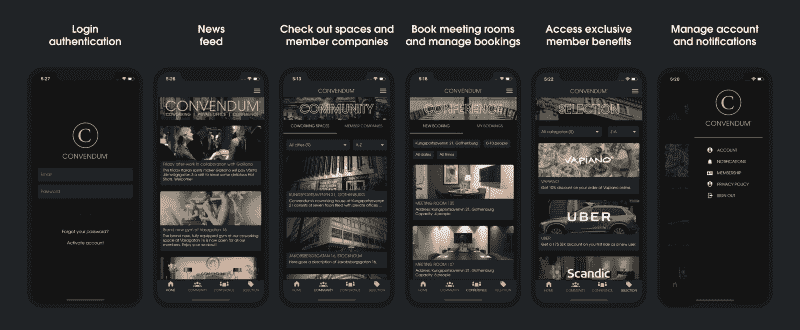

你还在这里？很好，那我们继续。

#### 向最好的人学习

想象一下，你答应一个朋友给他们建一栋房子。但是你不知道怎么盖房子。甚至不知道从哪里开始。你会做的第一件事是什么？

你给自己找个木匠。

这就是我试图做的。我中大奖了吗？在对 React 本地学习资源进行了几个小时的研究后，我在 Youtube 上找到了哈佛大学的 13 集视频课程(完全免费)。每个讲座深入到自己的主题，每次 90-120 分钟。总共大约 23 小时的高质量素材。

立刻，我就像着了魔一样开始消费这些视频讲座。经过几周晚上和周末的编程，我完成了课程，并为自己建立了一个相当不错的应用基础。

事后看来，毫无疑问，这是我发现的所有类别中最好的学习资源之一。包装和总是相关的课程绝对发挥了很大的作用，但老师乔丹 Hayashi 绝对是这里的大赢家。我会把他的教学风格描述为快速、超实用和直截了当。没有时间浪费在糟糕的笑话和分散注意力的个人轶事上。不像你真的…

无论如何，不知何故每次演讲似乎总是压缩了大量的信息，这将花费大多数其他老师至少两倍的时间。换句话说，这是一种与哈佛 CS50 老师大卫·J·马兰非常相似的风格。

因此，如果你正在为你的第一个注册护士应用程序寻找一个起点，这将是我的第一条建议。不过有一点需要注意:在课程中，Jordan 使用了 [Expo toolchain](https://expo.io/) ，这对大多数简单的应用程序来说都是一个很好的工具，因为它为您做了很多具体的工作。但是，如果你像我一样，正在为一个很大很复杂的应用程序构建基础，并且重视完全的配置自由，那么 react-native init 可能是一个更合适的解决方案。

第二好的学习资源实际上是我的同事。一个幸运的巧合是，就在几个月前，我们刚刚在我工作的公司开始了一个 React Native 项目。虽然我自己没有参与这个项目，但我从与项目中的人交谈和查看他们的 PRs 中学到了很多。

既然我们已经理清了所有的上下文，我们终于可以进入更技术性的东西了！？

#### **开发环境**

在使用 react-native init 建立应用程序基础之后，首先面临的挑战之一是适应新的开发环境。

如果您来自普通的 web 开发环境，许多事情将保持不变。对我来说，这包括保持 Atom 作为我的文本编辑器，iTerm 作为我的终端，GitUp 作为我的 git 接口(对那些抱怨的 Vim 用户:讨厌的人会讨厌的)。但是除此之外，React Native 还需要在我通常的工作流程中增加一些东西。

与 iOS 模拟器相处融洽，例如**。**虽然从命令行运行“react-native run-ios”听起来似乎很简单，但在开始时，它很少足以启动并运行模拟器。由于几乎每天都有新的 npm 包添加到项目中(后来也有相当多的本机 CocoaPod 模块)，我不得不更加熟悉清理 watchman、删除 haste 缓存、删除 node_modules 目录、重新安装所有节点模块并重置 Metro Bundler 缓存的痛苦程序。以下命令将为您完成所有这些工作:

```
watchman watch-del-all && rm -rf tmp/haste-map-react-native-packager && rm -rf node_modules && yarn && npm start --reset-cache
```

十之八九的舞蹈足以让模拟器再次运行。有时需要深入钻研各种 GitHub 问题和 Stackoverflow 线程。

其他一些痛苦的根源是，我很长一段时间都认为打开 Xcode 是实现某些事情所必需的。相信我，您希望在 IDE 的恐怖环境中度过尽可能少的时间(稍后将详细介绍)。

比如告诉模拟器运行某个 iPhone 版本。如果有人直接从命令行告诉我下面的代码为我做到了这一点，在最初的几个月里，我可能会稍微开心一点。

```
react-native run-ios --simulator=’iPhone X’
```

另一个例子是从发布模式(用于将应用部署到 App Store 或一些 CI 目标，如 Visual Studio App Center 或 Firebase)到调试模式(开发模式)所需的 [3 级火箭](https://facebook.github.io/react-native/docs/running-on-device#building-your-app-for-production)。也许对许多人来说显而易见的是，这些更改也可以直接从您选择的文本编辑器中进行。总之，在开发模式下工作时，有两件小事对我的工作流程产生了令人惊讶的巨大影响。

最后，我花了一些时间来习惯不断地在不同的 macOS 应用程序之间切换，以做我在使用 web 应用程序时通常会在 Chrome 中做的事情。

为了检查我的 Javascript 控制台日志和 HTML/CSS 输出的样式调试，我转向了 [React 本机调试器](https://github.com/jhen0409/react-native-debugger)。为了跟踪应用程序状态、分派的动作和 API 请求/响应，我使用了 [Reactotron](https://infinite.red/reactotron) 。虽然我发现这两个应用程序都非常有用，但我不禁怀念我对应的 Ember.js 工作流，在那里我可以在我的应用程序实际运行的同一个地方做所有这些事情(借助 Ember Inspector Chrome 插件)。

#### 航行

在 React Native 中，导航/路由显然是一个很难解决的问题。四年过去了，有很多不同的解决方案，但对于哪一个是最好的，仍然没有明显的共识。我决定用 react-navigation，但主要是因为这是哈佛课程和我同事的项目中使用的解决方案。

然而，如果我花时间做一些适当的研究，我可能会有以下发现:

*   [react-navigation repo](https://github.com/react-navigation/react-navigation) 拥有约 15 000 颗恒星和 86 个未决问题。它完全基于 Javascript，并且拥有我所见过的所有导航解决方案中最全面的文档。
*   react-native-navigation repo 拥有约 10 000 颗星和 162 个未决问题。同样值得考虑的是，它并不完全基于 Javascript(即需要编辑原生文件)。
*   [react-router repo](https://github.com/ReactTraining/react-router) 有大约 35 000 颗星和 36 个未决问题。然而，这些数字实际上与其他数字没有可比性，因为 repo 也包括 React.js 的路由包。
*   [本地导航报告](https://github.com/airbnb/native-navigation)有大约 3 000 颗星和 55 个公开问题。然而，在投入大量时间之前，应该认真考虑这个解决方案仍处于测试阶段，不完全基于 Javascript 并由 Airbnb 维护的事实( [Airbnb 决定淘汰 Native](https://medium.com/airbnb-engineering/sunsetting-react-native-1868ba28e30a) )。

考虑到上述情况，我可能仍然会选择反应导航，因为我没有时间去测试它们，例如 MLS 的 Kurtis Kemple 所做的。最后，正如他在演讲中解释的那样，选择导航解决方案并不是一个关于哪一个是最好的问题，而是一个关于哪一个最适合你的特定需求的问题。

在使用 react-navigation 大约 9 个月之后，我不得不说我真的没有什么可抱怨的。鉴于我的主要参考点是在 [Ember.js](https://www.emberjs.com/) 中使用的 [router.js](https://github.com/tildeio/router.js) 库，这是一种全新的路由体验。

了解 react-navigation 的三种主要导航器是比较容易的部分(StackNavigator、TabNavigator 和 DrawerNavigator)。困难的部分是理解导航器应该如何相互嵌套以获得预期的用户流。

例如，我的 DrawerNavigator 应该在导航根(在我的主 TabNavigation 之上的一个步骤)对我来说一点也不明显。如果这很难描述，下面是实际使用的 DrawerNavigator(现实中比 gif 中流畅得多):


react-navigation’s DrawerNavigator in action

正如你所看到的，我想要一个侧边栏，可以在应用程序的任何地方用拇指滑动打开。

与主底部标签栏相比，侧边栏在应用程序中更像是一个次要组件，我的第一直觉是 [DrawerNavigator](https://reactnavigation.org/docs/en/drawer-navigator.html) 应该放在路径树中中央 [BottomTabNavigator](https://reactnavigation.org/docs/en/bottom-tab-navigator.html) 位置的下方或与之平行(见下图)。

然而，在我用头撞墙试图将侧边栏压在那里之后，我发现反应导航方式实际上是将 DrawerNavigator 放在 BottomTabNavigator 之上一步，即在路由树的根处。希望这种提醒可以节省我花在文档和 GitHub 问题线程上的大量时间来获得这种见解。

下面是另一个以 DrawerNavigator 为根的插图:

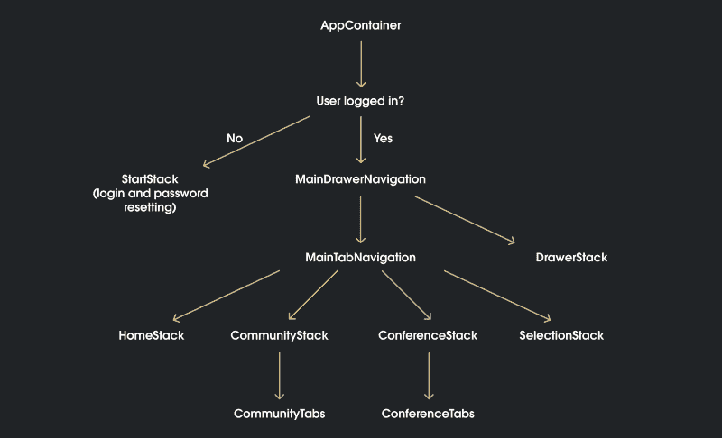

The app’s 1.0 version’s final navigation tree

你可能会问自己一个问题:为什么社区和会议都有 StackNavigator 和 TabNavigator？为什么不跳过堆栈层直接进入选项卡呢？

嗯，因为我想在两个 TabNavigators 上各有一个标题。这些家伙:


我的直觉和反应导航的做事方式再次出现分歧。鉴于[createMaterialTopTabNavigator](https://reactnavigation.org/docs/en/material-top-tab-navigator.html)必须是一个非常标准的导航组件，我认为它应该在其 navigationOptions 中有一个简单的内置标题配置。结果并不是这样，这就是为什么我被迫在两者之间使用 StackNavigator，从而为基础设施增加了另一层复杂性，这纯粹是出于表面目的。

react-navigation 中的这个缺陷也给我带来了一些更严重的问题。也就是说，当用户在两个[平面列表](https://facebook.github.io/react-native/docs/flatlist)中向下滚动时，让标题图像折叠/消失。因为 Home 和 Selection 的标题与它们的列表呈现在同一个 StackNavigator 中，所以只需让标题与列表的其余部分一起向上滚动，就可以很容易地解决这个问题。

但是对于 Community 和 Conference——由于标题呈现在 StackNavigators 中，而 TabNavigators 中的列表在树中比它们低一级——我发现没有办法对它们应用相同的解决方案。因此我就有了这种痛苦的不对称:


Scrolling in TabNavigator vs StackNavigator

现在，在上面的模拟器中运行的 iPhone X 上，这可能不会成为一个问题，但在较小的屏幕上，这个标题可能会占用大约 20%的宝贵屏幕区域。如果有人知道如何解决这个问题，我洗耳恭听！

同样的 TabNavigator 问题也导致了社区目的地的问题。如下所示，我想在协同工作空间选项卡中放置另一个 TabNavigator，以在 gif 右侧显示三个顶部选项卡 Info、Members 和 Contact。

然而，由于 TabNavigator 很难在不增加大量复杂性的情况下将图像幻灯片放在上面，从而导致各种其他导航问题(主要与导航参数有关)，我不得不求助于一个名为 [react-native-swiper](https://github.com/leecade/react-native-swiper) 的 JS 包来处理这三个选项卡。事实上，如果不是因为制表符下划线的不流畅的幻灯片动画，我会觉得完全没问题。无论如何，我认为这是一个公平的价格，以避免替代导航头痛。

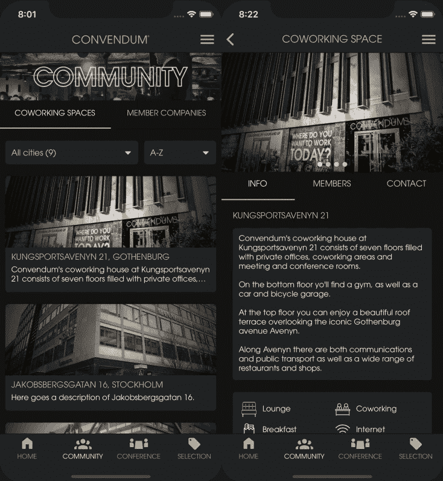

react-navigation TabNavigator vs react-native-swiper (notice the different animations of the golden underscore when swiping)

总结一下我在 React Native 中的导航体验:

*   有很多记录良好的解决方案，其中我发现 react-navigation 最适合我的需求。
*   React-navigation 使得在不太了解纯本地导航如何工作的情况下开始使用变得非常容易。
*   React-navigation 有一些非直观的维度(对于一个 web 开发人员来说)，但是没有一个是不能通过一些笨拙的解决方法来克服的。

#### 闪屏

当在模拟器上运行一个新的 react-native init 应用程序时，每次做出更改时都要反复重新加载应用程序，你会很快意识到需要一个漂亮的启动屏幕(也称为闪屏)。

既然已经有一个非常好的指南来指导如何达到这个目标，我就不浪费时间重复作者的话了。我在这里只遇到了一个指南没有涉及的问题:

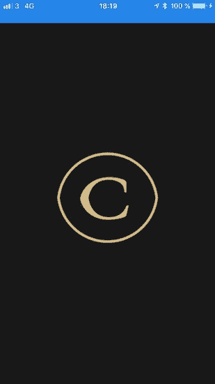

这很大程度上是一个 iOS edge 案例，但仍然可能会困扰接触它的少数用户。我第一次发现这一点是在我工作的地方，那里没有无线网络，因此我用我的笔记本电脑分享我手机里的 4G 网络。正如 iPhone 用户所知，在互联网共享时，设备上的状态栏会变蓝，高度会增加。在设备上运行时，它完全破坏了我的闪屏图像。同样的问题出现在通话中。

所以在[react-native-splash-screen](https://github.com/crazycodeboy/react-native-splash-screen)repo 中挖了一会儿，没有找到任何有用的东西，我决定通过在闪屏可见时完全隐藏状态栏来解决这个问题。

这非常简单，你只需要在 info.plist 文件中添加一个布尔值为 true 的 UIStatusBarHidden 键，然后在调用 SplashScreen.hide()后，将 React 原生 StatusBar 组件的“Hidden”属性设置为 false。

#### 状态管理

“约定胜于配置”是过去两年来我每天都听到的一句口头禅。尤其是我的前雇主。这并不奇怪，因为我们在服务器端使用了 Ruby on Rails，在客户端使用了 Ember.js 这两个框架基本上就是这句话的同义词。我以为我知道这些词的意思，但学习如何在 React Native 中处理状态的过程赋予了它们全新的含义。

尽管我在几个非常简单的演示应用中尝试过“配置超越惯例”的 React 库，但我从未构建过足够大的东西来证明引入像 [Redux](https://redux.js.org/) 或 [MobX](https://mobx.js.org/) 这样的状态容器是正确的。相反，我的大部分 JS 状态管理经验来自于 [Ember Data](https://github.com/emberjs/data) (Ember 内置的状态管理和数据持久化库)。

由于 Redux 是我多年来在播客、博客和视频中听到人们谈论的首选解决方案(包括 RN Youtube 课程中的 Jordan)，我从未真正考虑过它的任何竞争者。我只想用最少的努力建立最好的状态管理基础设施。

在 Ember 中，基本上 90%的基础设施都是免费的。我一点也不知道，在我目前的项目中，我将不得不接受相反的比例。React 不仅不能为您提供处理全局状态的任何有用的东西，而且 Redux——市场上最流行的解决方案——是如此之轻，以至于您基本上必须自己承担 90%的重量才能获得一个同等状态的解决方案。

现在，稍微年轻的我已经从他的系统中得到了这一点，困难的部分实际上只是掌握这一新的功能和不可改变的工作流程。一旦我接受了简单地从/向我的服务器获取或发送一些数据所需的惊人的复杂性，这一切都归结为 7 个非常简单的步骤:

1.  将 SOME_ACTION_REQUEST、SOME_ACTION_FAILED、SOME_ACTION_SUCCEEDED 这三个参数添加到常量文件中。
2.  将操作创建者添加到操作文件中。
3.  在适当的缩减器中处理这三个动作，如果有必要的话，添加一个新的缩减器，并将该缩减器包含在您的根缩减器中。
4.  向适当的 saga 添加工人，如果必要，添加一个新的 saga，并将该 saga 包含在您的根 saga 中(我使用 [redux-saga](https://github.com/redux-saga/redux-saga) 进行异步操作)。
5.  添加函数来处理任何最终的 API 请求。
6.  将必要的状态映射到适当的 React 组件中的 props。
7.  从适当的 React 组件调度 SOME_ACTION_REQUEST 操作。

redux 和 redux-saga 当然可以提供更多，但就我目前而言，以上 7 个步骤对我来说就是 Redux 的本质。

#### 会议

因此，我们已经建立了 React 本地开发环境，绘制了导航树，并准备好了状态管理基础设施。下一步该怎么做？嗯，对我来说，自然的选择是用户认证，从而进入会话。

如果你是从网络背景开始反应的，处理会话不需要太多的大脑计算能力。如果你熟悉 [LocalStorage](https://developer.mozilla.org/en-US/docs/Web/API/Storage/LocalStorage) 的概念，你只需要用 [AsyncStorage](https://facebook.github.io/react-native/docs/asyncstorage) 来代替它:一个抽象层，让你可以跨会话持久化键值对。换句话说，非常适合存储用户登录时从服务器生成的认证令牌。

#### 列表

总的来说，我的印象是列表是 React Native 中一个相当好解决的问题。基本上，您手头有三个选项:如果您处理的是一个数据不变的静态列表， [ScrollView](https://facebook.github.io/react-native/docs/scrollview) 可能就足够了。如果你正在处理一个更大的动态列表，那么 [FlatList](https://facebook.github.io/react-native/docs/flatlist) 就是你想要的。如果你想要一个更大更动态的列表，也可以分成不同的部分， [SectionList](https://facebook.github.io/react-native/docs/sectionlist) 就是你的答案。

我的动态列表只使用了 FlatList。虽然我直觉上喜欢它和它的大量配置选项，但我经历了一些非常痛苦的情况。下面我将逐一介绍。

**拉动刷新**
FlatList 有一个名为 refreshControl 的属性，你可以向它传递一个你想要用来刷新列表内容的组件，当用户从列表顶部向下拉动时触发。幸运的是，React Native 有一个专门用于这个目的的组件— [RefreshControl](https://facebook.github.io/react-native/docs/refreshcontrol) 。所有这些都非常直观且易于设置。

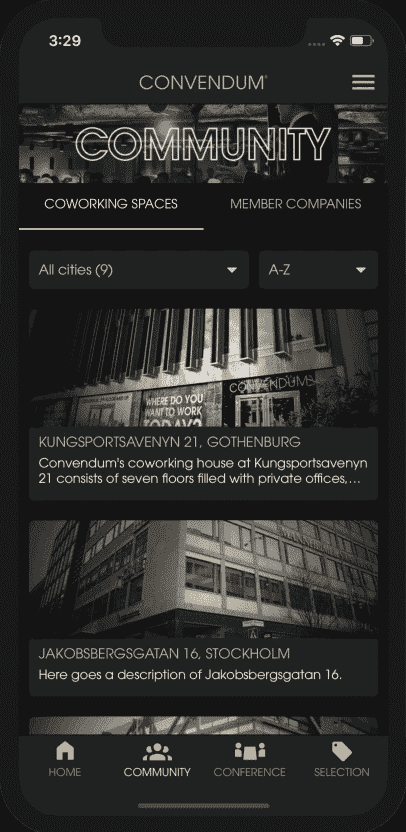

RefreshControl in action

然而，我遇到了一个奇怪的情况，refreshControl prop 和/或 refreshControl 组件似乎应该受到责备。一些背景:

因此，在我的列表中，我希望用户能够 a)在顶部向上滚动以刷新列表，触发我命名为 handleRefresh()的函数，b)向下滚动以将更多项目加载到列表中，又名。“无限滚动”(更多内容请见下文)。很标准的东西。

然而，过了一段时间后，我开始遇到这样的情况，刷新微调器将只是冻结并永远保持旋转，而不显示从服务器获取的新项目。经过一段时间的研究，我在这个 GitHub 问题回复中找到了我的问题的原因。

问题是 refreshControl 和 onEndReached(用于无限滚动)属性都使用了同一个布尔属性:“获取”。出于某种奇怪的原因，当这个抓取属性在不到 250 毫秒的时间间隔内从 false 变为 true，然后又变回 true 时，RefreshControl 会中断，加载微调器会冻结。

因此，为了验证这个理论，我尝试添加一个 setTimeout()，在更改获取布尔值的值之间设置 350 毫秒的最小时间间隔。它解决了这个问题。但是由于使用 setTimeout 对我来说有点太粗糙了，我最终采用了简单地为 handleRefresh()和 handleLoadMore()函数使用两个不同道具的解决方案:“refreshing”和“loadingMore”。不知道这个问题有多普遍，但希望我的解决方法可以节省一些时间和挫折。

注意，官方文档推荐使用 onRefresh 和 Refresh，而不是 refreshControl 属性。我使用 refreshControl 的原因是，我看不到任何其他能够定制微调器样式的方法。

如上所述，我也想给我的用户一种列表完全无缝的感觉。这意味着不必按底部的任何“加载更多”按钮来加载更多的项目，也不必在获取更多项目时阻止加载微调器或加载占位符，这些占位符也覆盖了已经加载的列表项目。

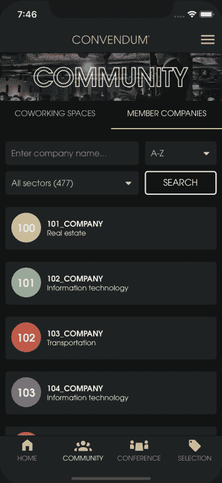

Infinity scrolling with FlatList (notice how the threshold value of 2 triggers onEndReached when we’re 2 screen height’s worth of list items from the bottom)

出于这个目的，onEndReached 基本上拥有了我所需要的一切。虽然我在实现它的时候遇到了两个问题。

第一个是围绕 onEndReachedThreshold 属性，它将告诉您的平面列表何时触发传递给 onEndReached 的函数。经过反复试验，我的解释是这样的:

如果列表中加载了 100 个项目，并且屏幕一次显示 10 个项目，则 onEndReachedThreshold 值为 1 意味着当您滚动列表中的第 90 个项目时，将调用 onEndReached 函数。如果该值为 2，则当您距离末端 2 个屏幕高度以内时，即在第 80 个项目时，该函数已经被调用，以此类推。

我在无限滚动中遇到的第二个问题是，我只能假设这是一个平面列表错误。也就是说，每当我向下滚动超过阈值时，传递给 onEndReached prop 的 handleLoadMore()函数就会被重复调用，通常会连续调用 10 次以上。

巧合的是，在使用 loadingMore prop 时又一次找到了解决方案，在 handleLoadMore()函数中添加了一个 if 语句，确保 fetch 操作只在 if！装载更多。很自然，您还希望在同一个 if 语句中检查您不是在服务器分页的最后一页。

加载占位符
不一定会对用户体验有任何影响，但作为一名开发人员，肯定会让我更高兴的是在 FlatList 中出现 ListLoadingComponent prop，就像有一个 ListHeaderComponent、一个 ListEmptyComponent 和一个 ListFooterComponent 一样。

因为没有，所以我被迫依靠笨拙的 if 语句来处理大量 render()函数中的占位符呈现。

**滚动到顶部**
我想触及的最后一个列表主题是通过按键滚动到列表顶部。在我的应用程序中，我目前在标题中有这些按钮，但它们的另一个常见位置是底部的标签按钮。

为了实现这一点，我使用了 FlatList scrollToOffset 方法，这个方法很简单，可以从文档中理解。然而，我在文档中找不到的一个关键细节是，您还需要使用 FlatList 组件中的 ref 属性，如下所示:

```
<FlatList  ref={(ref) => { this.newsListRef = ref; }}  .../>
```

这基本上是给你的 FlatList 一个标识符，这样就可以从别处的函数中调用它。所以在我的例子中，它允许我从我的`handleScrollToTop()`函数中调用 ScrollToOffset 函数，例如，将它作为一个参数传递给我的 react-navigation 导航对象，允许从参数传递到的任何路线调用它。

```
componentDidMount() {  this.props.navigation.setParams({    scrollToTop: this.handleScrollToTop,  });}
```

```
handleScrollToTop = () => {  this.newsListRef.ScrollToOffset({    x: 0, y: 0, animated: true,  });};
```

请注意，升级到 react-navigation 3 后，不再需要 ref 这个东西，因为 createBottomTabNavigator 按钮现在将默认处理滚动到顶部。

#### 形象

我逐渐认识到，图像最有可能成为让你的手机应用程序变得糟糕的东西。自然，有效的图像处理在网络上也很重要，但由于手机将在更大程度上运行于 4G(或 3G，但愿不会如此)，所以必须假设较低的平均下载速度，这反过来会使你的应用程序看起来很慢。

与电脑屏幕相比，图像也可能占据手机屏幕的更大份额，这就是为什么从美观的角度来看，它们也应该被赋予更高的优先级。因此，尽管这可能不是最有趣的部分，但投入一些时间可能是值得的。

事实证明，我的应用程序非常注重图片内容。它总共有 7 个列表，列表项带有图像属性，这些属性不仅显示在实际的列表项中，还显示在每个列表项自己的“详细信息”中(当用户按下列表项时会重定向到该屏幕)。

**上传图片**
在用户账户编辑屏幕上，该应用还允许用户上传头像图片。为此，我使用了 react-native-image-picker 库，以及我的 Rails 后端的 Cloudinary 和 Carrierwave。

首先，我将所有上传逻辑放在客户端，使用 Cloudinary 的节点 API 和 [react-native-fetch-blob](https://github.com/wkh237/react-native-fetch-blob) 模块。但是过了一段时间，由于我希望上传逻辑更加灵活，并且不想在 React 本机端放置太多复杂的逻辑，所以我把它们都移到了 Rails 后端。

然而，当我试图使用 react-native-fetch-blob 将图像发布到我的服务器时，遇到了一些麻烦。因此，回购额外的复杂性和当时非常不确定的维护状态让我选择了内置的 [JS FormData API](https://developer.mozilla.org/en-US/docs/Web/API/FormData) 。然而，请注意，不再维护的 react-native-fetch-blob repo 已经被移动到 [rn-fetch-blob](https://github.com/joltup/rn-fetch-blob) ，在那里它被主动维护。

**显示图像**
事实是，标准的 [React 原生图像标签](https://facebook.github.io/react-native/docs/image)，其样式、来源和 resizeMode 道具将带你走很长的路。如果您不关心缓存、显示多个图像或其他一些特殊情况，您可能不需要引入其他依赖项。

然而，我发现在两种情况下，我真的觉得值得努力添加到我的依赖列表中。第一个是一些列表卡和用户资料屏幕上显示的圆形头像格式的图像。为此， [react-native-elements 头像](https://react-native-training.github.io/react-native-elements/docs/0.19.1/avatar.html)派上了用场。

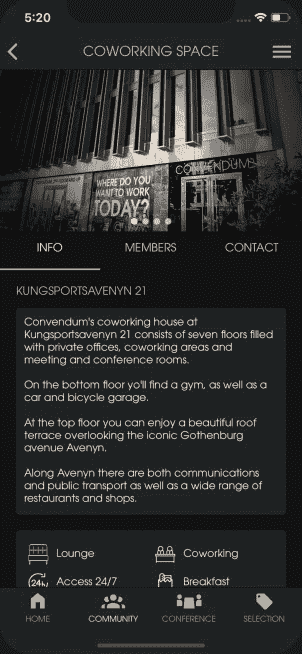

Forked react-native-slideshow in action

但是，这个组件不会做任何您无法通过对默认的 Image 组件进行一些额外的样式化来实现的事情。因此，除非你已经为其他目的引入了这个库，否则我不建议你仅仅为了格式化头像而添加这个依赖项。

我决定外包的另一个例子是在一个幻灯片中显示多个图像时(见 gif)。为此，我使用了 [react-native-slideshow](https://github.com/haqiqiw/react-native-slideshow) 库，这正是我想要的。

但是要注意，因为它维护得很差，我强烈建议将其分叉并稍微修改一下代码，而不是从 node_modules 中原样使用。

加载占位符
因此，当 7 个无限滚动列表显示图像时，当所有这些数据都从服务器获取时，用户必然要做一些等待。众所周知，等待可能是现代科技中最令人沮丧的经历。所以我们自然想让它尽可能耐用。

输入占位符。

我不太确定为什么，但是每当我等待一些内容加载时，如果我得到的只是一个加载微调器(或者更糟——什么都没有)，我会比看到一些闪亮的动态占位符——脸书新闻提要样式更沮丧十亿倍。这就是我想要的。

谢天谢地，我不是 React Native 中第一个有这种想法的人。在我自信地选定两个库之前，我没有做太多的研究:[react-native-loading-placeholder](https://github.com/zeljkoX/react-native-loading-placeholder)(用于实际的占位符)和[react-native-linear-gradient](https://github.com/react-native-community/react-native-linear-gradient)(用于闪亮的动画)。我对结果真的很高兴，即使我可能对右边的那个有点过火了…

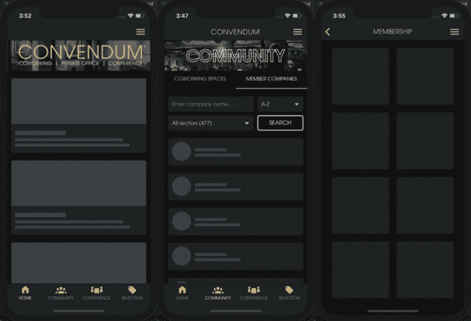

Loading placeholders with react-native-loading-placeholder and react-native-linear-gradient

**缓存**
是的，缓存在原生世界也是一件事。奇怪的是，在默认的 RN Image 标签中仍然没有内置的支持。相反，您将使用这个伟大库的 CachedImage 标签:[react-native-cached-image](https://github.com/kfiroo/react-native-cached-image)。

基本上，您需要做的就是安装 npm 包，并与 CachedImage 交换您想要缓存的所有默认图像标签。然后，您可以检查 Reactotron 时间线，以确认图像确实被存储。

与设置图像缓存所需的最小工作量相比，回报是巨大的。看到我的 Cloudinary 带宽从高达 95%的免费月配额下降到大约 4%是如此令人满意。

专业提示:添加 prop activityIndicatorProps = { { animating:false } }并在加载图像时滚动您自己的加载占位符，而不是标准的加载微调器。

#### 时间

**时间选择器**
React Native 居然有跨平台的[选择器组件](https://facebook.github.io/react-native/docs/picker)。然而，由于它的可配置性(以及我的不耐烦)，我四处寻找已经为我做了一些工作的 JS 库。幸运的是，我找到了[react-native-picker-select](https://github.com/lawnstarter/react-native-picker-select)，它模拟了 iOS 和 Android 的原生< select >界面，几乎完全符合我的目的。

由于它基本上只是一个使用内置 React 本地组件的 Javascript 文件(和一些 [lodash](https://lodash.com/) ，这已经是我的一个依赖项)，我决定简单地窃取代码——做一些小的调整——并把它放在我自己的 picker 组件中。从那时起，除了日期选择器，我不仅将它用于所有输入列表的时间选择器。

**日期选择器**
我决定使用 Wix 的 [react-native-calendars](https://github.com/wix/react-native-calendars) 库，原因如下:

*   我不喜欢原生的 iOS 日期选择器，因为它对月份和年份的概述很差。也许我只是被 web 开发击垮了，但那是我的看法。
*   React Native 目前要求两个平台有两个独立的实现；DatePickerIOS 和 DatePickerAndroid，做同样的事情需要大量的代码复制。
*   我希望挑选者更有个性，反映客户公司的品牌，而不是苹果和谷歌的品牌。

恨它或爱它，这是结果:

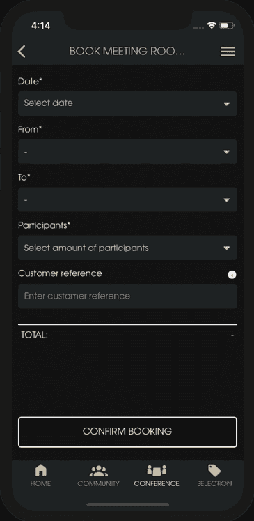

react-native-calendars and react-native-picker-select in action

**时区**
时区。理论上很简单，但实际上很难。

在项目接近尾声时，我将应用程序的后端与客户用于房间预订的第三方 SaaS 集成在一起。我刚刚有幸熟悉了古老的 SOAP 协议，为应用程序的会议部分设置了必要的 API 请求。当我最终把所有的部分都准备好的时候，我开始注意到 React Native 端的一些奇怪的时间行为。

客户公司明确表示，他们不希望用户在当天下午 5 点后进行新的预订，原因如下。但是由于 Javascript Date 对象的严格的 UTC 时区默认值，为时间选择器生成这个最大值被证明是相当棘手的。事实上，这太棘手了，逻辑使我的组件膨胀，对我来说太复杂了。我心里想，请为它建一个图书馆吧。

我的祈祷得到了 [moment-js](https://momentjs.com/) 的回应，它不仅完全兼容 React Native，而且还有一个特定的[时区模块](https://momentjs.com/timezone/)，可以在一行中为我生成完美的布尔值:

```
const timeSthlmAfterFive = moment().isAfter(moment.tz('17:00:00', 'HH:mm:ss', 'Europe/Stockholm'), 'second');
```

#### 自定义字体和图标

自定义字体和图标——这两个微小的细节对你的应用程序的 UI 和品牌有着巨大的影响。我来自一个 web 背景，我预料这将是一个令人头痛的问题，因为我已经习惯了文件转换和字体 css 文件组装。

但是在我之前的其他人的工作使这比我预期的要容易得多。跟随[这个教程](https://medium.com/react-native-training/react-native-custom-fonts-ccc9aacf9e5e)，我花了大约 10 分钟导入客户公司的自定义字体。并且[巨大的图标库 react-native-vector-icons](https://github.com/oblador/react-native-vector-icons) ，加上一些自定义的导入，到目前为止已经为我提供了所有我需要的图标。

#### 持续集成、部署和监控

转到 CI/CD——devo PS 人员的生计，也是所有寻求快速获利的孤独开发者的头号配置噩梦。

因为我是(现在仍然是)唯一一个开发这个应用程序的人，对一些人来说，这似乎有点大材小用了。由于没有代码协作，所有新的部署将来自同一台计算机，我可以在推送至 GitHub repo 并向应用商店提交新版本之前，在本地轻松构建和测试应用。但是，出于几个简单的原因，我仍然认为 CI 解决方案是必要的:

*   客户公司即将建立一个内部开发团队。当他们这样做时，他们会希望基础设施尽可能方便地向团队中添加新人。
*   尽管在本地运行您的测试只需要在命令行上使用一行代码，但是自动化所有可以自动化的事情总是可取的。

所以我决定实施一个 CI 解决方案。但是到目前为止，我一直认为这仅限于构建和测试，我必须为错误报告、分析和推送通知等找到单独的解决方案。更不用说连续部署，这在原生世界中似乎根本不存在。

然后我就找到了 [Visual Studio 应用中心](https://visualstudio.microsoft.com/app-center/)。Parashuram N(再次)的这个 [Chain React 2017 talk](https://www.youtube.com/watch?v=f_-S0ZhVmvQ) 完全让我意乱情迷。他所展示的内容似乎包括了我考虑过的所有不同的 devops 服务，在一个单一的解决方案中逐一添加:构建、测试、诊断(错误报告)、分析、推送通知和使用[代码推送](http://microsoft.github.io/code-push/)的持续部署。更不用说向应用商店和测试人员分发了。最重要的是，它可以在同一个地方管理我的 iOS 和 Android 应用程序的所有这些东西。最棒的是，它可能是免费的，直到应用程序变大，大约一年后。

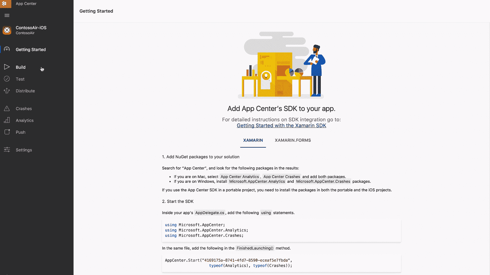

VSAC preview borrowed from: [https://blogs.msdn.microsoft.com/vsappcenter/introducing-visual-studio-app-center/](https://blogs.msdn.microsoft.com/vsappcenter/introducing-visual-studio-app-center/)

"这太好了，不可能是真的"，我泪眼汪汪地对自己说，激动得直喘气。真是太美了。如此天衣无缝。所以开发者友好(API 优先)。然而，有了这样一个用户友好的 UI，我的客户中的非技术人员也能理解它(其中的一些)。

你会问，这一切怎么可能？事实证明，微软最近一直在疯狂购物。为了组装 VSAC 这个好东西，他们收购了大量现有的独立解决方案，如 Codepush(连续 RN 部署)和 HockeyApp(测试分发和崩溃报告)，以及构建和扩展现有的微软产品。著名的“开发人员，开发人员，开发人员，开发人员”的精神签名史蒂夫巴尔默似乎真的比以往任何时候都运行在公司的血液中。

那么，我是否听到了足够多的信息，可以对这项相当新的技术进行明智的押注，放弃像[浪子](https://fastlane.tools/)、 [BuddyBuild](https://www.buddybuild.com/) 和 [Firebase](https://firebase.google.com/) 这样的竞争服务？嗯，如果它真的像 Parashuram 声称的那样好，它将为我节省数周的安装和配置时间，并可能节省无数小时的未来维护所有分散服务的时间，这些服务是整合类似结果所必需的。不管怎样，这绝对值得一试。

大约一周之后，这个应用程序就具备了 VSAC 的所有功能。除了一些儿童疾病，医生和支持聊天为我提供了所有我需要的答案。

其中一个问题是，他们还不支持使用双因素认证与苹果开发者账户集成(苹果在我建立账户的时候开始实施这一点……)。当时这让我非常沮丧，但就在我报道后的几周，他们增加了对它的官方支持。

如果你觉得我对 VSAC 的赞美有点片面，并且想听听有大应用视角的人的意见，我会推荐这篇更具怀疑性的 [CI/CD 评论](https://hackernoon.com/top-ci-cd-tools-for-your-android-and-ios-projects-8d356b983b3b)。

#### 添加对 Android 的支持

有了所有的 iOS 基础，我发现添加对 Android 的支持非常容易。在设置了 Android Studio 开发环境并让应用在 Android 模拟器上运行之后，大多数问题都可以通过 [React 本地平台模块](https://facebook.github.io/react-native/docs/platform-specific-code.html)解决。对于特定于平台的样式，它提供了 Platform.select()方法。以及所有其他特定于平台代码平台。操作系统会成功的。

此外，在谷歌 Play 商店提交应用程序并获得批准要比在 App Store 容易得多。为什么？

#### 因为苹果

显然，作为一名 web 开发人员接触 React Native 肯定会引起一些麻烦。但对我来说，迄今为止最头疼的是苹果强加的开发流程。老实说，我不记得曾经经历过由一个单一的原因引起的那么多瓶颈和进度延迟。技术项目或其他。

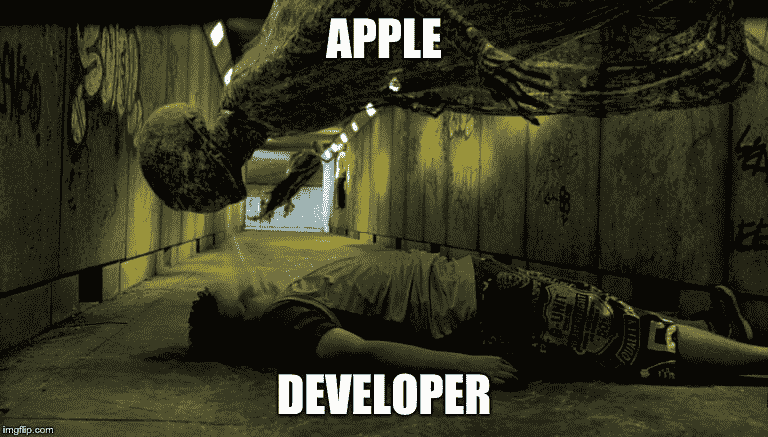

TL;DR

我认为主要原因是莫名其妙的高度官僚主义。如果在开发你的第一个 iOS 应用程序时，有一件事是你可以指望的，那就是你会在这个过程中交到很多新朋友。

例如，苹果支持中心的男人和女人们。你可能需要让他们相信你的应用背后的公司确实存在。你可能还会在邓白氏公司(Dun & Bradstreet)交几个朋友，他们是公司的鉴定合作伙伴。当你这样做的时候，你甚至可以在当地政府的公司注册处交一些朋友，以便将你的公司地址更新为苹果支持的格式(他们不支持在邮箱上注册的公司，这是一种非常普遍的做法，至少在斯堪的纳维亚是这样)。

然后你可能会花更多的时间和苹果支持人员在一起，因为他们仍然不能批准你的苹果开发者注册，因为你只是一个顾问，而不是你客户公司的实际员工。整个过程可能需要一个多月。但是当你交新朋友的时候谁会在乎呢，对吗？

乐趣并没有就此结束。

你已经设置好了你的苹果开发者公司账户。你已经完成了 1.0 版本的应用程序。现在你迫不及待地想把它放到野外。

你现在还不能。首先，你要做一些数字文书工作。您必须生成一个预置描述文件、一个 iOS 证书、一个标识符、一个. p12 苹果推送通知证书和一个旧的 dSym 文件。一旦您生成、配置并上传所有这些文件到正确的位置，您就可以开始实际的应用审查过程。

根据他们自己的说法，所有应用程序中有 50%在 24 小时内被批准/拒绝，90%在 48 小时内。但要做好最坏的打算，因为被拒绝显然是苹果开发者生活的正常部分。

幸运的是，我的应用程序只被拒过一次。这是由于“元数据被拒绝”的原因。如果我只是忘记填写一些必需的信息，我完全可以接受。但是，由于丢失的元数据显然是 5 个非常具体的问题(其中没有一个包含在 [App Store 审查指南](https://developer.apple.com/app-store/review/guidelines/)中)，这真的让我很难过。

生活在一个只有两家公司控制着整个原生移动应用分发渠道的世界里，真是悲哀。可悲的是，他们中至少有一个人如此不关心客户，以至于他们允许自己任意占用其他人的时间，导致了几个月昂贵的应用程序发布延迟。如此令人高兴的是，这种情况并不适用于网络。

显然，开发我的第一个 iOS 版 React 原生应用包含了一层又一层的官僚筛选过程。如果在移动开发的世界里有一个相当于摄魂怪的东西，那肯定就是它了。它会从你的身体里吸走灵魂以及任何最终的幸福。

那里。大声抱怨。感觉真好。

#### 摘要

如前所述，这个项目始于初夏。因此，我的暑期工作节奏较慢，这让我有可能在几个月的时间里兼顾这两者。但最终 10 月/11 月的最后期限会来得太快，我会意识到我必须做出选择，是继续工作还是按时完成应用程序。经过几周的思考，我选择了后者。

虽然这是一个非常艰难的决定，但事后看来，我认为这是正确的决定。我一直在寻找的自由、挑战和自我发展肯定找到了，甚至更多。

关于自由，客户的松散束缚基本上允许我在任何我想去的地方，任何我想去的时间工作。这对我生活的许多方面都产生了积极的影响。这让我每晚都能或多或少地睡足 8 小时。这使我能够找到一个更一致的锻炼程序。这使我能够为我关心的人找到更多的时间。一边旅行一边工作。

然而，从负面来看，这种自由也常常让这个过程变得相当孤独。即使是在咖啡馆和共同工作空间里与人一起工作，缺少真正的队友来分享起起落落也是显而易见的。

就挑战和自我发展而言，我发现这个项目仅用了 6-7 个月就教会了我在任何正常工作中至少需要几年才能学会的东西。这基本上使我在各个领域都成为了更好的开发人员，包括:

*   它打开了不止一个，而是两个新的数字平台(iOS 和 Android)的大门，相当于我的开发者工具带的平台增加了 3 倍。
*   加深了 Javascript 知识。在 Ember.js 的约定驱动的范围内，我认为理所当然的许多概念需要重新教授。
*   在此之前，我对 plain React.js 没有什么经验，现在我觉得我已经准备好了构建更大的面向 DOM 的 React 应用程序的大部分难题。这意味着我的开发人员工具带的 JS 框架/库增加了 2 倍。
*   介绍函数式编程和与 Redux 状态管理相关的不变性原理。
*   大规模开发和项目管理洞察。
*   更好的回购调查技巧，当试图解决技术与穷人的文件。
*   更好的用户界面/UX 设计技能。
*   最重要的是，我有了更强的信心，我可以独立地自学任何我想要的技术，并找到方法绕过在追求过程中可能出现的任何障碍。

由于我没有任何来自其他移动原生 JS 工具如 [Flutter](https://flutter.io/) 或 [NativeScript](https://www.nativescript.org/) 的经验，也没有来自 Objective-C、Swift、Java 或 Kotlin 的经验，我不会试图断言 React Native 比竞争对手更好或更差。

但我能说的是，作为一名 web 开发人员，React Native 让向移动设备的过渡变得非常刺激、不断发展，而且总体上是一种平稳的体验。不可否认，这项技术还很年轻，远非完美。但我会毫不犹豫地再次使用它。

*感谢阅读！一如既往，如果你有任何问题或反馈，欢迎在评论中联系我，在 gmail[dot] com 或 LinkedIn 上。如果你是一名经验丰富的 Rails/React 开发人员，并且对在斯德哥尔摩的联合创业公司工作感兴趣， [Convendum 正在招聘](https://career.convendum.se/jobs/207256-software-development-manager?promotion=84919-trackable-share-link-medium-app-article)！*