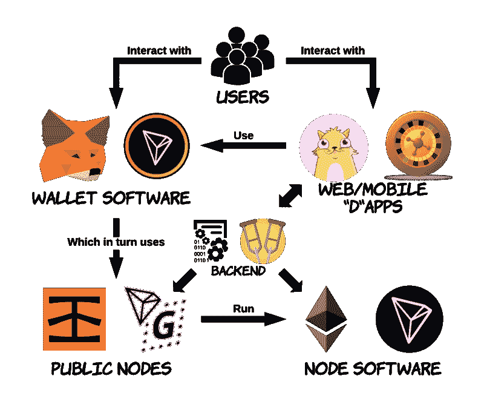
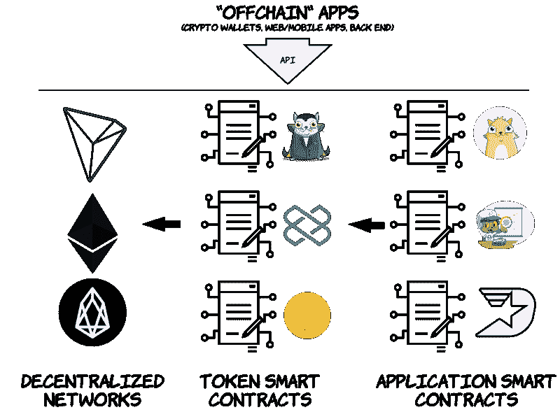
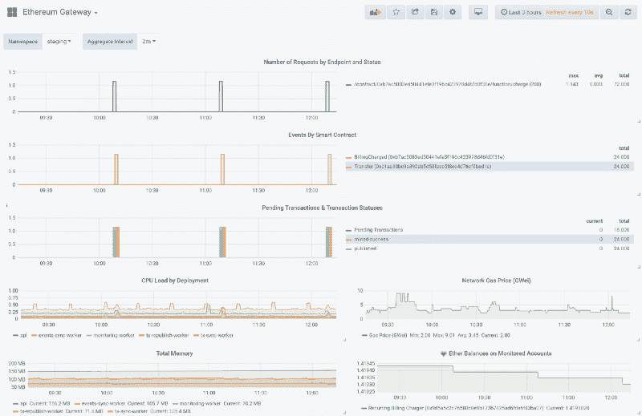
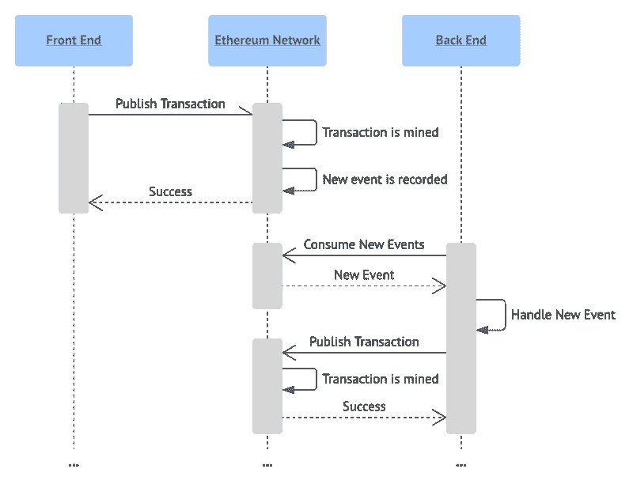
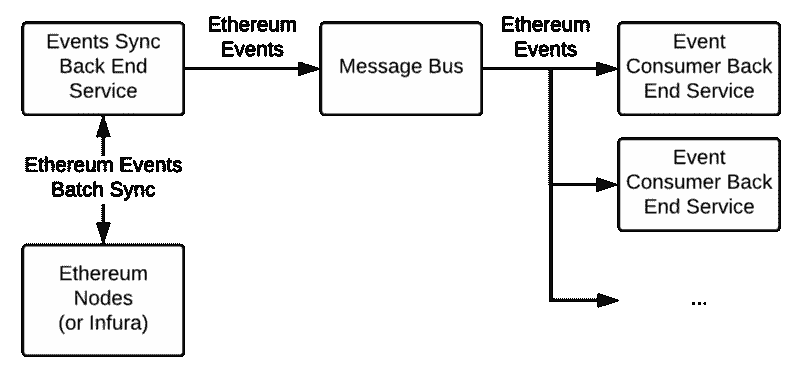
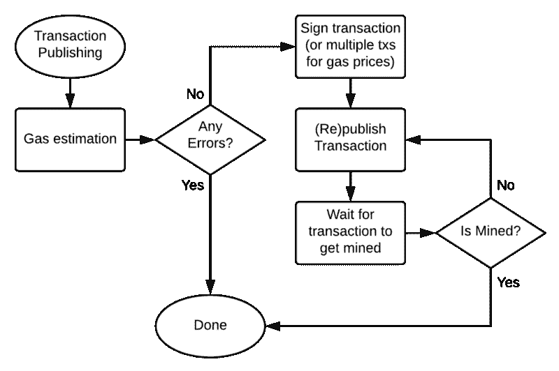
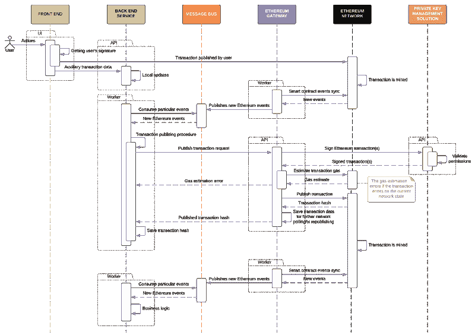
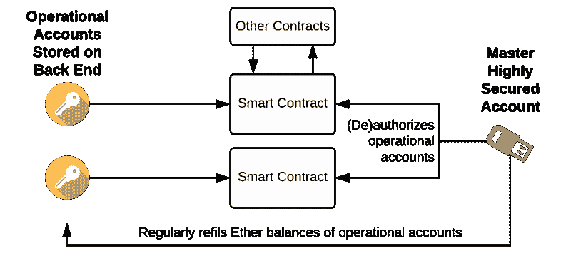

# 分散式应用架构:后端、安全性和设计模式

> 原文：<https://www.freecodecamp.org/news/how-to-design-a-secure-backend-for-your-decentralized-application-9541b5d8bddb/>

[分散式应用](https://en.wikipedia.org/wiki/Decentralized_application)或 Apps 需要特殊的系统设计来实现高安全性和可靠性。在这篇文章中，我将介绍如何正确设计和实现分布式应用程序的后端和智能契约的几个主要原则，以[以太坊](https://www.ethereum.org/)为主要示例，尽管它的大部分也适用于 [EOS](https://eos.io/) 、 [Tron](https://tron.network/) 和其他分布式数据平台。

**文章集锦**:

*   如何在后端存储私钥而不存在安全问题
*   如何正确设计智能合同以及“分散”什么
*   分散式和半集中式应用程序架构示例
*   如何处理网络负载和故障等低级问题

要大了，动手吧！

### 去中心化程序和区块链

尽管区块链今天面临着许多采用和监管的困难，但这是一种会一直存在的技术，无论是区块链、 [hashgraph](https://en.wikipedia.org/wiki/Hashgraph) 、 [tempo](https://www.radixdlt.com/) 还是任何其他即将到来的分布式账本技术，不管是什么算法。

> 区块链和其他类似技术带来的主要价值可以概括如下:它们允许人们编写和运行程序，这些程序实际上在创建后不能被更改，在执行过程中也不能被篡改。换句话说，这些程序总是按照设计运行，没有哪一方能够影响它们的行为。

如果我们把它们看作是定义硬币如何来回转移的程序，这个定义对今天存在的许多加密货币都是有效的。这也解释了为什么加密货币和许多种类的代币具有真正的价值:它们不能凭空产生，由它们定义的“底层程序”产生。

与比特币相反，以太坊/EOS/Tron/…平台实现了一个更复杂的程序层，它反过来实现了允许任何人在平台之上编写自己的分散程序的执行环境。这种用户定义的程序总是按照设计运行，没有任何例外，并且它们的安全性由平台保证。

### 分散应用

这些运行在分散网络上的安全且不可更改的程序，结合传统的前端和后端技术，就是我们今天所说的**分散应用**(Apps)。虽然其中一些可以是半集中的，但真正分散的应用程序中的大部分活动应该不受中心方的控制。

If someone asked me to draw how DApps work today, I would probably have drawn this

想象一下我们今天所说的分散化应用，以任何现有的集中式 web 资源如 [_YouTube_](https://www.youtube.com/c/NikitaSavchenko) 或 [_Instagram_](https://instagram.com/nikitaeverywhere/) 为例，想象一下，你将自己的“**加密身份**绑定到 web/移动资源，而不是密码保护的集中式帐户。

这就是[钱包软件](https://metamask.io/)给你提供的。来自这个身份的[私钥](https://en.wikipedia.org/wiki/Public-key_cryptography)(一个秘密，拥有它，你可以代表这个身份行动)存储在你的本地设备上，永远不会上线，使得除了你没有人能够控制这个身份。有了这个身份，你就可以在*集中式*(由中央权威机构控制的 web 资源)和*分散式*(与传统的 www 不同的网络，其目标是消除中央权威机构)*网络*中执行不同的动作，将网站用作接入点和/或图形用户界面。这种“加密身份”的全部意义在于，你的行为受到加密保护，没有人能够改变你签署的内容或你的签名。

今天，像[以太坊](https://www.ethereum.org/)、 [EOS](https://eos.io/) 或 [Tron](https://tron.network/) 这样的容错分散网络的计算和存储能力是有限的。如果它们是可扩展的，我们可以使用分散的网络来存储整个分散的应用程序，包括它的图形用户界面、数据和业务逻辑。在这种情况下，我们称这些应用程序为真正的分散/分布式应用程序。

然而，由于这些网络目前不可扩展，我们结合不同的方法来实现我们的应用程序的最大分散化水平。我们所知的“传统”后端不会有任何发展。例如:

*   对于分散式应用程序，我们使用后端来托管前端。
*   我们使用后端与任何其他现有技术和服务集成。真正的世界级应用程序不能生活在孤立的环境中。
*   我们使用后端来存储和处理对于一个分散网络(特别是区块链)来说足够大的任何东西。实际上，除了区块链部分，整个应用程序及其业务逻辑都存储在世界的某个地方。更不用说，IPFS 和类似的存储层[不能保证](https://github.com/ipfs/faq/issues/93)文件的可访问性，因此如果我们自己不托管文件，我们也不能依赖它们。换句话说，总是需要一个专用的运行服务器。

到目前为止，如果不使用可靠的后端，就无法构建一个安全的、部分分散的应用程序，本文的主旨就是解释如何正确地实现这一点。

### (去)集中化和代币

碰巧的是，今天几乎所有的去中心化应用都是围绕所谓的[令牌](https://coinmarketcap.com/tokens/)构建的——定制的(或者只是简单克隆的)加密货币，驱动特定的去中心化应用。代币只是一种可编程的货币或资产，仅此而已。

While token smart contracts determine how users can transfer tokens, application smart contracts can extend everything missing in token smart contracts. Both smart contracts run on top of decentralized networks

通常，令牌是在以太坊这样的去中心化平台之上编写的“智能契约”(自定义程序)。通过拥有一些代币，你基本上可以在网络资源或移动应用程序上获得不同的服务，并用这些代币交换其他东西。这里的关键点是，令牌独立存在，不受中央权威机构的控制。

> 围绕代币构建的应用程序有很多例子:从众多可收集的游戏，如 [CryptoKitties](https://www.cryptokitties.co/) (ERC721 代币)，到更面向服务的应用，如 [LOOM Network](https://loomx.io/purchase/) ，甚至是浏览器，如 [Brave](https://brave.com/download) 和游戏平台，如 [DreamTeam](https://dreamteam.gg/) (ERC20 兼容代币)。

开发人员自己决定他们对应用程序的控制程度。他们可以在智能合约的基础上构建整个应用程序的业务逻辑(就像 [CryptoKitties](https://www.cryptokitties.co/) 所做的那样)，或者，他们可以完全不使用智能合约，将一切都集中在他们的服务器上。然而，最好的方法是在中间的某个地方。

### 分散式网络的后端

从技术角度来看，必须有一座桥梁将令牌和其他智能合约与 web/移动应用程序连接起来。

在今天的完全去中心化的应用程序中，客户端直接与智能合约交互，这个桥梁被缩小到[公共 API 的](https://infura.io) [JSON RPC API](https://github.com/ethereum/wiki/wiki/JSON-RPC) 功能或像 Infura 这样的节点池，这反过来又被迫存在，因为不是每个设备都可以运行并支持其单独的网络节点。然而，这个 API 只提供了基本的、非常狭窄的函数集，几乎不允许进行简单的查询，也不能有效地聚合数据。正因为如此，最终，自定义后端开始发挥作用，使应用程序半集中化。

根据应用需求，与分散式网络的整体交互可以缩小到一两点:

1.  **监听网络事件**(如令牌转移)/ **读取网络状态**。
2.  **发布交易**(调用状态改变智能合约功能，如令牌传输)。

实现这两点非常棘手，尤其是如果我们想要构建一个安全可靠的后端解决方案。以下是我们将要分解的要点:

*   首先，在以太坊中，事件检索不是现成的产品。因为多种原因:网络节点在获取大量事件时可能失败，事件可能因为网络分叉而消失或改变，等等。我们必须构建一个抽象层来同步来自网络的事件，并保证它们的可靠交付。
*   对于事务发布也是一样，我们必须抽象以太坊的底层东西，如随机数计数器和 gas 估计，以及事务重新发布，提供一个可靠和稳定的接口。此外，事务发布意味着使用私钥，这需要高级的后端安全性。
*   安全。我们将认真对待它，并面对它，这是不可能的，以保证私钥将永远不会妥协的后端。幸运的是，有一种方法可以设计一个去中心化的应用程序，甚至不需要后端帐户的高度安全。

在我们的实践中，所有这些使得 [us](https://dreamteam.gg/) 为以太坊创建了一个健壮的后端解决方案，我们将其命名为**以太坊网关**。它从以太坊的乐趣中抽象出了其他微服务，并提供了一个可靠的 API 来与之配合工作。

作为一家[快速成长的初创公司](https://dreamteam.gg/)，由于显而易见的原因，我们不能公开完整的解决方案(目前还不能),但我将分享你需要知道的一切，以使你的分散式应用程序完美地工作。但是，如果您有任何具体的问题或询问，请随时联系 [me](https://nikita.tk/) 。对这篇文章的评论也非常感谢！

Back End Monitoring for Ethereum. The monitor demonstrates activities mainly regarding our [recurring billing feature](https://github.com/dreamteam-gg/smart-contracts/blob/master/contracts/token/TokenRecurringBilling.md) (though you can see peaks happening each hour).

### 分散式应用架构

文章的这一部分高度依赖于特定的去中心化应用程序的需求，但是我们将尝试整理出一些基本的交互模式，这些应用程序是在这些模式之上构建的(平台=去中心化平台=以太坊/EOS/Tron/随便什么):

#### **客户端⬌-平台** : ***全分散应用*** 。

客户端(浏览器或移动应用)借助以太坊“钱包”软件(如 [Metamask](https://metamask.io) 、 [Trust](https://trustwallet.com/) 或硬件钱包(如 [Trezor](https://trezor.io/) 或 [Ledger](https://www.ledger.com/) )直接与去中心化平台对话。以这种方式构建的 DApps 的例子有 [CryptoKitties](https://www.cryptokitties.co/) 、 [Loom 的](https://loomx.io/) [委托调用](https://delegatecall.com/)、加密钱包本身([元掩码](https://metamask.io/)、[信任](https://trustwallet.com/)、 [Tron 钱包](https://tron.network/wallet?lng=en)等)、像[以太德尔塔](http://etherdelta.com)这样的分散加密交换等等。

#### **平台** ⬌ **客户端** ⬌ **后端** ⬌ **平台** : ***集中式或半集中式应用*** 。

客户端与分布式平台和服务器的交互几乎没有共同之处。这方面的一个很好的例子是今天的任何( ***集中式*** )加密交易所，如 [BitFinex](https://www.bitfinex.com/) 或 [Poloniex](https://poloniex.com) :你在交易所交易的货币只是被记录在传统的数据库中。您可以通过将资产发送到特定地址(平台⬌客户端)来“充值”您的数据库余额，然后在应用程序(后端⬌平台)中执行一些操作后提取资产，但是，您就“应用程序”本身(客户端⬌后端)所做的一切并不意味着您与平台的直接交互。

另一个例子是 [Etherscan.io](https://etherscan.io/) ，它使用了 ***半集中式*** 方法:你可以在那里做所有有用的分散动作，但是如果没有它们全面的后端，应用程序本身就没有意义(Etherscan 不断地同步事务，解析数据并存储它，最终提供一个全面的 API/UI)。

#### **介于两者之间:*静止，*，集中式或半集中式应用。**

上述方法相结合。例如，我们可以有一个应用程序提供各种服务来交换加密，允许您使用加密身份登录和签署信息。

希望完全分散的应用程序(客户端⬌平台)的交互模式不会引起任何问题。依靠像 [Infura](https://infura.io/) 或 [Trongrid](https://www.trongrid.io/) 这样令人惊叹的服务，人们可以简单地构建一个根本不需要服务器的应用程序。几乎所有的客户端库，如以太坊的 [Ethers.js](https://github.com/ethers-io/ethers.js/) 或 Tron 的 [Tron-Web](https://github.com/tronprotocol/tron-web) 都可以连接到这些公共服务并与网络通信。然而，对于更复杂的查询和任务，您可能需要分配自己的服务器。

其余涉及后端的交互模式使事情变得更加有趣和复杂。为了将所有这些放在一张图片中，让我们想象一种情况，其中我们的后端对网络中的一些事件做出反应。例如，用户发布了一个允许我们向他们收费的津贴交易。要进行收费，我们必须发布收费交易以响应发出的津贴事件:

An example flow of server’s reaction to the user’s action in the decentralized network

从后端的角度来看，情况是这样的:

1.  我们通过持续轮询网络来监听特定的网络事件。
2.  一旦我们得到一个事件，我们执行一些业务逻辑，然后决定发布一个事务作为响应。
3.  在发布交易之前，我们希望确保它可能被挖掘(在以太坊中，成功的交易 gas 估计意味着相对于*当前网络状态*没有错误)。但是，我们不能保证交易*成功*。
4.  使用私钥，我们签署并发布事务。在以太坊，我们还必须确定交易的气价和气限。
5.  在发布事务后，我们不断地轮询网络的状态。
6.  如果花费的时间太长，我们无法获得事务的状态，我们必须重新发布它或触发“失败场景”。事务可能由于各种原因而丢失:网络拥塞、对等点掉线、网络负载增加等。在以太坊，你也可以考虑用不同的(实际)气价重新签订交易。
7.  在我们最终挖掘出我们的事务之后，如果需要的话，我们可以执行更多的业务逻辑。例如，我们可以通知其他后端服务事务已经完成。此外，在对交易做出最终决定之前，考虑等待几个确认:网络是分布式的，因此结果可能在几秒钟内发生变化。

如你所见，发生了很多事情！但是，您的应用程序可能不需要这些步骤，这取决于您想要实现的目标。但是，构建一个健壮和稳定的后端需要有一个解决上述所有问题的方案。我们来分析一下。

### 分散式应用后端

在这里，我想强调引起大多数问题的一些要点，即:

*   监听网络事件并从网络中读取数据
*   发布交易&如何安全地发布交易

#### 收听网络事件

在以太坊和其他分散网络中，智能合同[事件(或事件日志，或只是日志)](https://media.consensys.net/technical-introduction-to-events-and-logs-in-ethereum-a074d65dd61e)的概念允许链外应用程序知道区块链中正在发生什么。智能合约开发人员可以在智能合约代码的任何位置创建这些事件。

例如，在众所周知的 [ERC20](https://en.wikipedia.org/wiki/ERC-20) 令牌标准中，每次令牌传输[都必须记录传输事件](https://etherscan.io/tx/0xe7186ec76b164e44212dda60fdace62bef67cf7dc017d2e6318d517daa9b01c9#eventlog)，从而让链外应用程序知道发生了令牌传输。通过“监听”这些事件，我们可以执行任何(重新)动作。例如，当代币转移到你的地址时，一些移动加密钱包会向你发送推送/电子邮件通知。

事实上，没有可靠的解决方案可以开箱即用地监听网络事件。不同的库允许您跟踪/监听事件，但是，在许多情况下，可能会出错，导致丢失或未处理的事件。为了避免丢失事件，我们必须构建一个定制的后端，它将维护事件同步过程。

根据您的需要，实现可能会有所不同。但是，让您了解一下如何在微服务架构方面构建可靠的以太坊活动交付:

Reliable delivery of Ethereum events to all back end services

这些组件以下列方式工作:

1.  事件同步后端服务不断轮询网络，尝试检索新事件。一旦有新的事件可用，它就将这些事件发送到消息总线。当事件成功提交到消息总线时，对于区块链，我们可以保存上一个事件的块，以便下次从这个块请求新的事件。请记住，一次检索太多事件可能会导致请求总是失败，因此您必须限制从网络请求的事件/块的数量。
2.  消息总线(例如， [Rabbit MQ](https://www.rabbitmq.com/) )将事件路由到为每个后端服务单独设置的每个队列。在事件发布之前，事件同步后端服务指定路由关键字(例如，智能合同地址+事件[主题](https://codeburst.io/deep-dive-into-ethereum-logs-a8d2047c7371))，而消费者(其他后端服务)创建只为特定事件订阅的队列。

因此，每个后端服务只获得它需要的那些事件。此外，消息总线保证了所有事件一旦发布给它就可以交付。

当然，您可以使用其他东西来代替消息总线:HTTP 回调、套接字等。在这种情况下，您需要自己找出如何保证回调交付:管理指数/自定义回调重试，实现自定义监控等等。

#### **发布交易**

为了将事务发布到分散式网络，我们必须执行几个步骤:

1.  准备交易。除了事务数据，该步骤还意味着请求网络状态，以便查明该事务是否有效以及是否将被挖掘(以太坊中的 gas 估计)以及事务的序列号(以太坊中的 nonce)。一些库[试图在幕后做这件事](https://github.com/ethers-io/ethers.js/issues/331)，然而，这些步骤很重要。
2.  签署交易。这一步意味着使用私钥。最有可能的是，在这里您会想要嵌入定制的私有密钥装配解决方案(例如[)的。](https://github.com/immutability-io/vault-ethereum)
3.  发布和*重新发布*交易。这里的一个关键点是，您发布的事务总是有可能从分散的网络中丢失或丢弃。例如，在以太坊，如果网络的[气价](https://ethgasstation.info/)突然上涨，公布的交易可能会被取消。在这种情况下，您必须重新发布事务。此外，您可能希望重新发布具有其他参数的交易(至少具有更高的天然气价格)，以便尽快将其开采出来。因此，如果替换事务之前没有预签名(使用不同的参数)，重新发布事务可能意味着重新签名它。

The above points regarding Ethereum transaction publishing visualized

通过利用上面的方法，你可以最终构建出类似于下面序列图中所示的东西。在这个特殊的序列图上，我演示了(一般来说！)区块链循环计费的工作原理(链接文章中有更多内容):

1.  用户执行智能合约中的功能，最终允许后端执行成功的收费交易。
2.  负责特定任务的后端服务监听收费许可事件并发布收费交易。
3.  一旦收费交易被挖掘，这个负责特定任务的后端服务从以太坊网络接收一个事件，并执行一些逻辑(包括设置下一个收费日期)。

The general sequence diagram of how [blockchain recurring billing](https://hackernoon.com/payments-of-tomorrow-decentralized-recurring-billing-47d126d895fd) works, demonstrating the interaction between back-end services and Ethereum network

### 后端安全和智能合同

事务发布总是涉及到使用一个**私钥**。您可能想知道是否有可能保证私钥的安全。嗯，是也不是[有](https://en.wikipedia.org/wiki/Threshold_cryptosystem) [无数](https://medium.com/gemini/cold-storage-keys-crypto-how-gemini-keeps-assets-safe-a732addcd13b) [复杂](https://www.coinbase.com/security) [策略](https://github.com/immutability-io/vault-ethereum)和[不同类型的软件](https://www.vaultproject.io/)允许在后端安全地存储私钥。一些私钥存储解决方案使用地理分布式数据库，而其他解决方案甚至建议使用特殊的硬件。然而，在任何情况下，半集中式应用程序最易受攻击的地方是收集私钥并用于对事务签名的地方(或者，在特殊硬件的情况下，触发事务签名过程的地方)。因此，从理论上来说，没有 100%可靠的解决方案可以防止存储的私钥泄露。

现在这样想。在许多情况下，您甚至不需要经常在后端保护私钥。相反，**你可以设计智能合约和整个应用程序，使得私钥泄露不会影响它们的通常行为**。使用这种方法，授权帐户如何与智能合约交互并不重要。它们只是“触发”一个智能合约来完成它通常的工作，智能合约本身执行任何需要的验证。我称之为“运营账户模式”。

Operational accounts pattern for decentralized applications, where you don’t need military-grade security for your back-end accounts

这样，在紧急情况下:

*   攻击者唯一能窃取的是少量的以太(如以太坊),存放在交易发布的操作账户中
*   攻击者将无法损害智能契约逻辑，也无法损害参与该过程的任何人
*   受损的运营账户可以很快被其他账户替换，但是，这需要手动替换(生成新账户，并在所有智能合同中重新授权账户)或开发额外的解决方案，该解决方案将通过超级安全(硬件或[多重签名](https://medium.com/@yenthanh/list-of-multisig-wallet-smart-contracts-on-ethereum-3824d528b95e))主账户的单个交易来完成所有魔法。

例如，在我们的[recurring billing for ether eum](https://hackernoon.com/payments-of-tomorrow-decentralized-recurring-billing-47d126d895fd)解决方案中，无论后端发生什么情况，recurring billing smart contract 的设计方式都是，如果其中任何一个帐户受到损害，我们有整整一个月的时间来更换受到损害的帐户。

但是，如果你想让你的后端私钥存储尽可能安全，你可以尝试使用 [Vault](https://www.vaultproject.io/) 和一个[以太坊的伟大插件](https://github.com/dreamteam-gg)，它存储和管理以太坊账户(同时，关注我们的[开源模块](https://github.com/dreamteam-gg)——我们即将发布类似的东西)。我不打算在这里深入讨论细节，但是您可以访问链接的项目并从中学习。

这还不是我要说的全部。然而，这篇文章比我预期的要长得多，所以我不得不停下来。如果你对软件、加密、[、旅游贴士](https://instagram.com/nikitaeverywhere/)感兴趣，或者只是想关注一些有趣的事情，请订阅我的[媒体](https://medium.com/@zitro) / [其他网络](https://nikita.tk/)。希望我已经提供了一个大的有价值的信息，你会发现它有用。欢迎评论和传播这篇文章！