# 使用可流动流程引擎的 Java Using 流程编排

> 原文：<https://www.freecodecamp.org/news/saga-process-orchestration-in-java-using-the-flowable-process-engine-6baa9593bbcc/>

菲利克斯·库塔勒

# 使用可流动流程引擎的 Java Using 流程编排

#### 通过使用系统集成的 Camel 任务，在 for 中定义 Saga 流程控制器

### 介绍

在本教程中，我对 Flowable 作为 Saga 过程控制器的能力进行了评估。


Photo by [Geran de Klerk](https://unsplash.com/photos/uYkdJEYNwSM?utm_source=unsplash&utm_medium=referral&utm_content=creditCopyText) on [Unsplash](https://unsplash.com/collections/1988198/integrous?utm_source=unsplash&utm_medium=referral&utm_content=creditCopyText)

> Flowable 提供了一套紧凑高效的开源业务流程引擎核心集。它们为开发人员、系统管理员和业务用户提供了工作流和业务流程管理(BPM)平台。它的核心是一个快如闪电、经过测试的动态 BPMN 流程引擎，附带 DMN 决策表和 CMMN 案例管理引擎，全部用 Java 编写。它们是 Apache 2.0 许可的开源软件，有一个忠实的社区。([链接](https://www.flowable.org/)

可以看出，Flowable 的定位是工作流和业务流程管理平台。我们想了解的是，在低层服务编排(定义为 Saga 编排)的环境中，f low 的可行性。

请参考 Bernd Rücker 的以下精彩文章，了解如何处理"[没有两阶段提交的业务事务](https://blog.bernd-ruecker.com/saga-how-to-implement-complex-business-transactions-without-two-phase-commit-e00aa41a1b1b)"

> Saga 模式描述了如何在没有两阶段提交的情况下解决分布式(业务)事务，因为这在分布式系统中不可伸缩。基本思想是将整个事务分成多个步骤或活动。在原子事务中只能执行内部步骤，但是整体一致性由 Saga 负责。Saga 有责任完成整个业务交易，或者让系统处于已知的终止状态。([链接](https://blog.bernd-ruecker.com/saga-how-to-implement-complex-business-transactions-without-two-phase-commit-e00aa41a1b1b)

在本文中，我不讨论补偿事务。我将集中讨论执行 Saga 流程编排所需的基本框架。它主要是将 Flowable 提供的工作流功能与 Apache Camel(一个基于 [EIP 模式](https://www.enterpriseintegrationpatterns.com/)的 Java 集成框架)的功能相结合。阿帕奇骆驼是通过所谓的“骆驼任务”流动的第一公民。

### Spring Boot 应用框架

本质上可流动是基于 Spring Boot 的应用。它受益于 Spring Boot 提供的所有功能。

> Spring Boot 使得创建独立的、生产级的基于 Spring 的应用程序变得容易，你可以“直接运行”。

> 我们对 Spring 平台和第三方库有自己的看法，所以你可以毫不费力地开始。大多数 Spring Boot 应用需要很少的弹簧配置。([链接](https://spring.io/projects/spring-boot)

Spring Boot 是一个约定胜于配置的地方。我们的 *build.gradle* 看起来如下:

gradle 构建文件非常紧凑，由以下依赖项组成:

*   Spring Boot 框架依赖项
*   可流动的 Spring Boot 集成框架依赖性
*   Camel Boot 集成框架依赖项
*   以及 H2，一个可流动状态处理引擎所需的内存数据库

就这样，相当直白。

#### Spring Boot 和易流动

通过引入上述可流动的依赖关系(参考[可流动的 Spring Boot 应用文档](https://www.flowable.org/docs/userguide/index.html#springSpringBoot))和使用*@ spring boot application*注释，在幕后发生了很多事情:

*   内存中的数据源是自动创建的(因为 H2 驱动程序位于类路径中)。它被传送到可流动的过程引擎配置
*   已经创建并公开了可流动的 ProcessEngine、CMMNEngine、DMNEngine、FormEngine、ContentEngine 和 IdmEngine beans
*   所有可流动的服务都作为 Spring beans 公开
*   创建了 Spring 作业执行器

您可以微调可流动应用程序，即如果您只需要所提供引擎的子集，请参考以下[可流动启动器列表](https://www.flowable.org/docs/userguide/index.html#springBootFlowableStarter)。

#### 跳羚和骆驼

Apache Camel 集成框架包含在以下两个依赖项中:

```
implementation 'org.apache.camel:camel-spring-boot-starter:2.23.0'implementation 'org.flowable:flowable-camel:6.4.1'
```

*   第一个依赖项将 Camel 绑定到 Spring Boot 应用程序框架中，
*   第二个依赖项通过所谓的 Camel 任务将 Camel 绑定到可流动流程引擎中，这使得能够将集成到可流动流程模型中的任何第三方系统委托给 Camel Route(稍后将详细介绍)

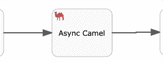

### 引导可流动的引导应用

要运行一个准系统可流动的 Spring 应用程序，请遵循以下步骤:

引入具有以下属性的 application.properties。

```
management.endpoints.web.exposure.include=*management.endpoint.health.show-details=when_authorizedflowable.idm.password-encoder=spring_delegating
```

提供 SecurityConfiguration 类。

并在启动时加载三个测试用户。

最后，我们提供了一个 REST 控制器，对我们的核心可流动 Spring Boot 应用程序进行初步检查。

通过命令启动可流动的应用程序

```
gradle bootApp
```

并用 [http://localhost:8080](http://localhost:8080) 打开浏览器。系统将提示您输入用户名和密码。提供`flowfest`和密码`test`。您现在应该已经登录，应该会显示问候消息。

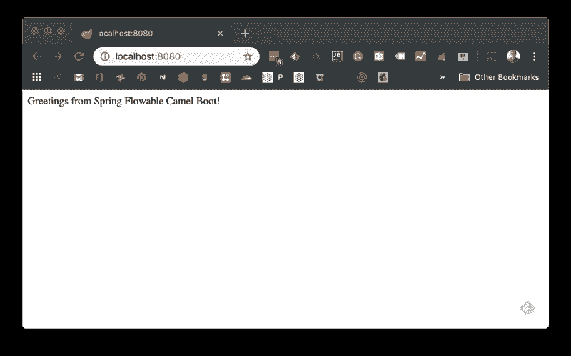

很好，我们强大的 Spring 应用程序已经准备好了，我们可以继续了。

### 可流动模型

我们的 Saga 流程将通过使用 BPM 模型特性在 flow Modeler 中建模。本[流动教程](https://paulhh.wordpress.com/2017/01/31/flowable-6-instant-gratification/)中给出了快速介绍。

通过[流动主页](https://www.flowable.org/)，下载最新版本(实际流动版本 4.6.1)这是一个 zip 文件，包含一个 war 目录和 5 个 WAR 文件。

例如，在 Tomcat 测试服务器上部署这 5 个 war 文件，并运行:

[http://localhost:8080/flowerable-modeler](http://cloudburo2:8080/flowable-modeler/#/processes)/你将被要求登录，提供`admin`密码`test`

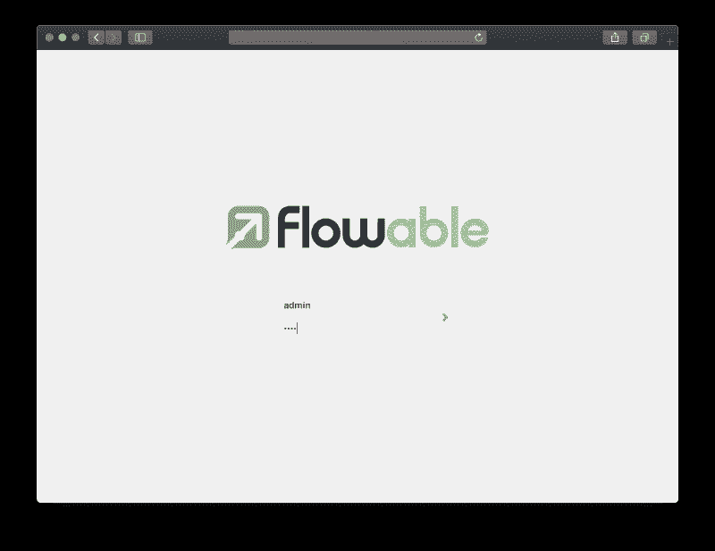

Flowable Login Page

成功登录后，您将被定向到业务流程模型仪表板(最初为空)。

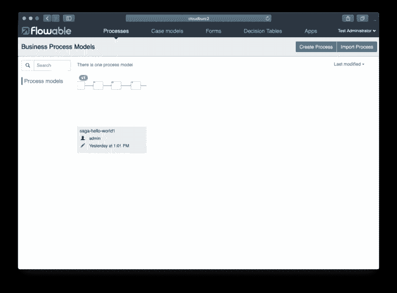

您已经准备好测试它了。可流动的默认配置引入了一个持久的 DB。这确保了您的模型工件将被存储起来，并且在重启应用服务器之后仍然可用。

为了成功加载可流动建模器，在 Ubuntu Standard Tomcat 应用服务器上有必要进行一个小的手工修改。在 tomcat 工件目录(/var/lib/tomcat8)中，我必须使用用户/组权限`tomcat8:tomcat8`创建一个`flowable-db`目录，否则应用程序启动会失败(由于 tomcat8 apt 包是由 root 安装的)。

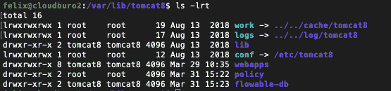

### 流动传奇:你好世界进程

在 flow 中，我们对 hello world 流程进行建模，该流程由 4 个步骤组成。

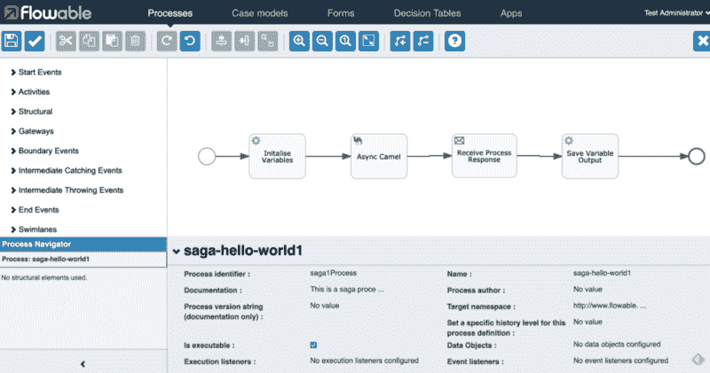

The open source Flowable Modeler (BPMN, CMN, DMN and UI Forms)

*   *初始化变量*任务设置一个我们希望在 Camel 任务中处理的输入变量
*   *Async Camel* 任务将流程委托给 Camel Route，由它处理输入变量。我们将使用 Camel Routes 进行任何类型的外部系统集成。该任务以异步方式调用，即在将处理委托给来的路由后，任务被终止并向前移动到…
*   *接收流程响应*任务是异步接收方任务，等待骆驼路线处理完成。事件触发后，处理后的数据将移交给…
*   *保存变量*任务，提取流程结果。

正如您稍后将看到的，通过使用 Camel 的功能进行集成，我们可以用一行代码在我们的 Saga 流程流中优雅地引入异步行为。

项目结构很简单。我们需要三个类来实现这个流程流，以及 BPMN 流程模型:

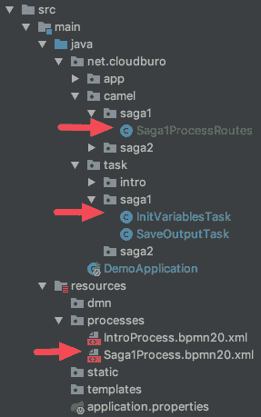

考虑到我们可能在一个可流动的 Spring 应用程序中有多个 Saga 流程，我们努力实现清晰的打包规则:

*   每个 BPMN 过程模型都有一个惟一的 id，在我们的例子中，id 是`saga1Process`。因此
*   流程模型中引用的任何类型的任务都在一个包中`task.saga1`
*   流程模型中引用的任何一种骆驼路线都在一个包`route.saga1`中

### InitVariablesTask

我们在这里模拟对调用应用程序提供的一些输入数据的检索。我们将变量`name`设置为`Hello World`。这个变量现在是流程上下文的一部分。

在模型中，我们将我们的类与我们的服务任务相关联:

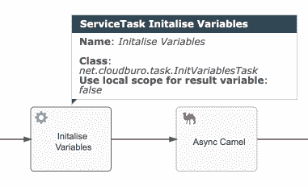

### 骆驼路线

现在让我们切换到 Camel 任务，这是一个 Camel 服务任务，我们将其配置为异步。

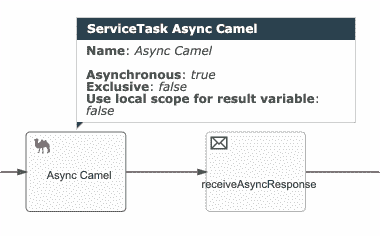

正如您所看到的，我们在骆驼任务中配置的唯一东西是服务任务标识，我们设置了异步标志。

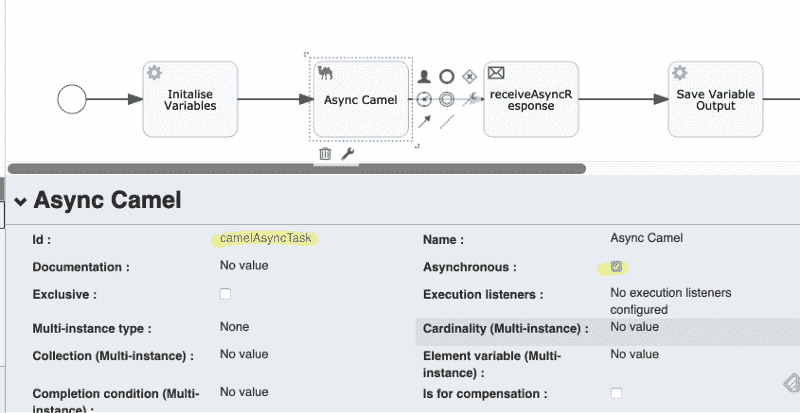

服务任务到 Camel route 的连接是在 route 类中通过命名约定完成的。整体进程 id 为`saga1Process`，任务 id 为`camelAsyncTask`，那么我们来看一下 Camel Route 类。我们在第 17 行建立了 Camel 服务任务的入站路线

```
from("flowable:saga1Process:camelAsyncTask")
```

并将收到的消息放入 Camel seda 组件(第 18 行)，这将以异步方式将 Camel 服务任务从处理中分离出来(如一行代码所示)

```
.to("seda:continueAsync")
```

#### SEDA 组件的简短介绍

我们将使用 **seda:** Camel 组件。这提供了异步的 [SEDA](https://en.wikipedia.org/wiki/Staged_event-driven_architecture) 行为。消息在一个[阻塞队列](http://java.sun.com/j2se/1.5.0/docs/api/java/util/concurrent/BlockingQueue.html)上交换，消费者在一个独立于生产者的线程中被调用。

> **分阶段事件驱动架构** ( **SEDA** )指的是一种[软件架构](https://en.wikipedia.org/wiki/Software_architecture)的方法，它将一个复杂的、事件驱动的[应用](https://en.wikipedia.org/wiki/Computer_program)分解成一组由队列连接的阶段。它避免了与基于[线程](https://en.wikipedia.org/wiki/Thread_(computer_science))的[并发模型](https://en.wikipedia.org/wiki/Concurrency_(computer_science))相关的高开销(即锁定、解锁和轮询锁)，并将事件和线程调度与应用逻辑分离。

正如我们在检索消息后看到的，我们模拟了一些处理

```
.log(LoggingLevel.INFO, logger, "External System Processing...").transform().simple("Processed: ${property.input}, { Result: OK }");
```

最后，我们将结果返回给我们的 Saga 流程

```
from("seda:continueAsync")        .to("flowable:saga1Process:receiveAsyncTask");
```

就是这样。因此，我们可以将任何类型的外部系统集成委托给 Camel routes，它提供了强大的集成概念。对于这个例子，我们可以使用一个带有重新提交策略的异常处理程序(在 Camel 中也称为`RedeliveryErrorHandler`),而不是将重试机制作为 Saga 过程的一部分来实现。这个错误处理程序允许你设置重试的次数，也可以设置重试之间的延迟等。

```
public void configure()  {    // ExceptionHandler with RedliveryPolicy    errorHandler(defaultErrorHandler()            .maximumRedeliveries(3)            .backOffMultiplier(4)            .retryAttemptedLogLevel(LoggingLevel.WARN));
```

### 接收异步响应任务

如上所述，这个服务接收者任务将充当从 Camel 返回的桥梁。

### 保存输出任务

最后，我们打印出被传递的 Camel 消息。

### Spring Boot 应用程序

在`*SpringBootApplication*`中，我们引入了一个`CommandLineRunner`，它将触发我们的流程模型。

如果我们重新启动应用程序:

```
gradle bootApp
```

我们可以在控制台上看到我们的 Saga 流程的处理输出。

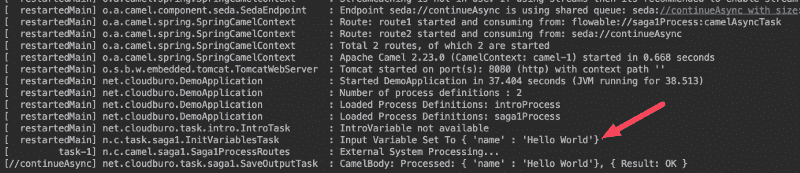

最后但同样重要的是，你也可以通过

```
gradle test
```

总结一下:正如你所看到的，使用骆驼任务的概念，Flowable 允许将第三方系统强大地集成到 BPMN 流程流中。这种方法将确保编排流不会被卸载到 Camel Routes 的企业集成逻辑过载。

您可以在此处查看代码:

[**talfco/tutorial-flowable-saga**](https://github.com/talfco/tutorial-flowable-saga)
[*一个描述如何使用 flow able 和 Camel 作为 Saga 流程经理的教程…*github.com](https://github.com/talfco/tutorial-flowable-saga)

编码愉快。