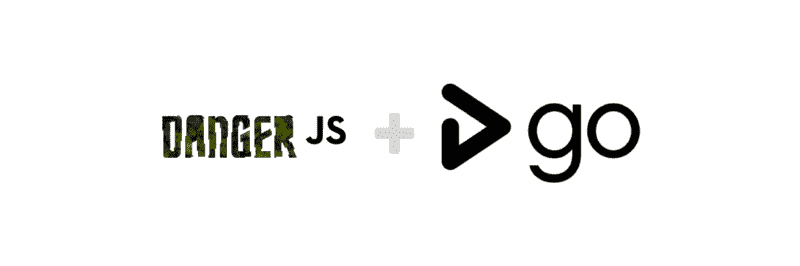
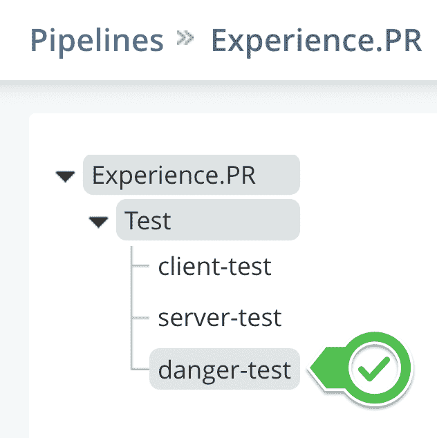
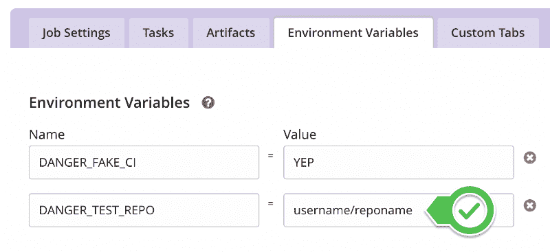
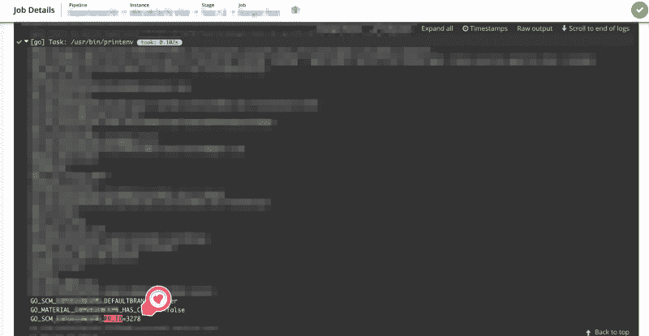

# 如何将 DangerJS 集成到 GoCD 管道中

> 原文：<https://www.freecodecamp.org/news/how-to-integrate-dangerjs-into-gocd-pipelines-7f930932ea07/>

作者莱昂纳多·利马

# 如何将 DangerJS 集成到 GoCD 管道中



在我现在的公司，我们最近将 CI infra 从 CircleCI 迁移到了 [GoCD](https://www.gocd.org/) 。在使用新的 CI 平台几个月之后，我已经可以轻松地使用它了。我计划的事情之一是集成[danger js](http://danger.systems/js)——一个通过对新代码执行可配置的自动检查来加速拉式请求审查的神奇工具。这是什么意思？没有更多的时间花在写公关评论上，比如:“哦，我相信你忘了 X… Y… Z…”。

我写这篇文章的目的是帮助下一个追求这个任务的人提高他们团队的代码质量和 PR 评审过程。

### 语境

我以前使用过 Danger 的能力(尽管与 Ruby 集成了),我已经知道初始设置会非常简单……如果我们还在使用 CircleCI 就好了！

在我第一次尝试集成时，我尝试用谷歌搜索“将 DangerJS 与 GoCD 集成”，但没有成功。此外，在阅读了 DangerJS 的文档后，我发现没有一种与 GoCD 的直接集成是我可以使用的。

这意味着我无法轻松地将危险检查集成到我的 CI 流程中。所以我只有几个选择:

1.  试图让开发人员在本地手动运行 DangerJS 命令；
2.  在(CircleCI/CodeShip/FooBar)中构建一个特定的管道，只运行 DangerJS
3.  放弃吧。

我不喜欢我的任何一个选项，在危险和 GoCD 设置中度过了几个小时后，我真的很沮丧。然后我在 DangerJS 文档中偶然发现了“[在 CI](https://danger.systems/js/guides/the_dangerfile.html#using-danger-and-faking-being-on-a-ci) 中使用危险和虚假存在”一节。就是这样！如果我可以在本地机器上伪造配置项，那么在 GoCD 机器上伪造配置项有什么不同？

之后，问题就在于如何在 GoCD 的框架内模仿同样的本地行为。

### 第一步

在做任何事情之前，你必须阅读官方文档，以便设置和开始使用 DangerJS。

基本上，你需要的是:

*   创建您的 dangerfile.js 文件。这里有几个[的例子](https://danger.systems/js/guides/the_dangerfile.html#examples)。
*   [在 GitHub/BitBucket 上创建一个僵尸账号](https://danger.systems/js/guides/getting_started.html#creating-a-bot-account-for-danger-to-use)以备不时之需
*   打开包含已更改文件的 PR 以检查您的更改
*   对一个公关链接(你刚刚打开的那个)在本地运行 DangerJS
*   尝试[在您的本地机器上伪造一个 CI 环境](https://danger.systems/js/guides/the_dangerfile.html#using-danger-and-faking-being-on-a-ci)

在下一节中，我将深入讨论这最后一步，因为这是使 DangerJS 与 GoCD 协同工作的关键部分。

### 在 GoCD 环境中配置假配置项

首先，如果您仍然没有一个分离的 GoCD 管道来只运行 Pull 请求构建，我强烈建议您这样做。如果你需要一些帮助，这里有一个指南。

其次，在建立你的公关渠道后，为危险创造一份新工作:



现在，为了能够使用 Danger 伪造 CI，您需要设置一系列环境变量，例如:

```
export DANGER_FAKE_CI="YEP"
export DANGER_TEST_REPO="username/reponame"
```

在 GoCD 的管道作业设置中，导航到环境变量选项卡并设置这两个 env 变量，用您自己的设置替换**用户名/报告名**占位符。



I’d recommend placing the DANGER_GITHUB_API_TOKEN generated on the first DangerJS configuration steps in the Secure Variables section.

在第一批配置完成后，为了在 GoCD 中实际运行 Danger 的测试，您可以使用一个 shell 脚本来执行与在本地环境中伪造配置项相同的命令。我们把这个文件叫做 danger-build.sh。

```
# danger-build.sh

echo '— — START DANGER JS VERIFICATION —'

echo Testing against commits on PR: ${GO_SCM_PIPELINE_PR_URL}

DANGER_TEST_PR=${GO_SCM_PIPELINE_PR_ID} npx yarn danger ci

echo ‘ — — END OF DANGER JS VERIFICATION — — ‘
```

请注意，您需要先前安装在 GoCD 可用机器中的 node、npm/yarn。

**你注意到那两个 GO_SCM 变量**了吗？它们是让您在 GoCD 机器中运行危险验证的捕捉。

请特别注意 PR_ID 变量，因为它提供 PR 引用，让 Danger 读取、解释更改，然后在 Pull 请求中写入建议。

如果你好奇的话，这些环境变量是由 GoCD 的机器生成的。可以通过在构建中运行`/usr/bin/printenv` UNIX 命令并检查输出来评估它们。



就是这样！

在 Shell 脚本中映射适当的 env 变量后，DangerJS 验证将开始在当前测试套件旁边的 GoCD 管道中运行。

总结这些步骤:

1.设置第一个本地文件和设置

2.在 GoCD 中创建特定的管道/作业

3.在 shell 脚本中发现并映射适当的环境变量，让 GoCD 运行 DangerJS

我希望这个演练对你有所帮助。如果你喜欢这篇文章，请与你的开发人员和管理人员分享，并帮助传播。

如有任何问题，欢迎在评论区提问！

PS: Danger 也有很多插件选项，[来看看](https://danger.systems/js/)！