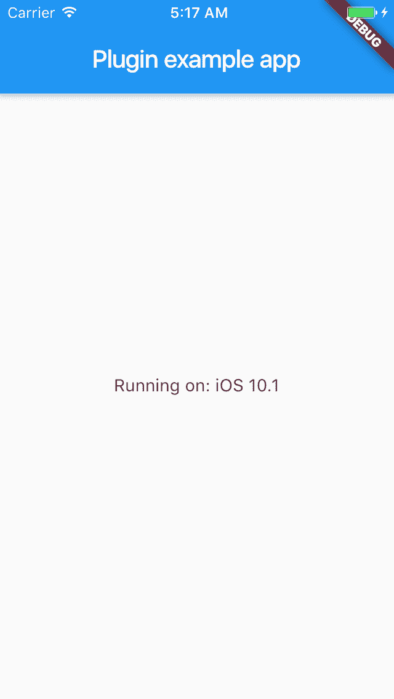
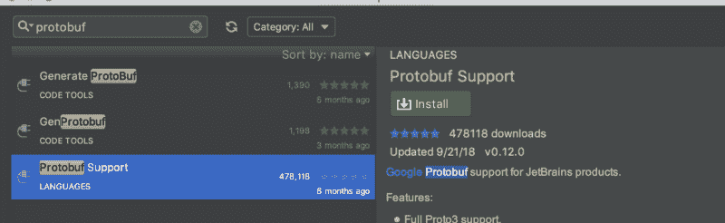
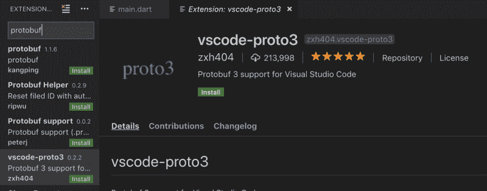
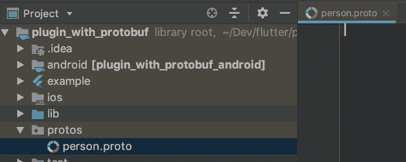

# 如何用 Protobuf 建立颤振平台通道

> 原文：<https://www.freecodecamp.org/news/flutter-platform-channels-with-protobuf-e895e533dfb7/>

作者 TruongSinh Tran-Nguyen

# 如何用 Protobuf 建立颤振平台通道

这个岗位是中高级水平。它面向的是那些打算[编写自定义平台特定代码作为 Flutter 插件](https://flutter.dev/docs/development/platform-integration/platform-channels)的观众。

TLDR:当编写平台特定的代码作为 Flutter 插件时，你应该使用 ProtoBuf 来获得类型安全、高性能和卓越的开发体验。示例代码和所有 5 个步骤都可以在我的 [GitHub](https://github.com/truongsinh/flutter-plugin-protobuf) 上找到。


### 问题是

当编写平台特定的代码作为 Flutter 插件时，一个关键的事情是 Dart 端和平台端之间的数据传输。在引擎盖下，只是一堆二进制的 0 和 1。尽管我们处理的所有代码(Dart、Java/Kotlin、ObjC/Swift)都是类型化的，所以 Flutter 使一些类型化变得更容易:

然而，看着上面的表格，您会注意到几件事:

*   FlutterStandardTypedData 家族麻烦。(相信我，有人这样做过吗？)
*   任何比那些或多或少“原始”类型更复杂的结构都需要使用`List<dynam`IC>dynamic>`;, in w`这应该是一个危险信号。

让我们看看我常见的错误类型`List`(同样的情况也出现在`Map`):

以及正确操作需要多长时间:

这只是一个顶级的`List` / `Map`，想象一下你必须深入数据结构，你必须在 Dart 和特定平台之间来回传递:

所以，总结一下:

*   `FlutterStandardTypedData`令人沮丧。
*   铸造数据是一场噩梦。
*   当处理`List` / `Map`时，我们失去了类型安全(尤其是在`Map`键中的错别字，或者重构代码/结构)。
*   `List<dynam`IC>动态>在性能方面都不是特别好。

### 解决方案

[Protocol Buffers](https://developers.google.com/protocol-buffers/) ，又名 Protobuf，是一种语言中立、平台中立的可扩展机制，用于序列化结构化数据，恰好支持:

*   [Dart](https://developers.google.com/protocol-buffers/docs/darttutorial) (由谷歌维护)
*   Java (由谷歌维护)
*   [通过 Java 绑定的 kot Lin](https://github.com/protocolbuffers/protobuf/issues/3742)(还不支持非 JVM Kotlin，但这不是我们的问题)
*   [ObjC](https://github.com/protocolbuffers/protobuf/tree/master/objectivec) (由谷歌维护)
*   [Swift](https://github.com/apple/swift-protobuf) (由苹果维护)

所以，让我们深潜吧！

#### 准备项目

我会用 Kotlin 和 Swift 创建插件项目(因为我喜欢它们)，反正 Java 和 ObjC 也一样。

```
flutter create -t plugin -i swift -a kotlin plugin_with_protobuf
```

那你应该看看

```
All done!
```

```
[✓] Flutter is fully installed. (Channel master, v1.4.2, on Mac OS X 10.14.3 18D109, locale en-US)
```

```
[✓] Android toolchain - develop for Android devices is fully installed. (Android SDK version 28.0.3)
```

```
[✓] iOS toolchain - develop for iOS devices is fully installed. (Xcode 10.2)
```

```
[✓] Android Studio is fully installed. (version 3.3)
```

```
[✓] VS Code is fully installed. (version 1.32.3)
```

```
[!] Connected device is not available.
```

```
Run "flutter doctor" for information about installing additional components.
```

```
In order to run your application, type:
```

```
$ cd plugin_with_protobuf/example
```

```
$ flutter run
```

```
Your application code is in plugin_with_protobuf/example/lib/main.dart.
```

```
Your plugin code is in plugin_with_protobuf/lib/plugin_with_protobuf.dart.
```

```
Host platform code is in the "android" and "ios" directories under plugin_with_protobuf.
```

```
To edit platform code in an IDE see https://flutter.io/developing-packages/#edit-plugin-package.
```

现在运行项目以确保一切正常。我假设你已经有一个设备连接或模拟器/仿真器运行

```
cd plugin_with_protobuf/exampleflutter run
```

或者更简单，使用您喜欢的 IDE，VS Code 或 Android Studio / IntelliJ。不管怎样，你应该有这个:



这一步的当前代码可在 [GitHub](https://github.com/truongsinh/flutter-plugin-protobuf/tree/step/0) 上获得。

#### 准备环境

*   在 Mac 上安装 Protobuf 编译器:`brew install protobuf`，或者查看 [README](https://github.com/protocolbuffers/protobuf#protocol-compiler-installation) 中的详细说明。
*   在 Mac 上安装 Swift-plugin for Protobuf 编译器:`brew install swift-protobuf`，或者查看 [README](https://github.com/apple/swift-protobuf#building-and-installing-the-code-generator-plugin) 中的详细说明。
*   为 Protobuf 编译器安装 Dart 插件:`pub global activate protoc_plugin`
*   为 ide 安装 Protobuf 扩展



#### 创建原型

现在让我们使用一个 IDE。我同时使用 VS Code 和 Android Studio，但是对于这一个，我将使用 Android Studio。用 Android Studio 打开项目`plugin_with_protobuf`(不是`plugin_with_protobuf/example`)。然后创建一个名为`protos`的新目录，并创建一个新文件`person.proto`



这一步的当前代码可在 [GitHub](https://github.com/truongsinh/flutter-plugin-protobuf/tree/step/1) 上获得。

#### 在 Dart 中生成原型

您可以从`person.proto`中的前两行看到，运行第一个命令来生成 Dart 代码(您可能希望事先创建`gen`目录)。

```
protoc --dart_out=./lib/gen ./protos/person.proto
```

在`pubspec.yaml`中，也为 Protobuf 运行时添加一个依赖项:

这一步的当前代码可在 [GitHub](https://github.com/truongsinh/flutter-plugin-protobuf/tree/step/2) 上获得。

#### 在 Swift 中生成原型

类似于步骤 2:

```
protoc --swift_out=./ios/Classes ./protos/person.proto
```

在`ios/plugin_with_protobuf.podspec`中，也为 Protobuf 运行时添加一个依赖项，注意 SwiftProtobuf 1.4 要求最低 iOS 9.0。

这一步的当前代码可在 [GitHub](https://github.com/truongsinh/flutter-plugin-protobuf/tree/step/3) 上获得。

#### 从 Swift 发送数据并在 Dart 中接收

从 Android Studio 打开 XCode:


创建模拟数据(模拟数据创建缩写，可以在 [GitHub](https://github.com/truongsinh/flutter-plugin-protobuf/tree/step/4) 上看到完整的 diffs)，序列化并发送给 Dart。

返回 Android Studio，接收并反序列化数据:

一些其他的 UI 变化被简化了，你可以在 [GitHub](https://github.com/truongsinh/flutter-plugin-protobuf/tree/step/4) 上看到完整的差异。现在，它似乎正在发挥作用。


这一步的当前代码可在 [GitHub](https://github.com/truongsinh/flutter-plugin-protobuf/tree/step/4) 上获得。

#### 生成 proto 并从 Kotlin 发送数据

与步骤 2 和 3 不同，Java/Kotlin 中的 protos 可以从 Gradle 中自动生成。我们只需要使用`protobuf-gradle-plugin`。

类似于步骤 4，创建模拟数据(模拟数据创建略，可以在 [GitHub](https://github.com/truongsinh/flutter-plugin-protobuf/tree/step/5) 上看到完整的 diffs)，序列化并发送给 Dart。

因为我们已经可以从 Dart 和 display 接收数据，所以它“工作正常”


这一步的当前代码可在 [GitHub](https://github.com/truongsinh/flutter-plugin-protobuf/tree/step/5) 上获得。

### 结论

Dart 和特定于平台的代码之间的通信，特别是当它涉及复杂的数据结构时，应该使用类型安全和高性能的序列化工具，如 ProtoBuf(例如， [BuiltValue](https://github.com/google/built_value.dart) 或多或少是类型安全的，但性能不高)。幸运的是，ProtoBuf 支持 Flutter 所需的所有 5 种语言和构建工具，并且易于集成。

最后一点:对于这个例子，你认为我们应该进行什么样的单元测试/集成测试？？