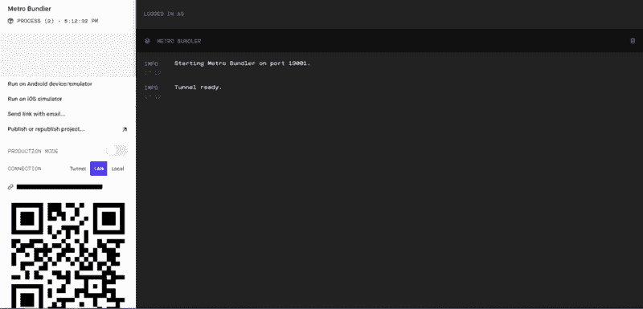
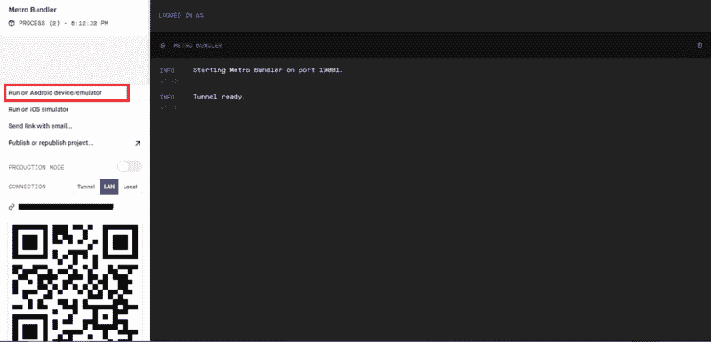
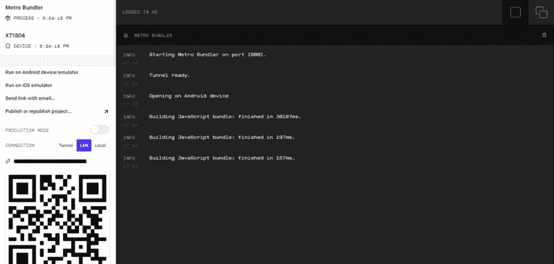
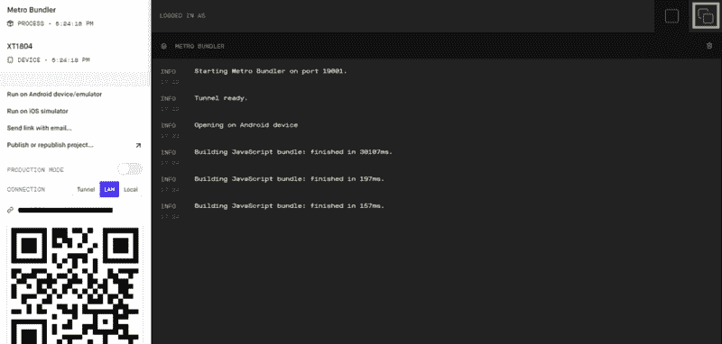

# 如何以老派风格构建 React 原生应用

> 原文：<https://www.freecodecamp.org/news/building-react-native-app-in-old-school-style-43f854a82a62/>

潘思·索兰基

# 如何以老派风格构建 React 原生应用

Photo by [Yann Le Comte](https://unsplash.com/photos/83Jan1nnQKg?utm_source=unsplash&utm_medium=referral&utm_content=creditCopyText) on [Unsplash](https://unsplash.com/search/photos/old-school?utm_source=unsplash&utm_medium=referral&utm_content=creditCopyText)

众所周知，现在是学习母语的时候了。作为 doc 有两种发展方式。本节重点介绍在 Expo 中创建应用程序，直接在您的 Android 设备上创建，而无需在您的设备上连接任何互联网。

我知道在你的设备上使用世博客户端应用程序很容易，但如果你有互联网问题呢？你不想用你有限的 MBs 去开发。那么，如果你的手机的 WiFi 连接有稳定性问题，或者你只是想开发应用程序的老派风格…或任何其他原因，该怎么办？

让我们开始吧，这个过程只包括三个小步骤。请记住，它只是针对操作系统 Windows 和目标操作系统 Android 的开发。

#### **预设置要求**

你需要从 [**这里**](http://adbdriver.com/downloads/) 在你的 PC 上安装一个 adb 驱动。这里的程序也是 [**这里的**](http://adbdriver.com/documentation/how-to-install-adb-driver-on-windows-8-10-x64.html) 。

完成该过程后，将您的手机连接到 PC。打开*命令提示符*，运行命令 **adb 设备*。*** 如果它返回*设备列表下的某个设备名称，*那么你的设置就完成了。但是如果没有显示名称，那么您需要正确安装 adb 驱动程序。

注意:你的手机应该在开发者选项中开启 USB 调试。

从 play store [**这里**](https://play.google.com/store/apps/details?id=host.exp.exponent&hl=en_IN) **安装世博客户端 App。**

#### 设置反应本地项目

按照 [**这里**](https://facebook.github.io/react-native/docs/getting-started.html) **中描述的步骤操作。**

我只是在复制这里的步骤。假设您已经安装了*节点 10+* ，运行以下命令:

npm install -g expo-cli

*expo init AwesomeProject*

*cd AwesomeProject*

*npm 开始*

以上命令会用 [***打开浏览器 http://localhost:19002***](http://localhost:19002)(如果没有自动打开，手动打开)。

一旦你打开本地主机，它会显示一条类似于**隧道就绪**的消息，如下所示:

Tunnel Ready means it’s time to create magic :)

#### 安装后步骤

现在是时候连接您的设备并打开另一个命令提示符来运行以下命令了:

**adb 设备** //查找您连接的设备的设备名称

**adb -s <设备名称>反向 tcp:8081 tc** p:8081 //这不会打印任何东西

在浏览器中进入[**http://localhost:19002**](http://localhost:19002)，点击**在 Android 设备/仿真器上运行。**

Click on Run on Android device/emulator to see magic on your device

现在，您将看到这些包正在您的设备上加载。加载所有软件包后，您的应用将在您的设备上运行，您的浏览器将如下所示:

The sidebar will show your device

您可以通过点击右上角的按钮来调试您的应用程序。

Click on the top-right button and you can see what data is passed to your device.

如果这些信息对你有用，我会很高兴。如果你有任何问题，请评论——我很乐意帮忙。

感谢阅读。