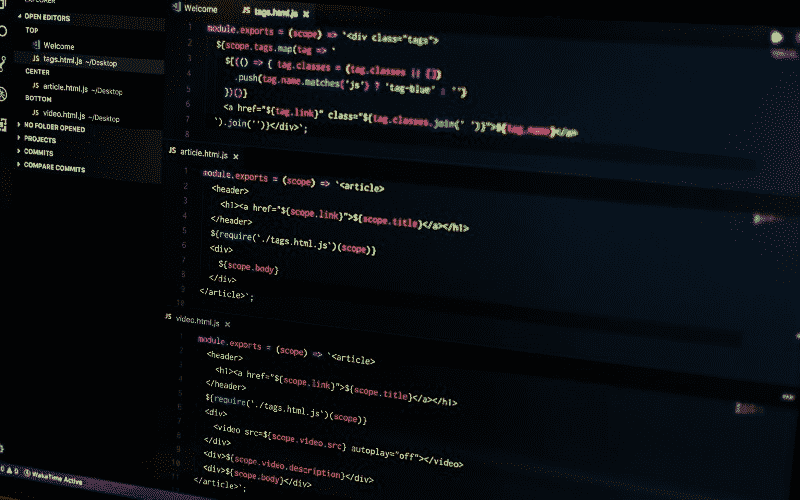

# 初学者学习前端开发的实用指南

> 原文：<https://www.freecodecamp.org/news/a-practical-guide-to-learning-front-end-development-for-beginners-da6516505e41/>

尼基塔·鲁登科

# 初学者学习前端开发的实用指南

Photo by [Atharva Tulsi](https://unsplash.com/@atharva_tulsi?utm_source=medium&utm_medium=referral) on [Unsplash](https://unsplash.com?utm_source=medium&utm_medium=referral)

我在 2018 年春天开始了我的编码之旅，不到一年前。从那时起，我获得了一些编程技能，但我知道未来还有很多东西要学。无论如何，我决定将这些技巧集中在一个地方，以帮助未来的开发人员走上他们的道路。这篇文章是我希望在开始旅程时就能找到的指南。

### **启动前**

如果你决定自学，网上有很多信息，你很难掌握所有的信息。重要的是要有一个结构化的计划，避免从一个资源跳到另一个资源而浪费时间。

请注意，这些只是进入前端世界的第一步。它将帮助你开始，但它不是完整的指南。

> 作为免责声明，请注意以下资源不是广告。我提到它们是因为它们在某些时候帮助了我，我个人推荐它们。大部分都是免费的，否则会指定。

Photo by [Mikito Tateisi](https://unsplash.com/@tateisimikito?utm_source=medium&utm_medium=referral) on [Unsplash](https://unsplash.com?utm_source=medium&utm_medium=referral)

首先，我建议注册[免费代码营](https://www.freecodecamp.org/)。其余的我会根据他们的课程。出于各种原因，我认为它是一个很好的资源:

1.  **课程设置。**这可以成为你的主要途径。这是你应该学习的东西的一个结构良好的概述，并提供了一个很好的学习曲线。
2.  **练习。**它们是一口大小的，所以你可以通过每天做几个来轻松跟上步伐，并保持你的热图绿色。
3.  **项目。完成每一章后，你将建造 5 个项目来获得认证。得到一些实践，巩固自己的知识是最理想的。**
4.  **社区。**它不仅仅是一个学习平台。有一个论坛、博客和 YouTube 频道，不同水平的开发人员可以在那里分享他们的知识，你也可以在那里找到灵感。
5.  这是免费的。金钱对许多人来说至关重要，在这里，无论如何，除了时间，你什么都不会花。

> 专业提示:你可以在 [Twitter](https://twitter.com/) **，**上创建一个账户，如果你还没有的话，公开参加**[100 daysofcode](https://www.100daysofcode.com/)**挑战。原因很简单——做这个挑战的人很多。你将获得动力和支持，这将有助于你跟上步伐。强烈推荐，不要害羞，享受社区*？*****

#### ****现在我们都准备好开始了！？****

****

Photo by [Braden Collum](https://unsplash.com/@bradencollum?utm_source=medium&utm_medium=referral) on [Unsplash](https://unsplash.com?utm_source=medium&utm_medium=referral)**** 

### ****响应式网页设计****

****第一部分包含了如何构建静态站点并对其应用样式的基础知识。****

#### ******基础知识******

****基本的 HTML 和 HTML5 和基本的 CSS 部分是现代互联网的基础。应用视觉设计、应用可访问性和响应性网页设计原则将教你写好网站的基础。不要急于求成，要小心翼翼，那些是你知识的主要组成部分。****

****你可以用一本很棒的指南来补充你的学习。****

****接下来，你将学习 CSS Flexbox 和 CSS Grid **等强大的布局技术。**在继续之前，请完成本[简短指南](http://learnlayout.com)以了解 Flexbox-Grid 时代之前人们使用的不同布局技术。你不太可能需要使用它们，但是知道并欣赏我们今天拥有的技术总是好的。****

#### ****CSS Flexbox****

****我爱上 Flexbox 是因为它的简单和强大。一开始，许多不同的属性可能会让你感到困惑，所以我的建议是在你的电脑旁边放一张备忘单，这样你就可以很容易地找到它们。此外，将此交互式 Flexbox [备忘单](https://yoksel.github.io/flex-cheatsheet/)加入书签。****

****最后，通过玩令人上瘾的 [Flexbox Froggy](https://flexboxfroggy.com/) 游戏来练习。？****

#### ****CSS 网格****

****网格更加先进和灵活，但是在大多数情况下，Flexbox 已经足够了。无论如何，你的武器库中又多了一个强大的工具。尤其是，如果你在网格花园里种植作物，这很容易理解。？****

#### ****实践****

****在进入期末专题之前，我建议你这样做:****

1.  ****在 [Codepen](https://codepen.io/) **上创建账户。**对于前端来说，这是一个很酷的平台，您可以在这里构建项目、测试代码片段并进行实践。****
2.  ****在你的机器上安装一个代码编辑器，并学习如何使用它。****
3.  ****从 Wes Bos 的[这个视频](https://www.youtube.com/watch?v=DP218aBHm1Q) 或者 Udacity 上的 [Shell Workshop](https://classroom.udacity.com/courses/ud206) 学习命令行的基础知识。****
4.  ****在 NetNinja 的这个[播放列表](https://www.youtube.com/playlist?list=PL4cUxeGkcC9goXbgTDQ0n_4TBzOO0ocPR)中学习如何使用 Git。****
5.  ****进行一些有指导的练习。通过 Traversy Media 和 code along 从该播放列表中选择任意项目。建立它们，直到你感到自信。如果你已经使用了代码编辑器和版本控制，并将你的工作上传到 Github 上的一个专门的研究报告中，那就太好了。****

#### ****现在你已经准备好获得你的第一个认证了！？****

****去构建你的最终项目并分享它们？****

****

Photo by [Jake Ingle](https://unsplash.com/@ingle_jake?utm_source=medium&utm_medium=referral) on [Unsplash](https://unsplash.com?utm_source=medium&utm_medium=referral)**** 

### ****Javascript 算法和数据结构****

****现在你知道了如何构建静态网站，是时候学习 JavaScript 了。****

****freeCodeCamp 的 JavaScript 部分很棒，但我强烈建议你看看 j [avascript.info](https://javascript.info/) 作为额外的参考。这是提供与 JavaScript 相关的所有信息的最佳资源。****

#### ****更多推荐****

1.  ****Beau Carnes 教授的 JavaScript 基础课程，如果你喜欢视觉指南的话。****
2.  ****关于 JavaScript 的新标准，我最喜欢的是适合每个人的伟大课程 [ES6！韦斯·博斯的](https://es6.io/)(付费)和博·卡恩斯的[现代 JavaScript](https://scrimba.com/g/ges6) 。****
3.  ****Scrimba 上的正则表达式课程。****
4.  ****NetNinja 的面向对象 JavaScript 课程对我很有帮助。****

#### ****算法****

****这是我最喜欢的认证部分。我记得当我刚开始解决这些问题时，它们是多么具有挑战性。我可以整天思考可能的解决方案。这是学习 JavaScript 以及如何像程序员一样思考的好方法。****

****作为一点帮助，我建议你观看 Traversy Media 的 JavaScript 有氧健身课程。****

****为了更多的练习，我强烈建议你注册 [CodeWars](https://www.codewars.com) 并设定一个初始目标来完成 **6kyu** 。这非常有帮助，因为当你完成任何挑战时，你可以浏览其他人的解决方案，并发现新的技巧、方法和想法。****

****要找到包括我在内的其他 100DaysOfCode 挑战者，请进入您的帐户设置，在氏族字段中输入 *#100DaysOfCode* 。****

****在进行最后的项目之前，你必须为最后的老板，收银机做好准备。？****

****在你打败它之后，我可以说…****

#### ****现在你知道如何使用 JavaScript 了！？****

****

Photo by [Pankaj Patel](https://unsplash.com/@pankajpatel?utm_source=medium&utm_medium=referral) on [Unsplash](https://unsplash.com?utm_source=medium&utm_medium=referral)**** 

### ****把东西粘在一起****

****现在是时候接受韦斯·博斯的 Javascript30 挑战了。这是学习 HTML、CSS 和 JavaScript 如何协同工作、完善基础知识和理解 DOM 的最佳方式。构建这些小项目对我来说是一次很棒的经历，真的很有趣！****

### ****前端库****

****从这一点来说，你正在成为一个真正的前端开发人员？****

#### ****引导程序****

****最流行的 CSS 框架。在 YouTube 上建立几个带有指南的网站。习惯 Bootstrap 著名的列网格布局。****

#### ****jQuery****

****尽管有些人说 jQuery 已经死了，但是当纯 JavaScript 的解决方案很古怪，并且使用 JS 框架太多的时候，jQuery 总是很有帮助的。这将是你武器库中的另一个伟大的工具。用它构建几个小应用程序来练习。****

#### ****厚颜无耻****

****直到我看到了 CSS 框架的真正威力，我才完全欣赏它们。我想学习先进的 CSS 技术，于是买了一个非常棒的[高级 CSS 和 Sass](https://www.udemy.com/advanced-css-and-sass/?couponCode=LAUNCHSITE4) 课程(由 Jonas Schmedtmann 付费)。如果你想提高你的 CSS 技能和理解工作流程，强烈推荐。我仍然很高兴我找到了它。****

#### ******反应&还原******

****这是前端库部分的主要部分。React 是您学习第一个 JavaScript 库的绝佳选择。****

****坦率地说，很难理解如何以 freeCodeCamp 的格式使用它，因为你不能从头开始构建任何东西，有些东西在幕后工作。所以参加 React 和 Redux 的课程，花点时间去了解他们的想法和工具。****

****我个人的最爱:****

1.  ****[完成 React 教程(带 Redux)](https://www.youtube.com/playlist?list=PL4cUxeGkcC9ij8CfkAY2RAGb-tmkNwQHG) by NetNinja****
2.  ****[React for 初学者](https://reactforbeginners.com/)(付费)Wes Bos****
3.  ****[React -完整指南](https://www.udemy.com/react-the-complete-guide-incl-redux/?couponCode=ACAD_W)(付费)由 Academind 提供****

****我希望你对在期末项目中使用你的新知识感到兴奋。****

#### ******现在你可以建造任何你想要的东西**？****

****

Photo by [rawpixel](https://unsplash.com/@rawpixel?utm_source=medium&utm_medium=referral) on [Unsplash](https://unsplash.com?utm_source=medium&utm_medium=referral)**** 

### ****继续前进****

****你现在是一个真正的前端开发人员，有足够的技能来构建优秀的 web 应用程序。也许你很好奇下一步该做什么，答案就像*一样简单:“建造，建造，建造！”*。你目前的任务是为自己创建一个投资组合，并获得更多的实践。****

****以下是关于下一步该做什么的一些提示:****

1.  ****在 freeCodeCamp 上的[获取项目创意](https://learn.freecodecamp.org/coding-interview-prep/take-home-projects/) 带回家项目。****
2.  ****与课程一起构建任何项目，然后通过添加新功能来修改和改进它。****
3.  ****解决 D3.js 和 Node.js 以获得下一个 freeCodeCamp 认证！****
4.  ****阅读[口若悬河的 JavaScript](https://eloquentjavascript.net/) 和[你不知道的 JS](https://github.com/getify/You-Dont-Know-JS) 成为 JavaScript 忍者。****
5.  ****提高你在代码战争中的排名。****
6.  ****从这门[面向网页开发人员的网页设计](https://www.udemy.com/web-design-secrets/) 课程中领略一下先进的网页设计。****
7.  ****保持你的 GitHub 账号活跃，努力为开源做贡献。****

****如果这些资源中有一个不适合你，没关系。不要沮丧，对某人有效的不一定对每个人都有效。****

****我希望这份指南能对你的学习有所帮助，也希望能节省你的时间？****

### ****祝你好运！****