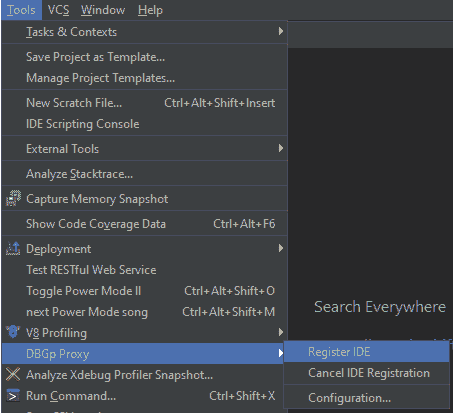
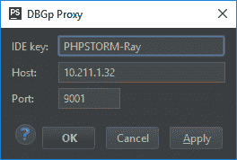
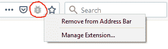
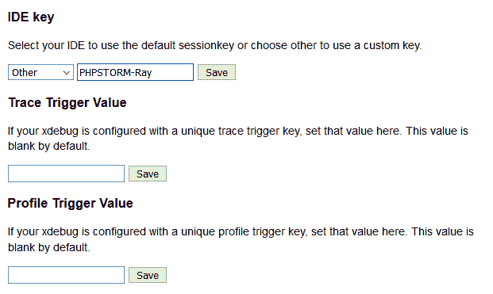
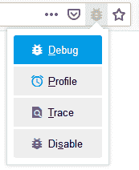
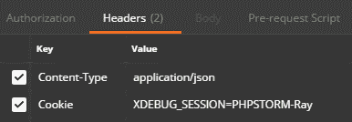
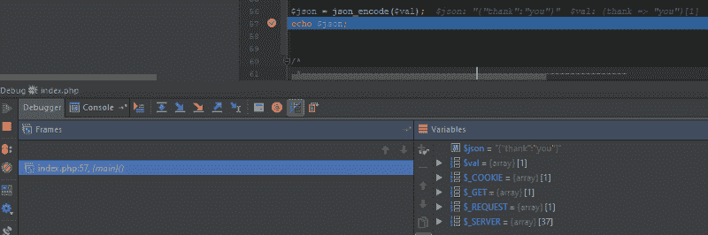

# PhpStorm 中的多用户调试

> 原文：<https://www.freecodecamp.org/news/multi-user-debugging-in-phpstorm-75ef628ed50f/>

作者雷·阿帕雷希多

# PhpStorm 中的多用户调试

#### 使用 Xdebug 和 DBGp 代理


Photo by [Philipp Katzenberger](https://unsplash.com/photos/iIJrUoeRoCQ?utm_source=unsplash&utm_medium=referral&utm_content=creditCopyText) on [Unsplash](https://unsplash.com/search/photos/computer?utm_source=unsplash&utm_medium=referral&utm_content=creditCopyText)

“呃，等一下……你不就是用了 Xdebug 2.1 开始引入的`xdebug.remote_connect_back`吗？”

当然，如果 web 服务器只能由开发人员访问(例如，私有开发服务器)，如果它不在 NATted 防火墙后面运行，如果您希望本指南到此结束。看到那些如果了吗？我个人不喜欢 IF 在编程或者生活中。因此，本指南将采用不需要 IF(或至少更少的 IF)的更长的方法，即使用 Xdebug 的 DBGp 代理。

> *使用代理时，PHP Xdebug 扩展不再直接连接 PhpStorm，而是连接 DBGp 代理服务器。然后，团队中的所有开发人员依次连接到该代理。每个开发人员都有一个独立的调试会话在这个代理上运行，这使得在同一服务器上对同一代码进行多用户调试成为可能。*


[*https://www.jetbrains.com/help/phpstorm/multiuser-debugging-via-xdebug-proxies.html*](https://www.jetbrains.com/help/phpstorm/multiuser-debugging-via-xdebug-proxies.html)

因此，使用 DBGp 代理，您可以限制谁可以连接到代理，并且您可以让多个开发人员调试运行在 NATted 防火墙后面的同一个 web 服务器。

> *运行 DBGp 代理还可以让你避免 NAT 问题，在这种情况下(从服务器上的 PHP+Xdebug 可以看出)，所有连接似乎都来自同一个 IP(因为你的内部网络是 NAT 的)。在这种情况下，您可以简单地在您的 NAT 机器上运行 dbgp 代理，将`xdebug.remote_host`设置配置为您的 NAT 机器的 IP 地址，并将 ide 配置为连接到在`<NAT-machine>`运行的代理；* :9001。

> *——[https://derickrethans.nl/debugging-with-multiple-users.html](https://derickrethans.nl/debugging-with-multiple-users.html)*

### 设置

首先应该在 PhpStorm 中正确地完成项目文件夹和服务器上的文件夹之间的映射，以便进行调试。

### 安装 Web 服务器

尽管本指南假设 web 服务器运行在 Linux 上，但是稍加修改，本指南也可以用于非 Linux web 服务器。

1.安装 Xdebug。

```
# PHP 7+pecl install xdebug  # PHP 5.6.xpecl install xdebug-2.5.5
```

2.启用 Xdebug 扩展，然后将下面的 [Xdebug 配置](https://xdebug.org/docs/all_settings)添加到 php.ini:

```
[xdebug]zend_extension="<full_path_to_xdebug.so>"
```

```
; debugger settingsxdebug.remote_enable=1xdebug.remote_host=127.0.0.1xdebug.remote_port=9000
```

对于本指南，DBGp 代理将在与 web 服务器相同的机器上运行，并将使用 Xdebug 的默认端口，因此称为`127.0.0.1:9000`。

3.从[科莫多远程调试包](http://code.activestate.com/komodo/remotedebugging/)下载并安装用于远程调试的 DBGp 代理，专门用于您的 web 服务器操作系统。本指南将使用 64 位 Linux 和 PHP 远程调试客户端 v11.1.0。为了简单起见，我将所有内容提取到我的主目录，即`/home/ray/`。

4.通过执行带参数的`pydbgpproxy`文件运行 DBGp 代理:

*   `-d <ip_address:po` rt >设置将从 web 服务器接收调试器连接的机器的 IP 地址和端口
*   `-i <ip_address:po` rt >设置将从开发者计算机接收调试连接的机器的 IP 地址和端口

在本指南中，web 服务器和 DBGp 代理将在同一台机器上运行。如果 IP 地址是`10.211.1.32`并且我们想要在端口`9001`上运行代理，那么命令将是:

```
pydbgpproxy -d 127.0.0.1:9000 -i 10.211.1.32:9001
```

为了方便起见，我们可以使用这个脚本，保存为`start-dbgp-proxy.sh`。
我把它放在与`pydbgpproxy`相同的目录下，即`/home/ray/start-dbgp-proxy.sh`):

```
ip=$(hostname -I | awk '{$1=$1};1')pydbgpproxy -d 127.0.0.1:9000 -i $ip:9001
```

5.确保在端口`9000`上允许来自本地主机的连接，在端口`9001`上允许来自开发者机器的连接。

6.运行`start-dbgp-proxy.sh`。如果不能运行，请添加执行文件权限。

```
start-dbgp-proxy.sh
```

确保它可以顺利运行。

```
INFO: dbgp.proxy: starting proxy listeners.  appid: 30430INFO: dbgp.proxy:     dbgp listener on 127.0.0.1:9000INFO: dbgp.proxy:     IDE listener on  10.211.1.32:9001
```

7.(可选)使用 crontab 在每次机器启动时自动启动`start-dbgp-proxy.sh`。

Edit crontab:

```
crontab -e
```

添加 cron 作业以在每次启动时自动启动`start-dbgp-proxy.sh`:

```
@reboot /home/ray/start-dbgp-proxy.sh
```

### 安装客户端

1.在 PhpStorm 上访问菜单。



2.用开发者之间的唯一字符串填充`IDE key`。用 DBGp 代理的 IP 地址和端口填充`Host`和`Port`([设置服务器#4](https://medium.com/@naldoray/multi-user-debugging-in-phpstorm-75ef628ed50f#6728) 上的参数`-i`)。



3.单击确定。您应该会看到一个成功通知弹出窗口。如果没有看到，通过`Tools > DBGp Proxy > Regist` er IDE 重新注册 IDE。如果它失败了或者你想改变配置，我需要进行配置吗...

4.(可选)如果您想从 web 浏览器启动调试连接，建议在您的浏览器上安装一个调试扩展: [Xdebug Helper Firefox](https://addons.mozilla.org/en-US/firefox/addon/xdebug-helper-for-firefox/) 或 [Xdebug Helper Chrome](https://chrome.google.com/webstore/detail/xdebug-helper/eadndfjplgieldjbigjakmdgkmoaaaoc) 。然后配置您的 Xdebug 助手。



在 Firefox 上，右键单击 Xdebug 助手图标>管理扩展…>选项在 Chrome 上，右键单击 Xdebug 助手图标>选项



用与注册 IDE 时相同的唯一字符串填充并保存`IDE key`([步骤#2](https://medium.com/@naldoray/multi-user-debugging-in-phpstorm-75ef628ed50f#bea9) )。

### 开始调试

1.在 PhpStorm 上设置断点。

2.通过点击右上角工具栏上的“电话”按钮或从菜单`Run > Start Listening for PHP Debug Connecti` ons 开始监听 PhpStorm 中的调试连接。这将使 PhpStorm 能够在调试会话启动时自动做出反应并打开调试窗口。


3.执行请求时激活 Xdebug 的调试器。根据 [Xdebug 文档](https://xdebug.org/docs/remote#starting)有三种方法可以做到这一点。但是我认为，适用于所有 HTTP 方法的最佳方式是设置一个名为`XDEBUG_SESSION`的 cookie，其值为`<IDE_k` ey >，当我们将 IDE 注册到 DBGp p[roxy(Setup Cli](https://medium.com/@naldoray/multi-user-debugging-in-phpstorm-75ef628ed50f#bea9)ent # 2)时，这是相同的唯一字符串。

*   在 web 浏览器中，cookie 将由 Xdebug Helper 扩展自动设置



*   在 Postman 中，可以在请求头中设置 cookie



4.使用已经设置的 cookie 运行脚本。

5.如果成功，PhpStorm 将自动显示调试窗口。



6.如果您没有进行任何调试，请确保在 PhpStorm 中取消设置/不发送 cookie 来禁用调试并停止监听调试连接。如果您没有这样做，当有太多挂起的连接时，它将使 DBGp 代理挂起。

希望这个指南对你有用。

感谢您的阅读！

### 参考

*   [https://www . jetbrains . com/help/PHP storm/multiuser-debug-via-xdebug-proxy . html](https://www.jetbrains.com/help/phpstorm/multiuser-debugging-via-xdebug-proxies.html)
*   [https://www . jetbrains . com/help/PHP storm/browser-debugging-extensions . html](https://www.jetbrains.com/help/phpstorm/browser-debugging-extensions.html)
*   [https://xdebug.org/docs/remote#starting](https://xdebug.org/docs/remote#starting)