# 免费课程:用 ES6 和 Dropbox 构建一个费用管理器

> 原文：<https://www.freecodecamp.org/news/free-course-build-an-expense-organizer-with-es6-and-dropbox-4ec7cd1048ef/>

在我之前的创业中，我们在生产过程中大量使用了 Dropbox API。我们的产品是适用于 iPad 的儿童书籍应用，每本书都是 Dropbox 文件夹的简单集合，其中包含了这本书的所有视觉效果、音乐和画外音。这有两大好处:它为每个人提供了一个他们已经知道如何使用的界面，而且它比构建一个定制的界面更便宜。

因此，当 Dropbox 问 Scrimba 我们是否有兴趣在他们的 API 上创建一个赞助课程时，我们毫不怀疑，因为我们知道他们的 API 有多有用。

其次，这一赞助也让我们在 2019 年为我们的社区创造了更多的课程。所以我们非常感谢 Dropbox 有兴趣支持 Scrimba。

现在让我们来看看实际的过程。

### 介绍

这门课的讲师是[克里斯蒂安·詹森](https://twitter.com/cbejensen)，一位犹他州的前端开发人员。你们中的一些人可能从他去年在 Scrimba 上创建的 React Hooks 教程中知道他，很多人都很喜欢这个教程。


Christian 在课程开始时向您概述了在开始之前您应该了解的内容，以及在整个课程中您可以期望学到的内容。


作为本课程的先决条件，了解一些基本的 HTML 和 JavaScript 是很好的，但不是必须的。如果你不太熟悉 JS，你仍然可以继续学习这门课程，因为这个 API 可以很好地翻译成其他语言。

本课程的最终目标是让你能够在 Dropbox 文件夹上构建一个应用程序，例如 Christian 在整个课程中构建的 expense organizer 应用程序。

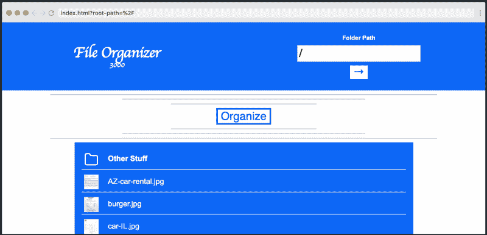

对于许多公司和自由职业者来说，这是一个痛苦的完美例子，即跟踪收据！

### 建立

在我们深入研究代码之前，Christian 为那些希望自己运行本教程中的应用程序的人提供了一个简短的、可选的设置概述。

你需要做的第一件事是[前往 Dropbox。](https://www.dropbox.com/developers)在 Dropbox 网站上，进入 ***我的应用*** ，选择 ***Dropbox API*** :

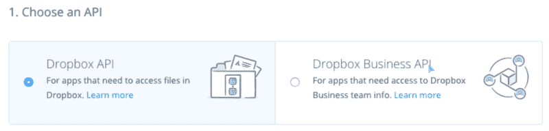

接下来，我们选择 ***应用程序文件夹*** 访问类型，看看它是如何工作的，最后，我们将命名我们的应用程序。

点击 ***创建应用*** 按钮后，我们的应用生成后，我们会看到设置屏幕。

在设置中，我们实际上只需要 ***OAuth 2*** 部分，在 ***生成的访问令牌*** 下，点击 ***生成*** 按钮，就可以获得我们将在下一部分教程中使用的访问令牌。

仅此而已！

### 导入 SDK

在本期节目中，Christian 向我们展示了如何导入 SDK 并开始使用它。

快速补充说明:尽管在本课程中使用了用于 Dropbox API 的 JavaScript SDK，但 SDK 本身在各种编程语言中基本上是相同的。

让我们从导入 JavaScript SDK 开始。

```
// note that the import is named  
import { Dropbox } from 'dropbox'; 
```

这个类是用一个配置对象实例化的，它需要`accessToken`和一个获取库。我们将在课程中使用普通的`fetch`，如果你愿意，你可以在你的 Dropbox 开发者账户中获得你的`accessToken`。

```
import { Dropbox } from 'dropbox';

const dbx = new Dropbox({  
  accessToken: 'aeOL1E1HS0AAAAAAAAAALX6z1ogWy75HGE_HBN-NNpJNfhnEa1kjF1vsJ_t7Wf8k', 
  fetch  
}) 
```

注意:上面的`accessToken`已经被撤销了，所以尝试在你自己的代码中使用它是没有意义的。

### 获取文件

到目前为止，Christian 向我们展示了如何实例化一个类。

关于这个类的方法的完整列表可以在官方文档页面找到。

在这次演员表中，我们将学习`filesListFolder()`方法。它接受一个文件夹并开始返回该文件夹的内容。

```
dbx.filesListFolder({  
  path: ''  
}).then(res => console.log(res))

// for a full console.log results, visit:  
// [https://scrimba.com/p/pnyeEhr/cGvvanuy](https://scrimba.com/p/pnyeEhr/cGvvanuy) 
```

当我们使用`filesListFolder()`时，有一些事情要记住:

*   它回报一个承诺。
*   要指定一个根路径，我们需要指定一个空字符串`''`而不是`'/'`

### 渲染文件

在这一课中，Christian 将向我们展示如何渲染我们从之前的角色中得到的文件。他将为我们提供一些样板的普通 JS 代码，让我们开始学习，这样我们就可以专注于本课最有趣的部分——渲染文件。

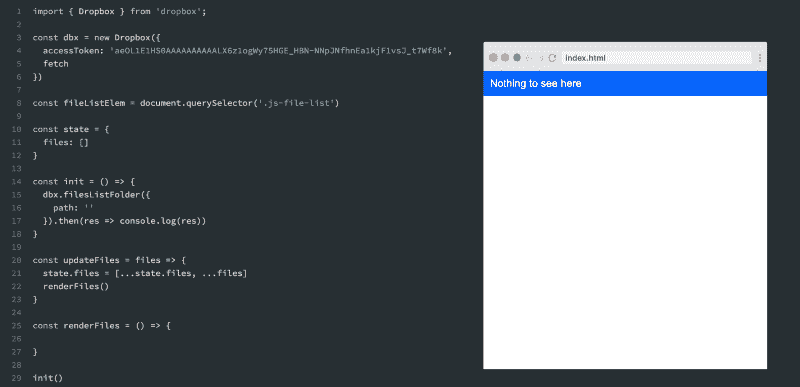

让我们和 Christian 一起编写`renderFiles()`函数。

我们需要将所有按字母排序的文件添加到`fileListElem.innerHTML`中，确保我们将文件夹放在第一位。然后，我们将每个文件夹和文件映射到一个`<li>`并使用`join('')`进行连接，以避免呈现一个数组而不是一个字符串。

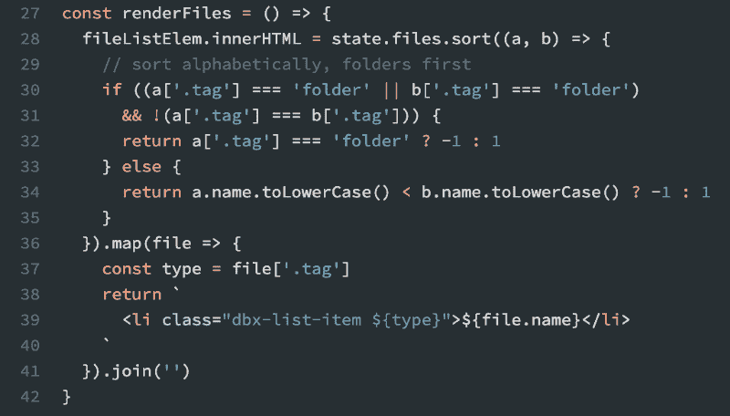

这就是我们的渲染文件列表！

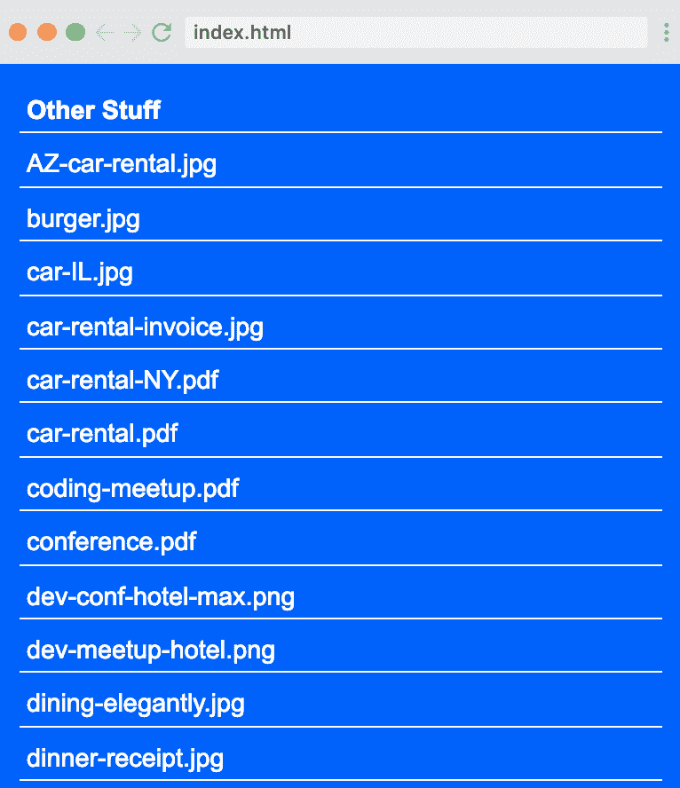

### 渲染缩略图

在这个截屏中，Cristian 将集中精力渲染缩略图，我们将在接下来的课程中从 Dropbox 中获取实际的缩略图。

我们将修改我们的`renderFiles()`函数。在`.map`部分，我们可以检查一个文件的缩略图是否存在，然后使用它，否则，使用缺省值。请记住，文件夹没有缩略图。

默认图像将以 base64 字符串的形式提供，如果您在自己的编辑器中跟随课程，[您可以访问演员表来复制它们](https://scrimba.com/p/pnyeEhr/ckMP6DTN?utm_source=freecodecamp.org&utm_medium=referral&utm_campaign=gdropbox_launch_article)。


很好，现在我们有了默认的缩略图渲染，在下一次 cast Christian 将向我们展示如何渲染我们可以从 Dropbox API 获得的实际缩略图。


### 获取缩略图

正如 Christian 在上一课中承诺的那样，我们现在要渲染从 Dropbox API 获得的实际缩略图，以显示包含它们的文件。

我们将添加并创建`getThumbnails()`到我们的`updateFiles()`方法中。

```
const updateFiles = files => {  
  state.files = [...state.files, ...files]  
  renderFiles()  
  getThumbnails(files)  
} 
```

要获取缩略图，我们可以使用现有的 API 端点:

```
// [http://dropbox.github.io/dropbox-sdk-js/Dropbox.html](http://dropbox.github.io/dropbox-sdk-js/Dropbox.html)

dbx.filesGetThumbnailBatch({  
  entries: [{  
    path: '',  
    // preferred size for a thumbnail  
    size: 'w32h32'  
  }]  
}) 
```

这就是完成的`getThumbnails()`功能:

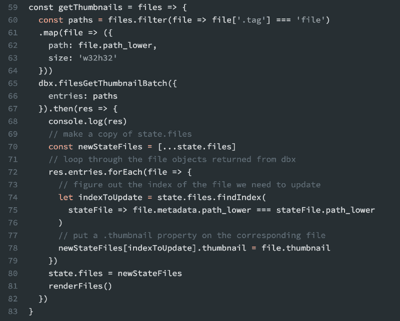

如果您对详细的演练感兴趣或者希望复制代码，请随意进入[实际的演员表](https://scrimba.com/p/pnyeEhr/cyNpzJAe?utm_source=freecodecamp.org&utm_medium=referral&utm_campaign=gdropbox_launch_article)。

### 异步/等待

到目前为止，我们已经使用了两个返回承诺的 API 调用。我们已经使用`.then()`解决了它们，在这个截屏中，Christian 将向我们展示如何使用`async/await`重构它们。

为了使用`async/await`,我们在函数前声明`async`,在 API 调用前声明`await`。

让我们看看如何重构我们的`init()`函数。

```
const init = async () => {  
  const res = await dbx.filesListFolder({  
    path: '',  
    limit: 20  
  })  
  updateFiles(res.entries)  
} 
```

现在让我们重构一下`getThumbnail()`:

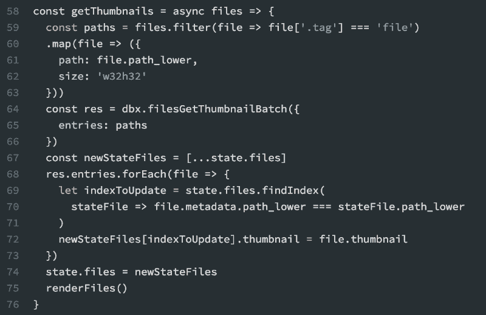

### 光标

在这次演员表中，我们将学习 Dropbox 的光标概念。

用简单的 API 术语来说，光标表示我们在文件中的位置。

例如，您有 100 个文件，您请求了前 20 个。光标将移动到第 21 个文件，并通过`has_more: true`字段让您知道您还有更多文件要下载。您请求的文件越多，光标移动得越远，直到它告诉您到`has_more: false`时已经没有文件了。

这是它在现实中的样子。

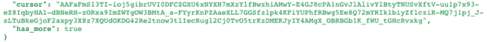

您可以使用光标字符串让 API 知道光标在哪里，这样您就不会收到您已经拥有的文件。

在下一课中，Christian 将向我们展示如何将这一概念应用到我们的应用程序中，并使用光标来获取更多文件。

### 获取更多文件

让我们更新`init()`方法，通过检查响应的`has_more`属性来加载更多的文件(如果有的话)。

```
const init = async () => {  
  const res = await dbx.filesListFolder({  
    path: '',  
    limit: 20  
  })  
  updateFiles(res.entries)  
  if (res.has_more) {  
    getMoreFiles(res.cursor, more => updateFiles(more.entries))  
  }  
} 
```

我们可以改善用户体验，但是在需要加载更多文件时添加加载消息。

```
const loadingElem = document.querySelector('.js-loading')

const init = async () => {  
  const res = await dbx.filesListFolder({  
    path: '',  
    limit: 20  
  })  
  updateFiles(res.entries)  
  if (res.has_more) {  
    loadingElem.classList.remove('hidden')  
    getMoreFiles(res.cursor, more => updateFiles(more.entries))  
    loadingElem.classList.add('hidden')  
  } else {  
    loadingElem.classList.add('hidden')  
  }  
} 
```

现在我们可以实现`getMoreFiles()`功能了。

```
const getMoreFiles = async (cursor, cb) => {  
  const res = await dbx.filesListFolderContinue({ cursor })

// we check if the callback is provided and if so - call it  
  if (cb) cb(res)

if (res.has_more) {  
    // if there are more files, call getMoreFiles recursively,  
    // providing the same callback.  
    await getMoreFiles(res.cursor, cb)  
  }  
} 
```

### 更改文件路径

哇，到目前为止我们已经写了一些非常棒的代码。

一件很酷的事情是，如果我们不总是被限制在根路径上。

这正是我们要在这次演员表中学到的。

为了让我们开始，Christian 对我们应用程序中的 HTML 和 CSS 做了一些更改，主要更改是`Folder Path`字段。这是用户可以指定他们想去的文件夹的地方。

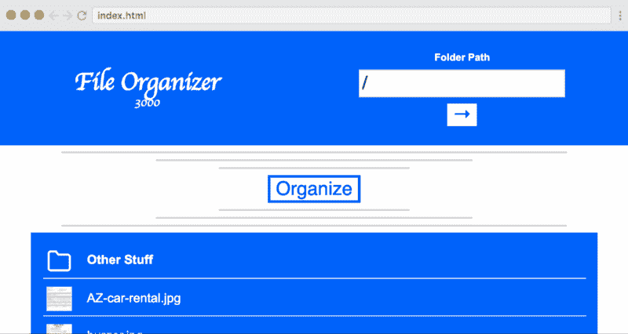

当用户让我们知道他们想去哪里时，我们可以通过监听`rootPathForm`上的提交事件来实现这一点。然后，我们验证他们的输入并防止基本错误，比如文件夹名称的大小写错误。我们还应该将`rootPathInput`的值存储在我们的`state`中，以便能够在应用程序的其余部分重用它。

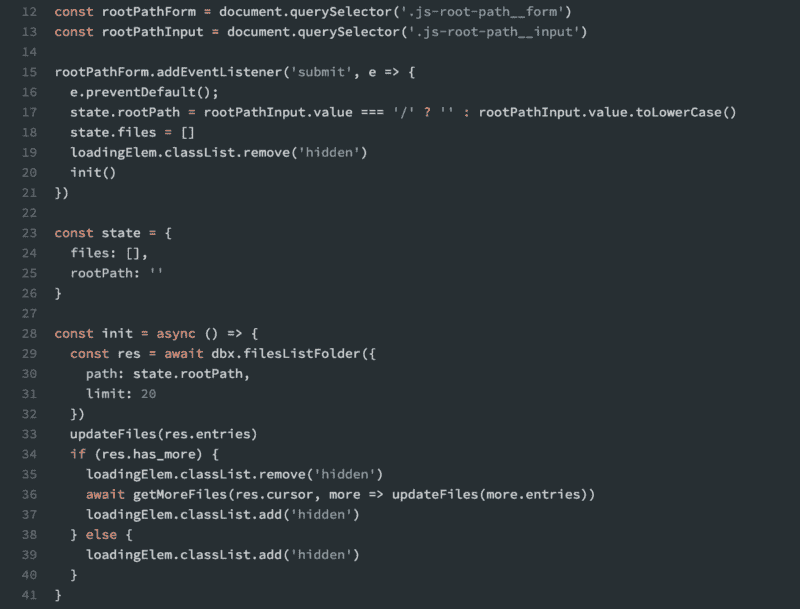

### 移动文件

在这一课中，我们将实现应用程序的主要功能——根据修改日期将文件组织到文件夹中的能力。

首先，我们需要添加一些组织代码，以确保在我们实现`moveFilesToDatedFolders()`之前，我们的核心功能对我们的用户来说感觉良好。

```
const organizeBtn = document.querySelector('.js-organize-btn')

organizeBtn.addEventListener('click', async e => {  
  const originalMsg = e.target.innerHTML  
  e.target.disabled = true  
  e.target.innerHTML = 'Working...'  
  await moveFilesToDatedFolders()  
  e.target.disabled = false  
  e.target.innerHTML = originalMsg  
}) 
```

接下来，让我们实现将使用 Dropbox 的`filesMoveBatchV2()`的`moveFilesToDatedFolders()`。

```
// Basic API implementation.   
dbx.filesMoveBatchV2({  
  entries: [{  
    from_path: 'some_folder',  
    to_path: 'some_other_folder'  
  }]  
}) 
```

当然，我们不会在我们的应用程序中使用硬编码的值，Christian 将向我们展示如何生成按日期修改值组织的`entries`数组，因此文件夹名称将基于这些日期命名。

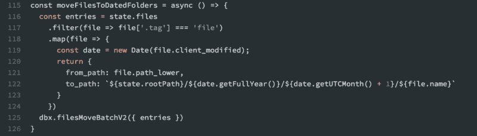

### 显示移动的文件

在上一个截屏中，Christian 向我们展示了如何根据修改日期将文件移动到他们自己的文件夹中，在这个截屏中，我们将学习如何改进现有的功能。

`filesMoveBatchV2()`返回以下两种情况之一:`success`如果调用立即成功，并且如果我们要求移动一个或两个文件，这可能会发生。然而，最有可能的是它将返回一个带有属性`async_job_id`的对象，这意味着您的调用正在被执行。

在这种情况下，我们可以使用`filesMoveBatchCheckV2()`来检查我们的作业的完成情况，直到它完成，或者换句话说，不是`in_progress`。

这就是 Christian 帮助我们使用一个简洁的`do while`循环重写`moveFilesToDatedFolders()`的地方，它的关键特性是它保证至少执行一次。

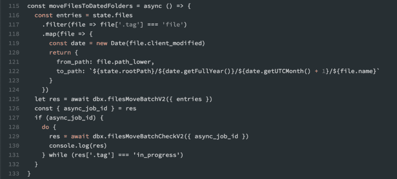

现在我们还需要做一件事——在用户移动文件后，我们希望向他们展示新状态的样子，而不需要他们刷新页面。

我们本质上想要重用这部分功能:

```
state.files = []  
loadingElem.classList.remove('hidden')  
init() 
```

让我们把它提取到一个新的`reset()`方法中。

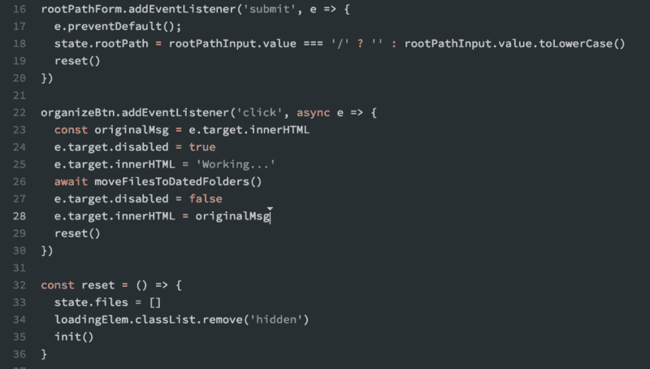

我们现在可以看到功能正在工作。点击*“组织”*，看着我们所有的文件被神奇地放进文件夹。下面是它如何工作的 gif 图:

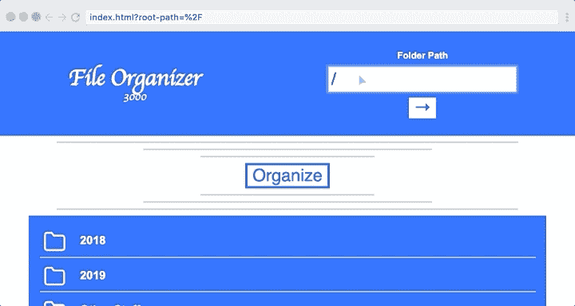

### 结论

课程到此结束，祝贺您完成课程！现在，您应该熟悉如何获取文件和缩略图，以及如何使用 Dropbox API 移动文件。此外，您还会学到几个 ES6 概念。

最后，我要感谢 Dropbox 对这篇帖子和课程本身的赞助和支付。它帮助 Scrimba 保持运转，并使我们能够在 2019 年全年为我们的社区创建更多免费内容。

快乐编码:)