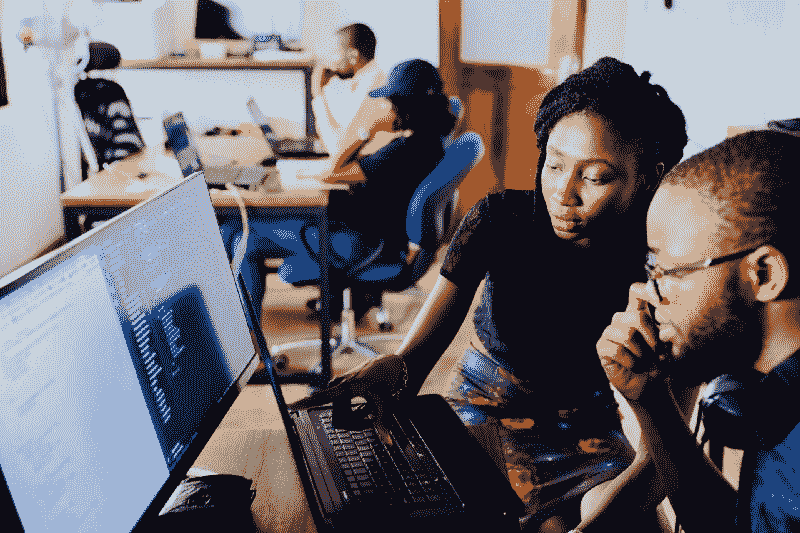

# 如何在黑客马拉松中生存(甚至茁壮成长)

> 原文：<https://www.freecodecamp.org/news/how-to-survive-and-even-thrive-in-a-hackathon-80ed94c83c7e/>

埃蒙·吉卜林

# 如何在黑客马拉松中生存(甚至茁壮成长)

Photo by [NESA by Makers](https://unsplash.com/@nesabymakers?utm_source=medium&utm_medium=referral) on [Unsplash](https://unsplash.com?utm_source=medium&utm_medium=referral)

所以，你正在寻找一种度过周六的方式，然后你想到了一个绝妙的主意，去参加一个有组织的黑客马拉松。好玩！但不一定。像其他任何事情一样，黑客马拉松是你投入什么就能得到什么的东西。但至少在这里，你通常会得到免费的百吉饼、披萨和咖啡来补偿你的麻烦(如果你曾经发现一个有不同菜单的黑客马拉松…