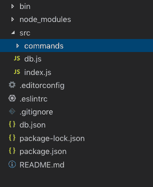
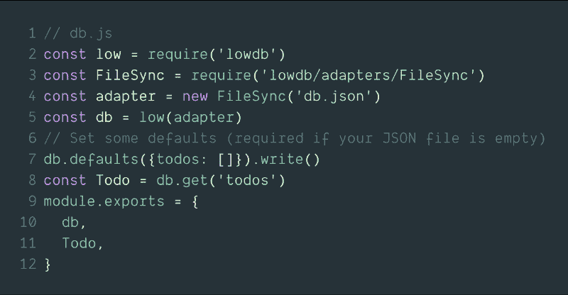
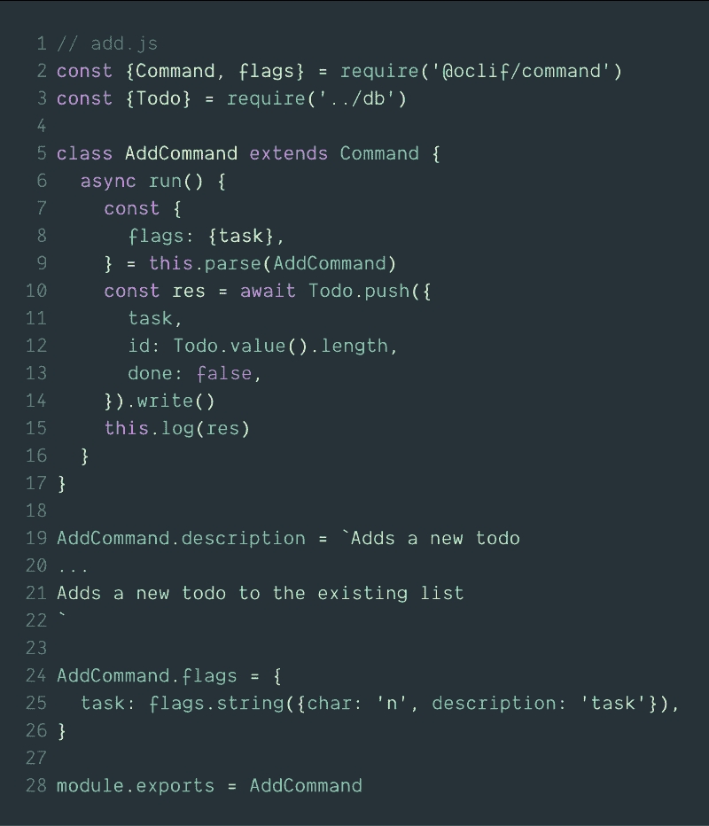
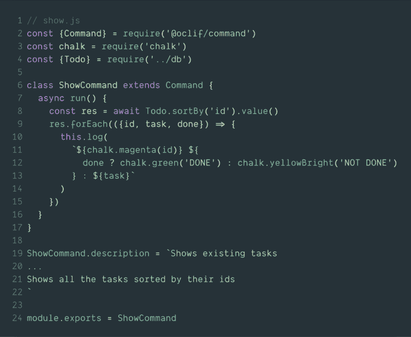
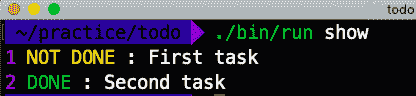
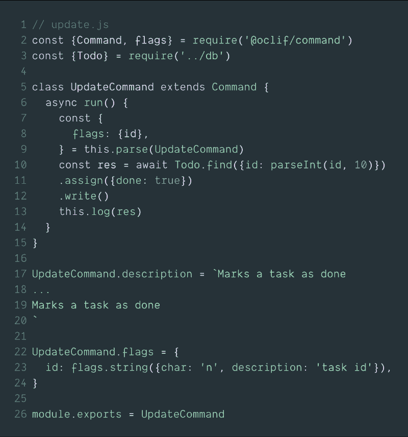
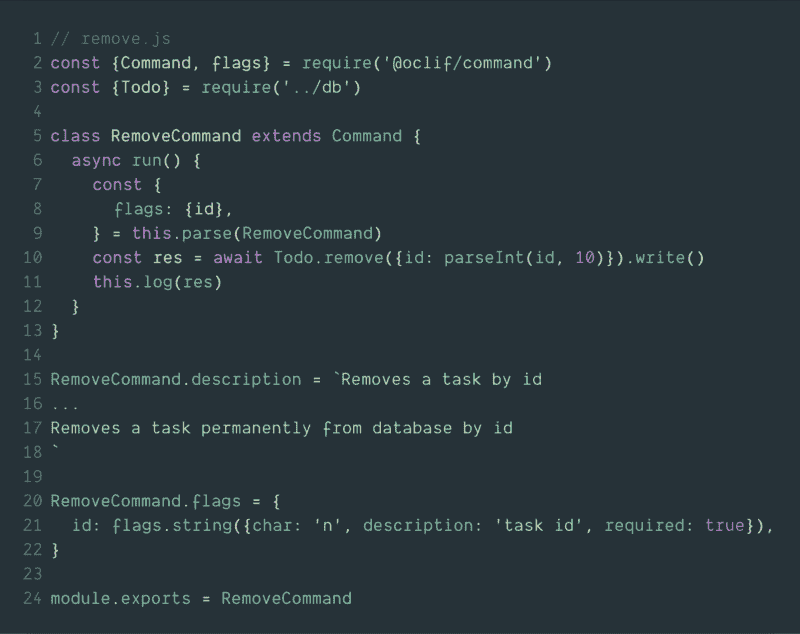

# 如何在 node.js 中构建 cli 工具

> 原文：<https://www.freecodecamp.org/news/how-to-build-a-cli-tool-in-nodejs-bc4f67d898ec/>

阿明·诺沙德

# 如何在 node.js 中构建 cli 工具


Photo by [Markus Spiske](https://unsplash.com/@markusspiske?utm_source=medium&utm_medium=referral) on [Unsplash](https://unsplash.com?utm_source=medium&utm_medium=referral)

作为开发人员，我们有点依赖 CLI 工具。从`git`到`cloud shells`——我们在任何地方都在使用这些工具。所以，是时候做自己的了。在这个过程中，我们将使用 Heroku 的 great oclif 框架。

### oclif 是什么？

这是一个开放的**框架**用于快速构建 CLI 工具，由知名的 **Heroku** 提供。

### 会建什么？

我们将创建一个 todo list 命令，它有四个动作:

*   添加新任务
*   查看所有任务
*   更新任务
*   删除任务

### 初始化我们的项目

Oclif 可以产生两种类型的项目—

1.  只有一个命令的项目。
2.  可能有多个命令(包括嵌套命令)的项目。

在本文中，我们需要一个多命令项目，所以让我们生成它:

```
npx oclif multi todocli
```

运行该命令并按照说明操作将在当前目录下初始化一个名为`todocli`的新项目。

现在，让我们进入目录并运行帮助:

```
cd todocli && ./bin/run --help
```

这将打印以下结果:

```
> USAGE       $ todocli [COMMAND]    COMMANDS    hello       help   display help for todocli
```

这将显示可用的命令及其文档。



### 项目结构

在`src`目录中，我们可以找到一个名为`commands`的目录。该目录包含所有命令及其相对文件名。例如，如果我们有一个命令`hello`，我们将在这个目录中有一个名为`hello.js`的文件，这个命令无需任何设置就可以工作。我们把`hello.js`移走吧，因为我们不再需要它了。

### 设置数据库

为了存储我们的任务，我们需要一个存储系统。为了简单起见，我们将使用一个非常简单的 **json** 文件存储系统 [lowdb](https://github.com/typicode/lowdb) 。为这个项目感到高兴吗？

让我们安装它:

```
npm install lowdb --save
```

让我们在项目根目录下创建一个`db.json`文件。这个文件将保存我们的数据。然后我们需要安装 [lowdb](https://github.com/typicode/lowdb) 。现在，我们将在`src`目录中创建一个名为`db.js`的文件。这个文件将保存我们的数据库资料。



这里，我们首先简单地加载所需的库和文件，然后定义一个空的 todos 数组作为我们的基本集合(如果你像 SQL 数据库一样思考，它就像一个表)。

### 添加任务

oclif 为我们提供了流畅的命令生成功能。让我们运行以下代码:

```
oclif command add
```

这将在`src/commands`目录下创建一个名为`add.js`的文件。让我们用下面代码替换文件的内容:



该文件有几个关键部分:

*   执行该命令主要功能的运行函数，
*   描述，即命令的文档，以及
*   flags，描述传递给命令的标志。

这里，我们有一个名为`task`的标志，它有一个`string`类型。我们可以运行命令

```
./bin/run add --task="welcome task"
```

该命令将向我们的数据库添加一个任务，并打印该操作的响应。

### 显示任务



在这里的`show.js`中，我们以升序显示所有的任务。我们用`chalkjs`添加了一点颜色，让我们的命令结果看起来更好。



### 更新任务



为了简单起见，我们现在只是将更新部分的任务设置为`done`。我们将刚刚通过任务的`id`作为`flag`。

```
./bin/run update --id=1
```

这将为带有`id = 1`的任务设置`done = true`。

### 删除任务



删除相当简单:我们将`id`作为一个标志传递，然后从数据库中删除相关的任务。

### 快好了！

就这样，我们做了一个非常简单的`todocli`。现在，如果我们想像其他普通 CLI 工具一样使用它，或者让我们的朋友使用它，我们需要将它制作成 npm 包。所以实际上让我们在 npm 上发布它。

### 构建并发布到 npm

首先，确保你有一个 npm 账户。然后，您需要登录运行命令

```
npm login
```

然后在项目目录中运行

```
npm run prepack
```

这将对项目进行打包，并通过描述和标志生成自述文件，使其为 npm 做好准备。

现在，在 npm 上发布:

```
npm publish
```

如果一切顺利，那么这个模块已经在 npm 上成功发布了。如果不工作，检查项目名称和版本。

现在，我们可以像在全局安装中使用任何其他 npm 工具一样使用它:

```
npm install -g todocli
```

然后任何人都可以随时随地使用这些命令？

```
> todocli add --task="Great task!!!"> todocli show> todocli update --id=1> todocli remove --id=1
```

如果您已经阅读了整篇文章，那么恭喜您？你太棒了。现在，你可以做一个小任务:

#### 工作

任务的 id 分配不合理，你能解决吗？在回复部分让我知道你是怎么解决的。

祝你好运，感谢你的阅读:)

oclif : [https://oclif.io](https://oclif.io)

https://github.com/typicode/lowdb

粉笔:[https://github.com/chalk/chalk](https://github.com/chalk/chalk)

托多克利:[https://www.npmjs.com/package/todocli-frombd](https://www.npmjs.com/package/todocli-frombd)