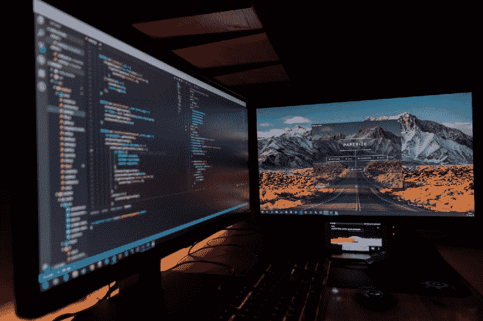
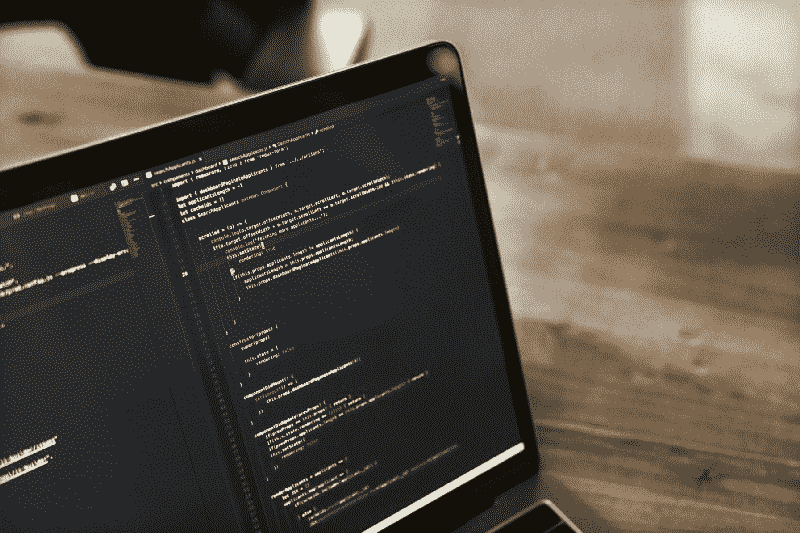
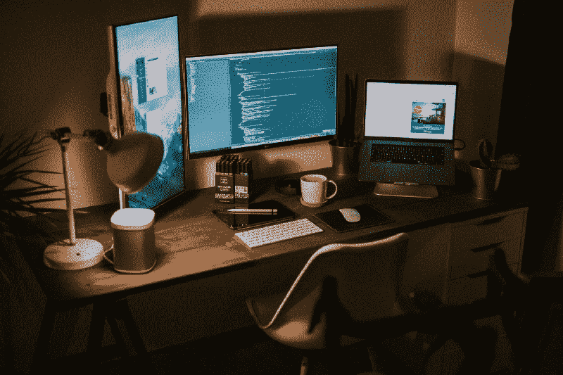

# 我的编码训练营经验(以及是否适合你)

> 原文：<https://www.freecodecamp.org/news/my-experience-with-a-coding-bootcamp-and-whether-it-might-be-right-for-you-5c32b4ed0a8/>

弗洛里安·穆勒

# 我的编码训练营经验(以及是否适合你)

Photo by [Fotis Fotopoulos](https://unsplash.com/photos/LJ9KY8pIH3E?utm_source=unsplash&utm_medium=referral&utm_content=creditCopyText) on [Unsplash](https://unsplash.com/@ffstop?utm_source=unsplash&utm_medium=referral&utm_content=creditCopyText)

看着日历，我现在意识到，自从我结束密集的编码训练营以来，已经过去了将近三个月。**时间过得很快**，疯狂。让我们再回溯一点，看看我是如何下定决心，在 2018 年夏天加入 Ironhack Berlin 的。

### 成为一名数字建筑师

很长一段时间以来，我一直希望创造和建设。我从来没有真正确定是什么，但我只知道我希望**创造**，并希望有一天产生影响。作为 Y-er 一代，这实际上是我们大多数人共有的独特性格特征之一。你可以在我关于 Y 一代[的文章中读到更多。](https://medium.com/@coding_flo/generation-y-impact-on-economy-and-politics-1d4965ee9a94)

### 我对编码的兴趣

我在 2014 年完成了硕士学位，在墨西哥呆了一半时间后，我在墨西哥城的一家初创公司找到了一份联合创始人的工作。之前我主要在银行业工作，所以这基本上是我对创业世界的第一次洞察。

一年后，我们的创业失败了，但我学到了一些关于公司创建、营销和业务发展的宝贵经验。由于这是一家电子商务公司，我第一次看编码，我可以告诉你，它看起来像象形文字。然而，我的兴趣被唤醒了，我被你如何用这种我不懂的语言写几行代码就能在线构建东西迷住了。

在墨西哥的创业经历结束后，我回到了德国，在一家移动应用公司从事营销和业务开发工作。由于我们是一个非常小的团队，我也与编程团队保持着稳定的沟通，并学习了框架和编程语言。就在那时，我确定我想了解更多关于编码的知识。

所以今年夏天，我决定做出改变，认真对待编码。我已经看过了 freeCodeCamp 的资源，顺便说一下，这很棒，尤其是他们在 Youtube 上的网页和教程。我还在 Codecademy 上做了一些免费课程，在 Youtube 上关注了一些编码频道。当我在柏林的时候，我参加了一个 Ironhack 的聚会，基本上我一天学到的东西比我之前两个月在线学习学到的还多。我被说服去参加训练营。

Photo by [Emily Morter](https://unsplash.com/photos/8xAA0f9yQnE?utm_source=unsplash&utm_medium=referral&utm_content=creditCopyText) on [Unsplash](https://unsplash.com/search/photos/question-mark?utm_source=unsplash&utm_medium=referral&utm_content=creditCopyText)

### 哪个训练营最适合我？

我做了很多关于编码训练营的研究，如果你有任何问题，你可以给我发消息或评论——我会尽我所能回答。

我查看了课程报告和 Switchup 的大部分信息，这是比较训练营提供商的主要平台。虽然我刚刚体验了 Ironhack，但我认为那里有很多非常棒的训练营。只需检查日期和价格，阅读评论，并检查营地的长度。我的是 9 周，回想起来我觉得有点短。对于像我这样的初学者，我肯定会像许多人一样推荐 12 周。

### 汉堡、柏林或阿姆斯特丹

我最后的选择是在汉堡、阿姆斯特丹和柏林之间。在大多数训练营中，有一个面试过程，他们想知道你的动机和未来计划。这并不太难——只要知道你想要什么，尤其是你为什么要编码。

我在阿姆斯特丹的面试可能是最难的，因为训练营结束后，他们会给你找一份他们合作伙伴的工作。虽然三个训练营各有利弊，但我决定去柏林，因为我知道柏林，我想专注于编码，而不受在一个新城市的任何干扰…嗯，在阿姆斯特丹有很多干扰。

Ironhack 是市场上最大的玩家之一。9 周花费了 6000 欧元，是的，这是一大笔钱。所以你应该确定你想要投入时间和精力。

决定之后，我只有很短的时间来做准备工作，这是参赛所需要的。它涵盖了在您的机器上设置您的编程环境，以及您在整个训练营中需要的所有必要工具。你有关于 HTML 和 CSS 的课程，并创建一个示例网站。最后一章介绍了万维网的编程语言 Javascript。

完成前期工作后，该是我收拾行李前往柏林的时候了，我终于开始了自己未来几周的编程训练营体验。

### 训练营

编码训练营可能是我一生中最艰难、最沮丧、最绝望的时期之一。听起来很糟糕？好吧，你还有时间逃跑，但如果不继续读下去。

9 周，每天从早上 9 点左右到下午 6 点，充满了课程，然后是家庭作业和自习。是的，有很多事情要做，特别是因为每天都有新的信息需要记忆和学习。

然而，尽管这真的很难，但同时这也是我一生中最令人满意的经历之一。

每天你都在忙碌，学习新的东西，试图跟上，并在晚上和周末继续这样做。我不想在这里夸大其词——只是给你一个真实的概述。

可以说，准备好只有很少的空闲时间，并以一种非常好的方式“大脑 f'ed”。永远记住你不是一个人在做这件事，你和惊人的志趣相投的人一起参加训练营，互相帮助，共同前进。

班级很可能由不同背景的人组成，有些人是绝对的初学者，有些人可能在其他编程语言方面有多年的经验。尽管如此，你们都会一起度过难关，即使是班里最有经验的学生也会从一个初学者那里学到一些东西。

Photo by [Max Nelson](https://unsplash.com/photos/Ix64NPGxZoQ?utm_source=unsplash&utm_medium=referral&utm_content=creditCopyText) on [Unsplash](https://unsplash.com/search/photos/coding-bootcamp?utm_source=unsplash&utm_medium=referral&utm_content=creditCopyText)

### 该结构

我的训练营分为三个部分，每个部分持续三周。看过其他训练营的时间表，每个地方都有些相似。前三周致力于介绍编码，但是要注意——从第一天开始，你就受到信息、技术和任务的轰炸。

前两周我们学习了 HTML、CSS 和普通的 Javascript，并在第三周测试我们新学到的知识。我们必须开发我们的第一个游戏。作为一个超级星战迷，我建立了一个基于记忆的星战射击游戏，非常简单但有趣。很快每个人都在试图打破高分。

第二部分专用于后端。我们学习了 Node。JS、Express framework 和 MongoDB。像前几周一样，每天都有一个新的章节致力于后端开发的一个部分。根据这个理论，我们每天晚上都要完成任务。

第二个项目是一个小组任务，在服务器的后端建立一个网站。结对编程是现实世界中广泛使用的技术，所以我们的想法是尽快适应它。

在团队中，保持程序的最新版本是非常棘手的。每个人都在编码，然后提交他们的变更，将它们与他们伙伴的变更合并。这通常会导致大量的“合并冲突”。那些已经在编码的人可能对这种现象太熟悉了。我和我的合作伙伴建立了一个网站来存储文章以便以后阅读，有点像 Pocket。这非常有趣，也是一个巨大的挑战。

### 最后的倒计时

过去的三个星期是用来回应的。JS，一个构建单页面应用程序的 Javascript 框架，也是目前最热门的框架之一。我们上了大约一周半的课，然后又上了一周半的期末项目。经过一番思考，我决定上一个约会网站。是的，我知道外面有很多，但是我的有一个转折，呵呵。

大约花了一半的时间后，我意识到我必须削减这个“超级惊人”的网站想法，坚持我的最终项目的基本版本。这是我注意到的一件事:通常，你的野心超过了你的知识，至少在开始的时候。不变得沮丧并处理好这些情况是非常重要的。在 9 周的编码后不知道所有事情是完全正常的，即使是最有经验的程序员也会在 StackOverflow 或其他页面上花费大量的时间来寻找挑战的答案。

我终于完成了我的项目，它的工作。为了演示，我甚至用来自一些 API 的大约 100 个人的资料填充它，以便给我的约会应用一些“用户”并显示匹配算法…嘿，它起作用了，没什么特别的，但是我还能要求什么呢？:)

### 思想

那么我对 9 周的训练营有什么看法，到目前为止发生了什么？我只能说这段经历对我来说太神奇了。那是一段令人惊叹又紧张的时光，我想我从来没有在这么短的时间内学到这么多东西。你必须做好承受精神痛苦的准备，并激励自己坚持到底，但如果你这么做了，那将是非常值得的。能够创造一些东西，即使是很小的东西，也是一种不可思议的感觉，值得所有的努力。

### 那你之后是个程序员还是什么？

我会说训练营给你所有的工具、必要的技能和知识，让你迈出成为程序员的第一步。但是，不要期望在没有任何帮助的情况下编写自己的应用程序或程序。如果你继续学习并投入工作，你很可能在训练营结束后的三到六个月内找到一份初级开发人员的工作。当然，在找工作的时候，你应该不断提高你的技能和知识。

Photo by [Jannis Brandt](https://unsplash.com/photos/4mHaSX8zvJI?utm_source=unsplash&utm_medium=referral&utm_content=creditCopyText) on [Unsplash](https://unsplash.com/search/photos/coding?utm_source=unsplash&utm_medium=referral&utm_content=creditCopyText)

### 任何人能给你的最好建议:秘密

听起来很奇特，但很简单:代码、代码、代码、代码。

你变得更好的唯一方法是通过编码、试错和继续编码。寻找一个项目来做，建立你自己的投资组合或者支持一些像 freeCodeCamp 这样的酷项目，解决现实世界中的问题。你做什么并不重要，但你只会通过练习变得更好。就这么简单。我从经验中知道，因为我认为观看教程是一个学习的好方法。是的，你带走了知识，但是只有实践会告诉你真实的发展中世界是什么样子。

这是我认为编码训练营是一项伟大投资的原因之一。是的，它们非常昂贵，但好的一面是，通过投资这么多钱，你会觉得有必要投入工作并学习编码。

我相信你可以自学编码，也有足够的资源来学习它，但你必须是一个伟大的自学者，才能独自获得技能。在互联网上解决问题寻找答案是非常麻烦的，训练营可以消除一些困难。

### Flo，你现在在做什么？

我非常幸运，在柏林一家不断发展的精品网络开发机构找到了一份工作。我们是一家客户代理机构，开发应用程序并实现我们客户的愿景，但也有惊人的机会实现内部项目，主要是开发很酷的东西。看看[asset zir](https://assetizr.com/)我们的最新创作——很棒吧；)

很有挑战性，也很有成就感。实际上，如果你对关于用 Javascript 和 React 编码的更惊人的内容感兴趣。JS，你得看看我们的 CEO 卢卡斯·吉斯德·杜贝的博客。下面这篇文章很酷，肯定会提高你的 JS 技能。

[**2019 年 Kickass JavaScript 开发者的 9 招**](https://levelup.gitconnected.com/9-tricks-for-kickass-javascript-developers-in-2019-eb01dd3def2a)
[*又是一年过去了，而你 JavaScript 却在千变万化。然而，有一些技巧可以帮助你写作……*levelup.gitconnected.com](https://levelup.gitconnected.com/9-tricks-for-kickass-javascript-developers-in-2019-eb01dd3def2a)

我希望我能帮助你决定是支持还是反对训练营。如果你有任何问题或疑虑，请在评论中给我留言，我会尽我所能回答。

你想知道更多关于编码训练营，我的旅程，我使用的其他资源，我们作为一个 webDev 机构的故事，或者其他什么吗？给我写个评论。期待与您进行生动的对话。

愿原力永远与你同在，❤️

菲欧

嘿，我是弗洛里安，但请叫我 Flo。我对很多事情都很感兴趣，希望有一天我能成为一名真正的学者(酷吧)。无论如何，我喜欢阅读和学习许多不同的东西，并决定分享故事。随意建议话题。热衷于 **webDev** ，你可能会在这里找到很多关于它的文章。请随便写封短信，打声招呼。祝 Flo 一切顺利。