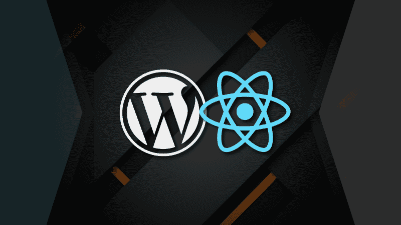

# 如何使用 WordPress 和 React 创建一个现代的 Web 应用程序

> 原文：<https://www.freecodecamp.org/news/wordpress-react-how-to-create-a-modern-web-app-using-wordpress-ef6cc6be0cd0/>

布雷特·卡梅伦

#### 将 React 前端的强大功能与互联网上最流行的 CMS 相结合

想要现代 React SPA 的优势，但需要一个熟悉的后端？在本文中，我们将介绍如何设置 WordPress 的 REST API，包括自定义文章类型和字段，以及如何在 React 中获取这些数据。



最近，我正在为一个客户开发一个 React 应用程序，他们突然向我提出了这个问题:“我们能把它 ***和 WordPress*** *一起使用吗？”*'

自 2015 年末以来，这个问题的答案一直是肯定的。但是创建一个可工作的非耦合网站的必要步骤似乎并不简单，特别是对于那些不熟悉 WordPress *和* React 的人来说。

在我创建工作应用程序的过程中，我遇到了一些棘手的障碍，在本文中，我将解释如何避免它们。我还会分享几个我一路走来学到的小技巧和窍门！

### 内容

#### [第一部分:背景信息](https://medium.com/p/ef6cc6be0cd0#842b)

*   [什么是无头 CMS？](https://medium.com/p/ef6cc6be0cd0#b8b4)
*   我应该知道些什么来跟进？
*   [关键缩略语](http://Key Acronyms)
*   [哪里可以看到 WordPress 的 JSON 数据？](https://medium.com/p/ef6cc6be0cd0#1012)

#### 第二部分

*   [添加自定义帖子类型](https://medium.com/p/ef6cc6be0cd0#c03e)
*   [更改标题占位符文本](https://medium.com/p/ef6cc6be0cd0#9a1a)
*   [向您的自定义帖子类型添加自定义字段](https://medium.com/p/ef6cc6be0cd0#40c2)
*   [使定制字段作为 JSON 可用](https://medium.com/p/ef6cc6be0cd0#43a6)
*   [限制可见的 JSON 数据](https://medium.com/p/ef6cc6be0cd0#6093)

#### [第三部分:反应](https://medium.com/p/ef6cc6be0cd0#a1f9)

*   [JavaScript 中的承诺](https://medium.com/p/ef6cc6be0cd0#39f1)
*   [取数方法](https://medium.com/p/ef6cc6be0cd0#092c)
*   [办理承诺](https://medium.com/p/ef6cc6be0cd0#02fd)

#### [React 中的一个工作示例](https://medium.com/p/ef6cc6be0cd0#8a3b)

#### [结论](https://medium.com/p/ef6cc6be0cd0#2968)

### 第 1 部分:背景信息


#### 什么是无头 CMS？

在过去，使用像 WordPress 这样的 CMS 意味着你必须使用 PHP 来构建你的前端。

现在，有了无头 CMS，你可以用任何你喜欢的技术来构建你的前端；这是因为前端和后端通过 API 分离。如果你想用 React，Angular 或者 Vue 创建一个 SPA(单页应用)，用 WordPress 这样的 CMS 控制内容，你可以！

#### 我应该知道些什么来跟进？

如果您具备以下条件，您将从本文中获益匪浅:

*   一些像 WordPress 这样的 CMS 如何工作的知识，一点 PHP，以及如何在你的电脑上建立一个基本的 WordPress 项目的想法；
*   理解 JavaScript，包括 ES6+语言特性和 React 类语法。

#### 关键缩略语

编程充满了行话，但是它确实使得讨论本文中的一些概念变得更快。下面是我们将使用的术语的快速回顾:

*   内容管理系统。想想 WordPress，Drupal，Joomla，万磁王。
*   SPA —单页应用程序。SPA 应用程序动态加载内容，而不是完整地重新加载每个页面。网站的基本代码(HTML、CSS 和 JavaScript)只需加载一次。思考反应，Vue，棱角分明。
*   API——应用编程接口。简单来说，就是一系列的定义，一个服务提供来让你获取和使用它的数据。[谷歌地图有一个](https://developers.google.com/maps/documentation/javascript/tutorial)。[中有一个](https://github.com/Medium/medium-api-docs)。现在，[每个 WordPress 网站都内置了一个 API](https://developer.wordpress.org/rest-api/)。
*   **休息——表象状态转移。**一种基于 HTTP 请求方法的 web 架构风格:`GET`、`PUT`、`POST`和`DELETE`。WordPress 的内置 API 是一个 REST 或“RESTful”API。
*   **HTTP——超文本传输协议。**用于在网络上传输数据的一组规则。它在 URL 的开头被指定为`http`或`https`(安全版本)。
*   **JSON — JavaScript 对象符号。虽然源自 JavaScript，但这是一种独立于语言的数据存储和传输格式。**

在这篇文章中，我们使用 WordPress 作为 CMS。这意味着用 PHP 编写我们的后端，并使用 WordPress 的 REST API 将 JSON 数据传递给我们的前端。

#### 哪里可以看到 WordPress 的 JSON 数据？

在进入正题之前，先简要说明一下*在哪里*可以在你的 WordPress 站点上找到 JSON 数据。如今，每个 WordPress 网站都有 JSON 数据可用(除非网站所有者禁用或限制访问)。通过在根域名后面添加`/wp-json`，你可以看到 WordPress 站点的主要 JSON。

例如，你可以通过访问[https://wordpress.org/wp-json](https://wordpress.org/wp-json)来看看 WordPress.org 的 JSON。或者，如果你在本地运行一个 WordPress 站点，你可以通过跟随`localhost/yoursitename/wp-json`看到它的 JSON。

要访问帖子的数据，请键入`localhost/yoursitename/wp-json/wp/v2/posts`。对于自定义帖子格式，请换成新格式(如`movies`)而不是`posts`。现在看起来不可读的文本块正是允许我们使用 WordPress 作为一个无头 CMS 的东西！

### 第 2 部分:WordPress


为了设置您的 REST API，您需要做的大部分事情都将发生在您的`functions.php`文件中。我假设你知道如何建立一个 WordPress 项目并使用`localhost`来访问它，但是如果你想得到一些帮助，我推荐[这篇文章](https://www.taniarascia.com/developing-a-wordpress-theme-from-scratch/#installing-wordpress)(这是我用来开始用 WordPress 编程的)。

对于大多数项目，您会想要使用一个自定义的文章类型，所以让我们从设置一个开始。

#### 添加自定义帖子类型

假设我们的网站是关于电影的，我们想要一个名为“电影”的帖子类型。首先，我们想确保我们的“电影”post 类型尽快加载，所以我们将使用`add_action`把它附加到`init`钩子上:

```
add_action( 'init', 'movies_post_type' );
```

我用的是`movies_post_type()`，但是你可以随便调用你的函数。

接下来，我们想使用`register_post_type()`函数将‘movies’注册为 post 类型。

下一段代码可能看起来很复杂，但相对简单:我们的函数采用大量内置参数来控制新 post 类型的功能，其中大多数都是不言自明的。我们将把这些参数存储在我们的`$args`数组中。

我们的一个参数，`labels`，可以有许多不同的参数，所以我们把它分成一个单独的数组，`$labels`，给我们:

两个最重要的参数是`'supports'`和`'taxomonies'`，因为它们控制了在我们的新 post 类型中哪些本地 post 字段是可访问的。

在上面的代码中，我们只选择了三个`'supports'`:

*   `'title'` —每个帖子的标题。
*   `'editor'` —主要的文本编辑器，我们将使用它进行描述。
*   `'thumbnail'` —帖子的特色图片。

要查看可用内容的完整列表，点击[这里查看支持](https://codex.wordpress.org/Function_Reference/post_type_supports)，点击[这里查看分类](https://codex.wordpress.org/Custom_Taxonomies#Default_Taxonomies)。

Generate WordPress 也有一个方便的工具[来帮助你编写定制的文章类型](https://generatewp.com/post-type/)，这可以使这个过程快很多。

#### 更改标题占位符文本

如果标题占位符文本“在此输入标题”对您的自定义帖子类型有一点误导，您可以在单独的功能中编辑它:

#### 向您的自定义帖子类型添加自定义字段

如果你想要一个不是 WordPress 预定义的字段，该怎么办？例如，假设我们想要一个名为“流派”的特殊字段。在这种情况下，您需要使用`add_meta_boxes()`。

因为，我们需要给 WordPress 的`add_meta_boxes`钩子附加一个新功能:

```
add_action( 'add_meta_boxes', 'genre_meta_box' );
```

在我们的新函数中，我们需要调用 WordPress 的`add_meta_box()`函数，就像这样:

```
function genre_meta_box() {  add_meta_box(    'global-notice',    __( 'Genre', 'sitepoint' ),    'genre_meta_box_callback',    'movies',    'side',    'low'  );}
```

你可以在这里阅读更多关于这个函数的参数[。出于我们的目的，最关键的部分是回调函数，我们将其命名为`genre_meta_box_callback`。这定义了元框中的实际内容。我们只需要一个简单的文本输入，所以我们可以使用:](https://developer.wordpress.org/reference/functions/add_meta_box/)

```
function genre_meta_box_callback() {  global $post;  $custom = get_post_custom($post->ID);  $genre = $custom["genre"][0];  ?>  <input style="width:100%" name="genre" value="<?php   echo $genre; ?>" />  <?php};
```

最后，我们的自定义字段不会保存它的值，除非我们告诉它这样做。为此，我们可以定义一个新的函数`save_genre()`并将其附加到 WordPress 的`save_post`钩子上:

```
function save_genre(){  global $post;  update_post_meta($post->ID, "printer_category",   $_POST["printer_category"]);};
```

```
add_action( 'save_post', 'save_genre' );
```

总之，用于创建自定义字段的代码应该如下所示:

#### 使定制字段作为 JSON 可用

我们的自定义帖子自动以 JSON 的形式提供。对于我们的“电影”帖子类型，我们的 JSON 数据可以在`localhost/yoursitename/wp-json/wp/v2/movies`找到。

然而，我们的自定义字段不会自动成为其中的一部分，因此我们需要添加一个函数来确保它们也可以通过 REST API 访问。

首先，我们需要给`rest_api_init`钩子附加一个新函数:

```
add_action( 'rest_api_init', 'register_genre_as_rest_field' );
```

然后，我们可以使用内置的`register_rest_field()`函数，就像这样:

```
function register_genre_as_rest_field() {  register_rest_field(    'movies',    'genre',    array(      'get_callback' => 'get_genre_meta_field',      'update_callback' => null,      'schema' => null,    )  );};
```

这个函数接受一个带有`get`和`update`回调的数组。对于像这样更简单的用例，我们应该只需要指定一个`'get_callback'`:

```
function get_genre_meta_field( $object, $field_name, $value ) {  return get_post_meta($object['id'])[$field_name][0];};
```

总的来说，下面是注册一个定制字段所必需的代码。

#### 将特色图片 URL 作为 JSON 提供

开箱即用，WordPress 的 REST API 不包括你的特色图片的 URL。为了更容易地访问它，您可以使用以下代码:

WordPress 过滤器`rest_prepare_posts`是动态的，所以我们可以用自定义的文章类型来代替“文章”，比如`rest_prepare_movies`。

#### 限制可见的 JSON 数据

我们几乎准备好开始将数据导入 React 应用程序，但我们还可以通过限制可用数据来进行更快速的优化。

有些数据是标准数据，您在前端可能永远不需要，如果是这样的话，我们可以使用像这样的过滤器将其删除。您可以通过查看网站的`/wp-json/wp/v2/movies`部分找到数据类型的名称。

完成后，一旦你使用 WordPress 后端添加了一些电影，我们就拥有了开始将数据导入 React 所需的一切！

### 第三部分:反应


要在 JavaScript 中获取外部数据，您需要使用承诺。这可能会影响您构建 React 组件的方式，在我的情况下(转换现有的 React 项目)，我不得不重新编写大量代码。

#### JavaScript 中的承诺

JavaScript 中的承诺用于处理异步动作——发生在通常的分步或“同步”执行顺序之外的事情(在提升之后)。

好消息是异步 JavaScript 比以前容易多了。在 ES6 之前，我们依赖回调函数。如果多次回调是必要的(而且经常如此)，嵌套将导致代码非常难以阅读、缩放和调试——这种现象有时被称为回调地狱，或末日金字塔！

ES6(或 ES2015)中引入了解决该问题的承诺，ES8(或 ES2018)引入了`async ... await`，这两个关键字进一步简化了异步功能。但是对我们来说，最关键的基于承诺的方法是`fetch()`。

#### 获取方法

这种方法从 Chrome 40 开始就有了，是比`XMLHttpRequest()`更易用的替代方法。

`fetch()`返回一个承诺，因此它是“then-able ”,这意味着您可以使用`then()`方法来处理结果。

您可以将 fetch 添加到 React 类组件内部的方法中，如下所示:

```
fetchPostData() {  fetch(`http://localhost/yoursitename/wp-json/wp/v2/movies?per_page=100`)  .then(response => response.json())  .then(myJSON => {  // Logic goes here});}
```

在上面的代码中，有两件事很重要:

*   首先，我们调用一个末尾附加了过滤器`?per_page=100`的 URL。默认情况下，WordPress 每页只显示 10 个条目，我经常发现自己想要增加这个限制。
*   第二，在处理我们的数据之前，我们使用的是`.json()`方法。该方法主要用于与`fetch()`的关系，它将数据作为承诺返回，并将正文解析为 JSON。

在大多数情况下，我们希望在 React 组件挂载后立即运行这个函数，我们可以使用`componentDidMount()`方法来指定:

```
componentDidMount() {  this.fetchPostData();}
```

#### 处理承诺

一旦你做出了承诺，你必须小心在正确的环境下处理它。

当我第一次尝试使用承诺时，我花了一段时间试图将数据传递给承诺范围之外的变量。以下是一些经验法则:

*   在 React 中，使用承诺的最佳方式是通过国家。您可以使用`this.setState()`将 promise 数据传递到组件的状态中。
*   最好在最初的`fetch()`之后，用一系列的`then()`方法来处理、分类和重新排列你的数据。一旦任何处理完成，最好将数据添加到最终的`then()`方法中的状态。
*   如果您想调用任何额外的函数来处理您的承诺(包括在`render()`中),最好是在承诺解决之前阻止函数运行。
*   因此，举例来说，如果您将您的承诺传递给`this.state.data`，您可以在依赖于它的任何函数体中包含一个条件，如下所示。这可以防止讨厌的不必要的行为！

```
myPromiseMethod() {  if (this.state.data) {    // process promise here   } else {    // what to do before the fetch is successful  }}
```

### React 中的一个工作示例

假设我们想要引入在第 1 部分中定义的自定义 WordPress 文章类型的`name`、`description`、`featured_image`和`genre`。

在下面的例子中，我们将为每部电影获取这四个元素并呈现它们。

与 React 教程一样，下面的代码块可能看起来令人生畏，但我希望当我们分解它时，它会看起来简单得多。

#### 建造者(道具)

在这个方法中，我们调用`super(props)`，定义我们的初始状态(一个空的`data`对象)并绑定三个新方法:

*   `fetchPostData()`
*   `renderMovies()`
*   `populatePageAfterFetch()`

#### componentDidMount()

我们希望组件一安装好就获取数据，所以我们将在这里调用`fetchPostData()`。

#### fetchPostData()

我们从 URL 获取 JSON，在第一个`.then()`方法中传递`.json()`。

在第二个`.then()`方法中，我们为每个获取的电影条目提取四个我们想要的值，然后将它们添加到我们的`newState`对象中。

然后我们使用`this.setState(newState)`将这个信息添加到`this.state.data`中。

#### renderMovies()

条件`if (this.state.data)`意味着该函数仅在获取数据后运行。

在这里，我们从`this.state.data`中取出所有电影的数组，并将其传递给函数`populatePageAfterFetch()`。

#### popularepageafterfetch _)

在这个函数中，我们为每个要渲染的电影准备数据。对于任何使用过 JSX 的人来说，这应该很简单，但是有一个潜在的障碍。

`movie.description`的值不是纯文本，而是 HTML 标记。为了显示这一点，我们可以使用`dangerouslySetInnerHTML={{__html: movie.description}}`。

**注意:** *这种潜在“危险”的原因是，如果你的数据被劫持包含恶意的 XSS 脚本，这些也会被解析。因为在本文中我们使用了自己的服务器/CMS，所以我们不需要担心。但是如果你确实想净化你的 HTML，看看 [DOMPurify](https://github.com/cure53/DOMPurify) 。*

#### 渲染()

最后，我们通过调用我们选择的`<d` iv >标签中的`renderMovies()`方法来控制呈现的数据将出现在哪里。我们现在已经成功地从我们的 WordPress 站点获取数据并显示出来了！

### 结论

总的来说，我希望这篇文章能让连接 React 前端和 WordPress 后端的过程尽可能的简单。

就像编程中的许多事情一样，开始时看起来令人生畏的事情随着实践很快就变成了第二天性！

我很有兴趣听听你自己使用 WordPress 作为无头 CMS 的经历，我很乐意回答评论中的任何问题。