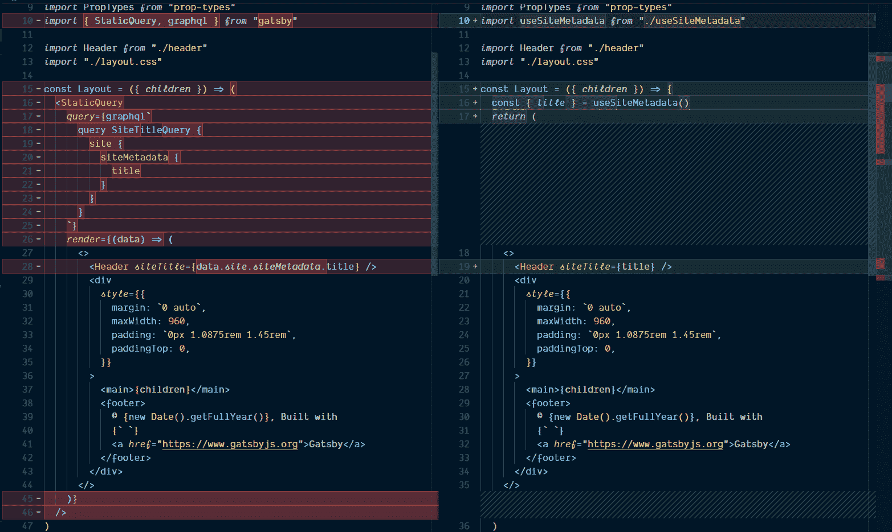
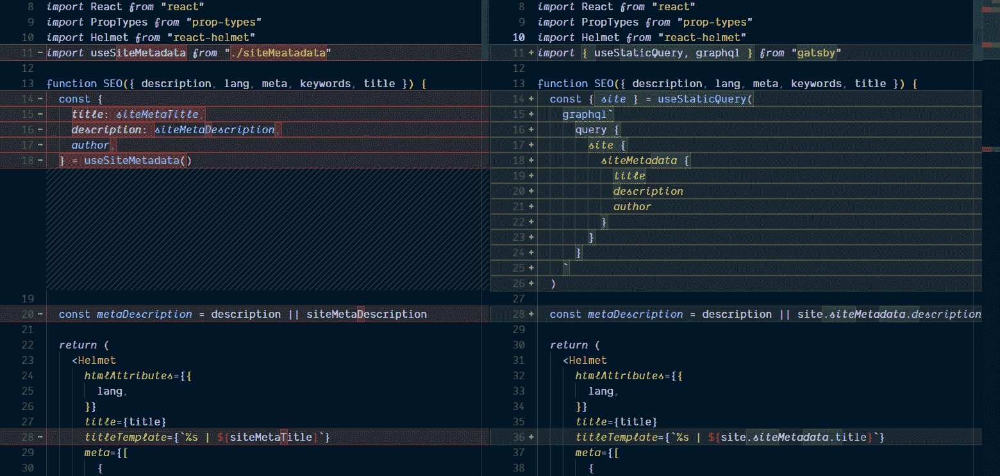

# 为 Gatsby 站点元数据创建自定义 React 挂钩

> 原文：<https://www.freecodecamp.org/news/creating-a-custom-react-hook-for-gatsby-site-metadata/>

## 胡克丝嘿！

好了，让我们开始新一轮的热舞吧，反应钩子！
这是一个指南封面，为
`StaticQuery`使用了盖茨比定制的 React 挂钩，现在用`useStaticQuery`代替了。

如果您以前没有使用过 Gatsby，`StaticQuery`只是一种在 Gatsby 组件(即 react 组件)或 Gatsby
页面中查询数据的方式，其中查询输入不会改变。这是一个很好的用例
,适用于不会改变太多的数据，比如你的站点元数据。

## TL；博士；医生

这里我试图用 [codesandbox.io](https://codesandbox.io) 来[甚至](https://youtu.be/8ruJBKFrRCk?t=93)，同时我转换一些 [codesandbox.io](https://codesandbox.io) 上的 Gatsby 默认启动程序
来使用
`useSiteMetadata`自定义钩子。

使用 [codesandbox.io](https://codesandbox.io) 我们来看看如何实现一个定制的 react
钩子来获取 Gatsby 中的站点元数据。

**这里有一个视频:**

[https://www.youtube.com/embed/qWay-LjXwbk?feature=oembed](https://www.youtube.com/embed/qWay-LjXwbk?feature=oembed)

`StaticQuery`组件使用[渲染道具](https://reactjs.org/docs/render-props.html)模式，这意味着
接受一个函数并基于该函数返回/渲染。

我之前在一篇关于[使用 react](http://localhost:8899/react-context-api-getting-started)
[上下文 api](http://localhost:8899/react-context-api-getting-started) 的帖子中详细描述了这种模式，它是一个组件，你将一个函数传递给它，使
成为一个组件。

这样想吧:

```
<Component>
 {() => ()}
</Component> 
```

第一个括号是参数/变量，第二个是被渲染的内容
，所以在 Gatsby `StaticQuery`的情况下，你
传递一个带有`graphql`标签的查询，然后从那里返回的`data`就是在组件渲染中使用的内容。所以你有了
包装组件，它返回并呈现一个子组件，
就像这样。

```
<WrappingComponent>
  {args => <ComponentToRender propsForComponent={args.propNeeded} />}
</WrappingComponent> 
```

这里有一个在 [codesandbox.io](https://codesandbox.io) 上的
Gatsby 默认启动器中使用的`StaticQuery`组件的精简版本

我把发型改短了一点:

```
const Layout = ({ children }) => (
  <StaticQuery
    query={graphql`
      query SiteTitleQuery {
        site {
          siteMetadata {
            title
          }
        }
      }
    `}
    render={data => (
      <>
        <Header siteTitle={data.site.siteMetadata.title} />
        <div>
          <main>{children}</main>
          <footer />
        </div>
      </>
    )}
  />
);

export default Layout; 
```

`StaticQuery`接受两个道具，`query`和你想要
用`render`渲染的东西，在这里你可以从查询返回的`data`道具中析构出你
需要的数据。

我从来不喜欢这样做，所以我采用了一个类似的
模式，但是组件包含在它自己里面，然后单独添加到
的`StaticQuery`中。像这样:

```
const Layout = ({ children, data }) => (
  <>
    <Header siteTitle={data.site.siteMetadata.title} />
    <div>
      <main>{children}</main>
      <footer />
    </div>
  </>
);

export default props => (
  <StaticQuery
    query={graphql`
      query SiteTitleQuery {
        site {
          siteMetadata {
            title
          }
        }
      }
    `}
    render={data => <Layout data={data} {...props} />}
  />
); 
```

我发现这更容易接受，因为您不必将所有的
代码捆绑到`StaticQuery`组件中。

这些都有道理吗？

很好，现在忘掉这一切吧！是时候在《盖茨比》中使用新的
`useStaticQuery`辣妹了。？

## 版本:

本指南正与以下依赖版本一起使用。

*   盖茨比:2.1.31
*   反应:16.8.4
*   反应范围:16.8.4

您还可以查看[示例代码](https://codesandbox.io/s/1vnvko0zqj)。

* * *

[Gatsby 文档](https://www.gatsbyjs.org/docs/use-static-query/)涵盖了它的使用，以及如何让
成为你自己定制的 react 钩子来使用`useStaticQuery`，这里是我
在视频中使用的那个。

*useSiteMetadata.js*

```
import { graphql, useStaticQuery } from 'gatsby';

const useSiteMetadata = () => {
  const { site } = useStaticQuery(
    graphql`
      query SITE_METADATA_QUERY {
        site {
          siteMetadata {
            title
            description
            author
          }
        }
      }
    `
  );
  return site.siteMetadata;
};

export default useSiteMetadata; 
```

这现在可以在剩余的代码中实现为一个函数
调用:

```
const { title, description, author } = useSiteMetadata(); 
```

## 来实施吧！

在`layout`组件中导入`useSiteMetadata`钩子，然后我们
可以着手移除`StaticQuery`组件，并从`useSiteMetadata`钩子中析构
`title`。

它看起来应该是这样的，为了简洁起见，我去掉了样式:

```
import React from 'react';
import PropTypes from 'prop-types';
import useSiteMetadata from './useSiteMetadata';

import Header from './header';
import './layout.css';

const Layout = ({ children }) => {
  const { title } = useSiteMetadata();
  return (
    <>
      <Header siteTitle={title} />
      <div>
        <main>{children}</main>
        <footer>
          © {new Date().getFullYear()}, Built with
          {` `}
          <a href="https://www.gatsbyjs.org">Gatsby</a>
        </footer>
      </div>
    </>
  );
};
Layout.propTypes = {
  children: PropTypes.node.isRequired,
};

export default Layout; 
```

对比如下:



现在对`seo`组件，同样，再次删除`StaticQuery`和
使用`useSiteMetadata`在它的位置。

对比如下:



如果你想查看代码，这里有示例:
[示例代码](https://codesandbox.io/s/1vnvko0zqj)

## 总结一下！

就是这样！我们已经从《盖茨比》中使用的令人敬畏的`StaticQuery`渲染
道具模式发展到更令人敬畏的
`useStaticQuery`反应钩子，钩子。

**感谢阅读**？

如果你喜欢这个，请看看我的其他内容。

在 Twitter 上关注我，或者在 GitHub 上关注 T2 问我任何问题。

> 你可以在我的博客上阅读其他类似的文章。