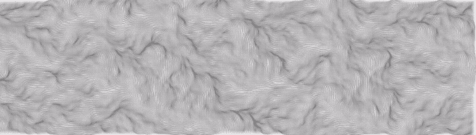

# 如何用 CCapture 保存画布动画

> 原文：<https://www.freecodecamp.org/news/how-to-save-canvas-animations-with-ccapture-78c70f0e86ac/>

依比·艾尔沙法

# 如何用 CCapture 保存画布动画



Animated noise visualization

你一直在学习 p5.js，你创作了一个精彩的动画，现在你想与全世界分享它。你是怎么做到的？

我们可以使用屏幕捕捉软件，但这只有在动画以正确的速度运行时才有效。在上面的动画中，我的速度不到每秒半帧。p5.js 文档中提到了 [ccapture.js](https://github.com/spite/ccapture.js) 库，它对我来说非常有用。

如果你想跟随这个教程，你可以在下面的沙箱里找到你需要的所有代码。

查看我的代码沙箱[这里](https://codesandbox.io/s/wy11r18xz8?fontsize=14)。

我们需要做的第一件事是下载[缩小的 CCapture javascript 文件](https://github.com/spite/ccapture.js/blob/master/build/CCapture.all.min.js)。我们会将文件移动到我们的项目文件夹中，或者上传到我们的沙盒文件夹中。然后我们需要将它添加到我们的 index.html 文件中:

```
<script src="p5.min.js"></script><script src="CCapture.all.min.js"></script><script src="sketch.js"></script>
```

在 sketch.js 文件中，我们需要初始化 capturer 对象。我们还需要指定我们希望我们的动画的帧速率。我们可以在文件的顶部这样做:

```
let framerate = 30;var capturer = new CCapture( {  format: 'webm',  framerate,  name: 'noise_visualization',  quality: 100,} );
```

注意，我们不需要使用 p5.js `frameRate()`函数来设置帧率。

除了`webm`之外，您还可以选择`jpeg`或`png`作为格式，这两种格式都会生成一个 tar 文件，每一帧都是一幅图像。根据文档显示，`gif`格式可能表现不佳。如果你打算使用它，请记住这一点。

使用 WebM 格式意味着一旦动画制作好，我们就可以观看了。这似乎比必须先把图像转换成视频有趣得多，所以我们就这样做了。

接下来，我们需要启动捕获器，我们将在设置功能结束时进行。您也可以在动画中的任何点启动它，或者在响应按键或鼠标单击时启动它。

```
function setup() {  // Setup code  // ...  capturer.start();}
```

现在我们需要捕捉帧，但要做到这一点，您需要首先将`canvas`传递给`capture`函数。我们可以对`setup`函数做一个小小的改动，这样我们就可以将画布保存到一个变量中:

```
// Initialise canvas outside of setup function so it can be used in the draw functionlet xseed, yseed, incrementxnoise,incrementynoise, canvas;
```

```
function setup() {  let p5canvas = createCanvas(200, 200);  canvas = p5canvas.canvas;  // Rest of setup code}
```

现在在 draw 函数的最后，我们捕获画布。

```
function draw() {  // Code for drawing the frame  capturer.capture(canvas);}
```

现在，我们需要做的就是决定何时停止捕捉，然后保存动画。我们可以使用 p5.js 中的`millis()`函数基于经过的时间来做这件事。但是我们可能希望我们的动画有一个特定的长度，如果帧渲染缓慢，经过的时间不会反映出来。相反，我们可以使用当前的`frameCount`计算出已经过了多少秒:

```
let secondsElapsed = frameCount/framerate;
```

现在，如果我们想让动画停止，比如说，5 秒钟，我们可以这样做:

```
let secondsElapsed = frameCount/framerate;if (secondsElapsed >= 5) {  capturer.stop();  capturer.save();  noLoop(); // This is optional}
```

就是这样！这是它在沙盒中的样子:

在这里查看我的 codesandbox [。](https://codesandbox.io/s/oqm8yp8ow6?codemirror=1&fontsize=14&module=%2Fsketch.js)

请注意，为了将代码嵌入到介质中，我已经注释掉了供下载的代码。

#### 使用 ffmpeg 进行转换

现在你有了你的动画，这很棒，但是你可能需要不同的格式。有很多程序和在线转换器可供你使用。我一直在使用 [ffmpeg](https://www.ffmpeg.org/download.html) ，因为它很灵活，可以从命令行获得。用他们自己的话说:

> FFmpeg 是领先的多媒体框架，能够**解码**，**编码**，**转码**，**多路复用**，**解复用**，**流**，**过滤器**和**播放**人类和机器创造的几乎任何东西。它支持最前沿的最晦涩的古老格式。

要将动画转换成 gif，您可以使用类似这样的东西。

```
ffmpeg -i noise_visualization.webm -filter_complex "[0:v] fps=15, split [a][b];[a] palettegen [p];[b][p] paletteuse" noise_visualization.gif
```

GIPHY 有一篇很棒的文章解释了所有这些选项的作用。

要将 Instagram 转换成 mp4，您可以使用如下方式:

```
ffmpeg -i noise_visualization.webm -c:a copy -c:v libx264 -b:v 5M -maxrate 5M noise_visualization.mp4
```

如果您经常重复使用相同的 ffmpeg 选项，将它们存储到替身中可能会很有用。你必须找出如何为你自己的终端程序做这件事的细节。在 cmder 中，它位于设置>环境下:


The cmder settings window

在 cmder 中，使用如下命令设置别名:

```
alias ffinsta=ffmpeg -i $1 -c:a copy -c:v libx264 -b:v 5M -maxrate 5M $2
```

这里`$1`是给`ffinsta`的第一个参数，`$2`是第二个参数。一旦设置了别名，您就可以像这样使用它:

```
ffinsta noise_visualization.webm noise_visualization.mp4
```

请注意，在 cmder 中，您必须在设置别名后重新启动终端。您的终端程序也可能是这种情况。

我希望本教程对你有所帮助，如果你需要任何帮助，尽管开口。


Photo by [Markus Spiske](https://unsplash.com/photos/cn0-hgcpoL8?utm_source=unsplash&utm_medium=referral&utm_content=creditCopyText) on [Unsplash](https://unsplash.com/search/photos/canvas?utm_source=unsplash&utm_medium=referral&utm_content=creditCopyText)