# 如何设置 VSCode 以提高您的生产力

> 原文：<https://www.freecodecamp.org/news/how-to-set-up-vscode-to-improve-your-productivity-fb14c81d4991/>

作者 Chiamaka Ikeanyi

# 如何设置 VSCode 以提高您的生产力

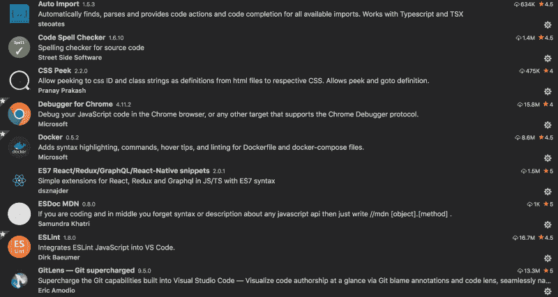

代码编辑器已经发展了很多年。几年前还没有 Visual Studio 代码(VS 代码)。你可能使用了崇高的文本，原子，括号等。但是随着 VS 代码的发布，它已经成为大多数开发者最喜欢的代码编辑器。

### 为什么 VS 代码？

开发人员喜欢它是因为

*   这是可定制的
*   易于调试
*   蚂蚁
*   扩展ˌ扩张
*   Git 集成
*   集成终端
*   智能感知
*   主题化和更多…

既然您已经看到了使用 VS 代码的优点，那么本文将介绍使用 VS 代码实现最大生产率时所需的 VS 代码设置和扩展。

### 末端的

您可以[设置您的终端](https://chiamakaikeanyi.dev/how-to-configure-your-macos-terminal-with-zsh-like-a-pro/)来使用 iTerm2 和 ZSh，并设置您的 VS 代码终端来使用它们。

配置 Zsh 后，启动 VS 代码集成终端`Terminal > New Termi`n 并运行命令

```
source ~/.zshrc
```

或者

```
. ~/.zshrc
```

来执行。外壳中的 zshrc 配置文件。

### 字体

[FiraCode](https://github.com/tonsky/FiraCode) 看起来很酷，因为支持连字。下载并安装 FiraCode，然后将其添加到您的`settings.json`文件中。

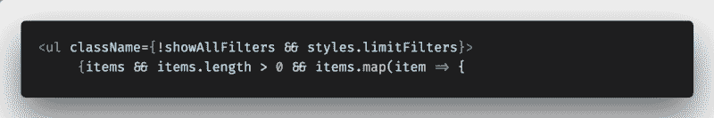

```
"editor.fontFamily": "Fira Code","editor.fontLigatures": true,
```

### 从命令行启动

从终端启动 VS 代码看起来很酷。为此，请按 CMD + SHIFT + P，键入 **shell 命令**，并选择路径中的**安装代码命令。然后，从终端导航到任何项目，并从目录中键入`**code .**`,使用 VS 代码启动该项目。**

### 配置

不特定于工作区的 VS 代码配置包含在 settings.json 中。

要启动 settings.json，请按

```
CMD + ,
```

将下面的代码复制并粘贴到 settings.json 文件中:

```
{    "editor.multiCursorModifier": "ctrlCmd",    "editor.formatOnPaste": true,    "editor.wordWrap": "bounded",    "editor.trimAutoWhitespace": true,    "editor.fontFamily": "Fira Code",    "editor.fontLigatures": true,    "editor.fontSize": 14,    "editor.formatOnSave": true,    "files.autoSave": "onFocusChange",    "emmet.syntaxProfiles": {        "javascript": "jsx"    },    "eslint.autoFixOnSave": true,    "eslint.validate": [        "javascript",        "javascriptreact"    ],    "javascript.validate.enable": true,    "git.enableSmartCommit": true,    "files.trimTrailingWhitespace": true,    "editor.tabSize": 2,    "gitlens.historyExplorer.enabled": true,    "diffEditor.ignoreTrimWhitespace": false,    "workbench.sideBar.location": "right",    "explorer.confirmDelete": false,    "javascript.updateImportsOnFileMove.enabled": "always",}
```

### 扩展ˌ扩张

下面是一些有用的扩展，可以改善你在代码库工作时的开发体验。

要访问这些扩展，

*   前往`View -> Extensi` ons
*   在市场中搜索扩展
*   点击安装

#### 1.自动导入

有了这个扩展，你就不需要手动导入文件了。如果您正在处理一个基于组件的项目，只需输入组件名，它就会被自动导入。

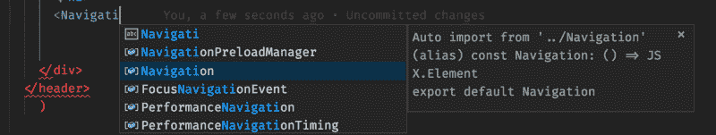

#### 2.添加 jsdoc 注释

这将在代码中添加一个注释块。要使用它，突出显示该功能的第一行，按下`CMD + SHIFT + P`并选择 ***添加文档注释。***

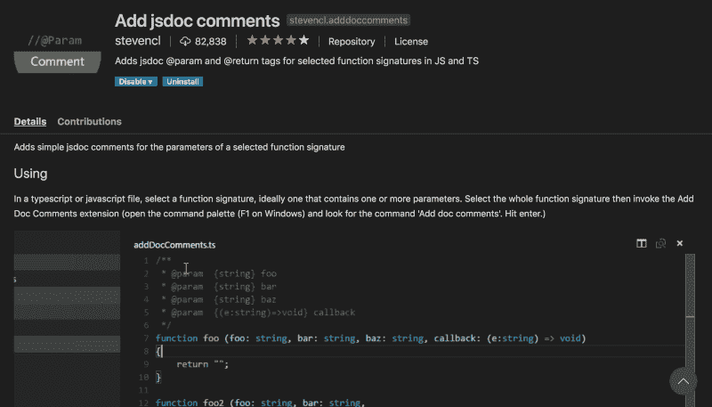

#### 3\. ESDoc MDN

在某些情况下，我们往往会忘记一件特定的事情是如何运作的。这就是这个扩展变得有用的地方。你不需要启动你的网络浏览器来找出语法。你所需要的就是打字

```
//mdn [object].[method];
```

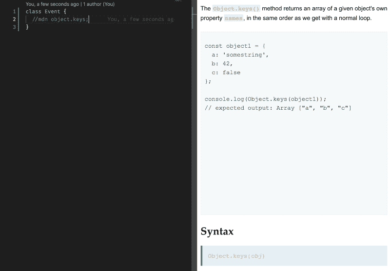

#### 4.CSS Peek

顾名思义，这有助于您查看代码库中定义的样式所应用的规则及其[特异性](https://chiamakaikeanyi.dev/css-specificity)。在处理遗留代码库时，这很方便。

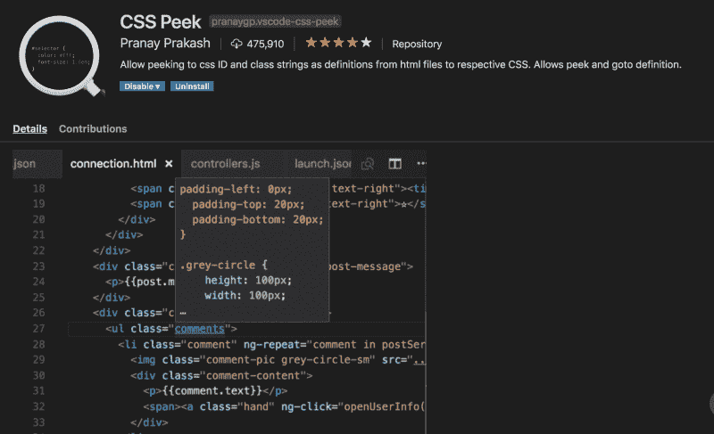

#### 5.走吧

GitLens 提升了您使用 Git 可以实现的目标。它可以帮助你做更多的事情，比如无缝地探索 Git 库，查看代码修改，作者身份等等。

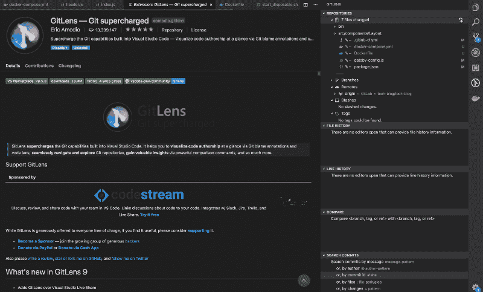

#### 6.埃斯林特

这将 ESLint 集成到 VS 代码中来 Lint 你的代码。您正在处理的项目需要在本地或全局安装 ESLint，以利用该扩展提供的特性。

要在本地安装 ESLint，请运行

```
npm install eslint
```

或者全球使用

```
npm install -g eslint
```

您还需要创建`.eslintrc`配置文件。如果您在本地安装了 ESLint，运行

```
./node_modules/.bin/eslint --init
```

或者

```
eslint --init
```

用于全球安装。

#### 7.Chrome 调试器

这让你可以直接从谷歌浏览器调试你的 JavaScript 代码

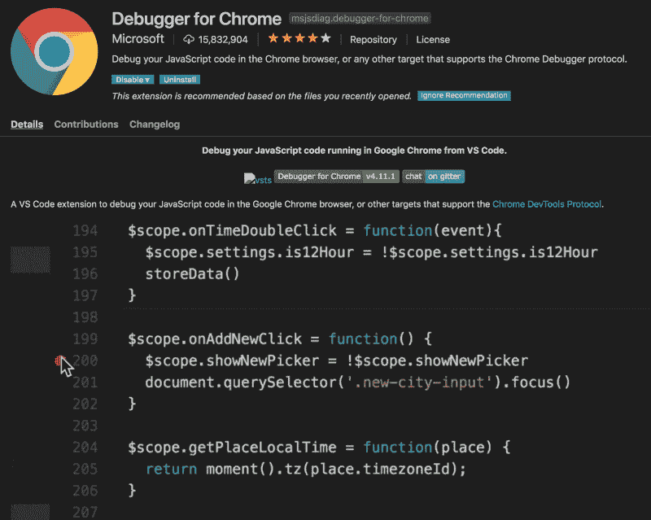

#### 8.谷歌字体

有了这个扩展，添加谷歌字体变得更加容易。您不再需要在浏览器中搜索字体。要访问字体列表，按`CMD + SHIFT + P`并搜索 ***谷歌字体*** 继续。

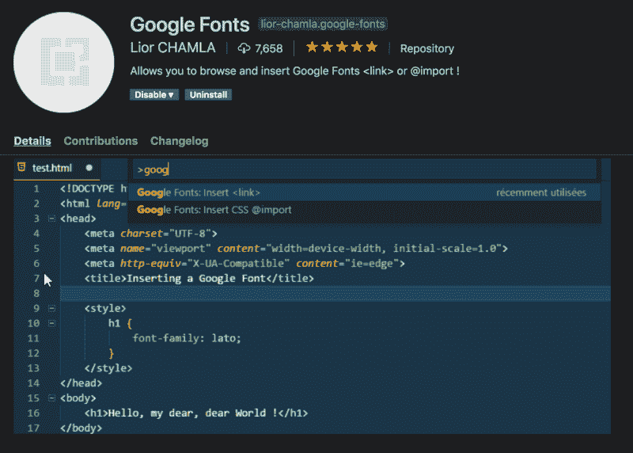

#### 9.待办事项突出显示

有很多需要优先处理的工作，有时你可能会忘记尚未完成的任务。TODO highlight 通过突出显示这些内容使其易于查看。

#### 10.码头工人

您可以使用这个扩展动态创建 docker 文件。它还提供了语法高亮、智能感知等等。

按 CMD + SHIFT + P 并搜索*将 Docker 文件添加到工作区。*

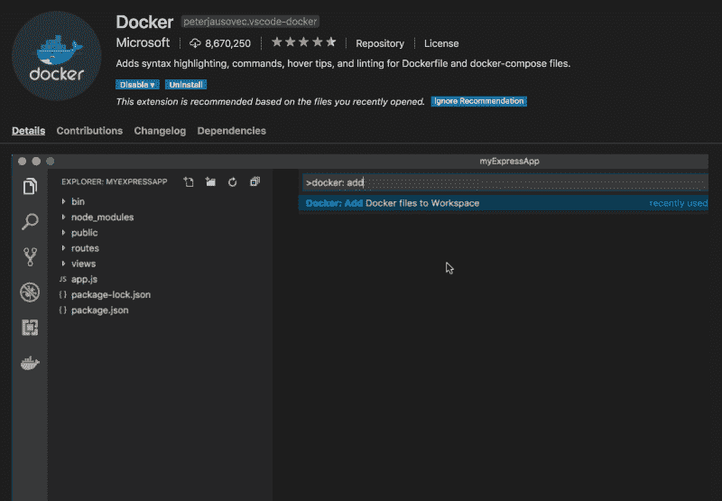

#### 11.代码拼写检查器

这有助于识别代码库中的打字错误。

#### 12.进口成本

导入成本显示代码中导入包的影响。它有助于测量性能瓶颈。

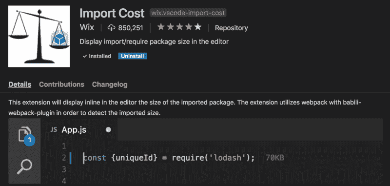

#### 13.html 提示

这个扩展验证你的 HTML，帮助你编写符合标准的代码。

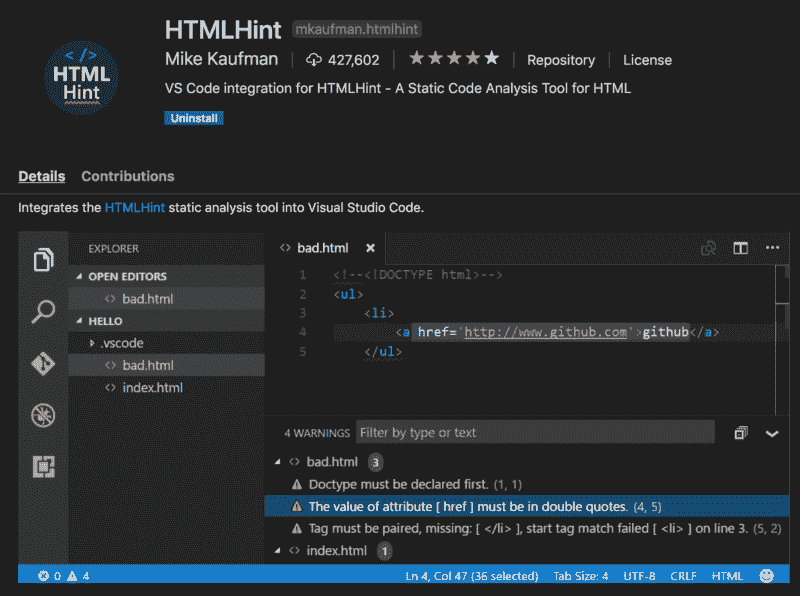

#### **14。孔雀**

这个扩展让你能够改变你的工作空间的颜色。当您有多个 VS 代码实例并且想要快速识别一个特定的实例时，这是非常理想的。

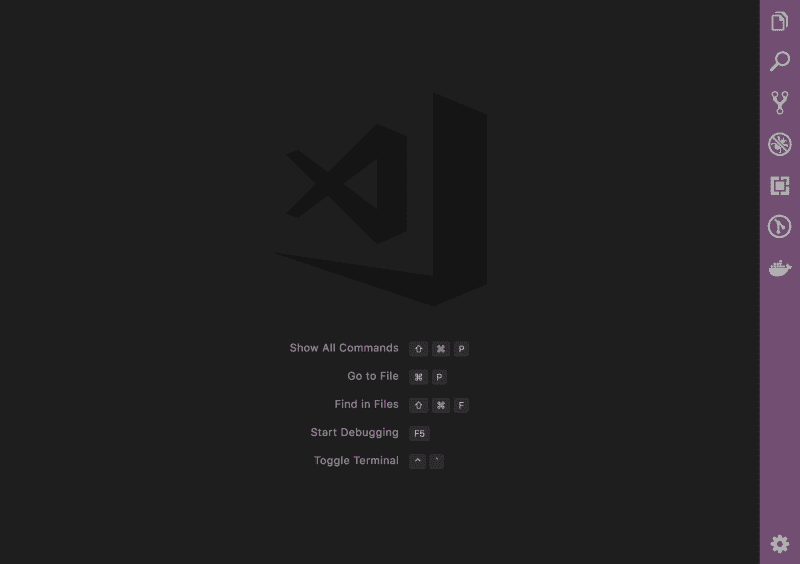

安装完孔雀，点击设置图标>设置，选择工作区设置选项卡，点击{}，粘贴下面的代码。

```
{    "workbench.colorCustomizations": {        "activityBar.background": "#e90b8d",        "activityBar.foreground": "#fff",        "activityBar.inactiveForeground": "#b5b5b5",    },    "peacock.affectedElements": [        "activityBar",    ]}
```

您还可以将`titleBar`和`statusBar`添加到 affectedElements，并在 color customizations 部分为它们添加颜色定制。

要使用默认颜色之一，请按 CMD + SHIFT + P，键入 **peacock** 并选择您喜欢的主题。这将覆盖为该工作区定义的 settings.json 文件中的颜色设置。

#### 15。更漂亮

编码的时候总是按空格键或者 tab 键吗？更漂亮的来拯救我们了。它格式化代码行，使其可读。

点击此处查看使用 Visual Studio 代码可以做的令人惊叹的事情。

欢迎在评论区留下对你有用的内容，并分享这篇文章。

另外，查看我的博客获取更多文章。