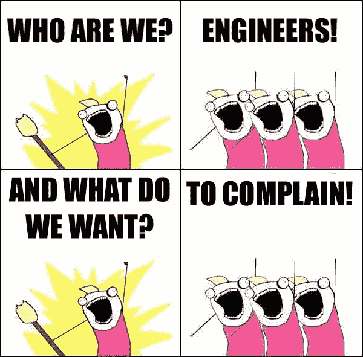

# 如何以正确的方式招聘:工程师对技术招聘的看法

> 原文：<https://www.freecodecamp.org/news/hiring-right-an-engineers-perspective-on-tech-recruiting-7ee187ded22d/>

作者:Rina Artstain

# 如何以正确的方式招聘:工程师对技术招聘的看法

我是一名工程师，但我也有工商管理硕士学位，对于这个职位，我会戴上那顶帽子。我曾认真考虑过买一顶印有“MBA”字样的帽子，但一些好心人劝我不要戴，所以不幸的是，这只是一顶象征性的帽子，而不是真正的帽子。

我经常看到工程师抱怨招聘流程:冗长，似乎与工作完全无关，一切都很愚蠢。我们就是不明白。不幸的是，我们可能是对的——一些雇主不知道他们在做什么，但是真的必须这样吗？

我在读 MBA 期间上过的最好的课程之一是关于招聘流程及其背后的研究的课程。它给我留下了持久的印象，并影响了我在招聘和应聘时对招聘流程的看法。当我听到这些咆哮时，我经常试图解释一个好的招聘过程背后的理性，我认为这是对工程师和招聘人员有用的洞察力，这就是我写这篇文章的原因。

### 招聘很难。错误是昂贵的。我们不知道自己在做什么。

当然，我们在这方面很出色。总是有人不知道自己在做什么。

### 那么，我们能做什么呢？

首先，让我们看看你可以使用的一些常用工具，描述它们，并根据该领域的最新学术研究，检查它们实际上有多好:

> 这里给出的有效性数字是“预测有效性”。这意味着特定测试结果的有效性与工作的成功相关。有效性分数为 0 意味着没有相关性，测试没有价值(你可以扔硬币)，1 意味着测试完美地预测了工作的成功。

**智力测试:**智商测试，sat 等。
**有效期:** 0.51
即使你不直接询问这些考试的成绩，你通常也会试图通过查看他们去的学校和他们的 GPA 来代理获取。我知道这对许多优秀的工程师候选人来说似乎不公平，即使他们在高等教育中表现不佳(或者根本没去，例如训练营等)。)但这是一种快速、廉价的处理大量简历的方式。

**工作样本测试**:要求你完成一项与工作直接相关的任务。
**有效期:** 0.54
如果做得好，在家里，这对每个人都节省时间。它也允许候选人以最小的压力展示他们最好的作品。然而，它所花费的时间经常被低估，如果在家里做，候选人可能会“错过”一些东西，没有答案，而潜在的雇主会错过有价值的信号。

我见过许多工程师，他们似乎认为工作样本是真正展示其价值的最佳和唯一方式。无论如何，我不明白。许多工作样本测试只是雇主让你投入时间的一种方式，而且对他们来说几乎没有成本。作为一名候选人，我真的看不出他们比编码面试更好——任务要么是合成的，没有实际工作的代表性，要么是过于复杂和耗时。

就业面试:我相信我不用解释什么是面试。
**有效性(结构化):** 0.51
**有效性(非结构化):** 0.36
啊，我们终于有所收获了。“结构化”面试和“非结构化”面试有什么区别？嗯，结构化面试有可重复的问题和清晰客观的答案标准。无结构面试，嗯，不会。最终，一场无组织的面试归结为对候选人的“直觉”。我常常感谢提前指定了清晰客观的标准，因为根据你对某人的第一印象(完全有偏见的)很容易扭曲面试结果。

**工作知识测试:**针对主题直接提问。
**有效性:** 0.48
通常这是通过给候选人一份问卷来进行的，询问他们领域知识的具体问题。像“web 路由在技术栈 A 中是如何工作的”、“如果你试图将这个值赋给技术栈 B 中的一个字符串会发生什么”等等。

到目前为止还不错。现在我开始说“好东西”了:

**评估中心:**当你花一大笔钱让候选人花一天时间和一群陌生人做群体动态。
V **有效:** 0.37
你能看出我觉得这些很蠢吗？不仅是我，它们的有效性相对较低，可重复性(即在重复测试中获得相同的分数)也非常低。如果你在招聘，请不要这样做。如果你是候选人，你有拒绝的特权——就说不。

背景调查:向过去的雇主询问候选人的情况。
**有效期:** 0.26
我知道很多雇主坚持要进行证明人调查。但是它们的有效性不是很大，应该谨慎使用。

笔迹学:给手写״specialist״寄一份书写样本，他会告诉你是否适合这份工作。通常用于完整性测试。
**效度:** 0.02
笔迹学不是一个好的招聘工具。不要使用它。我强调的够了吗？

### 编码面试

尽管我已经知道了这些统计数据，但在写这篇文章时，我仍然受到了很大的打击:即使是最好的测试也只有 0.51-0.54 的有效性，这一点也不令人惊讶。这是我们能做的最好的吗？为了获得更好的结果，我们可以用现有的工具做些什么？

进入可怕的“编码面试”。无论是在白板上还是在线编辑器上，它都允许雇主将工作样本、结构化面试和工作知识测试打包到一个会话中。通过由几个不同的人进行许多这样的编码面试，您可以获得更好的结果，提高可靠性并减少偏差(“直觉”)。这就是为什么招聘过程如此漫长和令人疲惫(对每个人来说)。

我知道我还没有说服你，但是我将在后面更多地谈论如何评估这个过程的质量。

好吧，让我们看看它是怎么做的。

### 这是个好问题吗？

给你三个容器。

*   一个盒子里装的全是白球，一个盒子里装的全是黑球，还有一个盒子里装的是黑白混合球。
*   每个盒子都贴了标签，但所有的标签都是错的。

你需要拉出多少个球来确定哪个盒子是哪个？

### 这个怎么样？

计数和说出序列是整数序列，如下开始:

`1, 11, 21, 1211, 111221, ...`

1 被读出为 **one 1** 或 11。

11 读作**两个 1**或 21。

21 被读出为**一个 2，然后一个 1** 或 1211。

给定一个整数 n，生成第 n 个序列。

### 还是这个问题？

你怀孕了还是打算在未来一年内怀孕？

### 你错了。

你回答“是”还是“不是”并不重要。

问题没有好坏之分。

现在，我不建议询问某人是否怀孕，因为那是违法的，而且通常是不相关的。但是如果这份工作是在一个有危险化学品和艰苦体力劳动的工厂里，这个问题实际上可能是一个要问的重要问题！

当你建立你的过程时，问题应该是你做的最后一件事。

### 首先，问正确的问题

*   什么是**实际**工作定义？
*   为了做好工作，一个**需要**哪些技能？
*   作为一个组织，**你**看重哪些软技能和性格特征？
*   为了找到合适的人，你愿意花费多少时间、精力和金钱？
*   为了通过你的流程，**候选人**愿意花费多少时间和精力？

只有在你有了这些问题的答案之后，你才能开始创建一个具体的过程。你不能从另一个组织复制这些问题的答案。你们必须自己去发现它们。

### 创建正确的流程

*   决定你的筛选参数是什么，无情的筛选。不要浪费你或你的候选人的时间。
*   使用结构化面试进行技术和软技能面试。
*   如果你觉得**候选人会愿意**并为你**节省大量时间和精力**，你也可以使用工作样本。
*   仅在需要时打电话给推荐人并进行背景调查。

### 测量、提炼、重复

每次我提到某个过程的有效性时，都会有人问我有效性是如何衡量的。我真的读过这些文章，我可以告诉你他们使用的方法，但是说实话——这真的不重要。重要的是什么对您的组织有效。你可能会发现“编码面试”不符合你的价值观，或者没有给你决定雇佣谁的信号。你可能会发现你的候选人喜欢在办公室里做长时间的工作样本，这可以让你更好地了解他们。

关键是一旦你有了你的过程，你必须确保它在工作！

*   有多少通过了你的初步筛选的候选人通过了面试？
*   有多少通过整个过程的候选人接受了这份工作？
*   员工在你这里呆多久？
*   他们的绩效考核怎么样？

收集您的数据，并相应地完善您的流程。这是一个持续的挑战！

### 避免偏见

现在，您已经构建了一个流程，并拥有关于被雇用的候选人的统计数据。你如何确保你测试的不是“富有的白人男性”，而是“优秀的程序员”？你如何证明你没有雇用“像我们这样的人”，而不是检查实际的“文化契合度”？

> 我个人最讨厌开源贡献或其他“业余”项目作为一种需求。如果你是一名优秀的程序员，但有其他爱好，或者如果你有一个家庭，并且真的想花时间和他们在一起，那就这样，你出局了。对我来说，这是一个筛选无关特征的例子。

不幸的是，一些常见的快速修复方法似乎不起作用。隐性偏见训练(通常)不会影响结果，它通常会让事情变得更糟。多样化的面试官也不一定做出较少偏见的决定，因为他们经常表现出和其他人一样的偏见。

你应该记住，这完全是潜意识的影响——你不必是公开的种族主义者或坏人才会有偏见。这是我们大脑工作的一个自然部分，所以这取决于帮助我们积极对抗偏见的过程。

解决这个问题的最好方法是增加多样性措施，并使用“测量、提炼、重复”的循环来检查你做得如何。

如果您度量多样性并相应地改进您的过程——您将找到问题所在并采取适当的行动。如果这是一个真正的管道问题，请阅读莫兰·韦伯的优秀文章。如果这不是一个真正的渠道问题，看看你如何对待不同的简历，他们通过你的过程有多好，他们多久接受你的提议，等等。

### **先不说:诚信**

这有点跑题，但是太好了，不能跳过。不管怎样，你可以跳过它，我不会因此而责怪你。

我提到笔迹学是开玩笑的，它的有效性很低，完全是浪费金钱。那么为什么有些用人单位还在用呢？你会感到惊讶:对他们中的一些人来说，这是别人决定他们觉得自己不能做什么的一种方式！但是他们中的一些人实际上相信它是准确的，这怎么可能呢？

让我告诉你一个故事:当我上这门课的时候，有一节课我们被要求给出一个写作样本。下一节课开始时，我们每个人都得到了一份对自己性格的笔迹学评估，并被要求评估其准确性。班上大多数人给它的准确度打了 4 或 5 分。结果我们都得到了同样的分析…我们怎么会被这样愚弄呢？

这被称为[巴纳姆效应](https://en.m.wikipedia.org/wiki/Barnum_effect)，基本上它的意思是，当我们阅读像占星术或笔迹学这样的普通文本时，我们会相信正确的部分，而忽略/忘记错误的部分！留给我们的最后印象是这篇文章非常准确。

事实证明，衡量诚信的最佳方式是直接提问！有纸笔测验，有一系列关于诚信的问题。具有讽刺意味的是，不诚实的人相信他们是一个不诚实的世界中的正常人，所以他们说实话没有问题！他们会说“当然，我会带几盒钢笔回家”或者“为什么我不应该撒谎说我生病了？”，并暴露自己不值得信任。

如果你正在招聘，我希望这给了你一些如何建立一个好的流程的见解。如果你是一名求职者，我希望这能帮助你理解招聘中的问题，以及什么是真正有效的。对我来说——我终于有了一个现成的答案给所有沮丧的候选人。祝你好运！