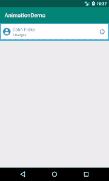

# 如何让你的 Kotlin Android 动画具有可访问性

> 原文：<https://www.freecodecamp.org/news/accessible-a11y-kotlin-android-animations-7432bd23e395/>

当研究有史以来第一个 Android 贡献的例子时，很少有用 Kotlin 编写的动画例子。本地动画中也有一些关于可访问性考虑的代码示例。

所以我们开始吧！让我们看看用 Kotlin 编写一个本地“扩展”动画，并讨论如何帮助那些打开对讲或放大文本的人。这个[示例 repo](https://github.com/dominicfraser/AnimationDemo) 中的所有代码都是可用的，创建了一个带有动画视图的活动。这是基于与 [Calum 特纳](https://medium.com/@cajturner)共同编写的代码。


GIF of the end app result

### Android 可访问性(a11y)

所有的 Android 设备都有一个名为 TalkBack 的内置屏幕阅读器。这可以从设备的设置中打开，并且还内置了首次使用指南。手势用于在页面中导航，并大声朗读对重点元素的描述。如果没有这一点，许多视障用户将无法使用应用程序。

最重要的是，正确的元素是可聚焦的，有描述的，并且视图的改变被宣布。

在同一个设置菜单中，可以调整默认的基本字体大小，从 1.0 开始缩放。视图应该对这种字体大小的变化作出反应，所有的元素仍然存在并起作用。

### 布局

我们不会在这里查看布局的样式细节，因为它们对于这个例子来说是相当独特的，但是可访问性方面值得强调。

使用了两个属性:`android:contentDescription`和`android:importantForAccessibility`。

`contentDescription`是当一个元素获得焦点时读取的内容。对于任何获得焦点的 ImageView 来说，这是必不可少的，否则屏幕阅读器将会把无用的“未标记”读给用户。

如果这是一个按钮，默认情况下会显示为“<description>按钮，双击激活”，但对于 ImageView 图标，我们手动指定操作，因为我们没有此默认设置。</description>

```
android:contentDescription="tap to toggle extra person information"
```

我们还使用`importantForAccessibility:no`来关闭“+”文本视图的焦点，因为两个徽章下面的文本提供了一个描述，所以如果大声朗读“+”会更加混乱。

对于这两者，在真实设备上打开对讲功能进行手动测试是在没有视觉效果的情况下上下文是否有意义的最佳指示。

### 展开动画

我们的动画将在点击“信息”图标时激活，切换细节部分的展开。

我们将在一个单独的活动中完成所有这些工作，以便只关注动画代码。在真实的应用程序中，这个应用到的视图更可能在它自己的片段或回收器视图中，所以会使用更抽象的代码结构。

#### 设置监听器

在我们的示例活动的`onCreate`中，我们必须首先在图标上设置一个监听器，并传入要切换的视图。

```
infoIcon.setOnClickListener { toggleCardBody(root.personEntryBody) }
```

我们还在类中设置了一个变量来跟踪视图是否被切换，将其设置为初始关闭。

```
private var isToggled = false
```

#### 切换扩展动画

在我们的布局中，我们将`personEntryBody`的高度设置为`0dp`。

为了打开它，我们需要知道新的高度来设置它，动画应该有多长，以及在动画的每个时刻应该有多高。

然后，我们需要将`isToggled`设置为它的反相，并确保再次点击时它会反过来。

```
private fun toggleCardBody(body: View) {
    body.measure(ViewGroup.LayoutParams.MATCH_PARENT, ViewGroup.LayoutParams.WRAP_CONTENT)
    val maxHeight = body.measuredHeight + body.paddingTop + body.paddingBottom
    val startHeight = if (isToggled) maxHeight else 0
    val targetHeight = if (isToggled) 0 else maxHeight

    val expandAnimator = ValueAnimator
        .ofInt(startHeight, targetHeight)
        .setDuration(200)

    expandAnimator.addUpdateListener {
        val value = it.animatedValue as Int
        body.layoutParams.height = value
        body.requestLayout()
    }

    expandAnimator.doOnEnd {
        isToggled = !isToggled
    }

    expandAnimator.start()
}
```

由于视图最初绘制时的高度为 0，我们必须通过重新测量其布局来计算新的尺寸。

正如在 [Android 视图布局文档](https://developer.android.com/reference/android/view/View.html#layout)中所描述的，我们可以使用`measure()`以及分配给视图的布局参数，在每次点击信息图标时进行重新测量。

要计算最大高度，我们必须手动添加顶部和底部填充，因为这些不包括在测量的高度中。

根据`isToggled`,我们知道我们是从 0 开始还是从展开的最大高度开始，以及相对的目标高度。

我们使用一个值动画器从起始值移动到目标结束值，并以毫秒为单位设置持续时间。该持续时间纯粹基于后来对 UX 感觉的手动测试。

```
ValueAnimator
        .ofInt(startHeight, targetHeight)
        .setDuration(200)
```

我们用一个更新监听器将持续时间与高度联系起来，请求在每次更新后绘制一个新的布局，并每次调整高度。

```
 expandAnimator.addUpdateListener {
        val value = it.animatedValue as Int
        body.layoutParams.height = value
        body.requestLayout()
    }

    expandAnimator.doOnEnd {
        isToggled = !isToggled
    }

    expandAnimator.start()
```

当我们使用 Kotlin 时，我们也将`[androidx](https://developer.android.com/kotlin/ktx#core-packages)`库添加到我们的`build.gradle`中，以受益于它的`doOnEnd`扩展。这允许我们非常容易地反转`isToggled`变量。

最后，我们开始我们的动画！我们已经有了一个可以在触摸图标时伸缩的身体！

#### 更流畅的动画

虽然我们的动画技术上是这样工作的，但一个很好的额外步骤是添加一个[插值器](https://thoughtbot.com/blog/android-interpolators-a-visual-guide)，这样运动感觉更自然。

```
expandAnimator.interpolator = FastOutSlowInInterpolator()
```

#### 增加我们的可及性

我们将添加两个最后的东西，希望能帮助我们的 a11y 用户。

首先，我们可以使用`[AccessibilityEvent](https://developer.android.com/reference/android/view/accessibility/AccessibilityEvent)`来帮助导航。

```
expandAnimator.doOnEnd {
    if (!isToggled)       body.sendAccessibilityEvent(AccessibilityEvent.TYPE_VIEW_FOCUSED)
    isToggled = !isToggled
}
```

这意味着当动画从关闭移动到打开时，焦点将立即跳转到主体中的第一项，在本例中为描述。在布局中，我们设置了信息图标操作的描述，但由于我们可能无法依赖用户移动到下一个项目的视觉指示器，我们可以为他们处理这一点。

第二，我们允许不同的字体大小。从`measure()`返回的测量高度不考虑设备辅助功能设置中设置的字体缩放，因此当缩放比例较大时，描述的底部将被裁剪，因为它太大而不适合。

我们可以通过编程访问字体比例，并以此为基础调整我们的高度。我们将其转换为整数，因为字体比例可能会导致浮动，这将不会作为布局高度。

```
val a11yFontScale = body.context.resources.configuration.fontScale
val maxHeight = ((body.measuredHeight + body.paddingTop + body.paddingBottom) * a11yFontScale).toInt()
```

### 完了！



GIF of the end app result

好了，我们已经完成了我们的最终动画！通过几条额外的线，我们大大增加了 a11y 的覆盖范围，并且有一个平滑的扩展部分，显示 Kotlin 和 Android 徽章？

感谢阅读？

以下是我最近写的一些其他东西:

*   [定制 CodeceptJS E2E 测试](https://codeburst.io/customising-codeceptjs-e2e-tests-1a2bf5f32f51?source=friends_link&sk=767140b587a6efd9d71f9e06c5dc3c4b)
*   [测试与 Jest 和酶 II 的反应](https://codeburst.io/testing-react-events-with-jest-and-enzyme-ii-46fbe4b8b589?source=friends_link&sk=e5e9c600c79cdac7fae802add95ff17d)

### 有用的附加功能

*   [Joe Birch](https://www.freecodecamp.org/news/accessible-a11y-kotlin-android-animations-7432bd23e395/undefined) 关于[探索 KTX for Android](https://medium.com/exploring-android/exploring-ktx-for-android-13a369795b51) 的大安卓帖子
*   [Android 辅助功能教程:入门](https://www.raywenderlich.com/240-android-accessibility-tutorial-getting-started)