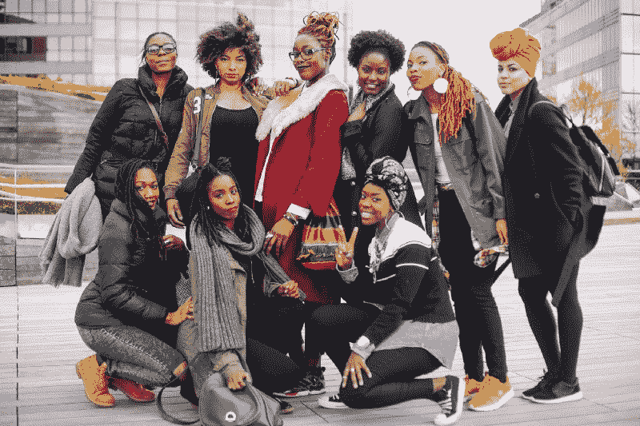

# 在科技行业工作:黑人女性给黑人女性的建议

> 原文：<https://www.freecodecamp.org/news/working-in-tech-advice-from-black-women-to-black-women-d1319e7899aa/>

薇薇安·卡斯蒂略

# 在科技行业工作:黑人女性给黑人女性的建议

在过去的几个月里，我收到了很多来自年轻黑人女性的询问，她们都是从科技行业开始职业生涯的。他们一直在寻求与在行业中工作、在公司中导航以及在工作场所取得成功相关的建议。

出于这种信念，黑人女性可以在我们的职业抱负中互相学习，互相支持，我联系了科技界的黑人女性，问了她们三个问题:

如果你能回到你科技生涯的开始，给自己一个建议，你会说什么？

你对进入科技行业的黑人女性有什么建议？

**(3)** 如果你可以改变你现在工作的地方的一件事，让它成为黑人女性更好的体验，那会是什么？

这篇文章中的建议来自从事设计、研究、广告、工程、IT 和产品/项目管理的黑人女性；他们在美国各大城市工作，大多数受访者年龄在 25 至 45 岁之间。

这是他们的建议。

### 如果你能回到你科技职业生涯的开始，给自己一个建议，你会说什么？

主题:不要害怕，相信自己，拿好袋子，大声说出你的愿望，寻求智慧和支持。

“人们有时会对你不客气。他们会告诉你，你知道的不够多，或者你的知识不够专业。别听他们的。他们正在进行一些不可能的标准，甚至他们自己也无法完成。你只要热爱技术就够了。”

“只管去做吧！不要再为不去追求你真正想要的东西找借口了。”

“建立一个其他从事过科技行业的黑人女性的网络。在工作中困难和沮丧的时候，你会需要它们。更重要的是，他们会给你如何驾驭公司生活的建议，特别是因为你会发现自己是唯一的黑人女性之一。”

“在你的忙碌中优先考虑自我保健。不要因为你很忙就让关系半途而废。找出时间，为你身边的人腾出时间，优先考虑你的幸福。”

“我想说，尽管前方的路看起来很孤独，但你并不孤独。我想说的是，依靠那些你已经认识并看到为你铺平道路的女性，无论是在科技行业内部还是外部，不要害怕你会成为一个“麻烦”,寻求帮助并承认你正处于艰难时期。我最大的建议是，为我自己赢得优雅和骄傲，因为我有勇气走出舒适区，追寻一条尚未完全确定的道路，但最终会引领我在自己的可能性深处游泳，不要害怕或怀疑这些深度。”

“要更自信。采取措施培养对你的知识、专长和技能的信任。例如，无论会议的重要性如何，在每次会议前都要做好充分的准备，阅读关键文件，对文件进行注释等..自信无非是准备。建立一个对自己的东西了如指掌的声誉。”

“你是你生活中的主角，这是你的世界，享受你的旅程，沉浸在你的激情中，热爱自己，你会成功的。”

“追求金钱的同时，也要注意公司的声誉。在接受一份工作之前，先了解一下其他人对这家公司的看法，并与你的团队会面。”

“不要害怕说出你的兴趣和职业目标，并坚持下去。不要害怕还价。”

“对自己有信心。你创造了自己的方式，这是一种优势，而不是劣势。我放弃了非盈利部门的工作，接受了非技术教育，在硅谷我感觉自己就像一条离开水的鱼。然而，随着我作为设计师的经验越来越多，我意识到我的背景是让我脱颖而出的一项资产。”

"早点开始为自己辩护，你是自己最好的啦啦队长."

### 你对进入科技行业的黑人女性有什么建议？

主题:赞助商>导师，承担风险，不要放弃你的职业抱负，对你所能提供的有信心，你的想法和创意有价值。

“获得赞助者比导师更重要。一个赞助人是可以证明你的工作质量/职业道德的人，他会在你的绩效评估或你的下一个项目/工作中支持你。本质上，他们愿意拿自己的社会和职业资本去冒险，以增加你的资本。这和导师不一样。导师唯一的风险和支出就是他们的时间。”

“如果一份工作看起来有趣，就去申请吧。忽略 100%符合资质的冲动。研究表明，男人只关注并实现了其中的 25%。想象一个女人有 75%申请同样的工作。你会是一只鞋子。”

“相信你的观点，不管多么不同，都值得被倾听。大胆分享你思考和体验事物的不同方式，因为这可能会对产品或业务的方向产生强烈影响，如果没有你，这些产品或业务可能不会有不同的观点。要知道你的声音是有价值的，即使没有其他人支持你，或者有人试图告诉你不是这样。通常，当你面对这些时刻并大声说出来时，你会发现还有其他人也有同样的感受，但他们觉得自己没有空间或信心说出来。”

“网络，你以后会意识到人脉有多重要。”

“如果你不喜欢某个公司或团队，就不要留在那里，有人愿意为你付出更多，让你开心。”

“写下你的愿景，制定一个计划。寻找值得信赖的导师和赞助商，这样你就能得到有意义的反馈。”

“不要被骗了，以为所有‘主流’女性都会成为你在职场上的担保人或盟友。当出现问题时(这是不可避免的)，有人会为我辩护或维护我的声誉，这让我感到惊讶。我的团队中有许多人是白人。事实上，白人男性和白人女性一样支持我，如果不是更多的话。”

“在大多数工作团队环境中，你将是唯一的黑人女性。做决定时要有目的性，大胆说出来，不要害怕犯错。这就是你学习的方式。此外，永远要有一个你积极争取的职业发展目标。”

“不要放弃。我们需要你的想法、选择和主意。关系也很重要，所以准备好人际关系网来帮助你进入职场，并保持人际关系网来获得晋升。”

“一起建造。求助。尽你所能寻求社区的支持。即使这只是意味着加入 WoC 的一个松散团队。”

“相信你的价值和技能，别人可能会怀疑，但永远不要怀疑自己——你是无限的。仇恨者不成熟。”

### 如果你能改变你现在工作的地方的一件事，让它成为黑人女性更好的体验，那会是什么？

主题:通过雇佣更多黑人女性来增加代表性，承认白人特权和种族主义的安全性，白人员工领导关于多元化&包容的对话。

“我会比以往任何时候都更加鼓励黑人女性申请她们认为超出她们能力范围的职位。我们需要很多黑人女性参与管理。并且在某个点之后停止寻找导师，开始寻找资助人。到时候你需要有人在决策室留下你的名字。尽早开始建立这些(永远不要认为你不值得这些荣誉)。”

“更多的黑人女性！世界需要你。”

“我是我们软件公司(10000 多名员工，总部位于意大利的公司)中唯一的黑人女性。我已经要求人力资源部门改进我们的文化多样性培训，因为它影响了我在工作中的舒适度(例如，对头发的评论，人们试图对我使用“俚语”，认为我是“好斗的”，因为我是个高个子、黑人、打篮球，被问及为什么当每个人都根据国籍/文化/种族分组时，我不和任何人交朋友或吃饭)。”

“更多的黑人女性。我在一家大型知名科技公司工作，尽管我们有几栋办公楼，但我是楼里唯一的黑人女性。这种感觉真的很孤独，就像我总是不得不粉碎它，以证明我属于这里。”

“让白人拥有自己的白人身份和种族主义意识形态，这样我们就可以勇敢地谈论种族问题，以及为什么在 2019 年，我是第一个在我的部门获得晋升和终身职位的非洲裔美国人。还有，为什么部门里没人愿意承认。”

“我们中的更多人！从事设计技术工作的黑人女性很少。”

“提供更多关于白人特权和白人女权主义的教育。作为我们楼里唯一的黑人女性，我发现很难加入我的白人女性同事关于平等的谈话，因为，嗯，她们谈论的唯一角度是作为一名女性意味着什么。然而对我来说，这也是作为一个黑人女性的问题。这是一种特权，只把你的性别视为平等的障碍，而不必考虑你的民族和/或种族。”

“我在一个远程、完全分散的团队中工作，他们似乎不愿意亲自见面。对我来说，我认为这是消极的，因为建立关系是面对面进行的。再多的松散信息或视频会议都无法取代面对面的交流。对于远程工作人员来说，有更多的机会建立关系，以培养社交纽带和团队信任。”

“雇佣更多的我们！在团队成长的时候，你的招聘过程要有目的、透明，在寻找候选人时不要把包容性排除在讨论之外。”

“就一件事？对管理层的无意识偏见训练。”

“我会在这里创造更多黑人女性领导人的可见性……我仍然希望有一个坚实的网络或空间，供黑人女性专门依靠。”

“请停止强迫黑人女性成为多样性和包容性的捍卫者。我们累了，不应该承担起教育你特权、种族主义和你自己的偏见的责任。不，我们不想一直谈论这个。我经常觉得我必须谈论多样性和包容性，因为办公室里没有人支持它，甚至没有人讨论它。作为唯一的黑人女性，这让 AF 很沮丧。”

"更多的内部团体致力于指导和促进公司中有色人种女性的职业发展."

“我的团队里没有其他黑人女性。如果办公室里有更多像我这样的人就好了。”

如果你喜欢你读到的内容，请通过在社交媒体上分享来增加这篇文章被其他人阅读的机会！谢谢！