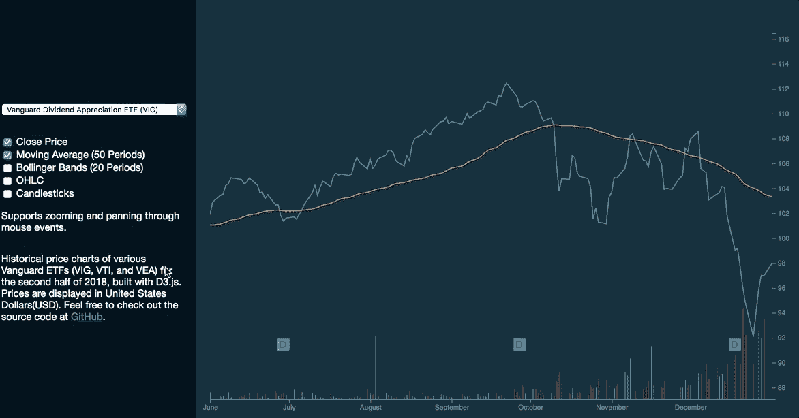
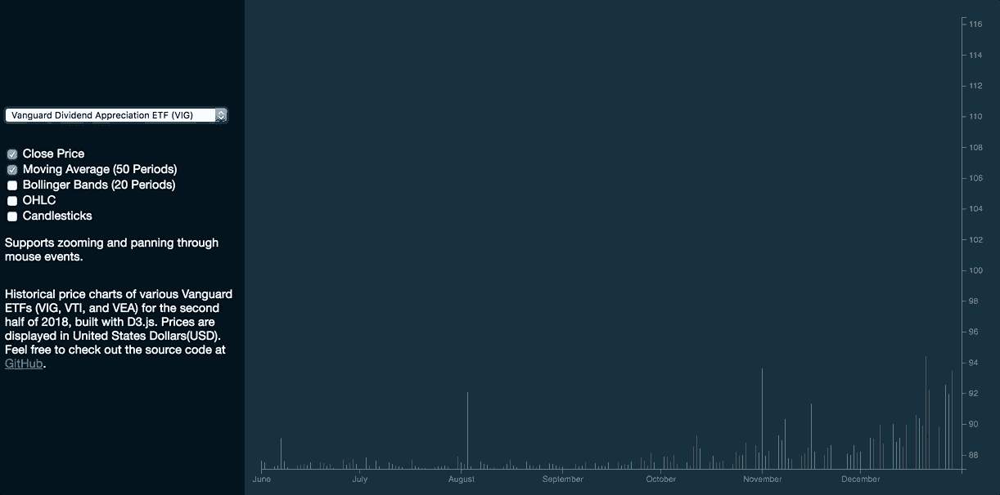
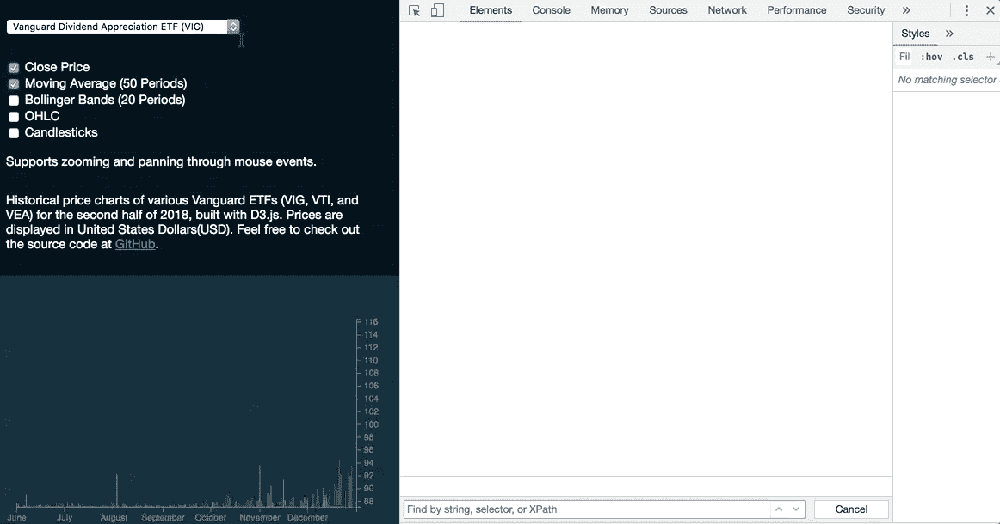
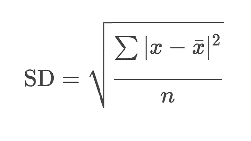
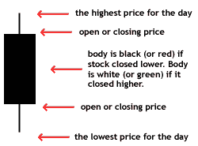
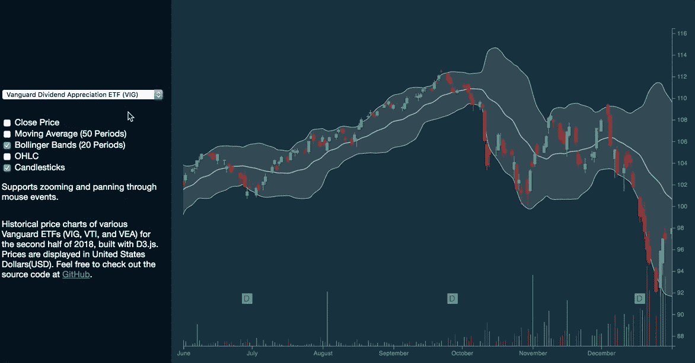

# 如何使用 D3.js 的通用更新模式

> 原文：<https://www.freecodecamp.org/news/how-to-work-with-d3-jss-general-update-pattern-8adce8d55418/>

#### 使用动态数据集实现可视化模块的指导教程

在呈现新图表之前，通常通过调用`d3.select('#chart').remove()`来移除现有的可缩放矢量图形(SVG)元素。

但是，有些情况下，您必须从外部 API 等来源生成动态可视化。本文将向您展示如何使用 D3.js 实现这一点。

D3.js 采用通用更新模式处理动态数据。这通常被称为数据连接，随后是对输入、更新和退出选择的操作。掌握这些选择方法将使你能够产生状态之间的无缝转换，让你用数据讲述有意义的故事。

### 入门指南

#### 要求

我们将构建一个图表，展示一些交易所交易基金(ETF)在 2018 年下半年的走势。该图表由以下工具组成:

1.  [收盘价折线图](https://www.investopedia.com/terms/l/linechart.asp)
2.  [交易量](https://www.investopedia.com/terms/v/volumeoftrade.asp)条形图
3.  50 天简单移动平均线
4.  [布林线](https://www.investopedia.com/terms/b/bollingerbands.asp) (20 天简单移动平均线，标准差设定为 2.0)
5.  开盘-盘高-盘低-收盘( [OHLC](https://www.investopedia.com/terms/o/ohlcchart.asp) )图表
6.  [烛台](https://www.investopedia.com/terms/c/candlestick.asp)

这些工具通常用于股票、商品和其他证券的技术分析。例如，交易者可以利用布林线和蜡烛线得出代表买入或卖出信号的模式。

图表看起来是这样的:



Powered by D3.js. Observe how the graph responds to user interactions, and changes in data or state.

本文旨在向您介绍数据连接的基本理论和进入-更新-退出模式，以便让您轻松地可视化动态数据集。此外，我们将介绍在 D3.js 的 v5.8.0 版本中引入的 [selection.join](https://github.com/d3/d3-selection/blob/master/README.md#selection_join) 。

### 一般更新模式

通用更新模式的要点是选择文档对象模型(DOM)元素，然后将数据绑定到这些元素。然后创建、更新或删除这些元素，以表示必要的数据。

#### 加入新数据

数据连接是数据集中的`n`个元素与`n`个选定的文档对象模型(DOM)节点的映射，指定数据更改时 DOM 所需的操作。

我们使用`data()`方法将每个数据点映射到 DOM 选择中相应的元素。此外，通过在每个数据点中指定一个键作为唯一标识符来维护[对象恒常性](https://bost.ocks.org/mike/constancy/)是一个很好的实践。让我们看一下下面的例子，这是呈现交易量棒线的第一步:

```
const bars = d3
  .select('#volume-series')
  .selectAll(.'vol')
  .data(this.currentData, d => d['date']);
```

上面的代码行选择了类为`vol`的所有元素，然后使用`data()`方法将`this.currentData`数组映射到 DOM 元素的选择中。

`data()`的第二个可选参数接受一个数据点作为输入，并返回`date`属性作为每个数据点的选择键。

#### 输入/更新选择

`.enter()`返回 enter selection，它表示当连接的数组比选择的长度长时需要添加的元素。接下来调用`.append()`，在 DOM 上创建或更新元素。我们可以通过以下方式实现这一点:

```
bars
  .enter()
  .append('rect')
  .attr('class', 'vol')
  .merge(bars)
  .transition()
  .duration(750)
  .attr('x', d => this.xScale(d['date']))
  .attr('y', d => yVolumeScale(d['volume']))
  .attr('fill', (d, i) => {
    if (i === 0) {
      return '#03a678';
    } else {
      // green bar if price is rising during that period, and red when price is falling
      return this.currentData[i - 1].close > d.close
        ? '#c0392b'
        : '#03a678';
    }
  })
  .attr('width', 1)
  .attr('height', d => this.height - yVolumeScale(d['volume']));
```

`.merge()`合并更新和输入选择，然后应用后续方法链在转换之间创建动画，并更新其相关属性。上面的代码块使您能够对选定的 DOM 元素执行以下操作:

1.  由图表上的`<rect>`元素表示的数据点组成的更新选择将相应地更新它们的属性。
2.  创建具有类`vol`的`<rect>`元素，在每个元素中定义上述属性，作为输入选择，由图中未表示的数据点组成。

#### 退出选择

按照下面的简单步骤从我们的数据集中删除项目。移除()；

`.exit()`返回退出选择，指定需要删除的数据点。`.remove()`方法随后从 DOM 中删除选择。

这是量系列条对数据变化的响应方式:



Notice how the bars change as we switch between datasets.

请注意，当我们选择不同的数据集时，DOM 和每个`<rect>`元素各自的属性是如何更新的:



Observe the changes in the DOM via the built-in Chrome DevTools.

### Selection.join(从 v5.8.0 开始)

D3.js 的 v5.8.0 中`selection.join`的引入简化了整个数据连接过程。现在传递单独的函数来处理 enter *、* update *、*和 exit，这又返回合并的 enter 和 update 选择。

```
selection.join(
    enter => // enter.. ,
    update => // update.. ,
    exit => // exit.. 
  )
  // allows chained operations on the returned selections
```

在卷系列条的情况下，应用`selection.join`将导致我们的代码发生以下变化:

```
//select, followed by updating data join
const bars = d3
  .select('#volume-series')
  .selectAll('.vol')
  .data(this.currentData, d => d['date']);
bars.join(
  enter =>
    enter
      .append('rect')
      .attr('class', 'vol')
      .attr('x', d => this.xScale(d['date']))
      .attr('y', d => yVolumeScale(d['volume']))
      .attr('fill', (d, i) => {
        if (i === 0) {
          return '#03a678';
        } else {
          return this.currentData[i - 1].close > d.close
            ? '#c0392b'
            : '#03a678';
        }
      })
      .attr('width', 1)
      .attr('height', d => this.height - yVolumeScale(d['volume'])),
  update =>
    update
      .transition()
      .duration(750)
      .attr('x', d => this.xScale(d['date']))
      .attr('y', d => yVolumeScale(d['volume']))
      .attr('fill', (d, i) => {
        if (i === 0) {
          return '#03a678';
        } else {
          return this.currentData[i - 1].close > d.close
            ? '#c0392b'
            : '#03a678';
        }
      })
      .attr('width', 1)
      .attr('height', d => this.height - yVolumeScale(d['volume']))
);
```

另外，请注意，我们对条形的动画做了一些更改。不是将`transition()`方法传递给合并的输入和更新选择，而是现在在更新选择中使用它，以便仅当数据集已经改变时才应用转换。

然后返回的输入和更新选择被合并并由`selection.join`返回。

#### 布林线

同样，我们可以将`selection.join`应用到布林线的渲染上。在渲染波段之前，我们需要计算每个数据点的以下属性:

1.  20 天简单移动平均线。
2.  上下波段，分别在 20 天简单移动平均线上下有 2.0 的标准差。

这是计算标准差的公式:



Credits: [Khan Academy](https://www.khanacademy.org/math/probability/data-distributions-a1/summarizing-spread-distributions/a/calculating-standard-deviation-step-by-step)

现在，我们将把上面的公式翻译成 JavaScript 代码:

```
calculateBollingerBands(data, numberOfPricePoints) {
  let sumSquaredDifference = 0;
  return data.map((row, index, total) => {
    const start = Math.max(0, index - numberOfPricePoints);
    const end = index; 

    // divide the sum with subset.length to obtain moving average
    const subset = total.slice(start, end + 1);
    const sum = subset.reduce((a, b) => {
      return a + b['close'];
    }, 0);
    const sumSquaredDifference = subset.reduce((a, b) => {
      const average = sum / subset.length;
      const dfferenceFromMean = b['close'] - average;
      const squaredDifferenceFromMean = Math.pow(dfferenceFromMean, 2);
      return a + squaredDifferenceFromMean;
    }, 0);
    const variance = sumSquaredDifference / subset.length;
  return {
      date: row['date'],
      average: sum / subset.length,
      standardDeviation: Math.sqrt(variance),
      upperBand: sum / subset.length + Math.sqrt(variance) * 2,
      lowerBand: sum / subset.length - Math.sqrt(variance) * 2
    };
  });
}
.
.
// calculates simple moving average, and standard deviation over 20 days
this.bollingerBandsData = this.calculateBollingerBands(validData, 19);
```

对上述代码块的标准偏差和布林线值的计算的快速解释如下:

对于每次迭代，

1.  计算收盘价的平均值。
2.  找出该数据点的平均值和收盘价之间的差异。
3.  对每个差值的结果求平方。
4.  求平方差之和。
5.  计算平方差的平均值以获得方差
6.  获得方差的平方根，以获得每个数据点的标准偏差。
7.  将标准差乘以 2。通过将平均值与相乘值相加或相减来计算上下波段值。

定义数据点后，我们可以利用`selection.join`来绘制布林线:

```
// code not shown: rendering of upper and lower bands 
.
.
// bollinger bands area chart
const area = d3
  .area()
  .x(d => this.xScale(d['date']))
  .y0(d => this.yScale(d['upperBand']))
  .y1(d => this.yScale(d['lowerBand']));
const areaSelect = d3
  .select('#chart')
  .select('svg')
  .select('g')
  .selectAll('.band-area')
  .data([this.bollingerBandsData]);
areaSelect.join(
  enter =>
    enter
      .append('path')
      .style('fill', 'darkgrey')
      .style('opacity', 0.2)
      .style('pointer-events', 'none')
      .attr('class', 'band-area')
      .attr('clip-path', 'url(#clip)')
      .attr('d', area),
  update =>
    update
      .transition()
      .duration(750)
      .attr('d', area)
);
```

这将呈现面积图，表示布林线填充的区域。在更新功能上，我们可以使用`selection.transition()`方法来提供更新选择的动画过渡。

#### 烛台

蜡烛图显示特定时期内股票的最高价、最低价、开盘价和收盘价。每个烛台代表一个数据点。绿色代表当股票以较高的价格收盘时，红色代表当股票以较低的价格收盘时。



Credits: [Investopedia](https://www.investopedia.com/terms/c/candlestick.asp)

与布林格波段不同，不需要进行额外计算，因为价格可在现有数据集中获得。

```
const bodyWidth = 5;
const candlesticksLine = d3
  .line()
  .x(d => d['x'])
  .y(d => d['y']);
const candlesticksSelection = d3
  .select('#chart')
  .select('g')
  .selectAll('.candlesticks')
  .data(this.currentData, d => d['volume']);
candlesticksSelection.join(enter => {
  const candlesticksEnter = enter
    .append('g')
    .attr('class', 'candlesticks')
    .append('g')
    .attr('class', 'bars')
    .classed('up-day', d => d['close'] > d['open'])
    .classed('down-day', d => d['close'] <= d['open']); 
```

在 enter 函数中，每个烛台基于其各自的属性进行渲染。

首先，如果收盘价高于开盘价，每个烛台组元素被分配一个类别`up-day`，如果收盘价低于或等于开盘价，则分配一个类别`down-day`。

```
candlesticksEnter
    .append('path')
    .classed('high-low', true)
    .attr('d', d => {
      return candlesticksLine([
        { x: this.xScale(d['date']), y: this.yScale(d['high']) },
        { x: this.xScale(d['date']), y: this.yScale(d['low']) }
      ]);
    });
```

接下来，我们将代表当天最高和最低价格的`path`元素添加到上面的选择中。

```
 candlesticksEnter
    .append('rect')
    .attr('x', d => this.xScale(d.date) - bodyWidth / 2)
    .attr('y', d => {
      return d['close'] > d['open']
        ? this.yScale(d.close)
        : this.yScale(d.open);
    })
    .attr('width', bodyWidth)
    .attr('height', d => {
      return d['close'] > d['open']
        ? this.yScale(d.open) - this.yScale(d.close)
        : this.yScale(d.close) - this.yScale(d.open);
    });
});
```

随后将`rect`元素追加到选择中。每个`rect`元素的高度与它的日范围成正比，是用收盘价减去开盘价得出的。

在我们的样式表中，我们将为我们的类定义以下 CSS 属性，使烛台变成红色或绿色:

```
.bars.up-day path {
 stroke: #03a678;
}
.bars.down-day path {
 stroke: #c0392b;
}
.bars.up-day rect {
 fill: #03a678;
}
.bars.down-day rect {
 fill: #c0392b;
}
```

这导致了布林线和烛台的渲染:



It is common for traders to use both Bollinger Bands and candlesticks for technical analysis.

新语法被证明比显式调用`selection.enter`、 `selection.append`、`selection.merge`和`selection.remove`更简单、更直观。

注意，对于那些使用 D3.js 的 v5.8.0 及更高版本进行开发的用户来说，由于上述优势，Mike Bostock 已经[推荐](https://bl.ocks.org/mbostock/3808218)这些用户开始使用`selection.join`。

### 结论

D3.js 的潜力是无限的，上面的例子只是冰山一角。许多满意的用户已经创建了比上面显示的更加复杂和精密的可视化。如果您热衷于从事自己的数据可视化项目，这个免费 API 列表可能会让您感兴趣。

可以随意查看这个项目的[源代码](https://github.com/wentjun/d3-historical-prices-data-joins)和[全演示](https://wentjun.com/d3-historical-prices-data-joins/)。

非常感谢您阅读这篇文章。如果你有任何问题或建议，欢迎在下面的评论中留下！

*D3 . js 新？你可以参考这篇* [*文章*](https://medium.freecodecamp.org/how-to-build-historical-price-charts-with-d3-js-72214aaf6ba3) *关于实现常用图表组件的基础知识。*

特别感谢 Debbie Leong 审阅本文。

其他参考资料:

1.  [D3.js API 文档](https://github.com/d3/d3/blob/master/API.md)
2.  [选择加入互动演示](https://beta.observablehq.com/@d3/selection-join)