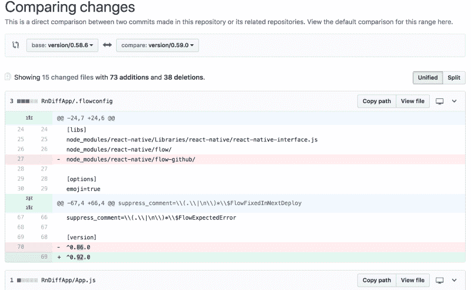

# 将 React 原生升级到最新版本的最简单方法

> 原文：<https://www.freecodecamp.org/news/easiest-way-to-upgrade-react-native-to-the-latest-version-daecd284cb18/>

作者:萨姆·约翰逊

# **将 React 原生升级到最新版本的最简单方法**

我读过许多人的恐怖故事，他们花了几天时间试图将 React-Native 升级到最新版本。这里提到的官方指导方针在大多数情况下并不起作用。

下面是我经过这么多试验和错误后发现的最简单的方法。

有一个很奇妙的工具叫做[***rn-diff-purge***](https://github.com/pvinis/rn-diff-purge)(请不要被名字迷惑，它不会做任何种类的 purge？).这个工具所做的是比较不同版本的 react-native，并从源代码层面向您展示不同之处。通过查看差异，您可以对构建进行相应的更改。这取决于您正在使用的库的数量，但是初始构建可能会立即成功或者显示一些错误。然后你可以一个接一个地解决这些错误。



到目前为止，我已经使用该工具升级 react-native 三次，完成升级需要 30 分钟到 1 小时。

以下是我每次决定升级时采取的步骤:

*   确保你的代码库状况良好，这意味着你已经解决了所有已知的问题。
*   确保您已经提交了所有更改:

```
git add . git commit -m “Last commit before upgrade to RN version 0.59.0” git push
```

*   将此内容复制并粘贴到您的浏览器:[https://github . com/pvinis/rn-diff-purge/compare/version/0 . 58 . 6..版本/0.59.0](https://github.com/pvinis/rn-diff-purge/compare/version/0.58.6..version/0.59.0)
*   根据显示的差异手动进行更改。
*   运行 npm i 以更新版本
*   通过 Android Studio 和 Xcode 构建和部署

如果没有显示错误，开始单元测试。

如果显示一些错误，这些错误很可能是由于您正在使用的库造成的。如果是这种情况，请在 github repo 中找到出错的库。

比如我把 React-Native 从 0.58.6 升级到 0.59.0 的时候，我用的一个库(“lottie-react-native”)在 Android Studio 下给了我一些编译错误。于是我去了他们的 github 网站，找到了[这一期](https://github.com/react-native-community/lottie-react-native/issues/453)。然后我按照上面提到的说明来解决这个问题。

您肯定会遇到许多问题，但是我到目前为止遇到的大多数问题(如果不是全部)都是由我使用的库引起的，而不是由 React-Native 本身引起的。

当您对所有的更改感到满意时，运行`git diff`来查看更改，然后运行`git add .` `git commit -m "Complete React Native Upgrade"` `git push`。

恭喜你！您已经准备好使用最新的 React-Native 版本提供的最新特性。

注意:有些问题没有即时的解决方案(这可能需要库本身的新版本)。但是好消息是所有的问题都会有某种解决方法。？