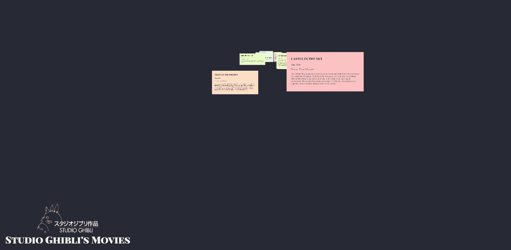
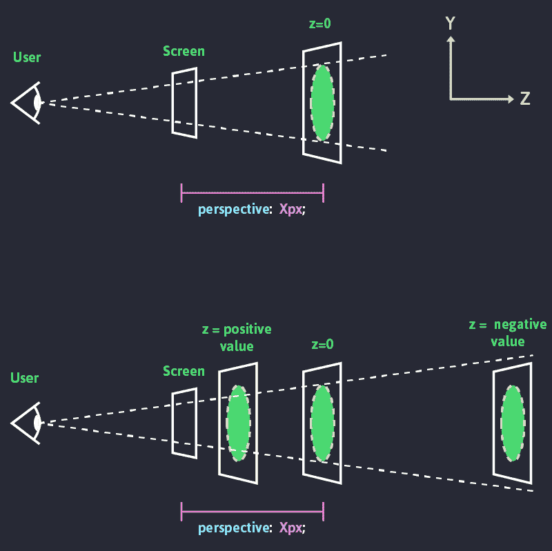
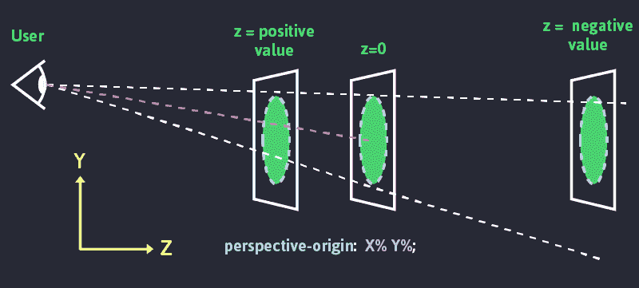

# 让我们玩玩 CSS 3D:如何在 z 轴上滚动

> 原文：<https://www.freecodecamp.org/news/css-3d-scrolling-on-the-z-axis-92503c3ecf3f/>

在本文中，我们将创建一个小的 3D 场景，用户可以在 z 轴上滚动。你可以在 [GitHub](https://github.com/vinceumo/CSS-3D-Scrolling-z-axis-demo/) 上找到这个教程的最终代码，如果你点击这个[链接](https://vinceumo.github.io/CSS-3D-Scrolling-z-axis-demo/)就可以看到演示。

本文假设您已经掌握了一些关于 CSS 和 JavaScript 的知识。我们将使用 CSS 自定义属性，因此如果您不熟悉，您可以阅读 [CSS 自定义属性—备忘单](https://vinceumo.github.io/devNotes/css/2019/02/20/css-customs-properties.html)。



### CSS 3D 简介

当谈到 CSS 3D 时，我们实际上是在谈论 CSS3 transform 3D。这个方法允许我们使用`transform` CSS 属性来设置 DOM 元素在 z 轴上的透视或旋转。

> 转换 CSS 属性允许你旋转、缩放、倾斜或平移一个元素。它修改 CSS 可视化格式模型的坐标空间。[变换—MDN](https://developer.mozilla.org/en-US/docs/Web/CSS/transform)

为了能够在 3D 空间中呈现我们的 Dom 元素，我们需要查看以下属性:

*   远景
*   透视原点
*   改变

### 远景

`perspective`是一个 CSS 属性，设置 z=0 和用户之间的距离。透视值越小，我们的场景失真就越大。(在下面的 codePen 示例中尝试更改`scenePerspective`的值)。

```
.container-scene { perspective: 100px; }
```

`perspective`的值是一个[长度单位](https://developer.mozilla.org/en-US/docs/Web/CSS/length)。



在下面的例子中，尝试将`scenePerspective`的值设置为 0 和 70。您可以注意到，如果我们的立方体的值设置为 0，那么它根本没有透视效果。如果该值设置为 70，您可以看到立方体透视非常强烈的扭曲。透视值越小，越深。

[https://codepen.io/vinceumo/embed/preview/jdJLge?height=300&slug-hash=jdJLge&default-tabs=css,result&host=https://codepen.io](https://codepen.io/vinceumo/embed/preview/jdJLge?height=300&slug-hash=jdJLge&default-tabs=css,result&host=https://codepen.io)

为了能够呈现 3D 空间，我们需要在子元素上指定`transform-style: preserve-3d;`。在上面的例子中，它设置为我们的`.cube`。默认情况下，元素被展平。

```
.container-scene {   
  perspective: 400px; 
}  
.container-scene .cube {
  transform-style: preserve-3d; 
}
```

### 透视原点

> *`perspective-origin`CSS 属性决定了查看者正在查看的位置。它被透视属性用作消失点。[MDN](https://developer.mozilla.org/en-US/docs/Web/CSS/perspective-origin)*

这个属性基本上允许我们移动 3D 场景的消失点。

```
.container-scene { 
  perspective: 400px; 
  perspective-origin: 50% 100%; /*X position value, Y position value*/ 
} 

.container-scene .cube { 
  transform-style: preserve-3d; 
}
```

对于 x 和 y，我们可以使用百分比来设置位置。但是我们也可以使用以下值:

x 位置:

*   `left` = 0%
*   `center` = 50%
*   `right` = 100%

y 位置

*   `top` = 0%
*   `center` = 50%
*   `bottom` = 50%



在下面的例子中，您可以更改`perspectiveOriginX`和`perspectiveOriginY`的值。

[https://codepen.io/vinceumo/embed/preview/wOwzBY?height=300&slug-hash=wOwzBY&default-tabs=css,result&host=https://codepen.io](https://codepen.io/vinceumo/embed/preview/wOwzBY?height=300&slug-hash=wOwzBY&default-tabs=css,result&host=https://codepen.io)

### 改变

我们之前已经提到过,`transform` CSS 属性允许我们在 3D 空间中设置元素。

Transform 提供了不同的功能来转换我们的 3D 元素:

*   rotateX(angle) — [MDN](https://developer.mozilla.org/en-US/docs/Web/CSS/transform-function/rotateX)
*   旋转(角度)——[MDN](https://developer.mozilla.org/en-US/docs/Web/CSS/transform-function/rotateY)
*   旋转(角度)——[MDN](https://developer.mozilla.org/en-US/docs/Web/CSS/transform-function/rotateZ)
*   translateZ(tz) — [MDN](https://developer.mozilla.org/en-US/docs/Web/CSS/transform-function/translateZ)
*   scaleZ(sz) — [MDN](https://developer.mozilla.org/en-US/docs/Web/CSS/transform-function/scaleZ)

正如我们在`perspective`部分的插图中看到的，`translateZ()`允许我们沿着 3D 空间的 z 轴定位一个元素。或者我们可以使用`translate3D(x, y, z)` CSS 函数。

在下面的例子中，您可以通过改变`cubeTranslateZ`和`cubeFacesTranslateZ`的值来调整`.cube`和`.face-`的 Z 轴位置。

[https://codepen.io/vinceumo/embed/preview/VRZKEB?height=300&slug-hash=VRZKEB&default-tabs=css,result&host=https://codepen.io](https://codepen.io/vinceumo/embed/preview/VRZKEB?height=300&slug-hash=VRZKEB&default-tabs=css,result&host=https://codepen.io)

现在我们已经很好地理解了 CSS 3D 是如何工作的，我们将创建一个 3D 场景，我们将能够在 z 轴上滚动。

### 作事前的现场（或情况）描述

我们将创建一个页面，列出吉卜力工作室的所有电影。每部电影都将是一张位于场景 z 轴上的卡片。请随意选择或[下载](https://codepen.io/vinceumo/share/zip/JzaXqN)下面的代码作为入门材料。我使用 [axios](https://github.com/axios/axios) 和[工作室吉卜力 API](https://ghibliapi.herokuapp.com/) 来填充这个页面。

[https://codepen.io/vinceumo/embed/preview/JzaXqN?height=300&slug-hash=JzaXqN&default-tabs=css,result&host=https://codepen.io](https://codepen.io/vinceumo/embed/preview/JzaXqN?height=300&slug-hash=JzaXqN&default-tabs=css,result&host=https://codepen.io)

如果您想跟随您自己的内容，我们将需要以下标记:

```
<div class="viewport">
  <div class="scene3D-container">
    <div class="scene3D">
      <div>Card1</div>
      <div>Card2</div>
      <!--Etc.-->
    </div>
  </div>
</div>
```

#### 式样

首先，我们将设置我们的 [CSS 自定义属性](https://vinceumo.github.io/devNotes/css/2019/02/20/css-customs-properties.html) (CSS 变量)。这些变量中的一些将使用 JS 进行转换。他们将帮助我们与场景互动。

```
:root {
 --scenePerspective: 1;
 --scenePerspectiveOriginX: 50;
 --scenePerspectiveOriginY: 30;
 --itemZ: 2; // Gap between each cards
 --cameraSpeed: 150; // Where 1 is the fastest, this var is a multiplying factor of --scenePerspective and --filmZ
 --cameraZ: 0; // Initial camera position 
 --viewportHeight: 0; // Viewport height will allow us to set the depth of our scene 
}
```

`.viewport`将允许我们设置窗口的高度。我们稍后将使用它来设置场景的深度，并使用滚动条在 z 轴上导航。

```
.viewport { 
  height: calc(var(--viewportHeight) * 1px);
}
```

`.scene3D-container`设置场景透视和透视原点。它的位置是固定的，所以它总是停留在屏幕上。我们也要设置透视原点。

```
.viewport .scene3D-container {
 position: fixed;
 top: 0;
 left: 0;
 width: 100%;
 height: 100%;
 perspective: calc(var(--scenePerspective) * var(--cameraSpeed) * 1px);
 perspective-origin: calc(var(--scenePerspectiveOriginX) * 1%) calc( var(--scenePerspectiveOriginY) * 1% );
 will-change: perspective-origin;
 transform: translate3d( 0, 0, 0 ); //Allows Hardware-Accelerated CSS, so transitions are smoother 
}
```

设置场景在 z 轴上的位置，这有点像在 z 轴上移动摄像机。但实际上我们是在移动场景，而摄像机(视口)是固定的。在本文的其余部分，我们将使用相机比较。`.scene3D`获取视窗的全高和全宽。

```
.viewport .scene3D-container .scene3D { 
 position: absolute; top: 0;
 height: 100vh;
 width: 100%;
 transform-style: preserve-3d;
 transform: translateZ(calc(var(--cameraZ) * 1px));
 will-change: transform; 
}
```

最后但同样重要的是，我们要在场景中放置我们的卡片。所有项目都是绝对位置。奇数项放在左边，偶数项放在右边。

我们使用 SCSS 程序翻译每一项。在 **X** 和 **Y** 轴上，我们随机地将它们在 X 轴上平移-25%到 25%，在 Y 轴上平移-50%到 50%。我们使用了一个`@for`循环，这样每个项目都可以在 **z 轴上平移**乘以它们的索引。

```
.viewport .scene3D-container .scene3D {
 > div { 
  position: absolute; 
  display: block; 
  width: 100%; 
  top: 40%; 
  @media only screen and (min-width: 600px) { 
    width: 45%; 
  } 
  &:nth-child(2n) { left: 0; } 
  &:nth-child(2n + 1) { right: 0; } 
  @for $i from 0 through 25 { 
   &:nth-child(#{$i}) { 
    transform: translate3D( random(50) - 25 * 1%, random(100) - 50 * 1%, calc(var(--itemZ) * var(--cameraSpeed) * #{$i} * -1px) ); 
   } 
  } 
 } 
}
```

CSS 现在完成了，我们有了一个 3D 场景。在本文接下来的部分，我们将编写一些 JavaScript 来允许我们在场景中导航。

为了能够滚动，我们首先需要设置`--viewportHeight`的值，它模拟场景的深度。

[https://codepen.io/vinceumo/embed/preview/WmgxBG?height=300&slug-hash=WmgxBG&default-tabs=css,result&host=https://codepen.io](https://codepen.io/vinceumo/embed/preview/WmgxBG?height=300&slug-hash=WmgxBG&default-tabs=css,result&host=https://codepen.io)

场景的深度等于下列各项的相加:

*   用户窗口的高度
*   `.scene3D-container`视角= & g `t; var(--scenePerspective) * var(--cameraSpe` ed)
*   我们最后一个项目转换后的 z 值=&g `t; var(--itemZ) * var(--cameraSpeed) * items.len` gth

让我们创建一个`setSceneHeight()`函数，它将在加载时更新`--viewportHeight`的值。

```
document.addEventListener("DOMContentLoaded", function() {
  setSceneHeight();
});

function setSceneHeight() {
  const numberOfItems = films.length; // Or number of items you have in `.scene3D`
  const itemZ = parseFloat(
    getComputedStyle(document.documentElement).getPropertyValue("--itemZ")
  );
  const scenePerspective = parseFloat(
    getComputedStyle(document.documentElement).getPropertyValue(
      "--scenePerspective"
    )
  );
  const cameraSpeed = parseFloat(
    getComputedStyle(document.documentElement).getPropertyValue("--cameraSpeed")
  );

  const height =
    window.innerHeight +
    scenePerspective * cameraSpeed +
    itemZ * cameraSpeed * numberOfItems;

  // Update --viewportHeight value
  document.documentElement.style.setProperty("--viewportHeight", height);
}
```

我们的页面现在有了滚动条，但我们仍然无法滚动。我们需要添加一个事件监听器来监听用户滚动。滚动事件将调用一个`moveCamera()`函数。它会用[window . page yo offset](https://developer.mozilla.org/en-US/docs/Web/API/Window/pageYOffset)的值更新`--cameraZ`的值。

```
document.addEventListener("DOMContentLoaded", function() {
  window.addEventListener("scroll", moveCamera);
  setSceneHeight();
});

function moveCamera() {
  document.documentElement.style.setProperty("--cameraZ", window.pageYOffset);
}

function setSceneHeight() {
  // ...
}
```

[https://codepen.io/vinceumo/embed/preview/pYxpLW?height=300&slug-hash=pYxpLW&default-tabs=css,result&host=https://codepen.io](https://codepen.io/vinceumo/embed/preview/pYxpLW?height=300&slug-hash=pYxpLW&default-tabs=css,result&host=https://codepen.io)

#### 移动摄像机角度

最后，让我们的场景更有活力一点。在[鼠标移动事件](https://developer.mozilla.org/en-US/docs/Web/API/Element/mousemove_event)中，我们将改变`scenePerspectiveOriginX`和`scenePerspectiveOriginY`的值。这样会给人一种相机在动的错觉。这些项目将直接留在场景中。如果你想给一个更真实的相机旋转运动，你可以在场景中应用 [rotate3d()](https://developer.mozilla.org/en-US/docs/Web/CSS/transform-function/rotate3d) 。

首先，我们将把这两个变量的初始值存储在一个`perspectiveOrigin`对象中。我们将设置一个`perspectiveOrigin.maxGap`值，它将限制变量的最大值和最小值。例如，如果`scenePerspectiveOriginY`等于 50%。在 mousemove 上，新值将介于 40%和 60%之间。

```
const perspectiveOrigin = {
  x: parseFloat(
    getComputedStyle(document.documentElement).getPropertyValue(
      "--scenePerspectiveOriginX"
    )
  ),
  y: parseFloat(
    getComputedStyle(document.documentElement).getPropertyValue(
      "--scenePerspectiveOriginY"
    )
  ),
  maxGap: 10
};
```

如果用户的光标在屏幕的中心，我们将把`--scenePerspectiveOriginX`和`--scenePerspectiveOriginX`的值设置为初始值。光标离中心越远，这些值增加/减少得越多。如果用户移动到左上角，值将增加，在右下角，值将减少。

`moveCameraAngle()`函数将更新这些值:

*   `xGap`和`yGap`返回用户在 X 和 Y 轴上相对于窗口中心的鼠标位置百分比。
*   `newPerspectiveOriginX`和`newPerspectiveOriginY`返回新的透视原点。

```
document.addEventListener("DOMContentLoaded", function() {
  window.addEventListener("scroll", moveCamera);
  window.addEventListener("mousemove", moveCameraAngle);
  setSceneHeight();
});

function moveCameraAngle(event) {
  const xGap =
    (((event.clientX - window.innerWidth / 2) * 100) /
      (window.innerWidth / 2)) *
    -1;
  const yGap =
    (((event.clientY - window.innerHeight / 2) * 100) /
      (window.innerHeight / 2)) *
    -1;
  const newPerspectiveOriginX =
    perspectiveOrigin.x + (xGap * perspectiveOrigin.maxGap) / 100;
  const newPerspectiveOriginY =
    perspectiveOrigin.y + (yGap * perspectiveOrigin.maxGap) / 100;

  document.documentElement.style.setProperty(
    "--scenePerspectiveOriginX",
    newPerspectiveOriginX
  );
  document.documentElement.style.setProperty(
    "--scenePerspectiveOriginY",
    newPerspectiveOriginY
  );
}
```

[https://codepen.io/vinceumo/embed/preview/NJEwwo?height=300&slug-hash=NJEwwo&default-tabs=js,result&host=https://codepen.io](https://codepen.io/vinceumo/embed/preview/NJEwwo?height=300&slug-hash=NJEwwo&default-tabs=js,result&host=https://codepen.io)

我们的场景现在结束了。我希望你喜欢这篇文章。

### 资源

*   [透视—共降线](https://tympanus.net/codrops/css_reference/perspective/)
*   [透视— MDN](https://developer.mozilla.org/en-US/docs/Web/CSS/perspective)
*   [变换样式—共滴](https://tympanus.net/codrops/css_reference/transform-style/)
*   [变换风格— MDN](https://developer.mozilla.org/en-US/docs/Web/CSS/transform-style)
*   [透视-原点-MDN](https://developer.mozilla.org/en-US/docs/Web/CSS/perspective-origin)
*   [使用 CSS 3D 时需要注意的事项— CSS-tricks](https://css-tricks.com/things-watch-working-css-3d/)

在 [vinceumo.github.io](https://vinceumo.github.io/devNotes/css/2019/03/21/css-3d-scrolling-on-the-z-axis.html) 阅读更多我的博客文章。

*   [在 twitter 上关注我](https://twitter.com/vince_umo)
*   [在 Github 上关注我](https://github.com/vinceumo)
*   [跟我一起去](https://dev.to/vinceumo)