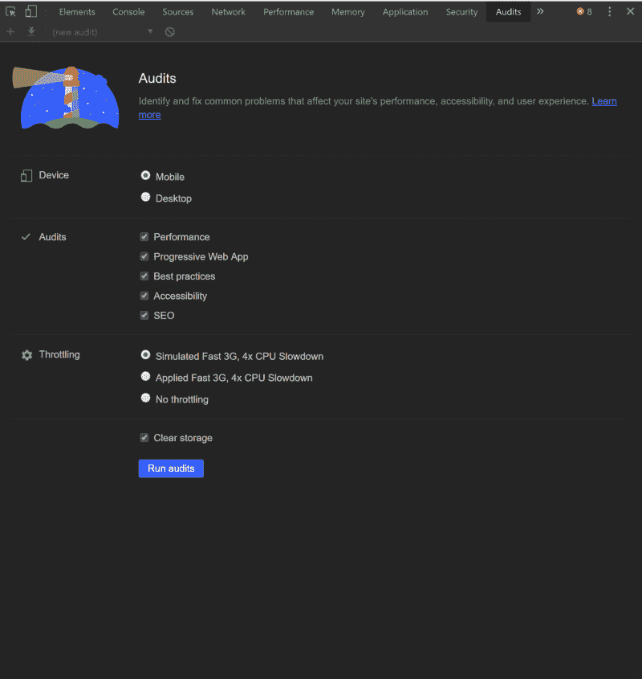

# 使用 GitHub Pages 和 Lighthouse 增强您的开发人员组合

> 原文：<https://www.freecodecamp.org/news/boost-your-dev-portfolio-with-github-pages-and-lighthouse/>

对于试图进入软件开发的人来说，无论你去哪里找都没关系——LinkedIn、职业建议板、youtube 教程——建议总是一样的:你需要一个投资组合。freeCodeCamp 知道这个建议，他们强制创建一个来完成他们的“响应式网页设计”认证。

文件夹应该是一个活的文档。你完成一个项目，你把那个坏男孩放到你的投资组合里，向全世界炫耀。你不断地添加，展示你的个人成长轨迹。你可以把它交给潜在的招聘人员和招聘经理，为你的简历增加一些内容。

在获得该认证的五个项目中，我将大部分工作放入了我的投资组合。如果这将是我的数码第一印象，我想确保这是我能做出的最好的印象。

完成 freeCodeCamp 上的项目的实际方法是使用 codepen.io。免费版本允许您在 HTML、CSS 和 JavaScript 窗格中编码，并在窗口中键入时看到您的更改。您可以在全视图中打开页面，这消除了 HTML、CSS 和 JavaScript 窗格，但在顶部保留了一个黑色横幅。这个网址是一个散列，类似于[https://codepen.io/cam-barts/full/ZPWpqo](https://codepen.io/cam-barts/full/ZPWpqo)，不容易记住，没有给出任何关于网站内容的指示，在我看来，不会在简历上引起任何波澜。此外，除非你用 codepen 支付会员费，否则你不能更改它。

大约在我完成我的项目的时候，我发现了两项有助于我的作品脱颖而出的技术:Github Pages 和 Google Lighthouse。

Github Pages 允许你直接从 Github 库托管一个网站。它提供了一个非常漂亮的 github.io 网址，这让我很想在简历上写点什么。这将允许我完全控制我的用户导航到网站时会看到什么(这么长，黑色横幅)，我也不必处理自我托管或支付其他托管服务。

我在弗朗西丝·科罗内尔主持的 [CodeNewbie 播客中听说了](https://www.codenewbie.org/podcast/what-are-progressive-web-apps)[谷歌灯塔](https://developers.google.com/web/tools/lighthouse/)。它直接从 Chrome Dev Tools 审计你的网站的五个方面:性能、渐进式 Web 应用、可访问性、最佳实践和 SEO。SEO，或者说搜索引擎优化，是帮助你的网站浮到像 Google 这样的搜索引擎的顶端，帮助你被找到。此外，既然我要在 Pages 上托管我的站点，我想对我的站点的性能负责，为了有效地做到这一点，我至少要有一个基准。

我写这篇文章的目的是帮助你免费创建一个非常快速、专业的投资组合网站。我想让它成为你在 LinkedIn 上自豪地发布的东西，并贴在你简历的顶部，我想利用 GitHub Pages 和 Google Lighthouse 来做到这一点。

为了更进一步，我做了一些假设。首先是你有一个 Github 账户。如果你还没有，创建一个很容易。第二是你对 git 有基本的了解。如果你是新手，有很多关于入门的优秀的[文章](https://medium.freecodecamp.org/what-is-git-and-how-to-use-it-c341b049ae61)。本文假设您已经在 codepen 上完成了作品集。最后，你应该安装谷歌浏览器。

本文跟随我的个人作品集。你可以在这里找到笔[，在这里](https://codepen.io/cam-barts/pen/ZPWpqo)找到代码[，最终产品在](https://github.com/cam-barts/cam-barts.github.io) [cam-barts.github.io](https://cam-barts.github.io/) 。

### 入门指南

设置 Github Pages 站点非常简单。TL；DR 版本是:

*   按照命名约定[GitHub 用户名].github.io 创建存储库
*   本地克隆
*   在存储库中创建*index.html*、 *style.css* 、 *script.js* 文件
*   向这些文件添加代码
*   提交并推送到 GitHub
*   利润！

你创建一个存储库，它的标题遵循惯例[你的 Github 用户名].github.io。这里是我的:cam-barts.github.io。当你导航到那个站点时，任何被推送到那个存储库的代码都会显示出来。

那么，当您在本地克隆了存储库之后，您到底在其中放入了什么呢？

你应该从三个文件开始，一个*index.html*文件，一个 *style.css* 文件，一个 *script.js* 文件。在您喜欢的任何编辑器中(我使用的是 [Atom](https://atom.io/) ，您应该从您的*index.html*中的以下代码片段开始:

如果您只使用过 codepen.io，那么这里发生的许多事情可能是您不熟悉的。

html 标签中的 *dir* 属性表示文档应该读为**L**eft**T**o**R**right。这只是确保当你的页面出现时，所有的元素都是左对齐的，这是说英语的人的阅读方式。

标题中的 meta 标签表示关于页面的元数据，这有助于像 Google 这样的搜索引擎索引你的站点。

此时，您应该继续填写 meta 标签和 title 标签。请注意，*关键字* meta 标签的内容应该用逗号分隔，并且应该包含您希望人们在 Google 中使用来查找您的作品集的术语。这是我的样子:

下一步是将公事包笔的 HTML 部分复制到代码片段的 body 部分。一旦完成，如果你在你的笔设置中链接到任何外部 CSS 或 JS，比如链接到 [Bootstrap](https://getbootstrap.com/) 或 [Font Awesome](https://fontawesome.com/?from=io) ，你需要在你的【index.html】中链接那些*。*

*为 css 创建更多链接标签，为 JavaScript 创建更多脚本标签，并将设置中的链接分别添加到 *href* 和 *src* 属性中。为了确保您的样式和脚本显示出来，请确保将它们放在代码片段中现有的 link 和 script 标记之前。例如，链接到 Bootstrap 和 JQuery 看起来像这样:*

*接下来，你需要把你自己的 CSS 添加到你的 *style.css* 中，如果你有 JavaScript，把它添加到你的 *script.js* 中。*

*在你完成这些之后，你就可以提交你所有的工作并把它推给 Github 了。完成后，您可以立即导航至[您的 Github 用户名].github.io 并查看您的网站！*

### *优化您的投资组合网站*

*恭喜你出版了作品集！*

*接下来的步骤包括优化您的网站。为此，我们将使用[谷歌灯塔](https://developers.google.com/web/tools/lighthouse/)。最好在私人浏览器窗口中进行，这样任何缓存或 Chrome 扩展都不会影响结果。当你导航到你的站点时，打开 Chrome 开发者工具(Ctrl + Shift+ i)并点击*审计*标签。*

*

Google Lighthouse Pane* 

*渐进式 Web 应用程序超出了本教程的范围，但是运行所有的审计并没有什么坏处。当您运行它们时，您应该会看到如下所示的页面:*

**

*这些报告最好的一点是，它给了你提高分数的“机会”。*

*在性能部分，它告诉你服务下一代文件格式，如 WebP 与传统。PNG 图像，并建议延迟加载图像。*

*在 SEO 部分，它建议 SEO 改进，比如添加一个描述元标签和使用易读的字体大小。它不仅给出了这些建议，还链接到了一些文章，这些文章提供了一些实际例子，说明了在代码中需要做哪些更改来优化这些方面。*

*对我来说，只花了一个小时，我的网站就在性能、可访问性、最佳实践和 SEO 方面获得了 90 多分。你可以在这里看到我所做的所有改变。*

### *更进一步*

*网站的下一步取决于你。你可以把它链接到[谷歌分析](https://analytics.google.com/analytics/web/)来看看你的投资组合有多少访客。您可以为您的奖项添加部分，以显示您获得的 freeCodeCamp 认证。你的站点的进化完全掌握在你的手中！下面是您的作品集的评论链接。*