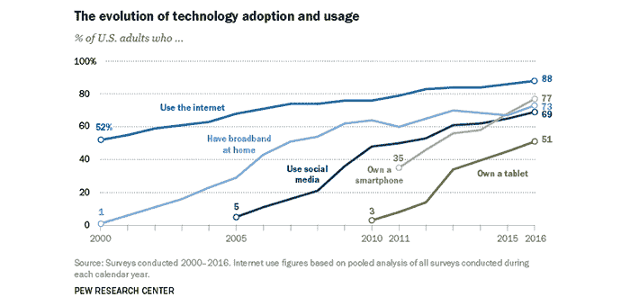
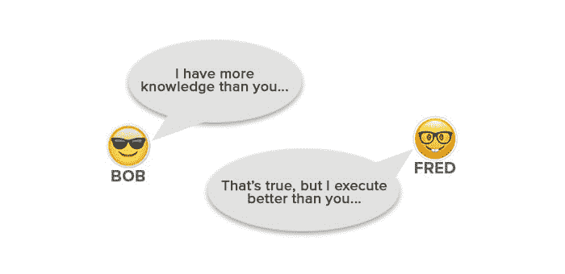
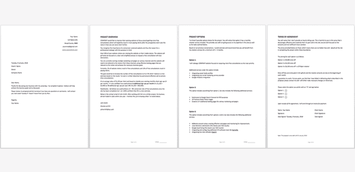

# 如何以正确的方式为网站收费

> 原文：<https://www.freecodecamp.org/news/how-to-charge-for-a-website-the-right-way-e3a4bbbadbcf/>

自由开发者经常问我这个问题:

“这个网站我该收多少钱？”

在我开始回答之前，让我提一下这是一个我正在报道的[有争议的话题](https://css-tricks.com/how-much-should-you-charge-for-a-website/)，但我的目标是让这篇文章对所有层次的人都有价值和可理解。

我的目标是介绍或改变你对现有网站开发者和设计者的定价价值的看法。

如果你用更少的工作赚更多的钱，这让你有更多的自由和家人在一起，去度假，学习更多的东西。

我不直接回答“**一个网站收费多少？**”在这篇文章的前半部分，但是一定要阅读我提到的所有内容。

让我们从一些实际例子开始:

**例 1:**

你想买一个皮沙发。

一个皮沙发要多少钱？

**例 2:**

你想买车。

一辆车多少钱？

**例 3:**

你想买房子。

一栋房子值多少钱？

…你能看出我的意思吗？

这些例子之所以没有意义，是因为问题太宽泛了。

在知道要花多少钱之前，你首先需要所有的信息。

沙发示例:

你想要合成革，顶级粒面革鞋面，还是全粒面真皮？什么颜色？

汽车示例:

你想要轿车还是越野车？四座还是双座？新的还是二手的？

房屋示例:

你想要几个房间？你想住在哪个地区？

太多的开发者很快就根据“现行价格”对一个 5 页的网站说$x 或者对一个 20 页的网站说$x。

这种商业模式让我很沮丧。

这让我很沮丧，因为开发者没有被告知如何给他们的服务定价，如何让 T2 得到他们的报酬，如何让 T4 得到他们的价值。

你有可能让某人的生意变得更好(如果你做得正确的话)。但是，你是否乐意仅仅得到一点点报酬，然后如此努力地工作，仅仅是为了获得一个低于平均水平的收入，然后在下个月重新开始？

如果那是你或者如果那是你的想法，我希望我能说服你对此有不同的想法。

当我第一次开始考虑网站定价的实际问题时，我认为网站的成本是我愿意接受的，也是客户愿意支付的。

它需要比其他任何人都便宜，这样客户才会继续使用它——至少我是这么认为的。

让我们快速转移到其他事情上:

我的预测是，随着技术和 AI(人工智能)的进步，开发者创建网站的需求会减少。随着越来越多的“拖放”软件的出现，企业自己创建网站变得越来越容易。

如果它导致了“*说话并创建*”软件，企业主可以对着他们版本的“Siri”说话，并说类似这样的话，我不会感到惊讶:

> *“Siri，根据获得最高投资回报的最佳转化策略，为我创建一个奢侈手表电子商务网站的 3 个选择。从 Watches 文件夹中提取数据，并设置支付门户，以支持 PayPal 支付。使用 WatchBrand.com 网址，并创建社交媒体档案。”*

如果这成为现实，“商品市场”(即以低于 1000 美元的价格创建网站的网络开发者)将变得越来越多余，那些将自己定位为专家的人将永远拥有他们的客户份额。

其实用[这个 AI 软件](https://thegrid.io/)就已经在这里了。

但你总会有你的客户，对吧？

印度是一个经济增长的国家，人口也是如此。

你知道有很多博士生很难找到工作吗？

如果他们找到了工作，通常工资很低或者在一些遥远的城市。

我知道这可能是有争议的，因为有许多变量要考虑，但我试图解释的总的观点有其真实性。

为什么会这样呢？

博士生找工作很吃力？

问题是这样的:

**需求与供给**。

就是这样。不多不少。

博士学者供过于求，工作岗位供不应求。

我的观点是:

Web 开发就像一个博士。随着越来越多的企业接触到互联网，希望成为开发人员的人的趋势每年都在显著增长。

请看下图:

*(注意令人难以置信的增长和互联网使用率从 52% — 88%)*

**从这些数据中可以得出两点:**

*   没有上线的企业会意识到他们需要上线。
*   那些在网上，但不把它当回事的商家，会开始更认真地对待它。

**结论:**

企业将需要自由网络开发者帮助他们创建或改进网站。

**结论的结论:**

成为企业寻求解决方案的利基市场中的关键人物。

附注:问题不在于你是否成为了一名开发人员，而在于你是否在这方面取得了成功。阅读[这篇文章](https://www.sitepoint.com/21-steps-to-becoming-a-successful-web-developer/)了解更多信息。

我想让你明白的最后一点是，少干活多挣钱的唯一方法是把自己定位为专家。

如果你是一件商品，你就不能这样做。

### 大多数开发者对网站收费过低

你知道有很多人对网站收取 10，000-50，000+美元的费用吗？

你有没有想过他们如何以这样的价格达成交易？

我有，这是我注意到的:

*   他们不把自己定位为商品，而是专家
*   他们写获胜的提议
*   他们捆绑他们的服务
*   他们有效地沟通
*   他们为项目增加价值并超额交付
*   他们对额外的服务收取额外的费用，尽管其他人可以做得更便宜

下一个要考虑的重要事情是思想的转变。

你卖的是**不是网站** …

你销售的**解决方案**为企业赢得了更多客户和/或增加了利润。

我不在乎是咖啡店、咨询公司、电子商务商店还是博客。最终目标是创造一些东西，让企业获得更多的客户，并增加利润。

以这种方式销售你的服务会带来自信。如果你总是被困在创建低于 1000 美元的网站上，你要么需要处于职业生涯的开始阶段，要么你必须提高你的技能。

而且我指的(不一定)是编程技能…

大多数人认为，仅凭 HTML 和 CSS 知识，你无法获得体面的收入。这是**不真实的**。我知道许多开发人员仅仅凭借这些技能就过得很好，我也一样。

那是什么？

为什么懂的多的人能比只懂基础的人赚的少？

是他们生活在哪个国家？*(否)*

是他们的学历还是资格？*(否)*

是因为他们爱吃咖喱鸡吗？*(不确定？)*

你知道这个问题的答案吗？

我想说的是，在一个领域知识较少的人成功的原因是因为他们在其他领域拥有更好的知识和技能。

因此，懂 Java、Ruby 和其他 7 种编程语言的“自由职业者 A”肯定应该比只懂 HTML、CSS 和其他基本后端语言的“自由职业者 B”挣得多——对吗？

同样，这里缺少的是不能看到所有事情的完整背景。

“自由职业者 B”可能比“自由职业者 A”有更好的沟通技巧、更好的提议和更好的商业经验，因此，可能挣得更多。

我认为这些技能甚至可能比关注“下一个要学习的重要编程语言是什么”更重要。

拥有编程知识很重要，因为这是一项必要的技能，但它不应该是主要的焦点。

拥有帮助你成为更全面的受欢迎的开发者的知识和技能也是至关重要的——比如上面提到的几点。

### “你是做什么工作的？”

当有人问你是做什么的——无论你是全职开发人员还是兼职开发人员，不要说一些常见的事情，比如:

> “我创建网站。”

记住，这是每个人，包括你 12 岁的表弟在编码一周后说的话。

这个**把你限制在商品市场**，它**把你限制在它们的价格**。

取决于谁问我是做什么的，我的回答一般是:

“我做业务转型”或“我创建有效的网站”或“我帮助企业获得更多在线销售。”

这是一个大胆(有点过于自信)的主张，但它是讨论的一个很好的起点。

这样做更有效的原因是因为通常会出现两个主要问题:

> “这很有意思，你说的业务转型是什么意思？”

或者

> “你做什么工作？”

这比:

> “哦，太好了。如果我需要一个网站，我会告诉你的。”

让我们用另一个实际例子来说明这一点:

**场景 1:**

人甲:“那么，你是做什么工作的？”

人 B:“我是营养师。”

**情景二:**

人甲:“那么，你是做什么工作的？”

人 B:“我通过健康食品的惊人益处，帮助忙碌的职业女性吃饭、生活和感觉更健康。”

**外卖:**

场景 1 =商品/无聊

场景 2 =独特/有趣/我想了解更多/展示您的目标市场/将您定位为专家

下次有人问你是做什么工作的，用不同的回答来回应你通常的回答，我相信对话会有所不同。

### 发送建议书/报价

在向潜在客户发送报价时，这通常是“成功或失败”的问题。

重要的是遵循基本原则，并以专业的方式展示。

在写提案时，我会第一个说，与现有客户或直接来找你的客户合作，比你接触新客户要容易得多。

你将与现有客户进行完全不同的沟通，如果是新客户，但我主要说的是新客户。

我注意到大多数开发者在他们的提议中做的一件重要的事情是他们只给出一个选择。

总是给出三个选项。

*您可以在这里下载一份免费的提案模板[。](https://www.freecodecamp.org/news/free-web-design-proposal-template/)*

### 客户并不总是选择更便宜的方案

W.庞德斯通的书《无价之宝》讲述了一个有趣的销售啤酒的实验。

一组人被提供了两种啤酒:2.5 美元的优质啤酒和 1.8 美元的便宜啤酒。

几乎 80%的人选择了优质啤酒。

在这次测试之后，除了前两种啤酒之外，第三种超级廉价啤酒作为 1.60 美元的选项被添加进来。现在，80%的人买了 1.8 美元的啤酒，其余的人买了 2.5 美元的啤酒。没有人买最便宜的选项。

在第三次测试中，他们拿走了 1.6 美元的啤酒，换上了更贵的 3.4 美元的啤酒。大多数人选择了 2.50 美元的啤酒，少数人选择了 1.80 美元的啤酒，大约 10%的人选择了最贵的 3.40 美元的啤酒。

**外卖:远离最便宜的选择**。

客户喜欢对项目问更多问题的开发人员。

在必要的地方添加建议，不要害怕推荐一些与他们的想法完全不同的东西。

欲了解更多关于定价的信息(价值与小时)，[阅读此](https://studywebdevelopment.com/hourly-billing-vs-value-pricing.html)。

这里也有一些关于定价的好文章:

[不要最便宜的，要最好的](https://www.entrepreneur.com/article/242322)

[你绝对必须阅读的 5 项定价心理学研究](https://blog.kissmetrics.com/5-psychological-studies/)

有一个常见的误解，这取决于你使用的 CMS 或编程语言，它应该与客户支付的金额直接相关。

我的意思是，许多程序员认为，因为他们在 WordPress 上使用 50 美元的网站主题，他们需要收取少量费用，因为网站已经完成了很多。

或者他们认为，如果他们从头开始编写代码，它应该更有价值。

这种想法错误的两个主要原因:

*   你不是在经营一个非政府组织或非营利组织。你是一家企业，企业需要盈利。
*   客户为你的经验和技能买单，你不是在卖现成的商品，而是在卖一个帮助他们发展业务的解决方案。

### 瞄准小众，说真的…

我接下来要解释的非常重要。如果你能注意到这一部分，这将是值得你花时间阅读这篇文章。

你希望客户来找你吗？

你想少干活多挣钱吗？

如果你对以上两个问题的回答是肯定的，你需要做以下三件事:

*   找到一个[网页设计利基](https://studywebdevelopment.com/niche.html)
*   将自己定位为该领域的专家
*   只在那个领域为客户提供服务

实际例子:

*   我选择了利基:脊医
*   我创建了一个网站，所有关于脊医，市场，他们可以做些什么来提高销售，等等。
*   我提供网站开发服务，搜索引擎优化，广告词，和其他数字营销技巧，只针对脊椎指压治疗师。

现在，如果你必须从你的业务中给脊椎指压治疗公司一个建议，“ChiroWebUSA”(随机商业名称)与只为每个利基市场做网站的人，你认为会发生什么？

*   你会立刻被视为这个行业的专业人士。
*   与那些只为每个人做网站的人相比，你会达成更多的交易。
*   你可以收取溢价。
*   因为你很了解这个行业(在研究之后),所以与其他开发者相比，你能够更快地创建网站，更快更有效地提供服务。

我知道我把它简单化了，但我不是在说废话。这种策略比只为每个利基市场做网站更有效。

我提到这个的原因是因为这个策略直接影响你的项目收费多少，你获得客户的转换率和项目工作时间。

就在这里停下来，想几秒钟…

### 网站收费多少——正确的方式

你需要做的主要事情是**计算出这个网站对于商业**来说*值*多少钱。

示例:

一家公司销售 3D 打印机，他们想要一个网站。

这是我遵循的系统:

1.  找出企业是否有现有的网站
2.  找出他们的竞争对手正在做而他们没有做的事情
3.  了解 3D 打印机的平均价格
4.  了解企业每月销售多少台打印机

有了这些信息，我就能弄清楚我是否真的能提高这项业务的销售额，我也就知道这个项目到底要收多少钱了。

因此，如果公司平均每月销售 10 台 3D 打印机，平均价格为 2，000 美元(每月销售 20，000 美元)，在计算出我可能每月增加 30%的销售额后，这就等于每月增加三笔销售额(或 6，000 美元)。

然后，我向潜在客户提到这一点，并说即使我们每个月只增加 2 笔销售，仅通过我将要做的改变和改进，每年就能增加 48，000 美元。

因此，一次性为网站花费 8000 美元，有可能在一年内增加近 50000 美元的销售额，这是显而易见的…

如果这种方法对你来说是新的，它可能听起来有点混乱，或者你可能有很多实际问题，所以我将尝试回答其中的一些:

> 你怎么能如此肯定生意会成功？

老实说，这并不能保证…但是在分析了业务并遵循了上面的步骤之后，我可以很好地了解我是否可以增加业务的销售额。如果我对此有信心，我会继续这个提议。否则，我礼貌地拒绝，并说我不能做太多的改进。

> 你用这种方法有多成功？

平均 70%。通过使用这种方法，我今年失去了一些不错的项目，然而，那些成功的项目远远超过了失去的项目。这就是我，你可能会更好或更差，但你做得越多，你就会越进步。

> 你怎么能这样欺骗商家？

非常苛刻的问题:)但这并不是撕毁业务…我只是得到了公平的工作投入和潜在的输出是一个很好的财务回报。

> 如果商家没有告诉你他们的销售数字，该怎么办？

对于大中型企业，他们不告诉我从来没有问题，因为我解释说我不只是在做一个网站，我想提高销售额，为了让我知道我需要知道当前的销售额(我愿意签署一份保密表格)。对于大公司，我能理解他们为什么不合作，我个人不与任何公司合作，也不想合作。

> 如果我只会做网站呢？

你仍然可以做得很好，只要创建网站，而不是任何数字营销的事情。我只是推荐它，因为我发现用这种知识更容易得到客户，而且我在“现实世界”中多次看到它的工作。

如果你有兴趣成为一名自由职业者，加入 1000 多人的行列，看看[我的自由职业包](https://studywebdevelopment.com/freelancing.html)。

感谢您的阅读，希望这篇文章对您有所帮助:)

如果你有任何问题，请在评论中告诉我。

如果你对更多自由职业相关的文章感兴趣，可以看看我的博客[**【StudyWebDevelopment.com】**](https://studywebdevelopment.com/)或者关注我的 [**推特**](https://twitter.com/study_web_dev) :)

*类似文章发表在*[https://study web development . com/how-to-charge-for-a-website . html](https://studywebdevelopment.com/how-to-charge-for-a-website.html)