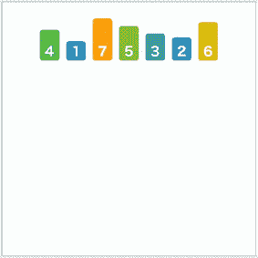
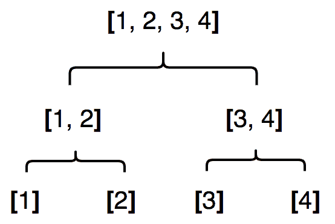
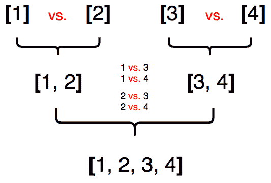
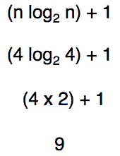
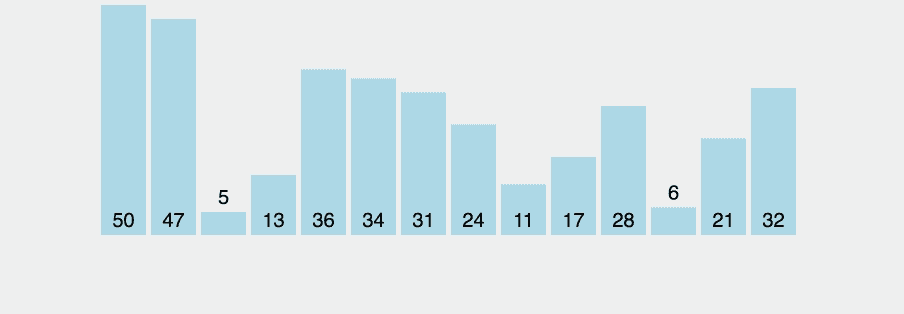
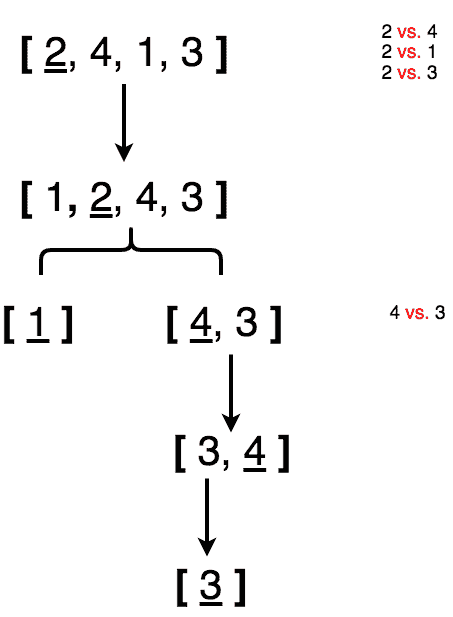
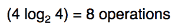

# 高级排序算法介绍:JS 中的合并、快速和基数排序

> 原文：<https://www.freecodecamp.org/news/an-intro-to-advanced-sorting-algorithms-merge-quick-radix-sort-in-javascript-b65842194597/>

作者:梁荣立

Illustration by [Marc Lariviere](https://giphy.com/marclariviere) ****on Giphy****

**在我之前的文章“简单算法的复杂性”[JavaScript](https://medium.freecodecamp.org/the-complexity-of-simple-algorithms-and-data-structures-in-javascript-11e25b29de1e?source=friends_link&sk=994bc3da2b4cc5b78da06cf161dad6a7)中的数据结构中，我们讨论了简单的排序算法(冒泡、选择&插入排序)。在这里，我经历了**合并**、**快速** & **基数排序、**每一种都在**平均** **时间复杂度**上有显著提升，小于 **O(n )** 。**

**让我们更详细地看一下每一项。**

### **合并**

**一个**合并排序**将一个列表分成它的单个项目。然后，当它们被合并到一个不断增长的有序列表中时，它对它们进行排序。**

**

[source](https://codepumpkin.com/wp-content/uploads/2017/10/MergeSort_Avg_case.gif)** 

**实际上，这意味着在将每个元素放入一个更大的数组(先放入较小的值)之前，要不断地将一个数组分割成单个元素的数组。将 2 个较小数组中的元素推入 1 个较大数组的每个阶段都涉及到确定哪个数组中的哪个元素具有较小的值。**

**归并排序的复杂度为 **O((n log n) + 1)** 。记住大 O 符号([简单算法的复杂性&JS](https://medium.freecodecamp.org/the-complexity-of-simple-algorithms-and-data-structures-in-javascript-11e25b29de1e?source=friends_link&sk=994bc3da2b4cc5b78da06cf161dad6a7)中的数据结构)是相对于**元素数(** n **)** 的**运算数(** O **)** 的计数。所以一个 4 元素的列表需要 3 次拆分。**注意**，为简化示例，列表已经排序。**

**

Splitting a 4 element list.** 

**合并 4 个数组需要 6 次比较。**

**

Once split, as it is being merged, the 4 elements requires a total of 6 comparisons.** 

**所以，数学计算如下:**

**

9 operations (**3 splits & 6 comparisons**) are required to perform a merge sort on a 4 element array** 

**为简单起见，归并排序的复杂度为 **O(n log n)** 。 **+1** 相对于 **n log n** 的值来说是不重要的，并且假定对数基数为 2。**

### **快的**

**一个**快速排序**选择一个值(在索引 0 处)，交换更接近它的所有较小的值，然后进行最后一次交换，将选择的值放在较小的值之前(索引在 0 之后的某处)。这样，**中枢值**后面的所有值都是较小的值。它之前的所有值都是更大的值。因此，在旋转时，**选择值(**旋转 **)** 被置于其正确的位置。重复该过程，直到所有值都“旋转”到正确的位置。**

**

[source](https://thumbs.gfycat.com/RectangularHarmlessGalapagosmockingbird-size_restricted.gif)** 

**与**合并排序类似，** **快速排序**需要将一个列表分割成更小的列表。不是在 merge 上排序，而是选择一个 pivot 来排序列表，使得较小的值在它的左边&较大的值在它的右边。所以毫不奇怪，和**归并排序**一样，**快速排序**也有 **O(n log n)** 的复杂度。**

**因此，对于一个 4 元素数组，选择一个轴心&找到它的正确位置(即，索引 0 处的 2 属于索引 1)。在这个发现过程中，使用 pivot 值(2)与剩余的元素(4，1 & 3)进行了 3 次比较。**

**

Quick Sort of Array [2, 4, 1, 3]** 

**然后，分解部分排序的数组(1，2，4，3)，以在发现最后的枢轴位置(值 **3** )之前，找到值 **1** 和 **4 的枢轴位置(通过与值 3**进行比较**)。这相当于 4 次比较和 4 个支点位置的发现或:****

****

O(n log n)**** 

### ****根****

****基数排序法按照数字的十位基数连续排序一系列数字。****

****

Digits 0 to 9**** 

****在这种情况下，数字(101，54，305，6，81)首先按它们的 0 位数字排序，然后按 10 位数字排序，最后按 100 位数字排序。在实践中，这意味着创建桶(数字 0 到 9)来存储具有共同数字的数字(即，10 个 **1 个**8 个 **1 个**在 0 的位置共享一个共同的数字)。然后，按存储桶顺序组合所有数字(从 0 的位置开始:10 个 **1 个**，8 个 **1 个**，5 个 **4 个**，30 个 **5 个**， **6 个**)，然后对 10 个位置的数字重复上述过程。这一直持续到达到最高位数字(即**1**01&305 有 100 位数字)。****

****一般情况下，**基数排序**的复杂度为 **O(kn)** 。****

*   ****n 是元素的数量****
*   ****k 是每个元素的平均位数****

****要排序的数字数量( **n** )是需要存入这些数字桶的次数。所以 **101，54，305，6，81** 的列表需要至少 5 个存款。数字集合的位数( **k** )越高，从 0、10、100、1000 等开始重复排序过程的次数就越多。所以列表 **101，54，305，6，81** 需要 5 个存款用于 **0 的**， **10 的** & **100 的**位。那总共是**3×5 = 15**笔存款。****

### ****结论****

****学习高级算法并不会降低更基础算法的重要性。通过学习基本算法，你可以简单地了解搜索或排序的意义。通过这项研究，你可以开始理解这些基本算法带来的问题。****

****没有什么是在真空中创造出来的。它始于一个想法。它的去向受到人类思维的限制，也受到我们对周围物质世界的影响。如果你选择扩展你的视野，这永远是“第一天”。****

### ******参考:******

****[https://www . udemy . com/js-algorithms-and-data-structures-master class/](https://www.udemy.com/js-algorithms-and-data-structures-masterclass/)****