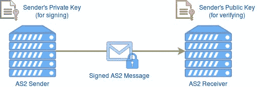
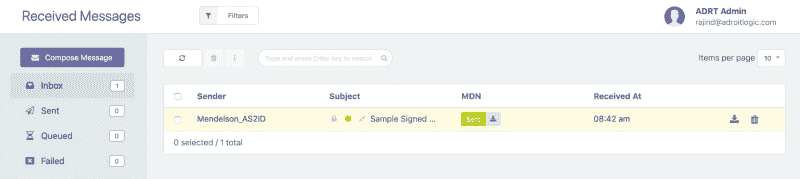
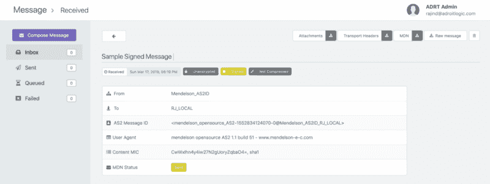

# 如何用 OpenSSL 验证 AS2 消息(SMIME)签名

> 原文：<https://www.freecodecamp.org/news/how-to-verify-as2-message-smime-signature-with-openssl-605c1affe3b/>

作者 Rajind Ruparathna

# 如何用 OpenSSL 验证 AS2 消息(SMIME)签名


Image by [ar130405](https://pixabay.com/users/ar130405-423602/) on [PixaBay](https://pixabay.com/images/id-2081169/)

在**“签名验证失败”**或“解密失败”行中声明错误的错误 MDN 对于在任何 AS2 服务中刚刚开始使用 AS2 的用户来说是常见的。在我们的 SaaS B2B AS2 消息平台 [AdroitLogic AS2Gateway 中，我们已经看到了许多这样的例子。](http://as2gateway.com/)对于这些类型的错误，有时支持团队和用户能够[手动尝试解密](https://notebookbft.wordpress.com/2019/03/17/how-to-decrypt-an-as2-message-smime-with-openssl/)或签名验证以获得更多信息是很重要的。

在这篇博文中，我们将探讨什么是 AS2 协议中的数字签名，如何验证 AS2 消息的签名，以及找出某些签名验证失败原因的一些技巧。

### AS2 议定书签字

AS2 签名本质上是一种数字签名，它为 AS2 通信提供认证、数据完整性和不可否认性。

*   身份验证—确保接收方与发送方进行交易，而不是与冒名顶替者进行交易
*   数据完整性—确定接收方获得的文件或数据是否在传输过程中被更改
*   不可否认性—防止发件人否认他们发送的消息来自他们



如上图所示，在生成签名时使用发送方的私钥，因此在验证时使用发送方的公钥。

### 我们开始工作吧！

出于演示目的，我们将使用一个传入的 AS2 消息到 AS2Gateway。因为我们在这篇博文中只关注签名验证，所以传入的 AS2 消息不会被加密或压缩。如果你想尝试一下加密，请看看我之前的一篇关于用 OpenSSL 解密 AS2 消息的文章。

#### 下载原始邮件和传输头

一旦我们收到 AS2 的消息，我们可以在 AS2Gateway 的**收件箱视图**中看到收到的消息，如下所示。



然后，我们可以点击消息主题(在这种情况下，它是“样本签名消息”)，以转到收到的消息的**详细视图**，如下所示。



现在您可以点击**“Raw Message”**按钮和**“Download Transport Headers”**按钮，分别下载我们从合作伙伴处收到的未处理的 AS2 消息净荷和传输头。原始消息将被下载到名为 *message.raw* 的文件中，传输头将被下载到名为 *headers.raw* 的文件中。

#### 获取发送方的公钥

现在我们已经有了原始消息和传输头，接下来我们需要的是发送者的公钥。我们可以在 AS2Gateway 的证书视图(如下所示)中点击 **PEM** (紫色)按钮直接下载。


在我们进行下一步之前，让我们确保我们已经准备好了所有需要的东西。

*   原始消息(message.raw)
*   传输头(headers.raw)
*   发件人公钥(cert.pem)

#### 分析 HTTP 传输头

在我们继续之前，让我们先看看传输头。

如你所见，有一堆标题。让我们在核实 AS2 电文的签名时只集中注意几个重要的问题。

*   **content-type** 报头表明我们在最外层有一个**多部分签名的**有效载荷，并且它进一步告诉我们**多部分边界**是由这个 AS2 消息的字符串“"-= _ Part _ 1 _ 170214111 . 1702141701”来表示的。17011 . 170214001
*   我们也有 1.0 的 mime 版本

如果你有兴趣了解更深入的细节，最好从 [AS2 RFC 4130](https://www.ietf.org/rfc/rfc4130.txt) 开始。

#### 分析原始消息

现在，让我们看看原始消息(message.raw)。根据内容类型传输头，我们已经知道负载是一个多部分签名的负载。下面我们可以看到。您可以看到两个部分(由内容类型传输头中规定的多部分边界字符串分隔)。一个包含原始有效负载(我们看到的是纯文本的有效负载，因为在本演示中我们没有对有效负载进行加密或压缩)。另一个带有签名(**应用程序/pkcs 7-签名**)。

#### 添加所需标题

还记得我们在查看传输头时讨论过几个重要的传输头吗？现在是使用它们的时候了。我们需要将这些头添加到 message.raw 文件中，这样最终输出将如下所示。(让我们把这个新文件命名为 **message_with_headers.raw** )注意，HTTP 传输头和多部分签名有效载荷之间的空白是有意的。

### 正在验证签名…

是时候运行解密命令了。这里我们使用 OpenSSL 的**‘smime’**工具。

```
openssl smime -verify -noverify -in message_with_headers.raw -signer cert.pem -out verified_payload.txt
```

运行该命令后，您应该会收到一条消息，显示**“验证成功”**。经过验证的有效负载位于 verified_payload.txt 文件中。注意，在这种情况下，我们将获得有效负载 mime 部分作为输出，如下所示。

为了完整起见，让我添加一个我在尝试这个时得到的错误的注释。对我来说，这个错误的原因是 content-type 头中的多部分边界字符串与实际的多部分边界字符串不匹配。注意，当在多部分 SMIME 有效载荷中使用多部分边界时，前面有两个'-'的。

```
Error reading S/MIME message 4719224428:error:0DFFF0D2:asn1 encoding routines:CRYPTO_internal:no multipart body failure:/BuildRoot/Library/Caches/com.apple.xbs/Sources/libressl/libressl-22.240.1/libressl-2.6/crypto/asn1/asn_mime.c:464:
```

还要注意，我们在签名验证命令中使用了参数 **'-noverify'** 。这是因为我们在本演示中使用的证书是自签名证书。如果没有使用' noverify '参数，OpenSSL 将首先尝试验证证书，并且会失败，并给出类似如下的错误。

```
Verification failure 4567594604:error:21FFF075:PKCS7 routines:func(4095):certificate verify error:/BuildRoot/Library/Caches/com.apple.xbs/Sources/libressl/libressl-22.240.1/libressl-2.6/crypto/pkcs7/pk7_smime.c:340:Verify error:self signed certificate
```

酷毙了。签名验证已经完成。尽管在本文中我们已经看到了完全使用命令行工具进行签名验证，但是也可以使用几行 Java 代码来完成。我希望在以后的文章中涉及到它。

### 奖金礼包

在结束之前，我想分享一些额外的细节，这将有助于您确定某些签名验证失败情况的原因。第一个是关于如何找出所使用的签名算法。

#### 找出使用的签名算法

为了找到使用的签名算法，我们可以使用 OpenSSL 的 **asn1parse** 工具。首先，我们需要将不带 mime 头的签名部分分离到一个单独的文件中，如下所示。姑且称这个文件为 **signature.raw**

现在，我们可以运行下面的命令来获得 asn1parse 输出。

```
openssl asn1parse -i -in signature.raw
```

输出如下所示。如果你能看到下面，最外面的部分有类型 **pkcs7-signedData，**，在四五行之后我们看到 **sha1** ，这是使用的签名算法。

#### asn1parse 输出的更多细节

从 asn1parse 输出中，我们可以看到和理解更多的细节。签名时，可以选择将签名证书附加到签名本身。这就是您从 **pkcs7-data** 部分开始看到的内容。**“整数:438 efdf 3”**为签名证书序列号。您还可以看到证书的有效期，如下所示。

**258:d = 7 HL = 2 l = 13 prim:utc time:051201134315 z**
**273:d = 7 HL = 2 l = 13 prim:utc time:190810134315 z**

> *发送代理必须将 2049 年的签约时间编码为 UTCTime。2050 年或以后的签名时间必须编码为通用时间。代理必须将年份字段(YY)解释为:如果 YY 大于或等于 50，则年份被解释为 19YY 如果 YY 小于 50，则年份被解释为 20YY。*

> *关于来自 RFC 2311 的 utc time—[https://tools.ietf.org/html/rfc2311](https://tools.ietf.org/html/rfc2311)*

在这种情况下，证书的有效期是从 UTC 2005/12/01 13:43:15 到 2019/08/10 13:43:15。

我们还将在**签名时间**的签名时间属性设为 190317161000Z，即 UTC 2019/03/17 16:10:00。请注意，在签名验证过程中，除了内容哈希匹配之外，还将进行另一项检查，以查看签名是否是证书当前的签名。基本上，在签名时，证书应该是有效的。

有了 ASN.1 结构的更多知识，我们应该能够从中获得更多的信息。我该收工了。干杯！？

### 行动呼吁

*   **拍手。**欣赏并让别人发现这篇文章。
*   **评论。**分享一下你对这篇文章的看法。
*   跟我来。 [Rajind Ruparathna](https://medium.com/@rajindruparathna) 接收此类文章的更新。
*   保持联系。 [LinkedIn](http://lk.linkedin.com/in/rajind) ， [Twitter](https://twitter.com/rajindrj)

*原载于 2019 年 3 月 19 日[notebookbft.wordpress.com](https://notebookbft.wordpress.com/2019/03/19/how-to-verify-as2-message-smime-signature-with-openssl/)。*