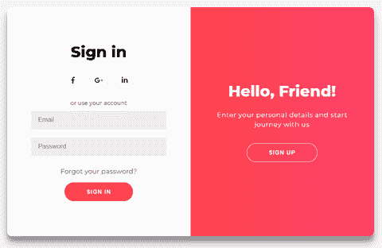
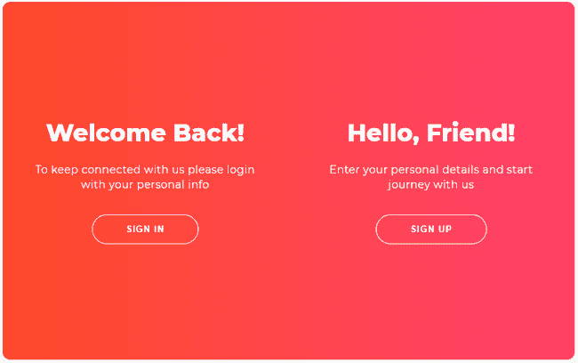

# 如何构建双滑块登录和注册表单

> 原文：<https://www.freecodecamp.org/news/how-to-build-a-double-slider-sign-in-and-sign-up-form-6a5d03612a34/>

你们中的一些人可能已经知道了，但是对于那些不知道的人，我将和你们所有人一起开始每周一次的编码挑战！？

这个挑战旨在通过在真实项目中练习来帮助提高我们的编码技能。

你可以通过阅读[完整指南](https://www.florin-pop.com/blog/2019/03/weekly-coding-challenge/)了解更多关于这一挑战以及如何加入的信息。

好的……所以本周的**挑战**是:**创建一个登录或注册表单(或者两者都有)。**

下面你可以看到我所创造的演示:



说实话，我在创作这部动画时有些纠结？，但最终，我还是成功了。？我的灵感来自于博士的这张照片，他们有一些很棒的设计，你应该去看看！

### 项目描述

在我们进入实际代码之前，我想分解一下组件中将要包含的东西。这将有所帮助，因为它将使我们编写的代码更加清晰。

我们在主要组件内有 4 个较小的屏幕/盒子(即`.container`):

1.  表格中的**符号**
2.  *报名*表格
3.  叠加中的**标志**
4.  *报名*叠加

此外，在某个时刻，你可以看到:

*   **在**表单中签到，旁边是*签到*叠加
*   *报名*表单与叠加中的**签到表单并排**

在*覆盖*面板中，我们有一些文本和一个`button`。点击它，您将调出另一个屏幕组合，反之亦然。再看一遍上面的 GIF，看看我的意思。

### 叠加动画—已解释

这可能有点棘手，但我会尽力解释，这样你就能理解背后的逻辑。

叠加组件有以下*层*:

**覆盖容器**——这将显示某一时刻的**可见**区域(更多信息见下文)。它的`width`是总集装箱宽度的`50%`。

**覆盖图** —这个 div 有双倍的`width`大小(`200%`)，所以它占据了主容器的整个宽度。(`200% * 50%= 100%`)。50%来自上面的`.overlay-container`。

覆盖面板是保存我们在屏幕上看到的实际内容(文本和按钮)的 div。他们都有一个`absolute`的`position`。我们可以把它们放在`.overlay`组件中我们想要的任何地方。其中一个面板定位在`left`上，另一个定位在`right`上。两者都具有`.overlay`部件的宽度`50%`。

“为什么我们需要 3 层？”你可能会问…好吧，让我们看看没有第一层会是什么样子:



在上图中，你可以看到两个面板都是“可见的”，这不是我们想要的。这就是为什么我们要添加`.overlay-container`来充当“焦点区域”的原因。这允许我们隐藏溢出的或者超出边界的面板。这就是为什么我们需要把 T1 号比 T2 号大一倍。通过移动 `.overlay-container`，它也有一个`absolute`的`position`，我们可以隐藏或显示我们想要的面板。

有点令人困惑？，我承认，但我希望我说得更清楚。

### 表单动画—已解释

这些一点也不难理解。基本上，我们又有了两个容器——`.form-container`s。每个都有一个`width`的`50%`和一个`position` - `absolute`。我们同时从左向右移动它们。当它们从上方到达`.overlay-container`后面时(当它们移动时),我们快速改变`z-index`的值。**注册**表单(例如)将移动到表单中**的顶部，反之亦然。神奇到眼睛，背后却有些代码逻辑！？**

### HTML

既然我们已经分解了动画的核心“功能”,那么是时候看看实际的 HTML 代码了。让我们从基本框架开始:

```
<div class="container" id="container">
    <div class="form-container sign-up-container">
        <!-- Sign Up form code goes here -->
    </div>
    <div class="form-container sign-in-container">
        <!-- Sign In form code goes here -->
    </div>
    <div class="overlay-container">
        <!-- The overlay code goes here -->
    </div>
</div>
```

主 div 有一个类`.container`和一个 id`container`,因为我们想在 JavaScript 中将这个元素作为目标(下面将详细介绍)。？

#### **报名表**

```
<div class="form-container sign-up-container">
    <form action="#">
        <h1>Create Account</h1>
        <div class="social-container">
            <a href="#" class="social"><i class="fab fa-facebook-f"></i></a>
            <a href="#" class="social"><i class="fab fa-google-plus-g"></i></a>
            <a href="#" class="social"><i class="fab fa-linkedin-in"></i></a>
        </div>
        <span>or use your email for registration</span>
        <input type="text" placeholder="Name" />
        <input type="email" placeholder="Email" />
        <input type="password" placeholder="Password" />
        <button>Sign Up</button>
    </form>
</div>
```

#### **表单中的签到**

我们在每个 div 上也有几个类:

```
<div class="form-container sign-in-container">
    <form action="#">
        <h1>Sign in</h1>
        <div class="social-container">
            <a href="#" class="social"><i class="fab fa-facebook-f"></i></a>
            <a href="#" class="social"><i class="fab fa-google-plus-g"></i></a>
            <a href="#" class="social"><i class="fab fa-linkedin-in"></i></a>
        </div>
        <span>or use your account</span>
        <input type="email" placeholder="Email" />
        <input type="password" placeholder="Password" />
        <a href="#">Forgot your password?</a>
        <button>Sign In</button>
    </form>
</div>
```

*   `.form-container`类将包含为`.sign-in-container`和`.sign-up-container`类复制的 CSS
*   2 个不同的类(如上所述)将包含不同的 CSS。

这样我们就避免了两次编写相同的 CSS 代码，并且我们可以使用添加多个类的能力。

您可能还注意到了`i`标签有一些类。这是因为我们使用了 [FontAwesome](http://fontawesome.io/) 作为图标。在他们的网站上阅读更多关于他们的信息。

#### **覆盖容器**

```
<div class="overlay-container">
    <div class="overlay">
        <div class="overlay-panel overlay-left">
            <h1>Welcome Back!</h1>
            <p>
                To keep connected with us please login with your personal info
            </p>
            <button class="ghost" id="signIn">Sign In</button>
        </div>
        <div class="overlay-panel overlay-right">
            <h1>Hello, Friend!</h1>
            <p>Enter your personal details and start journey with us</p>
            <button class="ghost" id="signUp">Sign Up</button>
        </div>
    </div>
</div>
```

同上，我们有一个公共类`.overlay-panel`和两个不同的类:`.overlay-left`和`.overlay-right`。此外，我们为按钮添加了`id`，因为我们将在`JavaScript`中为它们添加一个 **onClick** `eventListener`。

### JavaScript

通常，我们在 JS 部分之前介绍 CSS，但是这次首先展示和解释 JavaScript 代码更容易。这将有助于你理解我们后面要用到的 CSS。

```
const signUpButton = document.getElementById('signUp');
const signInButton = document.getElementById('signIn');
const container = document.getElementById('container');

signUpButton.addEventListener('click', () => {
    container.classList.add('right-panel-active');
});

signInButton.addEventListener('click', () => {
    container.classList.remove('right-panel-active');
});
```

如上所述，我们添加了事件监听器。当按钮被点击时，我们`add`或`remove`了`.right-panel-active`类(这不是这个类最好的名字，但这是我目前得到的最好的名字？).由于我们有两个屏幕，这个类将被用来以不同的方式设计子组件。

### CSS

首先，我们有基本组件的基本 CSS:

```
h1 {
    font-weight: bold;
    margin: 0;
}

p {
    font-size: 14px;
    font-weight: 100;
    line-height: 20px;
    letter-spacing: 0.5px;
    margin: 20px 0 30px;
}

span {
    font-size: 12px;
}

a {
    color: #333;
    font-size: 14px;
    text-decoration: none;
    margin: 15px 0;
}

button {
    border-radius: 20px;
    border: 1px solid #ff4b2b;
    background-color: #ff4b2b;
    color: #ffffff;
    font-size: 12px;
    font-weight: bold;
    padding: 12px 45px;
    letter-spacing: 1px;
    text-transform: uppercase;
    transition: transform 80ms ease-in;
}

button:active {
    transform: scale(0.95);
}

button:focus {
    outline: none;
}

button.ghost {
    background-color: transparent;
    border-color: #ffffff;
}

form {
    background-color: #ffffff;
    display: flex;
    align-items: center;
    justify-content: center;
    flex-direction: column;
    padding: 0 50px;
    height: 100%;
    text-align: center;
}

input {
    background-color: #eee;
    border: none;
    padding: 12px 15px;
    margin: 8px 0;
    width: 100%;
}

.social-container {
    margin: 20px 0;
}

.social-container a {
    border: 1px solid #dddddd;
    border-radius: 50%;
    display: inline-flex;
    justify-content: center;
    align-items: center;
    margin: 0 5px;
    height: 40px;
    width: 40px;
}
```

这里需要注意几件事:

1.  我们直接设计元素的样式(h1，p，a)。通常，您不会这样做，因为它可能会与其他样式混淆，所以最好为每个样式添加一个类。但是对于这个例子来说，它工作正常，因为我们在页面上只有这些元素。
2.  我们在`button`上有一个小`transition`。当它被点击时，*激活*状态被触发，所以我们把它变小一点。好看又简单的点击效果？！
3.  `form`是一个`flex`容器，因为我们想把所有东西都放在里面，用`flexbox`很容易做到这一点。下面你会看到用的次数多了。

`.container` CSS:

```
.container {
    background-color: #ffffff;
    border-radius: 10px;
    box-shadow: 0 14px 28px rgba(0, 0, 0, 0.25), 0 10px 10px rgba(0, 0, 0, 0.22);
    position: relative;
    overflow: hidden;
    width: 768px;
    max-width: 100%;
    min-height: 480px;
}
```

*   `Relative`定位，因为我们将有`absolute`定位的子元素(上面解释了原因)。
*   `Overflow`被设置为`hidden`,因为我们已经设置了一个`border-radius`,我们不希望子元素超出这个半径并显示在`.container`之外。

现在是有趣的部分，`.form-container`和相关的风格:

```
.form-container {
    position: absolute;
    top: 0;
    height: 100%;
    transition: all 0.6s ease-in-out;
}

.sign-in-container {
    left: 0;
    width: 50%;
    z-index: 2;
}

.sign-up-container {
    left: 0;
    width: 50%;
    opacity: 0;
    z-index: 1;
}

.container.right-panel-active .sign-in-container {
    transform: translateX(100%);
}

.container.right-panel-active .sign-up-container {
    transform: translateX(100%);
    opacity: 1;
    z-index: 5;
    animation: show 0.6s;
}

@keyframes show {
    0%,
    49.99% {
        opacity: 0;
        z-index: 1;
    }

    50%,
    100% {
        opacity: 1;
        z-index: 5;
    }
}
```

**注意**以下内容:

1.  如上所述，`animation` ( `show`)负责改变`.form-container`的`z-index`。我们从`0-49.99%`得到 z 向索引 **1** ，从`50-100%`得到 z 向索引 **5** 。使用这些范围是因为我们希望它们快速变化。
2.  当按钮被点击时，我们使用`.right-panel-active`类在`.form-container`周围移动。

最后是`.overlay-container`和相关风格:

```
.overlay-container {
    position: absolute;
    top: 0;
    left: 50%;
    width: 50%;
    height: 100%;
    overflow: hidden;
    transition: transform 0.6s ease-in-out;
    z-index: 100;
}

.container.right-panel-active .overlay-container {
    transform: translateX(-100%);
}

.overlay {
    background: #ff416c;
    background: -webkit-linear-gradient(to right, #ff4b2b, #ff416c);
    background: linear-gradient(to right, #ff4b2b, #ff416c);
    background-repeat: no-repeat;
    background-size: cover;
    background-position: 0 0;
    color: #ffffff;
    position: relative;
    left: -100%;
    height: 100%;
    width: 200%;
    transform: translateX(0);
    transition: transform 0.6s ease-in-out;
}

.container.right-panel-active .overlay {
    transform: translateX(50%);
}

.overlay-panel {
    position: absolute;
    display: flex;
    align-items: center;
    justify-content: center;
    flex-direction: column;
    padding: 0 40px;
    text-align: center;
    top: 0;
    height: 100%;
    width: 50%;
    transform: translateX(0);
    transition: transform 0.6s ease-in-out;
}

.overlay-left {
    transform: translateX(-20%);
}

.container.right-panel-active .overlay-left {
    transform: translateX(0);
}

.overlay-right {
    right: 0;
    transform: translateX(0);
}

.container.right-panel-active .overlay-right {
    transform: translateX(20%);
}
```

*   `.overlay`有渐变背景，我用 [UI 渐变](https://uigradients.com/)得到的；
*   `.overlay-left`和`.container.right-panel-active .overlay-right`在 X 轴上有一个`-20%`和`20%`平移。这是因为我想给文本添加一点效果，让它看起来像是从外面来的？；

除此之外…什么都没有！我们涵盖了一切。我们完了！？


### 结论

这篇文章对动画有点苛刻，不是吗？？然而，我希望你已经从中学到了一些东西。

别忘了，你也可以通过创建自己版本的**登录/注册表单来参与[每周编码挑战](https://www.florin-pop.com/blog/2019/03/weekly-coding-challenge/)。**在推特上分享给我: [@florinpop1705](https://twitter.com/@florinpop1705) 这样我就能看到了！

此外，你可以在谷歌表单中建议我们应该为下一个挑战构建什么。

你可以在 [Codepen](https://codepen.io/FlorinPop17/full/vPKWjd) 上找到我们构建的项目的现场版本。

感谢您花时间阅读本文？，我希望你学到了新的东西！

*最初发表于[www.florin-pop.com](https://www.florin-pop.com/blog/2019/03/double-slider-sign-in-up-form/)。*