# 用 JavaScript 在画布上绘图时如何锁定角度

> 原文：<https://www.freecodecamp.org/news/how-to-lock-an-angle-when-drawing-on-canvas-in-javascript-51938b5abc7c/>

用你的梯子

# 用 JavaScript 在画布上绘图时如何锁定角度

在很多画图工具中( [Adobe Photoshop](https://www.adobe.com/products/photoshop.html) 、 [Sketch](https://www.sketchapp.com/) 等等)，如果我们在画线的时候按住 SHIFT 键，就可以在水平或垂直方向上创建出完美的直线。

最近，我尝试用 JavaScript 在 canvas 中实现这个功能。过程真的很有意思。我想分享我在这方面的进展。

**演示**:为了更容易理解这个想法，你可以在[演示页面](https://ittus.github.io/draw-lock-angle/)查看一个演示版本。

### 要求

**输入**

*   基点(B)
*   当前鼠标位置(米)

**输出**

*   当前鼠标位置在 x 轴或 y 轴上的投影(P)

为了方便起见，在所有的图中，我们将用一个红圈标记基点，用一个绿圈标记当前鼠标点。

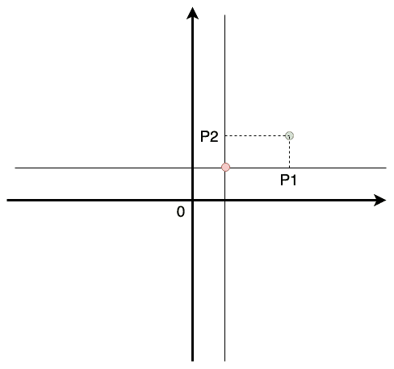

Problem: Decide which projection is better

### 简单溶体

当我处理这个问题时，直观地看到我们可以计算当前鼠标位置与水平线和垂直线之间的距离。如果鼠标位置离水平线比离垂直线近，我们就取水平线的投影，反之亦然。

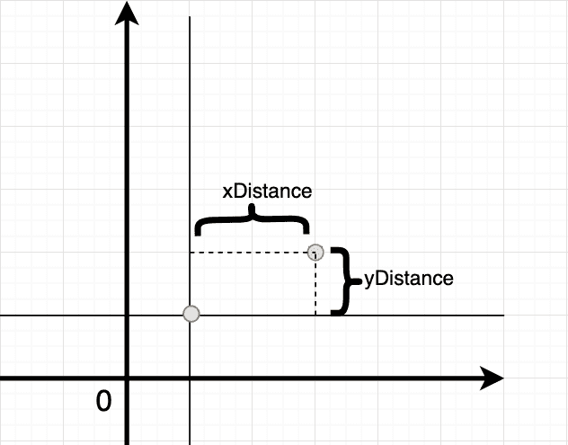

计算非常简单——下面是 Javascript 代码:

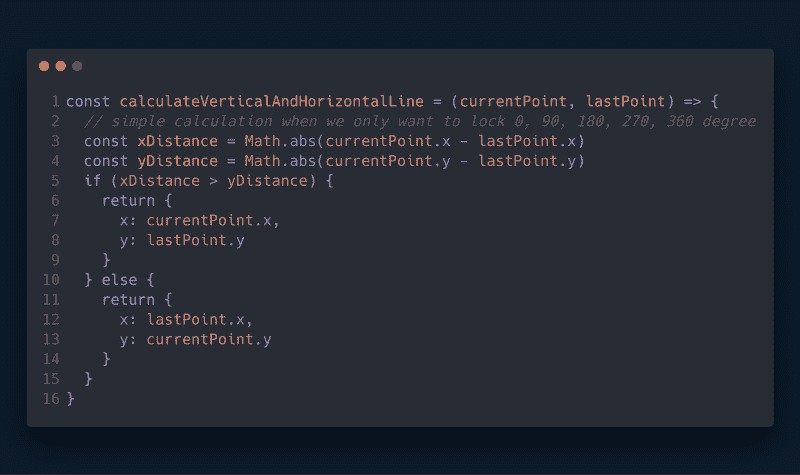

### 扩展问题

如果我们要投影在水平线和垂直线的平分线上(类似于[草图](https://www.sketchapp.com/))呢？这意味着用户可以将鼠标位置投影到水平线、垂直线、45 度角线或 135 度角线上。

方法是相似的。这次我们需要计算鼠标位置到 4 条线的距离:水平线、垂直线、2 条平分线(45 度线和 135 度线)。但是计算比较复杂。

我们仍然可以把它分成两步:

1.  确定哪条线离鼠标位置最近
2.  计算鼠标位置在最近线上的投影

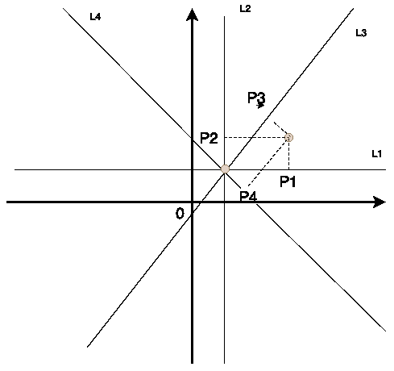

#### 步骤 1:确定哪条线离鼠标位置最近

首先，我们需要确定上面 4 行的行公式。因为我们已经知道基点(x0，y0)和线角，所以很容易算出每条线的公式。

> 例:计算 45 度平分线的公式，我们已经知道直线会经过基点(x0，y0)和(x0 + 1，y0 + 1)。利用[求直线方程](https://www.wikihow.com/Find-the-Equation-of-a-Line)的方法，我们可以算出直线公式。

最后，我们将有 4 行公式:

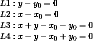

要计算鼠标基本位置到每条线之间的距离，我们可以使用一个流行的数学公式:

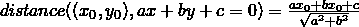

Distance from a point to a line

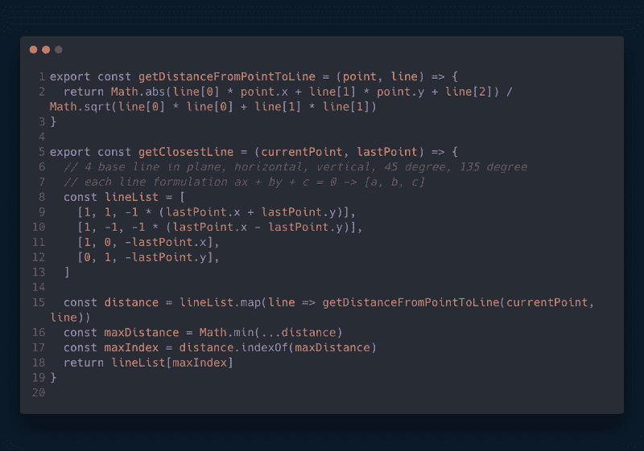

Finding the nearest line

#### 步骤 2:计算鼠标位置在最近线上的正交投影

现在问题变成了用公式 ax + by + c = 0 (L)计算鼠标位置(M)到最近直线的正交投影

有多种方法可以解决这个问题。我采取了一个简单的办法:首先计算包含鼠标位置 M 且垂直于直线 L 的直线的公式，称为 L’。然后，解方程组得到直线 L 和 L '的交点，这就是我们正在寻找的投影点。

经过一番计算，我想出了 L '的公式，穿过 M (x0，y0)，垂直于 L (ax + by + c = 0):

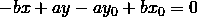

为了找到交点，我们需要求解方程组:

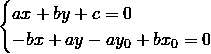

利用[克莱姆法则](https://en.wikipedia.org/wiki/Cramer%27s_rule)和矩阵行列式，我们可以很容易地求解这个方程:

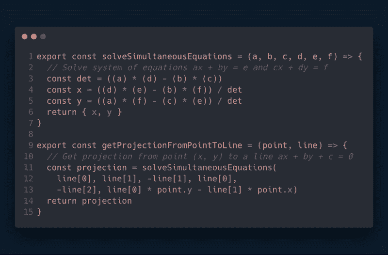

Solve simultaneous equations

### 分界线

有一种情况，我们要限制投影的边界。

示例:

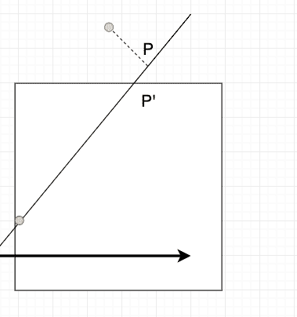

The projection point is outside of the boundary

在这种情况下，我们希望将投影限制在白色矩形区域中，但是使用所讨论的方法，投影点可以在边界区域之外。

在这种情况下，我们可以简单地得到直线 L '与边界的交点(称为 P ')。

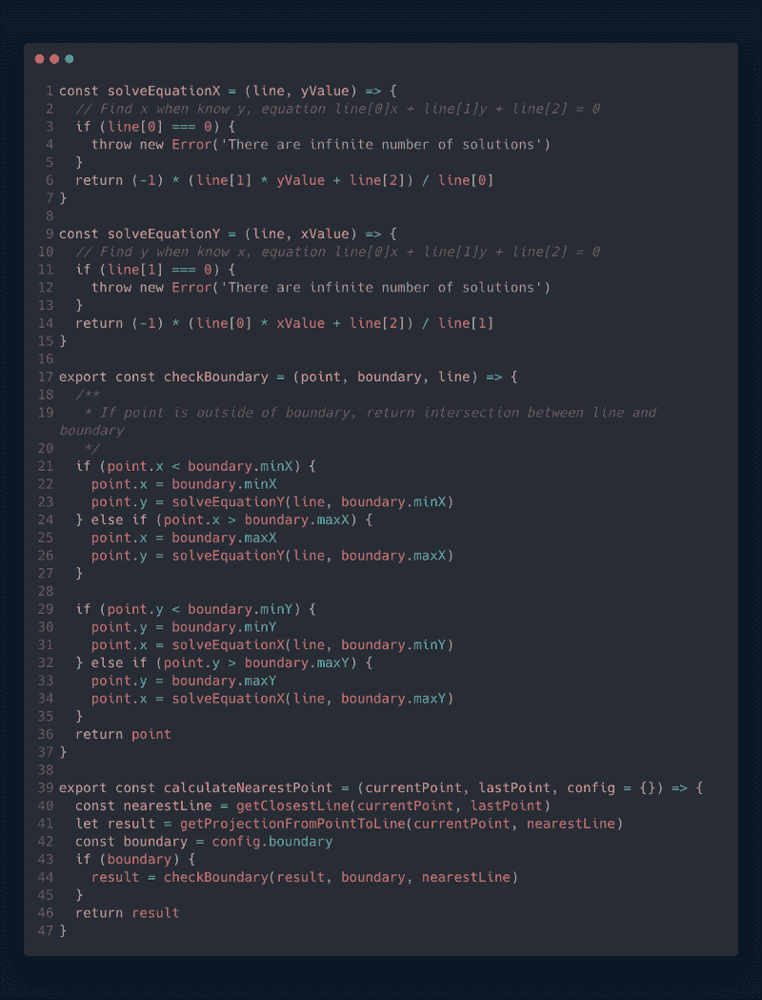

Support boundary of the projection

### **完整源代码**

你可以在 [Github](https://github.com/ittus/draw-lock-angle) 上查看演示和源代码。

编码快乐！