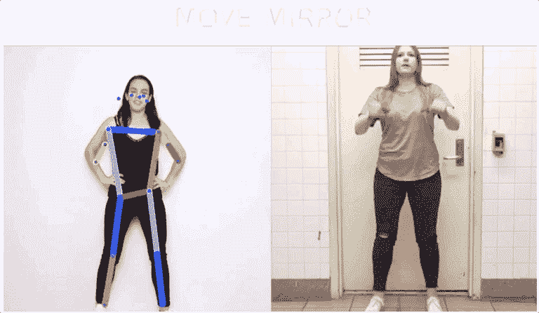
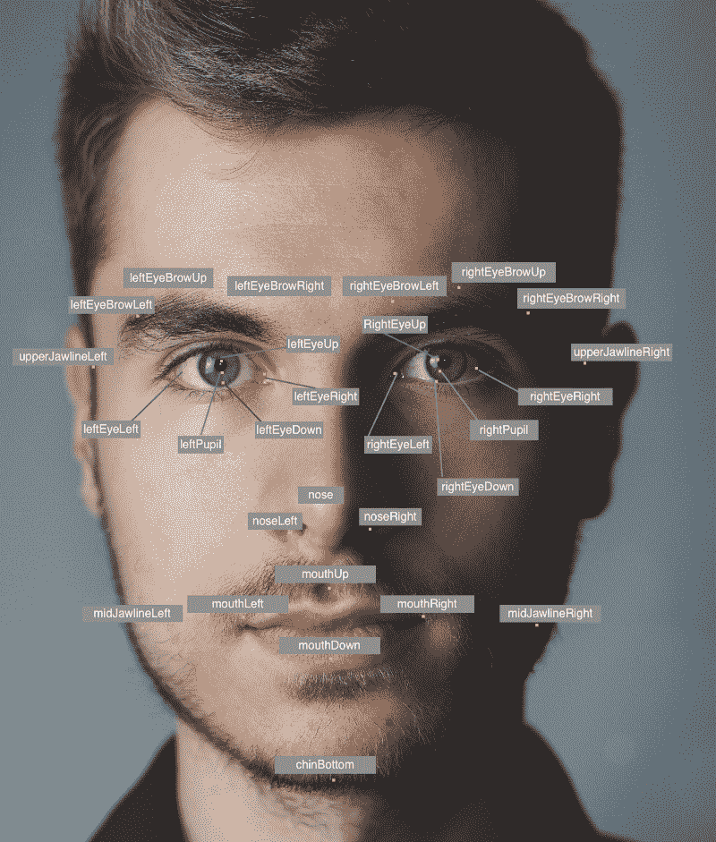
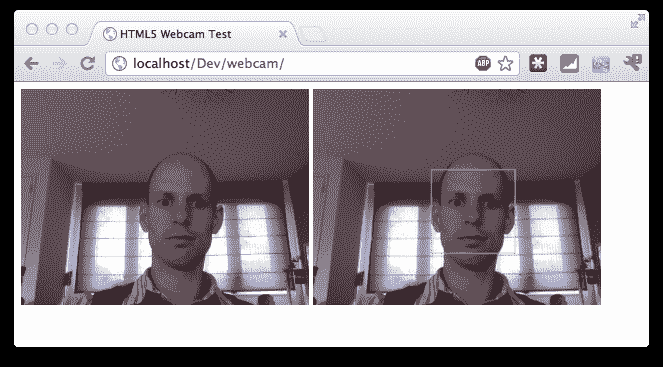
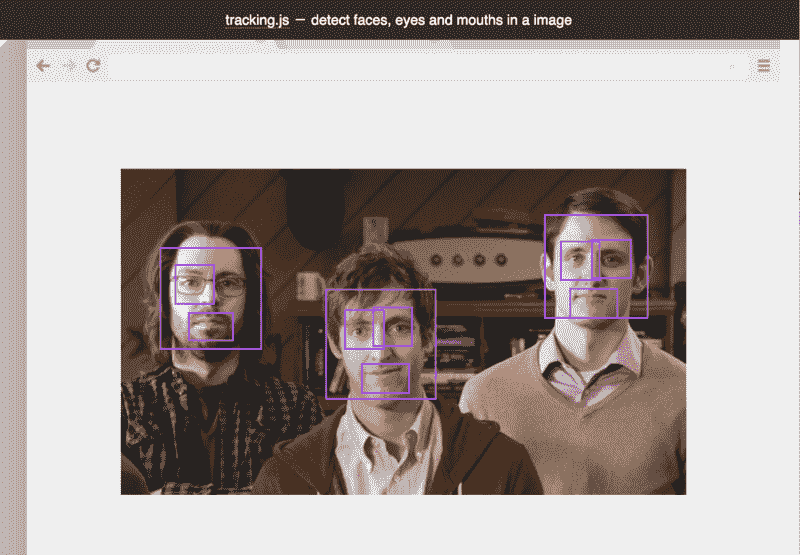
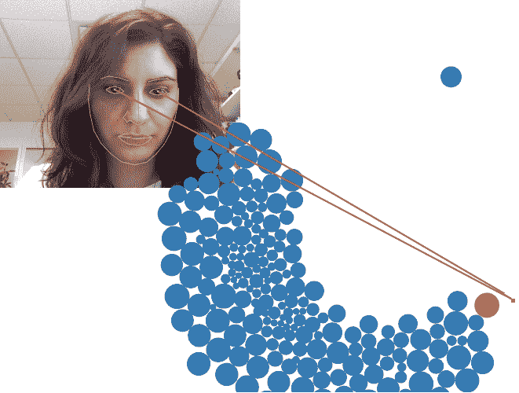
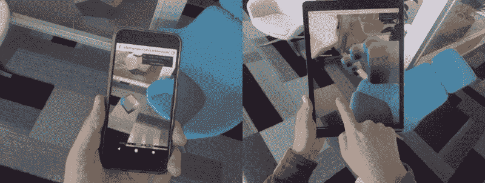

# 计算机视觉。你需要知道的 js 框架

> 原文：<https://www.freecodecamp.org/news/computer-vision-js-frameworks-you-need-to-know-b233996103ce/>

计算机视觉是近年来的热门话题，实现了无数伟大的应用。随着世界上一些专门开发人员的努力，利用计算机视觉创建一个应用程序不再是火箭科学。事实上，您可以用几行 JavaScript 代码构建许多应用程序。在这篇文章中，我将向你介绍其中的一些。

### 1\. TensorFlow.js

作为最大的机器学习框架之一，TensorFlow 还允许使用 [**Tensorflow.js**](https://www.tensorflow.org/js) 创建 Node.js 和前端 JavaScript 应用。下面是他们的一个演示，将姿势与一组图像相匹配。TensorFlow 也有一个 [**操场**](https://playground.tensorflow.org/#activation=tanh&batchSize=10&dataset=circle&regDataset=reg-plane&learningRate=0.03&regularizationRate=0&noise=0&networkShape=4,2&seed=0.27185&showTestData=false&discretize=false&percTrainData=50&x=true&y=true&xTimesY=false&xSquared=false&ySquared=false&cosX=false&sinX=false&cosY=false&sinY=false&collectStats=false&problem=classification&initZero=false&hideText=false) 允许我们可视化更好的人工神经网络，这对于教育目的来说是很棒的。

A Move Mirror Demo from [Tensorflow.js](https://experiments.withgoogle.com/move-mirror)

### 2 .亚马逊索赔

[**亚马逊 Rekognition**](https://aws.amazon.com/rekognition/?sc_channel=PS&sc_campaign=acquisition_US&sc_publisher=google&sc_medium=ACQ-P%7CPS-GO%7CBrand%7CDesktop%7CSU%7CMachine%20Learning%7CRekognition%7CUS%7CEN%7CText&sc_content=aws_recognition_software_e&sc_detail=amazon%20rekognition&sc_category=Machine%20Learning&sc_segment=293645376368&sc_matchtype=e&sc_country=US&s_kwcid=AL!4422!3!293645376368!e!!g!!amazon%20rekognition&ef_id=EAIaIQobChMIwLzV1obx4AIVEK6WCh3MZAPREAAYASAAEgJlv_D_BwE:G:s) 是一个强大的基于云的工具。但是他们也为浏览器中的 JavaScript 提供了 SDK，可以在这里找到**。下图说明了他们的面部检测有多详细。**

**

Facial Feature Detection with [Amazon Rekognition API](https://docs.aws.amazon.com/rekognition/latest/dg/faces-detect-images.html)** 

### **3.OpenCV.js**

**作为最古老的计算机视觉框架之一， [**OpenCV**](https://opencv.org/) 已经为计算机视觉领域的开发者服务了很长时间。他们还有一个 [**JavaScript 版本**](https://docs.opencv.org/3.4/d5/d10/tutorial_js_root.html) ，允许开发者在网站上实现这些功能。**

**

Example Face Detection with OpenCV, Image from [DZone](https://dzone.com/articles/face-detection-using-html5)** 

### **4.tracking.js**

**如果你只是想建立一个快速的人脸检测应用程序，比如网页版的 snapchat 过滤器，你应该看看 [**tracking.js**](https://trackingjs.com/) 。这个框架允许通过相当简单的设置将人脸识别与 JavaScript 集成。我还在这个框架上写了一个 [**指南**](https://medium.freecodecamp.org/how-to-drop-leprechaun-hats-into-your-website-with-computer-vision-b0d115a0f1ad) ，在圣帕特里克节的时候把一顶小妖精的帽子丢到脸上。**

**

tracking.js face detection [example](https://trackingjs.com/examples/face_hello_world.html)** 

### **5.WebGazer.js**

**无论你是试图进行用户体验研究，还是为你的游戏或网站创建新的互动系统， [**WebGazer.js**](https://webgazer.cs.brown.edu/) 都可以是一个很好的起点。这个强大的框架允许我们的应用程序知道这个人在用相机输入看哪里。**

**

WebGazer.js gaze tracking [example](https://webgazer.cs.brown.edu/#examples)** 

### **6.three.ar.js**

**另一个来自 Google 的框架， [**three.ar.js**](https://github.com/google-ar/three.ar.js?files=1) 将 [**ARCore**](https://developers.google.com/ar/) 的功能扩展到前端 JavaScript 上。它使我们能够将表面和对象检测集成到浏览器中，这是 AR 游戏的完美工具。**

**

[three.ar.js](https://github.com/google-ar/three.ar.js?files=1) demo** 

### **最后…**

**我热衷于学习新技术并与社区分享。如果你有什么特别想看的，请告诉我。以下是我之前与此主题相关的文章。敬请关注，工程愉快！**

*   **[**计算机视觉如何革新电子商务**](https://medium.com/swlh/how-computer-vision-is-revolutionizing-ecommerce-d05e0ca11765)**
*   ****如何用计算机视觉将小妖精帽子放入你的网站****