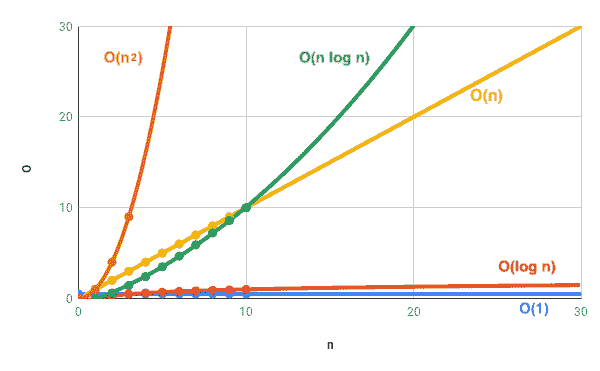
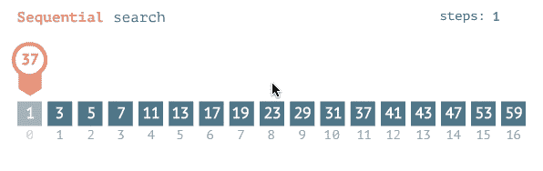
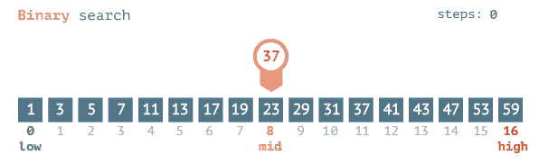
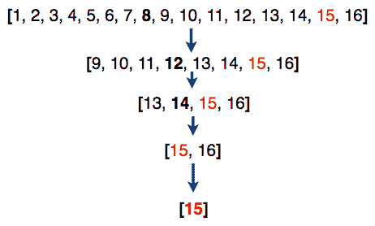
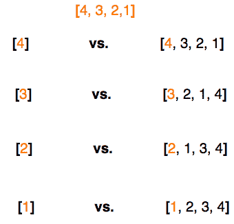
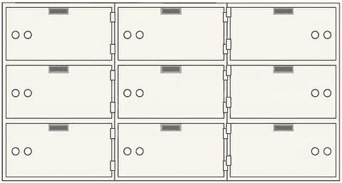

# JS 中简单算法和数据结构的复杂性

> 原文：<https://www.freecodecamp.org/news/the-complexity-of-simple-algorithms-and-data-structures-in-javascript-11e25b29de1e/>

作者:梁荣立

# JS 中简单算法和数据结构的复杂性

Photo by Karsten Würth on [Unsplash](https://unsplash.com/photos/ImeGmbUNarA)

在上一篇文章“[迈向计算科学的一步:简单算法&JS](https://medium.com/@yunglleung1/a-step-towards-computing-as-a-science-algorithms-data-structures-4c0e2d6ae79a)中的数据结构”中，我们讨论了简单算法(线性&二进制搜索；冒泡，选择&插入排序)&数据结构(数组&键值对对象)。在这里，我继续介绍复杂性的概念及其在这些算法&数据结构中的应用。

### **复杂度**

**复杂性**是复杂过程中涉及的一个因素。关于算法&数据结构，这可以是在给定数据结构上执行特定任务(搜索、排序或访问数据)所需的**时间**或**空间**(意味着计算内存)。执行任务的效率取决于完成任务所需的操作数量。

**倒垃圾**可能需要 3 个步骤(绑好垃圾袋，拿出去&扔进垃圾箱)。**倒垃圾**可能很简单，但如果你在装修了一个星期后倒垃圾，你可能会发现自己无法完成任务，因为垃圾箱里的**缺少空间**。

用吸尘器打扫房间可能需要很多重复的步骤(打开它，反复用吸尘器清扫地板&关闭它)。房间越大，你用吸尘器清扫地板的次数就越多。因此，**用真空吸尘器打扫房间的时间**越长。

因此，在执行的操作数量和执行的元素数量之间存在直接的因果关系。有很多垃圾(元素)需要拿出来很多次。这会导致**空间复杂度**的问题。拥有大量的平方英尺(元素)需要用真空吸尘器清扫地板很多次。这可能导致一个**时间复杂度**的问题。

无论你是**倒垃圾**还是**打扫房间**，你可能会说**操作计数(** O **)** 正好随着**元素数量(** n **)** 的增加而增加。如果我有一个垃圾袋，我必须倒一次垃圾。如果我有两个垃圾袋，假设你一次不能举起超过一个袋子，我必须执行同样的任务两次。所以，这些杂务中的大-O 是 O = n 或者 O = function(n)或者 **O(n)** 。这是一个线性复杂度(一条 1 运算:1 元素对应的直线)。因此，在 30 个元素上执行 30 个操作(图中的黄线)。

这类似于考虑算法和数据结构时发生的情况。

### 调查

#### 线性搜索

[source](https://www.mathwarehouse.com/programming/images/binary-vs-linear-search/binary-and-linear-search-animations.gif)

在有序列表中一个接一个地搜索一个条目的最佳情况是常数 **O(1)** ，假设它是列表中的第一个条目。所以，如果你要搜索的物品总是列在最前面，不管你的列表有多大，你都会在一瞬间找到你要的物品。搜索的复杂度随着列表的大小而变化。这种搜索的最坏情况的平均 T4 是线性复杂度或 O(n)。换句话说，对于 n 个项目，我要看 n 次，才能找到我的项目，于是线性搜索。

#### 二进位检索

[source](https://www.mathwarehouse.com/programming/images/binary-vs-linear-search/binary-and-linear-search-animations.gif)

对于二分搜索法来说，**最佳情况**是 O(1)，这意味着你的搜索项位于中点。**最差&平均情况**是 n 的对数基数 2 或:

对数是表示给定底数的指数的一种方式。因此，如果有 16 个元素(n = 16)，那么在最坏的情况下，需要 4 步才能找到数字 15(指数= 4)。

或者干脆: **O(log n)**

### 分类

#### 泡泡

[source](https://upload.wikimedia.org/wikipedia/commons/5/54/Sorting_bubblesort_anim.gif)

在冒泡排序中，每一项都与集合的其余部分进行比较，以确定冒泡的最高值。为此，在**平均到最差情况**上，其复杂度为 **O(n )** 。想象一个嵌套在另一个循环中的循环。

所以，对于每一件物品，你都要把它与你收藏的其他物品进行比较。这相当于对 4 个元素进行 16 次比较(或运算)(4 = 16)。最好的情况是除了一件物品外，你的收藏几乎都被分类了。这相当于一轮比较。也就是说，需要四次比较来冒泡一个四项集合的成员，这是一个复杂的 **O(n)** 。

#### 选择

[source](https://codepumpkin.com/selection-sort-algorithms/)

与**冒泡排序**不同，**选择排序**不冒泡最高值，而是选择最低值将其交换到最早的位置。但是，因为它需要将每个项目与集合中的其他项目进行比较，所以它的复杂度为 **O(n )** 。

#### 插入

[source](https://gfycat.com/densebaggyibis)

与**气泡** & **选择排序**不同，**插入排序**将项目插入其正确位置。但是，像前面的排序一样，这也需要将每个项目与集合的其余部分进行比较，因此，它具有平均到最坏情况的复杂度。像**冒泡排序**一样，如果只剩下一个项目要排序，只需要一轮比较就可以把项目插入到正确的位置。即具有 **O(n)** 的**最佳情况**复杂度。

### 数据结构

#### 数组

因为通过索引访问数组中的一个项，或者在数组末尾添加/删除一个项只需要一步，所以**访问**、**推**或者**弹出**数组中的一个值的复杂度为 **O(1)** 。然而，如前所述，**通过其索引在数组中线性搜索**，其复杂度为 **O(n)** 。

此外，因为将一个值的**移位**或**取消移位**到或从数组的前面需要**重新索引**它后面的每个元素(即移除索引 0 处的元素需要将索引 1 处的元素重新标记为索引 0，依此类推)，所以它们的复杂度为 **O(n)** 。重新标记从数组的开始一直进行到结束。

#### 键值对对象

[source](https://cdn.shopify.com/s/files/1/1147/6518/products/safeandvaultstore-sdbx9-safe-deposit-boxes_large.jpg?v=1495593363)

**用一个键访问**、**插入**或**删除**一个值是瞬间的，因此，它们的复杂度为 **O(1)** 。使用每一个可用的键在每个“寄存箱”中搜索特定的物品实质上是一种线性搜索。所以，它的复杂度是 O(n) 。

### 结论

**复杂性**不仅仅是一个讨论既定算法&数据结构的话题。如果使用得当，它可以成为一个有用的工具，用来衡量您所做的工作和您为解决问题而创建的代码的效率。

### **参考:**

[https://www . udemy . com/js-algorithms-and-data-structures-master class/](https://www.udemy.com/js-algorithms-and-data-structures-masterclass/)