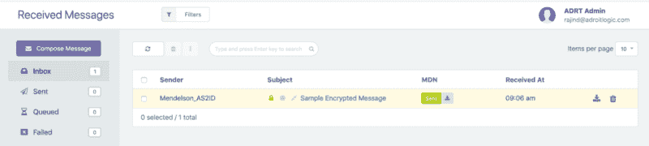
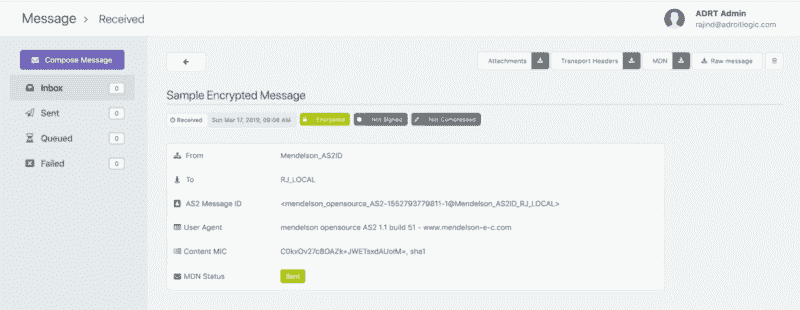
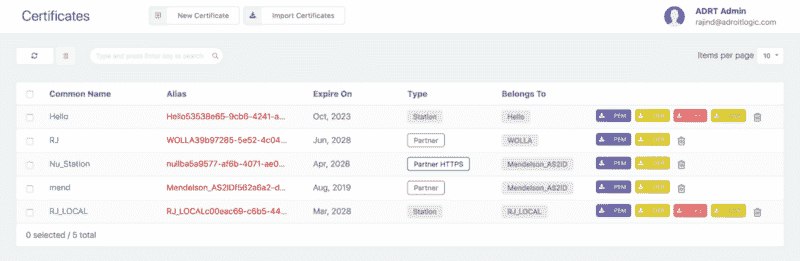

# 如何用 OpenSSL 解密 AS2 消息(SMIME)

> 原文：<https://www.freecodecamp.org/news/how-to-decrypt-an-as2-message-smime-with-openssl-d47fda5fd7db/>

作者 Rajind Ruparathna

# 如何用 OpenSSL 解密 AS2 消息(SMIME)


Image by [Markus Spiske](https://unsplash.com/photos/FXFz-sW0uwo?utm_source=unsplash&utm_medium=referral&utm_content=creditCopyText) on [Unsplash](https://unsplash.com/search/photos/encrypt?utm_source=unsplash&utm_medium=referral&utm_content=creditCopyText)

到现在为止，我已经参与了 SaaS B2B AS2 消息平台[adriologic as 2 gateway](http://as2gateway.com/)快两年了。我们在开始使用 AS2 的用户中看到的一个常见问题是解密失败。在这篇博文中，我们将看看 AS2 协议中的加密和解密。我们将介绍如何解密 AS2 消息，以及找出某些解密失败原因的一些技巧。

### AS2 协议的加密

AS2 协议基本上使用**公钥密码**或**非对称密码**进行加密。这里，接收者的公钥用于加密，接收者的私钥用于解密，如下所示。


假设接收者的私钥没有被泄露，加密数据和消息提供了以下安全好处。

*   **保密性** —确保只有预定的接收者可以解密和查看内容，即内容是用接收者的公钥加密的。因此，它只能用接收者的私钥解密。
*   **数据完整性** —确定接收方获得的文件或数据在传输过程中是否被篡改。解密过程的一部分包括验证原始加密消息的内容和新解密的内容是否匹配。对原始内容最微小的改变都会导致解密过程失败。

### 我们开始工作吧！

出于演示目的，我们将使用一个传入的 AS2 消息到 AS2Gateway。因为我们在这篇博文中只关注解密，所以传入的 AS2 消息没有经过签名或压缩。

#### 下载原始邮件和传输头

一旦我们收到 AS2 的消息，我们可以在 AS2Gateway 的**收件箱视图**中看到收到的消息，如下所示。



然后，我们可以点击消息主题(在这种情况下，它是“样本加密消息”)，以进入收到的消息的**详细视图**，如下所示。



现在，您可以点击**“原始消息”**按钮和**“下载传输头”**按钮，分别下载我们从合作伙伴处收到的未处理的 AS2 消息有效载荷和传输头。原始邮件将被下载到名为 message.raw 的文件中。传输头将被下载到名为 headers.raw 的文件中

#### 获取接收方的公钥和私钥

现在我们有了原始消息和传输头，我们需要接收者的公钥和私钥。至于公钥，您可以在 AS2Gateway 的证书视图(如下所示)中点击 **PEM** (紫色)按钮直接下载。对于私钥，您必须首先下载 JKS (identity.jks)。您可以通过点击证书视图中的 **JKS** (红色)按钮来完成此操作，并从 JKS 中提取私钥。查看我的[关于从 JKS 提取私钥的分步指南](https://notebookbft.wordpress.com/2019/01/10/extracting-private-key-from-java-keystore-jks/)了解更多细节。



请注意，在提取私钥时，您将需要密钥密码和密钥存储密码。如果您不记得他们，您可以通过点击**通用名**查看证书的更多详细信息(在这种情况下，相关 AS2 站的通用名为“RJ _ 本地”)。从那里你应该能找到相关的密码。

在我们进行下一步之前，让我们确保我们已经准备好了所有需要的东西。

*   原始消息(message.raw)
*   传输头(headers.raw)
*   接收方的私钥(private_key.pem)
*   接收者的公钥(cert.pem)

#### 分析 HTTP 传输头

在我们继续之前，让我们先看看传输头。

正如你所看到的，这里有很多头，因此在解密 AS2 消息的上下文中，我们只关注其中几个重要的头。

*   **content-type** 报头表明我们在最外层有一个加密的有效载荷。
*   **content-disposition** 头给出了有效载荷的文件名 test_message.txt。
*   我们也有 1.0 的 mime 版本

如果你有兴趣了解更深入的细节，最好从 [AS2 RFC 4130](https://www.ietf.org/rfc/rfc4130.txt) 开始。

现在，我们知道有效负载是加密的(这是应该的，因为这是我们为这个演示选择的类型)。我们知道文件名是 test_message.txt，太好了。现在我们几乎拥有了执行解密所需的一切。还有几步路要走。

#### 用 Base64 编码原始消息

因为我们在这里处理的是加密的原始消息，所以最好将其转换为 base64，这样我们就可以使用文本编辑器安全地处理它。当然，人们可以也应该能够不将其转换为 base64。为了方便接下来的步骤，我倾向于将原始消息转换为 base64。让我们运行下面的命令(这里我们使用**‘base64’命令行工具**)将原始消息转换为 base64。注意，参数'–break = 64 '非常重要，它将 base64 输出分成 64 个字符的行，否则您可能会在解密过程中遇到错误。

```
base64 message.raw --break=64 > base64_message.raw
```

从现在开始，我们将遵循 base64_message.raw 文件。

#### 添加所需标题

还记得我们在查看传输头时讨论过几个重要的传输头吗？现在是使用它们的时候了。我们需要将这些头添加到 base64_message.raw 文件中，这样最终的输出将如下所示。(我们把新文件取为**base64 _ message _ with _ headers . raw**)。请注意，标头和 base64 编码的有效负载之间的空白是故意的。您可能会注意到，除了我们前面谈到的头之外，我们还添加了**‘content-transfer-encoding:base64’**来表示内容是 base64 格式的。

### 正在解密…

是时候运行解密命令了。这里我们使用 OpenSSL 的**‘smime’**工具。

```
openssl smime -decrypt -in base64_message_with_headers.raw -recip cert.pem -inkey private_key.pem >> test_message.txt
```

运行该命令后，test_message.txt 文件中应该会有输出。注意，在这种情况下，我们将得到纯文本输出，因为我们使用了没有压缩和签名的有效载荷。

```
This is a test message for the demonstration of AS2 decryption by OpenSSL.
```

如前所述，如果 base64 输出没有分成 64 个字符的行，您可能会得到类似下面的错误。为了完整起见，我想加上这一点，以便其他面临这个问题的人可以在这里找到解决方案。

解密有效载荷的步骤到此结束。尽管在本文中我们已经看到了完全使用命令行工具进行解密，但是也可以使用几行 Java 代码来完成。我希望在以后的文章中涉及到它。

### 奖金礼包

在结束之前，我想分享一些额外的细节，这将有助于您确定某些解密失败场景的原因。第一个是关于如何找出使用的加密算法。

#### 找出使用的加密算法

为了找到使用的加密算法，我们可以使用 OpenSSL 的 **asn1parse** 工具。让我们运行下面的命令来获得 asn1parse 输出。(请注意，如果您运行该命令时没有“-inform der”参数，您可能会得到一个错误，如“错误:偏移量太大”)

```
openssl asn1parse -inform der -in message.raw
```

输出如下所示。如果你能看到下面，这里显示的大约有两个主要部分在 [ASN.1 符号](https://en.wikipedia.org/wiki/Abstract_Syntax_Notation_One)中作为 **pkcs7-envelopedData** 部分和 **pkcs7-data** 部分。在 pkcs7-data 部分，我们有**‘des-ede 3-CBC’**这是使用的加密算法。

#### 找出用于加密的公钥

奖金套餐还没做；-).有时，弄清楚加密中使用的证书以确保发送者是否使用了接收者的正确公钥是很重要的。如果您查看上面的 **asn1parse 输出**，您应该会看到在 **pkcs7-envelopedData** 部分中有 **commonName** 、 **organizationName** 等。这些是用于加密 AS2 有效载荷的证书的详细信息。

现在，在 **countryName** 条目之后，您可能会看到如下一行。

**122:d=9 hl=2 l= 4 质数:printable string:none**
**128:d = 6hl = 2l = 6 prim:integer:01627 AE 13d**

这是以十六进制表示的证书序列号，通过它，您可以验证在加密过程中是否使用了正确的公钥。

奖金礼包到此结束。愿你所有的 AS2 解密失败消失。？

### 行动呼吁

*   **拍手。**欣赏并让别人发现这篇文章。
*   **评论。**分享一下你对这篇文章的看法。
*   跟我来。 [Rajind Ruparathna](https://medium.com/@rajindruparathna) 接收此类文章的更新。
*   保持联系。 [LinkedIn](http://lk.linkedin.com/in/rajind) ， [Twitter](https://twitter.com/rajindrj)

*原载于 2019 年 3 月 17 日[notebookbft.wordpress.com](https://notebookbft.wordpress.com/2019/03/17/how-to-decrypt-an-as2-message-smime-with-openssl/)。*