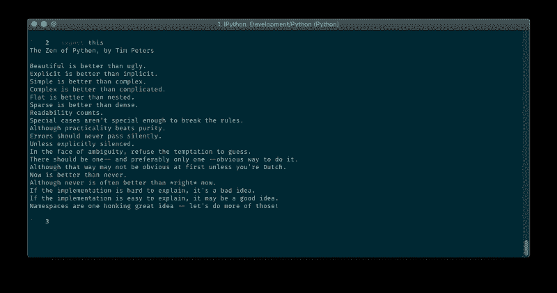
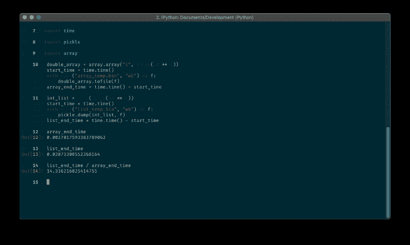

# 很棒的 Python 模块，你可能没有使用(但应该使用)

> 原文：<https://www.freecodecamp.org/news/awesome-python-modules-you-probably-arent-using-but-should-be-ec926da27439/>

作者:亚当·戈德施密特

# 很棒的 Python 模块，你可能没有使用(但应该使用)

Photo by [Chris Ried](https://unsplash.com/@cdr6934?utm_source=medium&utm_medium=referral) on [Unsplash](https://unsplash.com?utm_source=medium&utm_medium=referral)

Python 是一门漂亮的语言，它包含许多内置模块，旨在帮助我们编写更好、更漂亮的代码。

### 目标

在整篇文章中，我们将使用一些鲜为人知的模块和方法，我认为它们可以改进我们的编码方式——在可见性和效率方面。

### 命名元组

我相信你们中的一些人已经从`collections`模块中知道了更流行的`namedtuple`(如果你不- [查看一下](https://docs.python.org/3.6/library/collections.html#collections.namedtuple)，但是从 Python 3.6 开始，`typing`模块中有了一个新的类:`NamedTuple`。两者都旨在帮助您快速创建可读的不可变对象。

`NamedTuple`实际上是`namedtuple`的打印版本，在我看来，可读性更好:

下面是另一种选择:

### 数组.数组

> *高效的数值数组。数组是序列类型，除了存储在其中的对象的类型是受约束的以外，其行为非常类似于列表。— [Python 文档](https://docs.python.org/3.6/library/array.html)*

当使用`array`模块时，我们需要用 typecode 实例化它，这是它的所有元素都将使用的类型。让我们用一个普通的列表来比较时间效率，将许多整数写到一个文件中(对于一个普通的列表使用`[pickle](https://docs.python.org/3.7/library/pickle.html)`模块):

[https://gist.github.com/AdamGold/961758c66cdfe92642eabb61d9ce9866](https://gist.github.com/AdamGold/961758c66cdfe92642eabb61d9ce9866)

**快了 14 倍**。那太多了。当然这也依赖于`pickle`模块，但是这个数组比列表更紧凑。所以如果你使用简单的数值，你应该考虑使用`array`模块。

### itertools .组合

`itertools`是一个令人印象深刻的模块。它有许多不同的节省时间的方法，所有这些都列在这里。甚至还有一个包含更多 itertools 的 GitHub 库！

这周我开始使用`combinations`方法，我想我会分享它。此方法将 iterable 和 integer 作为参数，并创建一个生成器，该生成器由 iterable 的所有可能组合组成，最大长度为给定的整数，没有重复:

### dict.fromkeys

创建带有默认值的字典的一种快速而漂亮的方法:

### 最后但同样重要的是——`dis`模块

> *`[dis](https://docs.python.org/3/library/dis.html#module-dis)`模块通过反汇编支持对 CPython [字节码](https://docs.python.org/3/glossary.html#term-bytecode)的分析。*

您可能知道也可能不知道，Python 将源代码编译成一组称为“字节码”的指令。模块帮助我们处理这些指令，它是一个很好的调试工具。

这里有一个来自[流利的 Python 书籍](http://shop.oreilly.com/product/0636920032519.do)的例子:

我们出现了一个错误，但操作仍然成功。怎么会这样好吧，如果我们看看字节码(我在重要部分附近添加了注释):

### 在你走之前…

感谢阅读！更多 Python 相关的文章和其他很酷的东西，你可以关注我的 [Medium](https://medium.com/@adamgoldschmidt) 或 [GitHub](https://github.com/AdamGold) (我有一些很棒的回复！).

如果你喜欢这篇文章，请按住鼓掌按钮？帮助其他人找到它。你拿的时间越长，你给的掌声就越多！

不要犹豫，在下面的评论中分享更多的 Python 隐藏的宝石。