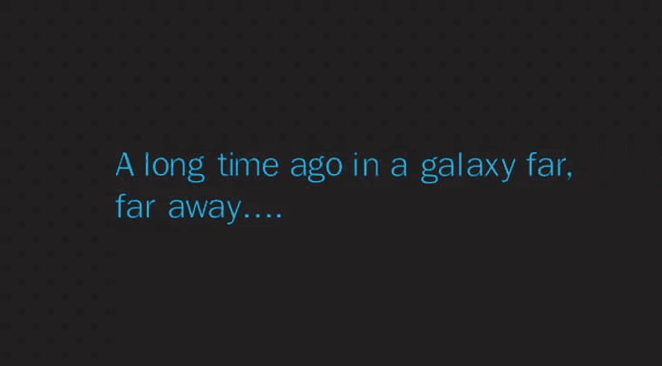

# 下面是我想放弃初级开发人员时做的事情

> 原文：<https://www.freecodecamp.org/news/heres-what-i-did-when-i-wanted-to-give-up-as-a-junior-developer-af41d5aa2edd/>

编码很难。真的很难。有时候你会想“这太棒了！我爱这个！”

但你也会有不那么美妙的时光。当你连续几天盯着同一个错误或者试图理解一个新概念时。你可能会想，“我不适合做这个。我为什么要努力？”

那么，如果你觉得自己想要放弃，你会怎么做？我有一些建议给你，但首先，这是我的故事，关于当我几乎放弃的时候，我做了什么…

**注意**:可以直接跳到[提示](https://medium.com/p/af41d5aa2edd#53aa) : **退一步，体会到这是正常的。**

**灯光暗淡&戏剧性的介绍音乐播放**

*Disclaimer: The following story took place not that long ago and within the current galaxy*

当我第一次开始将编程作为计算机科学课程的一部分时，我感到非常失落。人们会说，当你刚刚开始时，你不应该知道很多，但我在开始时真的很挣扎。

我只是不能理解任何编码概念:

**抽象:** *专注于想法而不是实现的想法*……“好的，尤达，这是什么意思？”

**接口:**“啊！我知道这个！这是用户用来与…哦，等等“互动的东西

**功能和对象:**“不太确定这些东西我需要多少或者什么时候需要。所以我现在只使用一个"***创建名为 MyClass.js*** 的单块文件

**数组:**“数组装东西。明白了。但只有一种东西。好吧，我想很公平。哦，看，你可以做一个 2D 数组…一个数组的数组。轻松点。我已经准备好开始这项任务了:

*赋值:下面这段代码是一个 3D 数组，是数组的数组的数组，包含随机数。遍历数组，按顺序打印出质数和它们出现的频率。考虑时间复杂度。*

“…嗯…”

***离开大楼***

不要让我从数据结构和算法开始…

我不知道为什么我的功课落后了这么多。

是因为我不适合编码吗？

是我的课程和讲师的质量吗？

是因为我在大学的头几周喝了大量的啤酒，参加了大量的派对吗(不，不可能是那样的)。

经过几年的挣扎和挣扎，我仍然不能编写最简单的应用程序。最后一根稻草是，当我面试实习的时候，一家公司告诉我应该考虑另一个领域。

这是我的最低点，我很想放弃和退学。但是技术是我的激情所在，我最想成为一名开发人员。我在大学的最后一年，我决定适可而止。

我坐下来，打开笔记本电脑，放上一些 AC/DC，开始**练习**。

我会天天练习。在编码网站上，在我自己的小项目上，跟随教程，如果有练习代码的方法，我正在做。当我不写代码的时候，我在阅读关于代码的书籍。我阅读其他人的代码。我读到过写好代码的人。

缓慢但稳定地，它开始发出滴答声。所有我不理解的概念都慢慢向我走来。就像从灰烬中重生的凤凰(或者说，更多的是与计算机相关的东西，而不是戏剧性的东西)，我毕业了，并得到了我的第一个初级开发人员的角色。

经过多年的经验、学习和错误(那些故事改天再说！)我已经过了初级开发人员阶段。我目前在一家初创公司工作，负责产品开发。我也在指导比我资历浅的开发人员，并且热爱其中的每一分钟。

我现在的任务是将我的知识传递给全世界的初级开发人员。向大家展示，任何人都可以通过努力工作和奉献精神进入 web 开发的世界。

希望我没有让你太厌烦——还在听吗？很好，让我们来看看当你感觉有点失败时可以尝试的技巧。

### 后退一步，意识到这很正常

在你放弃你的 web 开发职业之前，首先要做的是认识到有时感到不知所措是非常自然的。最好的方法是暂时远离代码。去散散步，看看书或者看看电视。基本上，休息一下，放松一下。如果你需要休息几天，那也很好。

当你回来的时候，希望你会感觉更精神，更有动力再去一次！如果没有，这里有几样东西你可以试试。

### 有耐心

我觉得这个表述的不够，但是耐心对于各个层次的开发者来说都是超级重要的。学习编码时，不理解某些东西会令人沮丧，尤其是当你已经看了几个小时的时候。

但是下一次当你感觉自己因为一个 bug 和错误而沮丧的时候，记住上一点的“后退”方法，试着告诉自己:

“好吧，这很糟糕，但沮丧于事无补。我要休息一会儿，带着新鲜的眼光回来，再试一次”。

你会惊讶这有多大的帮助。

### 当你获得胜利时，庆祝胜利

我遇到的许多初级开发人员可能对自己非常苛刻，不能正确地承认他们的成就。

“我终于让这个按钮在我的应用程序上工作了，但花了一整天！”

那又怎样？关键是它现在起作用了！万岁。

当你获得胜利时，庆祝胜利是很重要的。无论你是想让你的第一个 HTML 页面工作，还是想创建你自己的复杂的 web 应用程序，只要你有所成就，就要庆祝一下。

大声呼喊“成功”，在房间里跳来跳去，和邻居一起跳舞。好吧，这可能有点过了(我什么都没做，我发誓…)但是你明白了。通过庆祝胜利，你承认了自己的成就，让自己充满喜悦，激励自己继续争取更多的胜利。

### 设定更小的、可定义的目标

坐下来说“好吧，我的目标是学习如何编码”很容易。这是一个伟大的目标，但很难衡量。你什么时候学完了编码？是在你创建第一个网站的时候吗？当你创建了你的第一个大型应用程序？当你有了第一份工作。

然而，如果你说，“今天我要学习 JavaScript 和 ES6 中的箭头语法是什么”呢？你有一个清晰可定义的目标，很容易衡量，你猜对了——一旦你达到目标，就给你一个值得庆祝的胜利。

通过更频繁地创造和达成更小的目标，你会觉得自己在进步。

### 记下你的进步

即使你设定了自己的目标，也很难记住所有的事情。你可能一开始的意图是完成一件事，后来就岔开了，结果是学习或者做别的事(这种事我经常遇到！).

记录你进步的一个好方法是把每件事都记在日记里。在你的一周、一天或其他任何事情的开始，写下你计划实现的目标。当你实现了这个目标，把它写下来，连同任何你想记起来的笔记。没达到目标？没问题，写下原因——是因为分心，做了其他更有趣的事情，需要休息，等等。

如果你曾经感到失败，看看你的胜利日志——你会惊讶于你已经走了这么远！

### 回顾你早期的项目

另一个很好的方法是查看你的早期代码练习和项目。这是你前进的书面轨迹，无论是你的第一个 HTML 页面，你的第一个“Hello World”应用还是你的第一个 TODO 应用。

您可能会回过头来想，“哦，我记得我花了很长时间才弄明白如何添加这些复选框！现在我闭着眼睛也能做到”。

所以把你做的一切都放到 GitHub 上，或者保存在你的电脑上。不管它有多小，它都是你旅程的一部分，记住它很重要。

### 加入社区

没有比 web 开发社区更好的社区了。从开源软件到免费资源，再到学习编码，成为其中的一份子真的很棒。

我希望我能早点加入这个社区——这会让我的 web 开发之旅中的困难部分变得容易得多。

为什么？因为有支持。有许多伟大的社区，从[自由代码营](https://www.freecodecamp.org/)和[代码新手](https://www.codenewbie.org/)，到 Subreddit 和 Twitter 团体，都是为了支持其他程序员而建立的。

我强烈建议加入这些社区。分享你在做什么，看看其他人在做什么，并参与讨论。当你的帖子得到一些赞、感谢或回复时，这是一个巨大的动力。

### 努力工作，不要放弃

正如我在开头所说的，编码很难。继续投入工作，当你获得胜利时庆祝胜利，不要放弃。到头来还是值得的！用纳尔逊·曼德拉的话说:

> 在完成之前，一切似乎都是不可能的。

*感谢阅读！*

我目前正在创建一系列指南、文章和视频课程，来帮助你踏上 web 开发之旅。如果你想成为其中的一员，请务必通过 [chrisblakely.dev](https://www.chrisblakely.dev/#sign-up) 加入邮件列表！