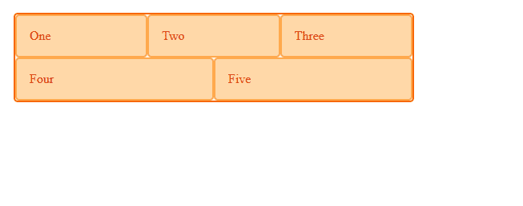
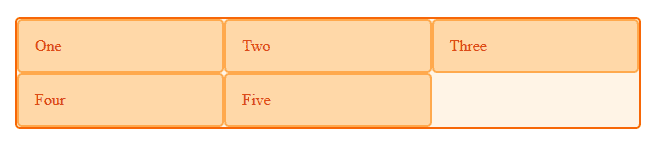
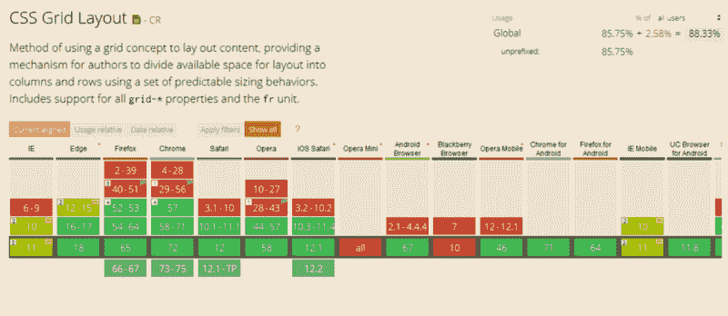

# Flexbox 和 CSS 网格的主要区别

> 原文：<https://www.freecodecamp.org/news/the-main-differences-between-flexbox-and-css-grid-667c03461d2b/>

作者:夏拉·威廉姆斯

# 【Flexbox 和 CSS 网格的主要区别


尺寸定义了 Flexbox 和 CSS 网格之间的主要界限。Flexbox 是专门为一维布局设计的，而 CSS Grid 是为支持二维布局而设计的。因此，CSS Grid 可以轻松地同时呈现行和列。

用外行人的话来说，CSS Grid 呈现了一个更大的画布，而 Flexbox 提供了在有限空间内操作的微小功能。网格是为二维组织而设计的。

然而，这两个规范有一些共同点，如果你知道如何使用灵活的盒子，你会发现一些概念，这将有助于你掌握 CSS 网格。

在本文中，我们将讨论 Grid 和 Flexbox 之间的主要区别，总结如下:

*   Flexbox 是为一维布局设计的，而 Grid 是为二维布局设计的。
*   CSS Grid 的方法首先是布局，而 Flexbox 的方法主要是内容。
*   Flexbox 布局最适合于应用程序组件和小规模布局，而网格布局是为设计中非线性的大规模布局而设计的。

### ***了解 Flexbox 和网格***

#### 一维柔性盒

CSS 灵活框布局(或 Flexbox)允许设计者在不同大小的屏幕中适当地放置响应元素。这些工具包括:

*   文档的方框布局，
*   用于定义屏幕上文本外观的内联布局，
*   描述一维表格数据的表格布局，
*   和允许显式定位响应元素的定位布局模式。

Flexbox 在前端开发人员中很受欢迎，因为它允许开发人员创建动态布局的多个实例，并毫不费力地在容器内对齐内容。

[柔性框模块](https://developer.mozilla.org/en-US/docs/Web/CSS/CSS_Flexible_Box_Layout/Basic_Concepts_of_Flexbox)被设计为一维表示模型，并作为一种方法，可以提供界面元素之间的空间分布和强大的对齐功能。当我们将 flexbox 描述为一维时，我们描述的事实是 flexbox 一次处理一个维度的布局，作为一行或一列。这可以与 CSS 网格布局的二维模型相比较，后者同时控制列和行。

```
<div class=”wrapper”> <div>One</div> <div>Two</div> <div>Three</div> <div>Four</div> <div>Five</div></div>
```

```
.wrapper { width: 500px; display: flex; flex-wrap: wrap;}.wrapper > div { flex: 1 1 150px;}
```



优点:

*   Flex 可以在任何方向排列
*   Flex 可以颠倒或重新排列其视觉顺序。
*   项目可以在容器中对齐，也可以在它们之间对齐。
*   支持所有浏览器。

缺点:

*   性能问题


#### 二维网格

CSS Grid 按列和行对齐项目，允许开发人员轻松控制大型布局和整个页面的渲染和外观，这些布局和页面适用于桌面、平板电脑和智能手机显示器。

项目被放置在由网格定义的单元格内。创建和定义整体布局仍然是 CSS Grid 的强项。Internet Explorer、Chrome、Safari、Edge 和 Firefox 支持网格。值得注意的是，Opera Mini、黑莓浏览器、QQ 浏览器、百度浏览器都不支持网格。

它提供了创建布局的自动化，或者定义在给定网格内执行放置的自动放置规则。

```
<div class=”wrapper”> <div>One</div> <div>Two</div> <div>Three</div> <div>Four</div> <div>Five</div></div>
```

```
.wrapper { display: grid; grid-template-columns: repeat(3, 1fr);}
```



优点:

*   网格轨迹是在样式表中创建的。
*   减小文件大小。
*   用 CSS Grid 做原型是快速高效的。

缺点:

*   并非所有浏览器都支持



### 【Flex 和 Grid 的区别

#### **维度和灵活性**

Flexbox 可以更好地控制项目之间的对齐和空间分布。由于是一维的，Flexbox 只处理列或行。该系统适用于较小的布局，但不能呈现复杂的显示，如支持浮动和列的文本或以文档为中心的属性。

Grid 具有二维布局功能，允许以灵活的宽度作为长度单位。这弥补了 Flex 的局限性。

#### **对准**

Flexbox 允许对对齐进行微调，以确保准确的规范共享。Flex Direction 允许开发人员垂直或水平对齐元素，这在开发人员创建和反转行或列时使用。

为了同时在两个维度上进行更广泛的对齐，CSS Grid 为网格流动性和自动关键字功能部署了分数度量单位，以自动调整列或行。内置的自动化将开发人员从可能源于混乱计算的返工制度中解救出来。

#### **物品管理**

Flex 容器是父元素，而 Flex 项目代表子元素。Flex 容器可以通过调整项目尺寸来确保平衡的表示。这使得开发人员可以针对不断变化的屏幕尺寸进行设计。

为了微调这种美感，Grid 支持隐式和显式内容放置。其内置的自动化功能允许它自动扩展行项目，并将值从前面的项目复制到新的创建项目中。

### 结论

Flexbox 和 CSS Grid 都允许对它们各自的前端开发领域进行强大的控制。然而，当它们组合在一起时，它们的功能会成倍增加，利用它们各自的优势来创建极其流畅、可定制、漂亮、流畅和简单的体验。

组合它们的代码还会产生一个更轻量级的设置，其中两个领域中的抽象会溢出到另一个领域。这两个选项都有广泛的应用，当它们组合成一个强大的设置时，甚至更多。

点击了解更多关于[网格布局与其他布局方法的关系。](https://developer.mozilla.org/en-US/docs/Web/CSS/CSS_Grid_Layout/Relationship_of_Grid_Layout)

这篇文章是由 techiespad 博客的成员提供的。