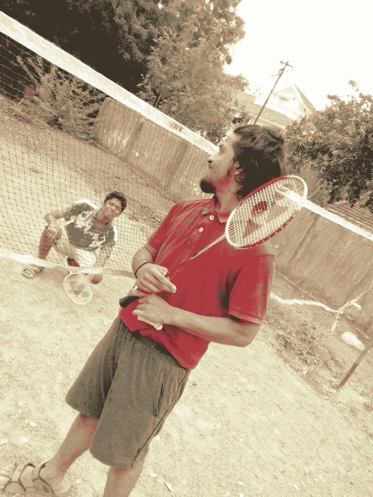
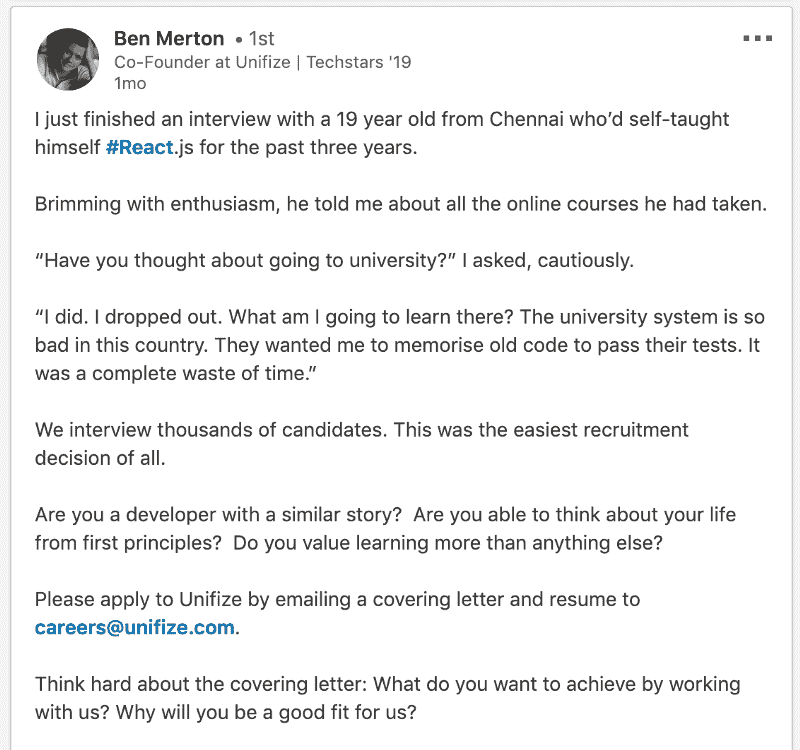
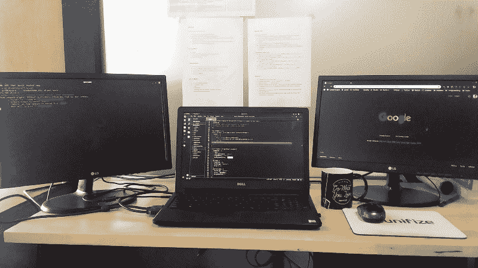

# 我是如何在十九岁时辍学并在印度找到一份开发工作的

> 原文：<https://www.freecodecamp.org/news/how-i-dropped-out-and-got-a-job-as-a-developer-in-india-at-the-age-of-nineteen-3e8c30b83cce/>

### 关于我自己

我是一名来自印度的 19 岁自学成才的 web 开发人员。我在大学一年级的时候开始了我的编程之旅。我从小就对电脑着迷。我仍然记得在我二年级的时候得到了我的第一台电脑。从那以后我就被它粘住了。我原以为编程会太复杂，但我知道我想在科技领域有所作为。

在我上学期间，我是一个极其普通的孩子。考试不及格，逃课，沉迷于 YouTube。我只想玩电子游戏和看 YouTube 视频。我决定适可而止，并计划至少在进入大学后提高自己。这就是我高中毕业后决定报读计算机科学学士学位的原因。我设法进入我们城市的一所著名的大学。我非常兴奋和好奇，想了解关于计算机的一切。

### 大学的开始

Photo by [Franck V.](https://unsplash.com/@franckinjapan?utm_source=medium&utm_medium=referral) on [Unsplash](https://unsplash.com?utm_source=medium&utm_medium=referral)

大学和我想象的完全不同。我的大多数同学加入计算机科学只是因为他们想获得某个学位。我们的教授告诉我们要记住 C 程序才能通过考试。他们甚至懒得解释我们为什么要以这种方式做事情。我的同学会一行一行地背像冒泡排序、二分搜索法等算法，只是为了通过实践。

对于每学期的实践，我们在教学大纲中有大约 15-25 个项目。我们的教授会把我们必须在课堂 WhatsApp 小组上写的程序截图发给我们。我们必须用流程图写所有的程序，在笔记本上记下要采取的步骤。在一次实践考试之前，我们不得不在另一个笔记本上重新写一遍，我们称之为“记录笔记本”。然后就在我们的实践考试之前，我们必须提交这两个笔记本。只有我们把所有这些都写了两遍，我们才能被允许参加实践考试。

### 辍学

Photo by [Braden Hopkins](https://unsplash.com/@bradenh13?utm_source=medium&utm_medium=referral) on [Unsplash](https://unsplash.com?utm_source=medium&utm_medium=referral)

大学让我非常失望。简直是折磨。就在那个时候，我决定自学编程。我开始意识到网上可用的资源。从哈佛大学的课程到十美元的 Udemy 课程，网上可用资源的数量让我吃惊。

那时我发现了 freeCodeCamp，在我大学第一学期结束后的假期里。我上瘾了！我整个假期都在解决自由代码营的挑战。我仍然记得在完成第一个项目(致敬页)后，我给所有的朋友和亲戚打了电话。我为自己感到骄傲。事实上，我已经建立了自己的东西让我非常高兴。尽管我的第一个项目非常简单，但它给了我信心。

大学毕业后的每一天，我都会去 freeCodeCamp 继续学习。过了一段时间，我开始逃课去做 freeCodeCamp。我的出勤率很低，以至于不允许我写试卷。我有两个选择:继续上大学并全职专注于此，或者退学自己学习。所以我问自己大学到底教会了我什么。我意识到这并没有教会我什么，但它给了我勇气。选择人迹罕至的道路的勇气。

### 求职

说服我的家人是我旅途中最艰难的部分。在和他们谈了几个小时后，我设法做到了。但我的父母仍然心存疑虑，因为辍学在印度并不普遍。我决定在求职前花些时间做好准备。在那些日子里，我玩得很开心。我会参与免费代码营的项目，和我的表兄弟们一起玩，打羽毛球。2018 年底打算求职。

Photo by [Hari](https://www.instagram.com/harinypd) (my cousin) Our badminton court ;D

我已经有了一个不错的作品集(感谢 freeCodeCamp ),这真的帮助我的工作申请得到了关注。我在 AngelList、LinkedIn、Glassdoor 等网站上申请了多家公司。大多数公司在面试前都会给我一些工作任务。我申请的公司中大约 95%都不在乎我的学历。

### 第一份工作

找了大约一个月的工作后，我接到了一家名为 Unifize 的公司的电话。该公司的一位联合创始人对我说。他给了我一个 15 天的试用期，之后如果他们满意，我就会被雇用。面试两天后，我在他的 LinkedIn 上发现了这篇[帖子](https://www.linkedin.com/feed/update/urn:li:activity:6497453777174528000)，让我喜极而泣！

Ben Merton’s LinkedIn Post

十五天后，我得到了这份工作！加入 Unifize 已经一个月了。我爱死它了！

### 结论

我真的要感谢 Quincy Larson 和 freeCodeCamp 的其他团队成员制作了这么一个令人惊叹的平台。我也要感谢社区在我的旅程中一直鼓励我。最后，我要感谢[本·默顿](https://www.freecodecamp.org/news/how-i-dropped-out-and-got-a-job-as-a-developer-in-india-at-the-age-of-nineteen-3e8c30b83cce/undefined)，阿维纳什·苏坦普尔和拉克什曼·塔伊给我这个机会。如果没有 freeCodeCamp，这一切都不可能实现。非常感谢，伙计们！:)

My workspace :D

欢迎随时在 [Instagram](https://www.instagram.com/node_monk/) 、 [LinkedIn](https://www.linkedin.com/in/arun4033622) 、 [Twitter](https://twitter.com/node_monk) 上与我联系。感谢您花时间阅读本文！