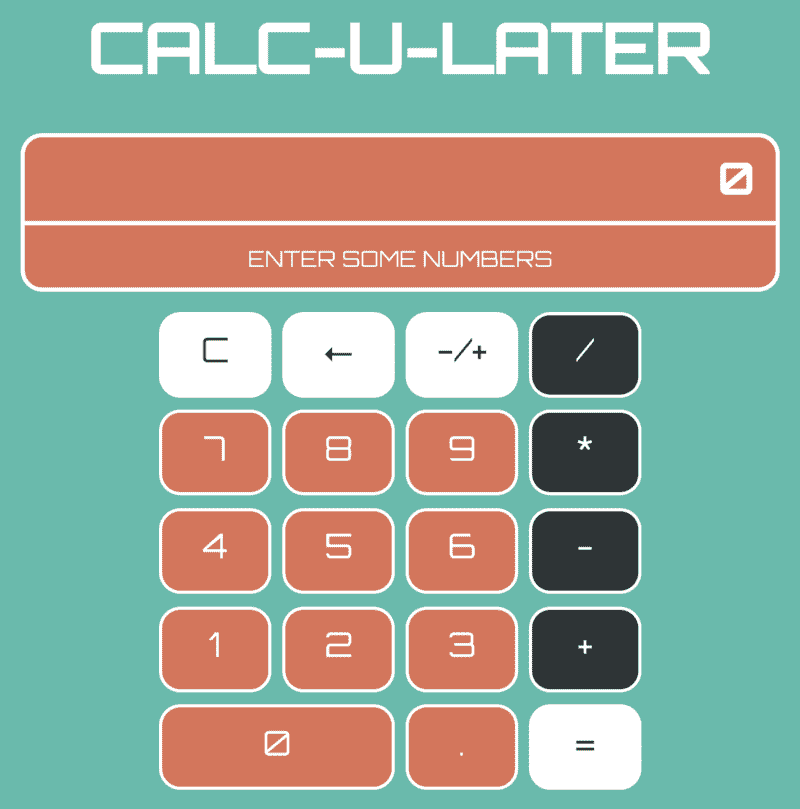

# 如何用 React 钩子和 React 上下文 API 构建一个计算器

> 原文：<https://www.freecodecamp.org/news/building-a-calculator-with-react-hooks-and-react-context-api-debcabbc5f54/>

作者:Theran Brigowatz

# 如何用 React 钩子和 React 上下文 API 构建一个计算器


Photo by [Crissy Jarvis](https://unsplash.com/@crissyjarvis?utm_source=medium&utm_medium=referral) on [Unsplash](https://unsplash.com?utm_source=medium&utm_medium=referral)

如果你和我一样，当你第一次听说 React Hooks 的时候，你可能会有一点矛盾，或者对所有的宣传感到困惑。如果我不再需要写出类组件，那又有什么大不了的呢？然而，一旦我一头扎进去并开始使用它们，我真的看不到自己会回到钩之前的日子。用布鲁斯旅行家不朽的话来说，“钩子把你带回来。我不会对你撒谎。"

有一段时间，我在寻找关于如何结合上下文 API 使用钩子的指南。在只找到了几个充分解释了这个概念的例子之后，我决定做任何优秀的开发人员都应该做的事情:仔细阅读文档，然后自己构建一些东西。努力通过它，自己学习它，是吸收知识的最好方法之一。这是一个如何使用钩子和上下文来构建相同项目的指南。

#### 概观

这个项目将是一个类似于 iPhone 计算器的基本计算器应用程序。因为这只是一个简单的桌面应用程序，我用后退按钮代替了%按钮。虽然我不会用它来参加 sat 考试，但你绝对可以用它来计算脚趾的数量。

这个项目有一个工作的[部署版本](https://calc-u-later.netlify.com/)，或者你可以在 [GitHub](https://github.com/theranbrig/calculator) 上查看所有代码。



Our application layout. Nothing too fancy here.

### 该项目

#### 入门指南

首先，我们将使用`create-react-app`。您可以通过运行以下命令开始:

```
npx create-react-app calculatorcd calculatornpm start
```

#### 文件结构和 CSS

应用程序的文件结构应该如下所示。在`src`文件夹中创建以下文件或者只留下`App.js`和`index.js`。

```
src├── App.js├── index.js└── components    ├── BackButton.js    ├── Calculator.js    ├── ClearButton.js    ├── Display.js        ├── EqualButton.js    ├── FunctionButton.js    ├── NegativeButton.js    ├── NumberButton.js    ├── NumberProvider.js    └── styles        └── Styles.js
```

如果你想完全跟随，你也可以为 CSS 安装样式化的组件。

`npm -i styled-components`

然后你可以从[这个链接](https://gist.github.com/theranbrig/dbf478ac4c961d6c8a193de582420ce1)添加样式化的 CSS 到`Styles.js`文件或者添加你自己的。

#### 主应用程序结构

`Calculator.js`文件应该设置显示器和数字键盘。它应该包含所有的按钮类型。

您会注意到，所有按钮组件都与数字显示一起添加到这里。每个按钮组件本质上是相同的。它们都应该遵循相同的基本结构。`zero-button`得到一个单独的`div`,因为我们使用 CSS Grid 进行布局，它需要跨越两列。(PS——如果你想了解 CSS Grid 的更多信息，我写了一篇关于基础知识的[小文章](https://medium.com/@theran.brigowatz/gettin-griddy-with-it-build-your-own-css-grid-and-drop-the-frameworks-7d8c498c8b1b)。)

你可能会注意到`buttonValue`道具只需要用于`NumberButton`和`FunctionButton`组件。每个按钮都应该遵循相同的基本结构，并具有唯一的名称。你可以参考上面的文件结构，看看需要哪些按钮。如果按钮没有通过 props 传递一个`buttonValue`，那么按钮应该在按钮组件中写有符号。为文件结构中的每个按钮类型创建一个。

在这之后，你应该有一个计算器的基本结构。我们一会儿将回到展示上来。现在，我们将进入应用程序的内部工作，看看我们如何使用我们的钩子和上下文。

#### 构建上下文 API 提供程序

我们现在要创建`NumberProvider.js`。这是你的应用程序的核心，也是我们的功能所在。如果您从未使用过 React Context API，它是一个很好的工具，可以帮助您将数据从一个组件传递到另一个组件。

想象一下当你的组件相互嵌套的时候。在过去，你必须进行“道具训练”。这是当您通过嵌套组件向下传递数据或函数时。这很难说是理想的，尤其是当你开始深入几层的时候。

但是，使用这个提供者组件，它允许您将数据传递给任何嵌套组件，不管有多深。这个号码提供者将包装我们的`App`组件。现在，无论何时我们想要获得数据，或者使用存在于提供者中的函数，它都是全球可用的。这使我们不必“钻透”嵌套的组件。你坚持真理的唯一来源，这是 React 的本质。要开始，您需要创建提供者。它应该如下所示:

创建了基本提供程序，并且传入的任何值现在都可供所有嵌套组件使用。为了使其可用，我们将包装我们的`App`组件，使其全球可用。我们的`App`会有这个代码。

#### 使用上下文提供程序

现在我们可以为我们的显示添加代码。我们可以通过从新的 React Hooks API 传入`useContext`函数来显示该值。我们不再需要通过嵌套组件来传递属性。显示应该是这样的:

通过调用`useContext`并传递我们创建的`NumberContext`，您在`NumberProvider`中向上传递三级的数字立即可用于`Display`组件。你的数字显示器现在已经启动并运行，因为它显示的是我们已经设置为零的`number`。

当然，现在我们的计算器显示的是一个零。如果你在计算我和一个新出生的儿子的睡眠时间，这是很棒的，但如果试图添加任何其他东西，就不那么棒了，所以让我们使用一些钩子来让这个计算器计算。

#### 钩子入门

如果您以前没有使用过钩子，它本质上允许您摆脱类语法，取而代之的是在功能组件中拥有状态。在这里，我们可以将以下内容添加到我们的`NumberProvider.js`文件中，以便创建我们的第一个钩子。

可能有一些你没见过的语法。我们不是用 state 写出我们的类，而是将 state 的每个部分分解成它自己更小的`number`变量。还有一个`setNumber`，它的作用与`setState`函数相同，但是现在为一个特定的变量工作，并且可以在需要的时候被调用。`useState`允许我们设置一个初始值。

我们现在可以在函数中使用这些来将数字按钮的值传递到显示器中。在这个应用程序中，计算器使用字符串来获取输入。有一些检查可以确保你的号码中不能有多个`.`，并且你的号码不能以一连串的零开始。

#### 构建按钮组件

现在，您可以在任何嵌套组件中使用上下文 API 调用这个函数。

现在你已经有了一串数字生成器。您可以看到如何通过`useContext`函数将您在`NumberProvider`中设置的值注入到应用程序的其他组件中。国家和影响它的功能都保存在`NumberProvider`中。你只需要在你想要的特定上下文中调用。

当你开始给你的应用程序增加更多的复杂性时，你就可以开始看到这有多棒了。假设您希望用户组件检查您是否登录以使用特殊功能。您可以创建一个单独的提供程序来保存用户数据，并使其可用于任何嵌套组件。

我们可以继续向我们的计算器添加函数，并通过内置的`useContext`函数将它们传递给适当的组件。

#### 已完成的提供商功能

完整的`NumberProvider`如下所示，包含以下与挂钩一起使用的功能。

*   `handleSetDisplayValue`设置您在显示屏上输入的值。我们正在检查数字字符串中是否只有一个小数，并且我们将数字长度限制为 8 个字符。你可以把它看作是一个提示计算器，而不是帮助你通过微积分考试的计算器。它接受`NumberButton.js`中的`buttonValue`属性。
*   获取并存储我们的显示字符串，以便我们可以输入另一个数字。这是我们的储值。它将被用作辅助功能。
*   `handleClearValue`将所有内容重置回 0。这是你的明确职能。它将被传递给`ClearButton.js`。
*   `handleBackButton`允许您一次删除一个先前输入的字符，直到回到 0。这属于`BackButton.js`文件。
*   是你得到数学函数的地方。它设置你是加、减、除还是乘。它被传递到`FunctionButton.js`文件中，并接受`buttonValue`属性。
*   `handleToggleNegative`顾名思义。它允许您在计算后对显示值或存储值执行此操作。这个当然进去`NegativeButton.js`。
*   做数学运算。最后。因为这只是一个简单的四函数计算器，它只是使用简单的开关函数，这取决于我们在状态中的`functionType`。我们使用`parseInt`,因为我们以字符串的形式传递我们的数字。此外，我们四舍五入到只有三个小数位，以确保我们没有疯狂的长数字。

#### 完成的展示

你还需要一个显示器。在这种情况下，它将显示`number`和`storedNumber`以及您的`functionType`。有一些检查，例如当你有一个空字符串作为数字时显示 0。

为了简洁起见，我不打算包括所有的按钮功能，因为它们与上面的`NumberButton.js`文件非常相似。只要确保在必要的时候传入一个`buttonValue`属性，并且从上面的列表中传入正确的函数。

#### 查看所有代码

如果您想查看该项目的完整代码，可以在以下位置找到:

[GitHub 回购](https://github.com/theranbrig/calculator.)

[计算后部署](https://calc-u-later.netlify.com/)

### 结论

我希望这能澄清一点 React 钩子和上下文 API 是如何一起使用的。使用这些内置的 React 特性有几个好处。

*   简单易懂的语法，摆脱了类组件的混乱。不再有超级和构造函数。只有几个干净的变量。
*   更容易在组件内部和组件之间设置和使用状态。不再有穿过多个组件杂乱的道具钻孔。
*   在小项目中消除对 Redux 的需求，在小项目中你不需要在复杂的状态中持有太多。你可能不会用它来重建脸书，但它可以在小规模的应用程序上完成这项工作。

请让我知道你的想法，或者如果你在代码中遇到任何问题。希望这能给你以前不熟悉的东西一点启发。React 挂钩和上下文是简化 React 应用程序和编写更简洁代码的好方法。

在[https://theran.co](https://theran.co)查看更多我的作品和其他项目。