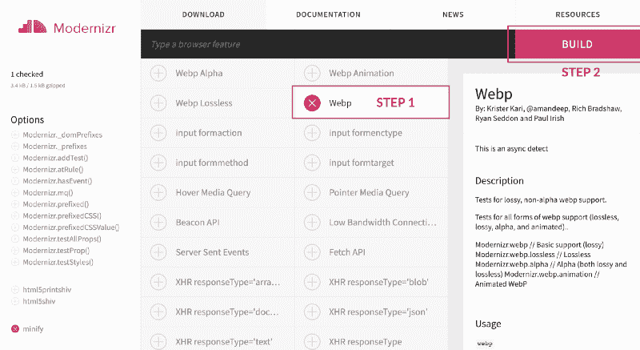
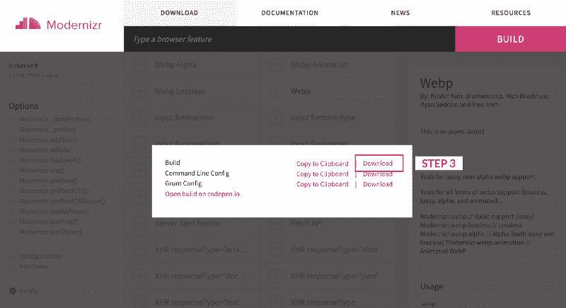

# 如何让你的网站以闪电般的速度加载 WebP 图片

> 原文：<https://www.freecodecamp.org/news/make-your-website-load-lightning-fast-with-webp-images-cf55c98ac0a2/>

卡门·钟

# 如何让你的网站以闪电般的速度加载 WebP 图片

有没有觉得你的网站加载时间太长了？

好消息是你并不孤单。谷歌发布的一份报告发现，他们分析的 70%的页面需要超过 10 秒的时间来加载——仅仅是一个页面。

坏消息是…嗯，那很糟糕。同一份报告发现，如果网页加载时间超过三秒，53%的访问者会离开手机。这意味着每一秒你的网站加载失败，一个潜在的顾客或客户正在下降。

幸运的是，仍然有一些好消息:WebP 文件格式可以将你的图像压缩到甚至比 JPG 文件更小的大小，而质量几乎没有下降，使你的网站加载速度增加一倍以上。最重要的是，只有不到 0.1%的网站使用 WebP 来优化他们的图片(稍后将详细介绍原因)，你可以获得超越竞争对手的真正优势。


#### 稍等一下:什么是 WebP？

WebP 是一种图像格式，使用预测编码对图像进行编码，为互联网上的图像提供无损和有损压缩。它于 2010 年推出，目前由谷歌开发和支持。但不仅仅是谷歌在使用 WebP: Pinterest、脸书(在 Android 设备上)、YouTube 的缩略图都使用 WebP 图片，其他大玩家也是如此。

[谷歌声称](https://developers.google.com/speed/webp/)WebP 无损图像比其 PNG 等效图像小 26%，WebP 有损图像比其 JPG 等效图像小 25–34%(截至 2019 年 2 月)。

让我们用 WebP 图片做个测试。当我通过 WebP 转换器运行我的 JPG 图像时，我得到了以下结果:

*   JPG 图像(已经压缩): **279 KB**
*   100%无损的 WebP:**451 KB***(是的，这是更高的——下面有更多为什么！)*
*   80%损耗的 WebP:**156 KB***(原始大小的 56%)*


Left: Original jpg at 279 KB. Middle: 100% lossless WebP at 451 KB. Right: 80% lossy WebP at 156 KB.

*(以上照片太小看不出区别？如果你想看 80%有损的 WebP 图片，直接去[我的网站](https://www.carmenhchung.com)。)*

所以你可能想知道为什么无损的 WebP 图像实际上比原始的 JPG 大。这是因为我的原始图像实际上是一个无损的 PNG 文件，然后我转换并通过图像压缩器产生一个较小的 JPG 文件。在这个压缩过程中，转换器添加了所谓的*工件*。

当你逆转这一过程，并试图将有损 JPG 转换回无损文件格式(如 WebP)时，该算法将去除不必要的元数据(好)，但它也会对它找到的每个工件进行编码，以再现像素完美的图像(坏)，通常会导致文件大小增加，但没有视觉效果。因此，最终的文件会比直接从原始 PNG 文件转换而来的文件还要大！

> 专业提示:如果您的原始图像是无损文件格式(如 PNG、BMP 或 Raw)，请直接将其转换为 WebP 图像。不要先将其转换为有损文件格式(如 JPG 或 GIF)。

有损压缩(上图右侧的那个)创建的图像与原始图像大致相同:但由于压缩，图像尺寸变小了(质量有时会受到影响，尽管在这种情况下，这几乎看不出来)。此外，有损图像会不可逆转地失去质量，一旦转换为有损格式就无法恢复，这意味着如果您一次又一次地压缩同一个有损图像，每次质量都会下降。

> 专业提示:如果你压缩成有损格式，你应该总是压缩原始图像。不要一遍又一遍地压缩已经压缩过的文件，否则会加剧质量恶化。

#### 我不相信。给我看看结果。

我将上面的三张图片放在独立的测试页面上，同时对所有三个页面进行围攻(这是一个基准工具测试工具，我将在另一篇文章中详细讨论)，用大约 25 个用户同时访问我的测试页面，看看他们的响应时间有多快。

不出所料，80%有损的 WebP 文件(即最小的文件)速度最快，完全加载的平均响应时间为 **5.33 秒**；JPG 然后平均用了 **8.34 秒**；而 100%无损的 WebP 文件平均耗时 **12.28 秒**。

因此，80%有损的 WebP 文件比 100%无损的 WebP 文件快 2.3 倍，比 JPG 快 1.56 倍。

对于更多图片的网站(如摄影网站、博客或视觉作品集)，我认为速度负载差异会更大。

#### 那么，为什么不是每个人都使用 WebP 文件格式的图片呢？

截至 2019 年 2 月，[浏览器对 WebP 文件的支持](https://caniuse.com/#feat=webp)接近 72%，Chrome、Firefox、Opera 以及最新的 Edge 版本均有支持。不幸的是，Safari 和 IE(还)不支持 WebP 文件，所以你仍然需要为这些浏览器准备一个后备——下面会详细介绍。

#### 好吧，我很感兴趣。我如何实现 WebP？

首先，你需要将你的图片转换成 WebP 格式。有几种方法可以做到这一点，包括易于使用的转换器，如[这个](https://image.online-convert.com/convert-to-webp)或[这个](https://convertio.co/jpg-webp/)。对于那些使用 Photoshop 的人来说，你也可以使用 [WebP 插件](https://www.filecluster.com/howto/open-save-webp-image-files-photoshop/)来转换你的图像。

或者，你可以在这里下载谷歌的 WebP 转换器[，将 jpg 和 PNG 转换成 WebP，将 WebP 文件转换成 PNG 或 PPM。我更喜欢这个选项，因为我更信任谷歌软件转换的质量，我可以用每次转换指定精确的选项。](https://storage.googleapis.com/downloads.webmproject.org/releases/webp/index.html)

例如，要将 PNG 文件转换为 80%有损的 WebP，可以在终端/命令行中运行`cwebp -q 80 mypicture.png -o mypicture.webp`。关于如何使用该选项进行转换的直接说明可以在[这里](https://developers.google.com/speed/webp/docs/cwebp)找到。

不要忘记，一旦你转换了你的图像，要保留原来的 JPG 或 PNG 文件，因为你会需要它作为一个后备文件，以防用户的浏览器不支持 WebP。

#### 我有我的网页图片。现在怎么办？

让我们假设你想以普通的 HTML 方式显示你的图像(而不是在 CSS 类中，我将在后面讨论)。要做到这一点，使用下面的代码(显然，用您的图像文件的名称替换对`mypicture`的引用):

`HTML:`

```
<picture>
```

```
 <source srcset="images/mypicture.webp" type="image/webp">
```

```
 <source srcset="images/mypicture.jpg" type="image/jpeg">
```

```
 
```

```
</picture>
```

这里发生的事情是，我们首先检查浏览器是否支持`<pictu` re >标签。如果是，我们将提供 WebP 图像；如果没有，我们将提供 JPG 形象。如果浏览器甚至不支持`t the <`；图片>标签，然后我们将有一个最后的回落的 `the` 正常< img >标签。

#### 很好。但是如果我在 CSS 类中有一个图片，比如背景图片 url，该怎么办呢？

这需要更多的工作。

首先，你需要知道什么时候用户的浏览器*不能*处理你的 WebP 文件，这样你就可以加载备份的 JPG 或 PNG 文件(它们将在另一个 CSS 类中)。

为了做到这一点，我使用 Modernizr 来帮助我检测用户正在使用哪种浏览器(以及他们的浏览器支持哪些功能)。你可以去[他们的网站](https://modernizr.com/download?webp-setclasses)，点击“WebP”，然后点击“Build”。



然后会出现一个弹出窗口—点击构建命令旁边的“下载”。



之后，会下载一个名为`modernizr-custom.js`的文件——将该文件移动到您的网站目录中(比如您的根文件夹)。为了调用和触发 Modernizr，将它放在显示 WebP 文件的 HTML 页面的底部:

`HTML:`

```
// First, refer to the location of your downloaded Modernizr script. I have just left mine in the root folder.
```

```
<script src="modernizr-custom.js"></script>
```

```
// Second, trigger Modernizr to detect WebP compatibility.
```

```
<script>
```

```
 Modernizr.on('webp', function (result) {
```

```
 if (result) {
```

```
 // supported
```

```
 } else {
```

```
 // not-supported
```

```
 }
```

```
 });
```

```
</script>
```

Modernizr 现在会自动将`webp`或`no-webp`类应用于 HTML 元素(在我的例子中，是保存图像的容器)，这取决于它是否检测到浏览器对 WebP 的支持。这意味着您可以指定您想要在 CSS 类中包含哪些图像，方法是定位这些类中的任意一个，如下所示:

`CSS:`

```
.no-webp .container {     background-image: url("mypicture.jpg"); } 
```

```
.webp .container {     background-image: url("mypicture.webp"); }
```

#### **如果用户没有启用 Javascript 会怎样？**

啊！他们为什么要这么做？(我在看你，ie 浏览器！)

Modernizr 确实依赖于用户浏览器上启用的 Javascript，因此要解决这个问题，您需要在页面顶部添加一个 HTML 类，比如说`<html class=”no-j` s" >。

然后，添加 Javascript 代码，如果启用了 Javascript，该代码将成功删除该类:

`HTML:`

```
<script>     document.documentElement.classList.remove("no-js"); </script>
```

如果没有启用 Javascript，那么该类将自动应用于页面上的所有 HTML 元素——并且您可以创建一个以 JPG 图像作为背景图像的`no-js`类:

`CSS:`

```
.no-js .container {     background-image: url("mypicture.jpg"); }
```

#### **结论**

当您只是在 HTML 代码中显示图像时，WebP 图像相对容易实现(您不需要 Modernizr 或`no-js`类)，但是当您在 CSS 中使用图像(比如作为背景图像)时，就会变得稍微费时一些。

请记住，你的网站加载时间的长短会直接影响你的访问者在你的网站上停留的时间，从而影响你的潜在客户转化率，所以你花在切换到 WebP 图片上的时间是值得的，因为你的用户会在你的网站上停留更多的时间。

如果你实现了 WebP 图像，请在评论中告诉我——我很想知道你的网站有多快！

#### *感谢阅读！如果你喜欢这篇文章，请随意点击几下那个按钮(？？？？)帮别人找。*

#### **此外，查看我的免费资源* [这里](https://www.carmenhchung.com/media.html) *有所有代码(和有用的代码注释)，你可以复制到你的网站上实现 WebP 图像。？**