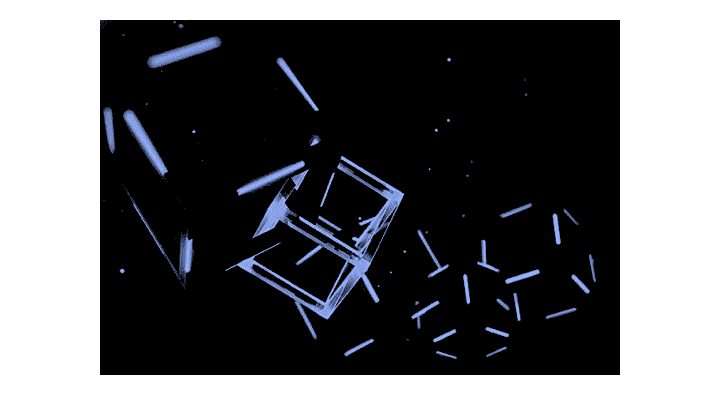

# 线性数据结构:JS 中的链表、栈和队列

> 原文：<https://www.freecodecamp.org/news/linear-data-structures-linked-lists-stacks-and-queues-in-javascript-a13c7591ad87/>

作者:梁荣立

基于 JS 中的[简单算法&数据结构，这里我们将看看数组和键值对象之外的数据结构，以及“标签化的&存放”盒子之外的数据结构。就像沿着路径的道路一样，**链表**、**栈** & **队列**是从一个数据单元移动到下一个数据单元的直接方式。](https://medium.freecodecamp.org/a-step-towards-computing-as-a-science-algorithms-data-structures-4c0e2d6ae79a?source=friends_link&sk=1291dffce9f32b30f36339d59a66e12c)

### 链接列表

一个**链表**就像一组锁在一起的盒子，存放在一个黑暗的房间里。要找到任何一个盒子，都需要从一端(头或尾)开始，沿着链接从一个盒子到下一个盒子。到达任何一个盒子后，你会被指向下一个盒子的方向。**没有索引**作为跳转到任何一个框的向导。

[source](https://www.blackline.com/blog/rpa/blockchain-finance-6-things/)

你可以很容易地**解移**或**将**“盒子”推到链表的头部或尾部。你也可以很容易地从头部或尾部的**移动**或**弹出**。头部或尾部很容易接近。但是，要将**插入**或**删除**“框”沿着这个链表的主体，到**将**项设置到超出头部或尾部的“框”中，就比较困难了。它需要从头(或尾)开始，从当前的“盒子”移动到下一个，然后才能**让**到达你想要的“盒子”

一个**单链表**是一个单向链表。这意味着你只能从头部向前移动到尾部。到**未移位** & **移位**的复杂度是常数( **O(1)** )。这是因为添加一个“盒子”或从开头删除它只需要访问列表的头部。将一个“盒子”推到最后的复杂度也是,**O(1)**出于类似的原因，尾部是立即可访问的。

但是，**从尾部弹出**需要重新分配一个新的尾部，只有从头开始向前移动才能到达，因此是线性复杂度( **O(n)** )。一个 **n** 数量的“盒子”需要 **n** 数量的步骤(操作)才能到达倒数第二个“盒子”&将其重新分配为新的尾部。类似地，**插入/移除**一个“盒子”，或者**获取/设置列表主体上任何“盒子”中的**项需要从头开始移动，因此它们的复杂性通常是 **O(n)** 。

一个**双向链表**是双向链表。这意味着你可以从头部或尾部向前移动。一个优点是头部&和尾部都很容易接近以添加“盒子”或从中移除“盒子”。对**未换挡**、**换挡**、**推动**或**弹出**的复杂度为 **O(1)** 。弹出尾部所需的新尾部可从当前尾部到达。

能够从两个不同的端点(头部或尾部)移动的另一个优点是，沿着列表主体向**插入/移除**任何“框”或者向**获取/设置**一个“框”中的“项目”花费的时间是单链表的一半。也就是说，它们的复杂度是 O(n) 的一半**。如果“盒子”或“物品”位于列表的第二部分，则从尾部开始移动不需要移动列表的第一部分。反之亦然。虽然，一个 **O(1/2 n)** 往往会简化为 **O(n)** 。**

### 大量

堆栈是一堆整齐排列在一起的物品。一个新的物品可以被**推**到堆叠的顶部，一次一个，直到堆叠的高度。相反，每个项目可以从堆栈顶部**弹出**关闭，一次一个。最后输入的项目总是第一个输出的项目( **LIFO** )。

Annie Spratt from [UnSplash](https://unsplash.com/photos/thI_CZAB0MY)

由于栈是通过 LIFO 过程来操作的，所以将一个项目推到栈顶或弹出的复杂度是 T4 O(1)T5 的常数。堆栈的顶部很容易接近。

### 行列

队列是一排整齐排列的物品。一个新的项目可以被**排队**到行尾，一次一个，拉长行。相反，每个项目可以从队列的前面**出列**，一次一个。第一个输入的项目总是第一个输出的项目( **FIFO** )。

[source](http://www.communityvoiceks.com/news/wichita_news/sedgwick-county-treasurer-launches-new-virtual-waiting-line-process/article_e1fce0c2-f05f-11e5-979b-93e21092f3d5.html)

由于行的前端和后端都很容易访问，队列的**入队** & **出列**的复杂度为 **O(1)** 。

感谢阅读！

### 参考:

[https://www . udemy . com/js-algorithms-and-data-structures-master class/](https://www.udemy.com/js-algorithms-and-data-structures-masterclass/)