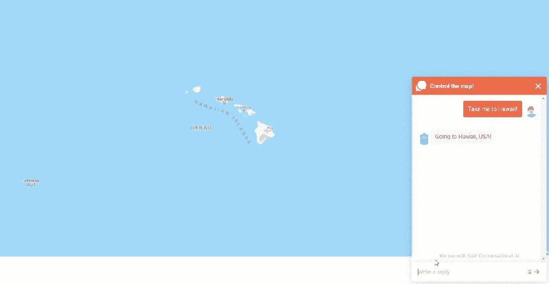
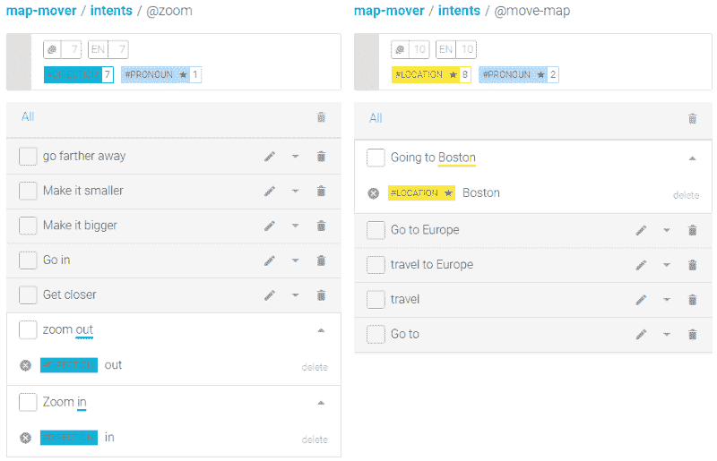
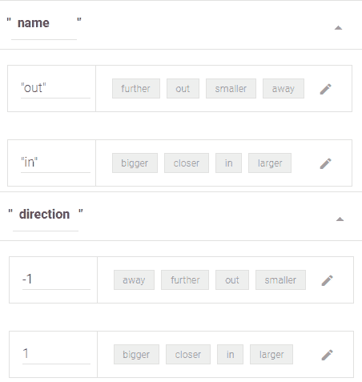
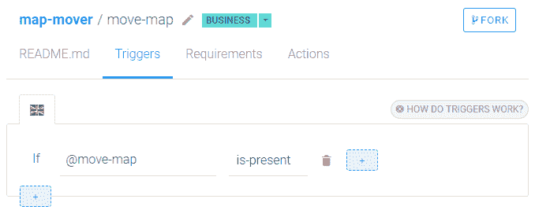
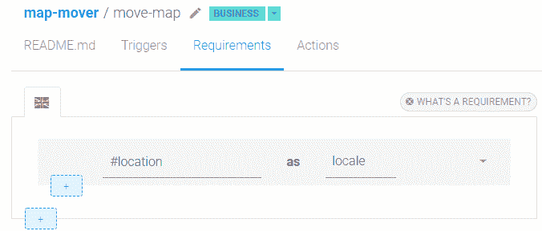
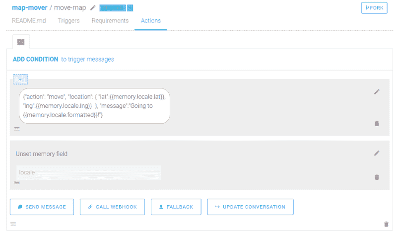
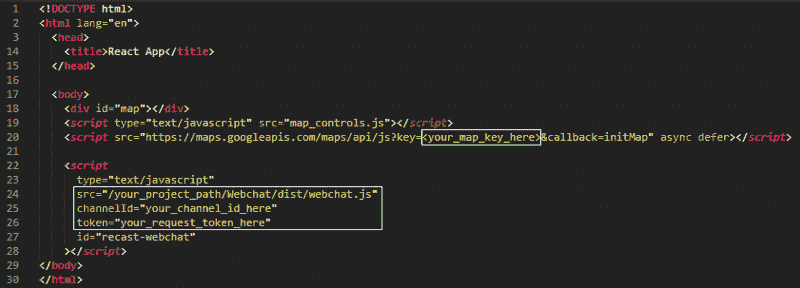

# 如何为像谷歌地图这样的网络应用编写聊天机器人

> 原文：<https://www.freecodecamp.org/news/how-to-code-a-chatbot-tailored-for-web-apps-like-google-maps-cf97fc090676/>

保罗·皮纳德

# 如何为像谷歌地图这样的网络应用编写聊天机器人


在本文中，我们将学习如何将 SAP 对话式 AI 聊天机器人集成到您的任何 web 应用程序中，并为用户提供一种有趣而直观的 UI 交互方式！

对话式界面越来越受欢迎，尤其是在与看似不透明的后端系统进行交易时。例如，我们可以部署聊天机器人来引导客户完成故障诊断过程，并在他们需要进一步帮助时创建一个票证；所有这些都不需要客户了解票证创建过程。

这为您的客户提供了更直观的体验，提高了客户满意度，同时通过将员工从处理票证的分类和发送中解放出来，提高了效率。

对话式人工智能可以解决这个问题，但是如果你的用户希望能够与你的前端应用程序进行交互呢？

例如，让用户导航到网站中的某个页面而不必找到确切的链接可能会很好。或者允许用户对产品列表应用复杂的过滤器，而不必点击菜单。

尽管我们的 webchat 可以嵌入到任何网站中，但它不具备这类交互所必需的 UI 的上下文感知能力。为了演示我们如何实现这种上下文感知，我们将创建一个简单的地图应用程序，其中嵌入了能够移动地图和放大或缩小地图的 bot:



### 资源

[在 SAP 对话式人工智能上创建您的第一个聊天机器人](https://cai.tools.sap/blog/build-your-first-bot-with-sap-conversational-ai/)

[了解如何自助主持网络聊天](https://github.com/SAPConversationalAI/Webchat#self-hosted-webchat)

[谷歌地图应用编程接口](https://developers.google.com/maps/documentation/javascript/tutorial)

[地图移动机器人](https://cai.tools.sap/timoteo/map-mover)

[前端应用源代码](https://github.com/timothy-janssen/map-app)

[最终地图应用](https://map-app-demo-1.herokuapp.com/)

### 先决条件

*   首先，你将需要舒适地使用 [SAP 对话式人工智能](https://cai.tools.sap/)构建一个简单的机器人。如果你对这个平台不熟悉，去[这个教程](https://cai.tools.sap/blog/build-your-first-bot-with-sap-conversational-ai/)学习如何建立一个令人捧腹的笑话机器人。
*   您还需要能够在您控制的地方托管我们的 webchat 组件。我们的 [GitHub](https://github.com/SAPConversationalAI/Webchat#self-hosted-webchat) 有让你开始的所有信息。
*   它还期望你至少熟悉 JavaScript 和前端 web 开发的基础知识。

### 辅导的

首先，我们需要为我们的机器人定义接口，以便能够向我们的前端发送命令和消息。这将通过发送一个 stringified JSON 对象来代替我们通常发送给用户的普通消息字符串来实现。我们修改后的 webchat 将能够理解这个 JSON 对象，执行定义的操作，并最终向用户显示一条“消息”。

这可以相当简单地完成；我们将发送一个带有"*移动*或"*缩放*"动作的对象，然后向用户显示一条消息。注意，我们将把这个 JSON 对象作为一个字符串传递，我们假设应用程序将解析它并只向用户显示“message”的值。

```
{ "action": "move" || "zoom", "message": "This will be displayed to the user" }
```

如果我们的动作类型是“*移动*，地图将需要坐标来导航。
因此，我们将在 JSON 对象中包含一个位置的坐标。或者，如果我们的动作是*放大*，我们将需要知道是*放大*还是*缩小*。为此，我们将包含一个表示为 1 的 in 或-1 的 out 方向。有了这样的定义，下面是一些 JSON 对象的例子:

```
{"action": "move", "location": { "lat": -8.3405389, "Ing": 115.0919509 "message": "Going to Bali, Indonesia!" }{"action": "zoom" "direction": 1, "message": "Zooming in!"}
```

考虑到这一点，我们可以开始建造我们的机器人。和往常一样，我们将从定义用户的意图开始。在这种情况下，我们有*缩放*和*移动地图*。



请注意，我们将需要用实体“方向”来标记 *@zoom* 中的句子，但是在 *@move-map* 中会自动识别“位置”。幸运的是，location gold 实体自带经度和纬度，因此我们可以轻松地将它们传递到前端。

为了获得代表我们缩放方向的 1 或-1，我们将利用定制的丰富。我们将使用以下值添加键“name”和“direction”。然后将正确的实体值映射到它们各自的键值。



现在我们可以认识到我们的移动地图意图，我们只需要一个技能，如果我们的意图匹配就会触发:



并且需要一个位置:



最后发回一条消息，告诉前端去哪里:



缩放技能可以以几乎相同的方式实现；我鼓励你自己尝试一下！

现在我们的 bot 已经完成，我们需要在本地托管 webchat，以便我们可以修改它来理解我们的“不寻常”响应。如果您不熟悉自托管流程，请查看这个 github 。

最后，是时候构建我们的 web 应用程序了。我们将首先为我们的地图添加一个容器 div，我们将编写处理地图交互的脚本(map_controls.js)，Google 的本教程[中描述的必要脚本，以及指向我们本地托管的 bot 的脚本标签。它应该是这样的:](https://developers.google.com/maps/documentation/javascript/tutorial)



为了完成我们的简单应用程序，我们将实现我们的地图初始化和缩放/移动方法:

```
function initMap () {  window.map = new google.maps.Map(document.getElementById('map'), {    // OPTIONS    center: {lat: -34.397, lng: 150.644},    zoom: 8,    zoomControl: false,    streetViewControl: false,    mapTypeControl: false,    rotateControl: false,    scaleControl: false,    fullscreenControl: false  });}     const zoom = (direction) => {  window.map.setZoom(window.map.getZoom() + direction);}
```

```
const setCenter = (lat, lng) => {  window.map.setCenter({lat: lat, lng: lng});}
```

一旦我们成功地将聊天机器人添加到我们的应用程序中，我们将能够要求它四处移动或放大/缩小，但它仍然会向我们显示那个难看的 JSON 字符串。为了解决这个问题，我们将在 Webchat/src/containers/Chat/index . js 中添加以下代码。这将在窗口对象中搜索一个名为 applicationParse 的函数，如果它存在，就调用它。

```
const getApplicationParse =  messages  => {  return new Promise(resolve => {    if (!window.webchatMethods || !window.webchatMethods.applicationParse) {      return resolve()    }    // so that we process the message in all cases    setTimeout(resolve, MAX_GET_MEMORY_TIME)    try {      const applicationParseResponse = window.webchatMethods.applicationParse(messages)      if (!applicationParseResponse) {        return resolve()      }      if (applicationParseResponse.then && typeof applicationParseResponse.then === 'function') {        // the function returned a Promise        applicationParseResponse          .then(applicationParse => resolve())          .catch(err => {            console.error(FAILED_TO_GET_MEMORY)            console.error(err)            resolve()          })      } else {        resolve()      }    } catch (err) {      console.error(FAILED_TO_GET_MEMORY)      console.error(err)      resolve()    }  })}
```

现在，我们将在调用 componentWillReceiveProps 中的 setState 之前调用 getApplicationParse。这将确保我们的应用程序有机会在任何东西被发送回用户之前解析来自机器人的响应。

```
componentWillReceiveProps(nextProps) {  const { messages, show } = nextProps    if (messages !== this.state.messages) {    getApplicationParse(messages)    this.setState({ messages }, () => {      const { getLastMessage } = this.props      if (getLastMessage) {        getLastMessage(messages[messages.length - 1])      }    })  }  if (show && show !== this.props.show && !this.props.sendMessagePromise && !this._isPolling) {    this.doMessagesPolling()  }}
```

最后，我们需要实现 applicationParse 并将其包含在 map_controls.js 的 window 对象中。在这里，我们将循环遍历我们的消息，如果它是来自 bot 的有效操作命令，则采取该操作并仅将消息返回给用户。

```
window.webchatMethods = {  applicationParse: (messages) => {    messages.map(message => {      try {        var obj = JSON.parse(message.attachment.content);        console.log(obj);        if(obj !== undefined &&            obj.action == 'zoom' &&            typeof obj.direction === "number"){          message.attachment.content = obj.message.toString();          zoom(obj.direction);        } else if (obj !== undefined &&                    obj.action == 'move' &&                    typeof obj.location.lat === "number" &&                    typeof obj.location.lng === "number") {          message.attachment.content = obj.message.toString();          setCenter(obj.location.lat, obj.location.lng);        }      } catch (err) {        // Invalid JSON - treat it as a regular message and pass it back to UI as is      }      message    })     return messages;       }}
```

你现在可以要求你的机器人移动或缩放地图，它会发送一条信息，应用程序可以解释和采取行动。

有了工具箱中的这个工具，您现在可以将聊天机器人集成到您的任何 web 应用程序中了！

*最初发表于 [SAP 对话式人工智能博客](https://cai.tools.sap/blog/how-to-control-your-web-application-with-an-integrated-chatbot/)。*