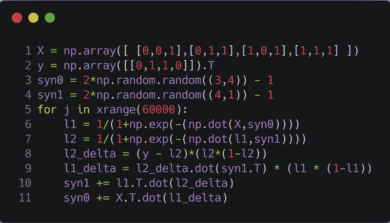
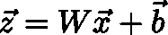
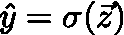
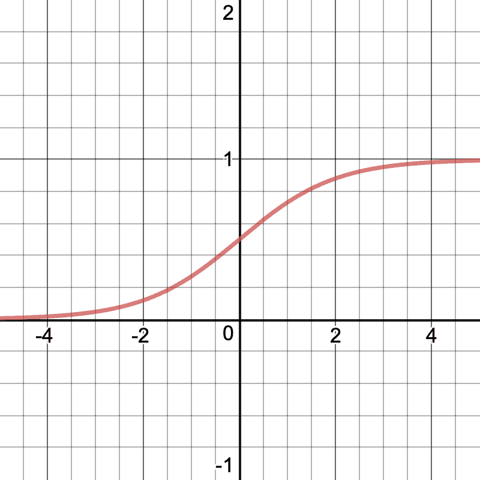
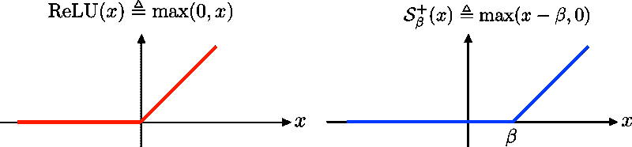
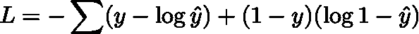
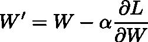
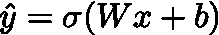
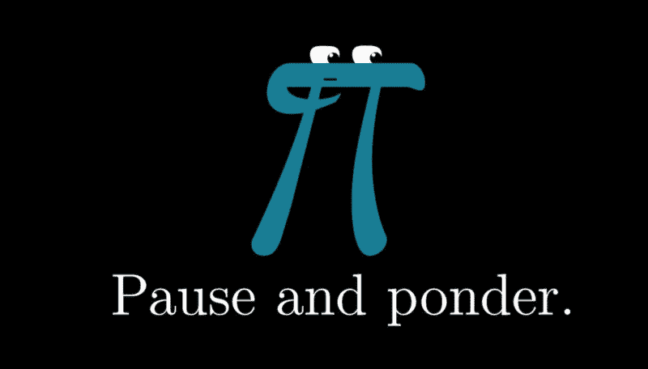

# 如何用三行数学建立一个神经网络

> 原文：<https://www.freecodecamp.org/news/how-to-build-a-neural-net-in-three-lines-of-math-a0c42f45c40e/>

#### 人工智能无代码指南

所以大约一年前，我读了这篇由[查斯克](https://www.freecodecamp.org/news/how-to-build-a-neural-net-in-three-lines-of-math-a0c42f45c40e/undefined)写的[精彩文章](https://iamtrask.github.io/2015/07/12/basic-python-network/)。

如果您没有点击该链接，现在就点击。

你有吗？好的，很好。

现在事情是这样的——这篇文章要求你了解一点 python，这一点你可能知道。

A Neural Network in 11 Lines of Code

如果你对神经网络感兴趣(如果这个短语对你来说听起来完全陌生，请观看这个 [YouTube 播放列表](https://www.youtube.com/playlist?list=PLZHQObOWTQDNU6R1_67000Dx_ZCJB-3pi))并且还没有学习 python，那么恭喜你，你来对地方了。

但不管你在深度学习的广阔前景中处于什么位置，我认为偶尔回到基础，重温给我们带来 Siri、Alexa 和无尽的网飞狂欢观看的基本数学思想是很好的。

Photo by [freestocks.org](https://unsplash.com/photos/11SgH7U6TmI?utm_source=unsplash&utm_medium=referral&utm_content=creditCopyText) on [Unsplash](https://unsplash.com/search/photos/netflix?utm_source=unsplash&utm_medium=referral&utm_content=creditCopyText)

所以，不再赘言，我向你们展示构成我称之为**“深度学习基本定理”的三个等式**

### 1.线性回归

第一个等式非常基本。我想其他人也是，但我们会及时找到他们的。

目前，我们所做的只是计算一个向量***【z】***(根据上面的等式)，其中 ***W*** 是一个最初只是填充了一串随机数的矩阵， ***b*** 是一个最初只是填充了一串随机数的向量， ***x*** 是一个最初没有填充一串随机数的向量。

***x*** 是我们数据集中的一个训练例子。例如，如果你正在训练一个神经网络来预测某人的年龄，给定他们的性别和身高，你首先需要一些(或者最好是很多，越多越好)数据的例子，形式为`[[height, gender], age]`。向量`[height, gender]`就是我们所说的 ***x.***

### 2.激活功能

在左边，我们有预测值 ***y*** ，这是我用来表示数据标签的变量。

顶上的帽子意味着这个值 ***y*** 是一个预测值，与我们数据集中的基础事实标签相反。

这个等式中的 ***z*** 就是我们上面计算的那个。sigma 表示 sigmoid 激活函数，如下所示:

所以简单地说，我们取***【z】***，一个可以任意变大或变小的实数向量，并将其分量压缩到 0 和 1 之间。

拥有一个介于 0 和 1 之间的数字很有用，因为如果我们试图建立一个分类器，假设它预测一幅图像是猫还是狗，我们可以让 1 代表狗，让 0 代表猫。或者反过来，如果你更喜欢猫的话。

Photo by [Erik-Jan Leusink](https://unsplash.com/photos/tzzpfLiRPlA?utm_source=unsplash&utm_medium=referral&utm_content=creditCopyText) on [Unsplash](https://unsplash.com/search/photos/cat?utm_source=unsplash&utm_medium=referral&utm_content=creditCopyText)

但是假设我们*没有*做狗和猫(是的，就像有任何其他更好的机器学习用例)。让我们回到我们的年龄预测。在那里，我们不能仅仅预测 1 和 0。

一般来说，你可以使用任何你喜欢的函数，不一定只是一个 sigmoid。但是一群聪明人注意到乙状结肠工作得很好。所以我们只能这样了。

然而，当我们处理的标签是实际的数字而不是类时，情况就不同了。对于我们的年龄预测器，我们需要使用不同的激活函数。

输入 rel。

Source: [https://upload.wikimedia.org/wikipedia/commons/8/85/ReLU_and_Nonnegative_Soft_Thresholding_Functions.svg](https://upload.wikimedia.org/wikipedia/commons/8/85/ReLU_and_Nonnegative_Soft_Thresholding_Functions.svg)

我先说，我认为这是深度学习中最无聊的部分。我的意思是，说真的，只是一个无聊的看起来简单的函数？那有什么好玩的？

尽管外表可能具有欺骗性。虽然很无聊——ReLU(***x***)只是`max(0,x)`——ReLU 函数在实践中确实工作得很好。所以嘿，接受现实吧。

### 3.反向传播和梯度下降

好吧，你抓到我了。我作弊了。严格来说是四行数学。但是，嘿，你可以把第一步和第二步压缩成一个步骤，所以我想我会成功的。

现在来消化一下所有(字面上的)希腊东西。

在第一个等式中，我们对***【y】***和 ***y*** -hat 计算一个称为损失的数字，用 ***L*** 表示。

从名字就可以推断出，这种损失衡量了我们在征服机器学习魔法书的恶战中损失有多严重。

Photo by [Karly Santiago](https://unsplash.com/photos/79Ut1cRYoQ0?utm_source=unsplash&utm_medium=referral&utm_content=creditCopyText) on [Unsplash](https://unsplash.com/search/photos/magic?utm_source=unsplash&utm_medium=referral&utm_content=creditCopyText)

特别是，我们的 ***L*** 在这里是测量一种叫做二元交叉熵损失的东西，这是一种听起来像你有数学博士学位的捷径，当你实际上只是测量 ***y*** 离 ***y*** -hat 有多远。然而，这个等式的表面下还有很多东西，所以看看丹尼尔·戈多伊的文章吧。

你需要知道的是，如果我们的预测值远离地面真实值，那么*会变大，而当我们的预测和现实匹配时， ***L*** 会变小。*

*总和就在那里，这样我们就可以把每个训练样本的所有混乱程度加起来，这样我们的神经网络就可以了解它总体上有多混乱。*

*现在，深度学习的实际“学习”部分开始了。*

*

Photo by [Ben White](https://unsplash.com/photos/1MHU3zpTvro?utm_source=unsplash&utm_medium=referral&utm_content=creditCopyText) on [Unsplash](https://unsplash.com/search/photos/learning?utm_source=unsplash&utm_medium=referral&utm_content=creditCopyText)* 

*堆栈的最后一步是更新矩阵 ***W*** 和向量 ***b*** ，这样我们的损失就会减少。通过这样做，我们有效地最小化了预测值与实际值的差距，因此，我们的模型变得更加准确。*

*等式又来了:*

**

****【W’***是更新数字的矩阵，让我们更接近地面真相。α是我们可以选择的常数。你看到的最后一项是损耗对参数的梯度。简而言之，这是对 ***W*** 矩阵中数字的一个小调整所带来的损失变化的衡量。*

*再说一次，我不会太深入到梯度下降(更新矩阵中的数字的过程)中，因为已经有很多关于这个主题的很好的资源。我强烈推荐[塞巴斯蒂安·鲁德](https://www.freecodecamp.org/news/how-to-build-a-neural-net-in-three-lines-of-math-a0c42f45c40e/undefined)的这篇文章。*

*顺便说一下，我们可以对*向量中的初始随机值做同样的事情。只要把它们朝正确的方向拧适量，然后嘣！我们刚刚接近历史最低点。**

### **结论**

**现在你知道了。构成我们今天使用的神经网络基础的三个重要方程。**

************

**停下来思考一秒钟。你刚才看到的是人类对错综复杂的智能的理解的汇编。**

**当然，这是我们刚刚看到的一个非常基本的香草神经网络，多年来在学习算法方面已经有了无数的改进，导致了重大的突破。当加上这些年来数据和计算能力的空前爆炸，在某种程度上，经过深思熟虑的数学似乎几乎不可避免地能够掌握区分猫和狗的微妙艺术。**

**但还是。这是一切开始的地方。**

**在某种程度上，这十年(可以说)最重大的技术进步的核心和灵魂就在你眼前。所以花点时间。停下来思考。**

**

Source: [https://pbs.twimg.com/media/C1hNo_KUcAAJDQ9.jpg:large](https://pbs.twimg.com/media/C1hNo_KUcAAJDQ9.jpg:large)**