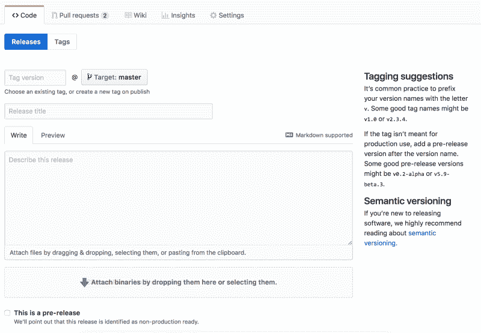

# 我如何在 JavaScript 中建立一个好的发布过程

> 原文：<https://www.freecodecamp.org/news/how-i-established-a-good-release-process-in-javascript-b93e57e247e1/>

达芙娜·罗森布鲁姆

# 我如何在 JavaScript 中建立一个好的发布过程

#### 使用 Git 工作流、NPM 和第三方库

最近，我坐下来为我的团队定义发布程序。我浏览了 git 工作流、版本控制的最佳实践以及升级外部库的方法。我想把我所有的学习都集中在一个地方，因为我知道将来我还会回到这个地方。我希望它也能对你有所帮助。

在这篇文章中，我将解释如何结合 *git workflow、semver、*和 NPM 来用 JavaScript 创建健康的图书馆管理和 CI。当我的团队变得越来越大，我们必须创建一个对每个人都有效并且我们都同意的更好的过程时，这开始困扰我。我阅读了大约 20 篇文章来创建这个不同实践和官方建议的详细综合总结。


Photo by [rawpixel](https://unsplash.com/photos/1Z15APktAiY?utm_source=unsplash&utm_medium=referral&utm_content=creditCopyText) on [Unsplash](https://unsplash.com/search/photos/flow?utm_source=unsplash&utm_medium=referral&utm_content=creditCopyText)

### GIT 流

使用 Git 有不同的模式。模式决定了什么类型的分支将存在于项目中，它们的命名约定，何时使用每种类型等等。最广为人知的模式是 Git Flow。

GitFlow 就像敏捷——每个人都在使用*的某个*版本。

它是由文森特·德里森于 2010 年 1 月创建的。从那以后，它被大量使用，尽管有许多批评者。在解释了方法论本身之后，我将详细阐述他们的观点。

我强烈推荐阅读全文，并将下面的总结作为备忘单(它也包含了一些额外的见解)。

### 两种分支

#### 无限生命期分支:*主人*和*养成*

*   原产地/主数据总是生产就绪。
*   origin/develop 总是包含下一个版本的最新交付变更。当它准备好了，它就被合并到主版本中，并且用一个版本号来标记变更。

#### 有限寿命分支

*   特征分支
*   释放分支
*   热固定分支

让我们更详细地看一下每一项。

#### 特征分支

*   从*分出并合并回*发展。
*   命名约定:除了*主*、*开发*、*发布-** 或*热修复-** 之外的任何东西。我喜欢用前缀`feature/`，比如`feature/fix-texts`。

当合并回*开发*时，Vincent 推荐使用`—-no-ff`标志，它总是为合并创建一个新的提交。这允许您更好地理解历史跟踪，并知道哪些提交作为一个特性一起发布。它还简化了恢复特征。

#### 释放分支

*   从*发展*分支，合并回*发展*和*主*。
*   命名约定: *release-** ，例如: *release-1.2。*
*   目:最后一分钟的小变更，以便开发人员可以清楚地接收下一个版本的变更。

直到分出发布分支，下一个发布的变更才能合并到*开发*中。版本号是在创建发布分支时定义的，并用作其名称。

#### npm 版本

创建发布分支后，您应该运行`./bump-version.sh`。这是一个虚构的脚本，用于更新项目的版本号。正如我提到的，Git Flow 文章来自 2010 年 1 月。这也是《NPM》第一次上映的月份(巧合？？)，我更喜欢使用 [npm 版本](https://docs.npmjs.com/cli/version.html)，如下所示:

```
> npm version patch
```

输出将是新的版本号。一个提交将被添加到分支中，新版本将在 *package.json* 和 *package-lock.json* 文件中更新。

运行`git log -1`然后运行`git show <commit ha` sh >来查看变化。

更换*副*版本或*主*时，相应使用`npm version minor`或`npm version major`。

使用`-m`标志添加提交消息，否则将是新版本的编号。

如果*前版本、版本、*或*后版本*在 package.json 的*脚本*属性中，它们也将被执行。

它还将创建一个 [git 标签](https://git-scm.com/book/en/v2/Git-Basics-Tagging)。通过在运行`npm version patch`之前和之后运行`git tag`可以看到这一点，并注意到不同之处。

正如在 *git 标签*文档中所解释的，默认情况下，`git push`命令不会将标签传输到远程服务器。创建标签后，您必须将标签明确推送到共享服务器。这个过程就像共享远程分支一样。可以跑`git push origin v1.5.1`。也可以删除和签出本地和远程标签。

npm-version 的替代工具是流行的工具 [release-it](https://www.npmjs.com/package/release-it) ，它可以修改版本、创建标签和发布等等。

#### 返回到释放分支

所以你创建了一个发布分支，运行`npm version patch`并推送。也许你还添加了一些小的错误修正。下一步是合并到 master 和 release。

#### 从标签创建发布

正如在 [GitHub 文档](https://help.github.com/articles/creating-releases/)中解释的，当创建一个版本时，你需要为它键入一个版本号。版本基于 Git 标签。在版本输入区域下面，您将看到文本:*选择一个现有的标签，或者在发布时创建一个新标签。*您可以选择是否推送由`npm-version`创建的标签，然后在创建发布时再次键入，或者您可以选择不推送，在创建发布时键入。当然，你可以[创建自动发布](https://developer.github.com/v3/repos/releases/#create-a-release)而不是手动使用 GitHub 网站。

#### 合并回*发展*

不要忘记合并回发布分支来开发。然后可以删除发布分支。这里您可能会遇到合并冲突，所以只需修复它们并提交即可。

### 修补程序分支

*   包含对紧急生产错误的修复。
*   从*主*分支，合并回*发展*和*主*。
*   命名约定:`hotfix-*`。

像发布分支一样，它们是为新的发布做准备，创建分支并完成它的过程是完全一样的。

如果你使用发布分支，并且一个发布分支存在，试着不要将它合并回开发，而是合并到发布分支，它将在以后被合并到开发中。

### 是这样吗？

这是 Git 流程。使用瀑布方法会更好。今天推荐的工作方式是持续部署——被测试完全覆盖，没有*开发*分支，合并特性分支以立即控制和部署。

但是产品和市场的类型有时可能决定了不同类型的部署过程。例如，在*医疗保健*中，由于法规的原因，不可能总是进行连续部署。在游戏行业，游戏是有发布日期的，但它们通常不支持持续集成和交付。

### 对手

如果你在谷歌上找“不要用 gitflow”，可以找到很多文章。以下是其中一些要点:

#### #1

在他的博客[“线路终点”](https://www.endoflineblog.com/gitflow-considered-harmful) , [亚当·岸本瑠可](https://www.endoflineblog.com/about)表示，使用 *- no-ff* 标志的结果是“git 火车图”(见图)，这在回顾中很难追踪。他强烈推荐使用 *rebase* 来代替。

他还声称方法太复杂，开发人员不可能不犯错误，也不可能不合并到错误的分支。

虽然我同意第一点，但我认为 GitHub 上的构建自动化(如自动标记)和配置良好的分支可以解决大多数人为错误。在这篇文章中，他对 Git 流提出了不同的看法。


Photo from the great project [https://github.com/vbarbaresi/MetroGit](https://github.com/vbarbaresi/MetroGit)

#### #2

在他的文章[“Git:我如何使用它，为什么我不使用 Git flow”](https://medium.com/@matt.dekrey/git-how-i-use-it-and-why-i-dont-use-gitflow-8688f255fef2)，[马修·德克里](https://medium.com/@matt.dekrey)中，谈到了*开发*分支:

> “如果团队很忙，将代码放在一个没有经过充分测试的公共地方，并且不一定致力于要发布的功能，最终会成为一个半成品架构和未发布功能的鬼城。”

我认为，有了一些原则和一个体面的 CI，团队将合并(或重新组合)到那些已经准备好并通过了单元测试和集成测试的特性，然后夜间测试套件(或系统测试)可以在开发中运行，并确保特性一起工作。

他提到的另一个问题是支持旧版本:*“一旦你削减了 1.2 版，你就不能再修补 1.1 版了”*。在本文中，您还可以找到他推荐的使用 Git 分支的方法。

#### #3

Nicholas C. Zakas 在他的文章[GitHub workflows inside a company](https://humanwhocodes.com/blog/2013/05/21/github-workflows-inside-of-a-company/)中说:

> *“总的感觉是，git-flow 在更传统的发布模型中工作得很好，在这种模型中，发布每隔几周进行一次，但是当您每天发布一次或更多次时，这一过程会大大中断”*。

Git Flow 发布一年半后，帮助启动 GitHub 的工程师斯科特·沙孔发布了 [GitHub flow](http://scottchacon.com/2011/08/31/github-flow.html) ，这是一个更简单的 Git Flow 版本，更适合 CD 项目。

### 那选择什么呢？

我们今天在行业中面临的一个问题是与只有一种方法能把事情做好的观念作斗争。我们忽略了一个事实，不同的团队、产品和市场需要不同的解决方案。

当然，在选择技术或模式之前，团队需要了解使用它的利弊。但是没有“放之四海而皆准的解决方案”。在 Atlassian (BitBucket)的这篇推荐文章中，他们回顾了一些可能的 Git 工作流，并说:

> *“请记住，这些工作流程旨在作为指导方针，而非具体规则。我们希望向您展示什么是可能的，因此您可以混合和匹配来自不同工作流的方面，以满足您的个人需求。在评估团队的工作流程时，最重要的是考虑团队的文化。”*

后来他们补充说:

> *“没有放之四海而皆准的 Git 工作流程。开发一个 Git 工作流对于您的团队来说是非常重要的。除了团队文化，工作流还应该补充商业文化。像分支和标签这样的 Git 特性应该补充你的业务发布时间表。”*

他们建议朝着短期分支努力，并致力于最小化和简化恢复。

### 挤压提交与否？

我想知道的另一个问题是，哪个更好:每个特性一次提交还是少量提交，这样您就可以查看某一行的注释，并准确理解为什么进行了这种特定的更改。

现在我已经用上面提到的 Atlassian 文章的健康方法教育了自己，我认为它高度依赖于这个项目。对于有许多远程贡献者的开源项目，最好是压缩，以保持项目的高层次愿景。

对于稳定的组织来说，在任何给定的时刻，至少有一部分团队继续从事项目工作，更好的做法是精心设计并保持小的提交，但前提是满足两个条件:

1.  带有指示性消息，而不是“wip”、“fix”等。
2.  每个提交本身不会破坏构建或产品，也就是说，如果一个特性包含 3 个提交，并且我们恢复了其中的 2 个，那么产品是稳定的并且运行良好。

### 服务器



The link to semver is in GitHub’s release page (bottom right corner)

Semver，或语义版本化，是代码项目版本命名约定的规范。你可以在 GitHub 的发布页面上找到它的[链接。](https://semver.org/)

这个想法是每个新版本都有一个 x.y.z 形式的版本号，例如:1.1.2。当**主**版本发布时——即当 API 中断时——x 增加。y — **minor** —新功能但是 API 以向后兼容的方式改变，z — **patch** —在以向后兼容的方式修复 bug 时增加。

[这是一个验证它的 NPM 工具](https://www.npmjs.com/package/semver)。

#### JavaScript 版本控制

NPM 鼓励 JavaScript 开发者保持 Semver 方法。在创建自己的 git 工作流时，这绝对是需要考虑的事情。

### 更新外部库不应该是 Git 工作流的一部分

当使用 NPM 时，如果您不更改默认配置，安装新的软件包将会使用一个^.来安装它们您将在您的包中看到类似这样的内容。

```
“dependencies”: {    “my_dep”: “^1.0.0”,}
```

如果你不想有克拉，你想使用一个固定版本，你可以这样安装:

```
npm install foobar --save --save-exact
```

或者，您可以在您的`.npmrc`配置文件中定义它，如下所示:

```
npm config set save=true
```

```
npm config set save-exact=true
```

以上摘自 [Heroku 的*node . js 开发最佳实践*](https://devcenter.heroku.com/articles/node-best-practices#use-a-smart-npmrc) 文章。但是为什么推荐呢？

为了理解这一点，我强烈推荐阅读 [Pinning Dependencies 和 Lock Files](https://renovatebot.com/docs/dependency-pinning/#pinning-dependencies-and-lock-files)by renew。总结一下要点:

*   “一个锁文件[package-lock.json]将锁定您的项目使用的确切依赖项和*子*依赖项，这样每个运行`npm install`的人将安装与上次更新锁文件的人完全相同的依赖项。”您可以看到为什么不使用您的锁文件会有问题——由于某个依赖关系的变化，生产中可能会出现问题，并且很难跟踪问题，因为在您的本地环境中会有这个依赖关系的不同版本。
*   锁文件不是让人可读的。如果发布了您使用的第三方库的新版本，并且它在 package.json 文件中允许的版本范围内，package-lock.json 将确保每个人都只使用上次更新时定义的固定版本。例如，在 package.json 中有这样的定义:

```
“dependencies”: {    “my_dep”: “^1.0.0”,}
```

现在，如果团队发布了一个新的主要版本 2.0.0，它将永远不会被你的应用程序使用，除非你手动更新它。

但是，如果他们发布了次要版本 1.2.0，那么在任何环境下，您的应用程序都不会使用它，因为锁文件确保使用的是一个固定版本，即上次更新的版本范围内的版本。

但是，如果您更新您的锁文件(通过运行`npm update`，它根据 package.json 文件中定义的规则更新锁文件)，1.2.0 将成为您在锁文件中定义的固定版本，并且很难跟踪它。

*   通常的建议是不管是否固定依赖项都使用锁文件，即使有锁文件也要固定。

如果您选择固定依赖项，您需要一些自动机制来升级它们，这样安全修复和其他有用的新功能就不会一直让您感到惊讶并干扰您的产品计划。翻新是一个解决方案，而依赖机器人也是一个不错的选择。我相信你能找到更多。我认为即使不固定版本，这也是一个很好的解决方案，因为总会有新版本超出范围。

### 摘要

1.  对于任何工程师来说，了解不同的 Git 工作流、理解 semver 方法以及如何使用锁文件都是非常重要的。
2.  不同的团队需要不同的工作流程。这取决于市场和团队，工作流应该使使用它的工程师的生活尽可能容易，允许他们快速发布稳定的代码。
3.  我认为最接近我想要工作的工作流在这篇文章中描述了— [特性分支工作流](https://www.atlassian.com/git/tutorials/comparing-workflows/feature-branch-workflow)。
4.  使用永久版本和固定版本，以及帮助升级第三方库的服务是很好的。
5.  我是设计模式的狂热爱好者，我喜欢阅读不同的模式来使用 Git。