# 如何利用色彩理论增加用户对你的应用的参与度

> 原文：<https://www.freecodecamp.org/news/how-to-increase-user-engagement-with-your-app-using-color-theory-7c6f5c632570/>

作者:阿尔纳·瓦亚尼

> "色彩是一种直接影响灵魂的力量."—瓦西里·康丁斯基

颜色是一个物体所具有的属性，由于它反射或发射光线的方式而在眼睛上产生不同的感觉。

颜色通常归因于我们的潜意识、我们的过去和我们的个人偏好。从海报到应用程序，选择正确的颜色可能是设计任何东西最关键的部分之一。更重要的是，颜色能够唤起一个人的某种情绪，这种情绪可能会因文化和性别等因素而异。

### 颜色如何影响你做决定的方式？

我们都被我们生活的世界所制约。我们看到的一切都有颜色，这是一种用来激发人们某种情感的技术。

**原色**基本上是所有存在的颜色的母色；它们就像每种颜色的根源。

Photo by [Justin Lim](https://unsplash.com/@justinlim?utm_source=medium&utm_medium=referral) on [Unsplash](https://unsplash.com?utm_source=medium&utm_medium=referral)

#### 红色——能量、力量、爱

红色创造了一种紧迫感，因此你会注意到它被用在清仓大甩卖的海报上。此外，红色能增加你的食欲，所以它在食品工业中也被大量使用。这是一种非常情绪化的颜色，所以用它作为背景色可能不是最好的主意。

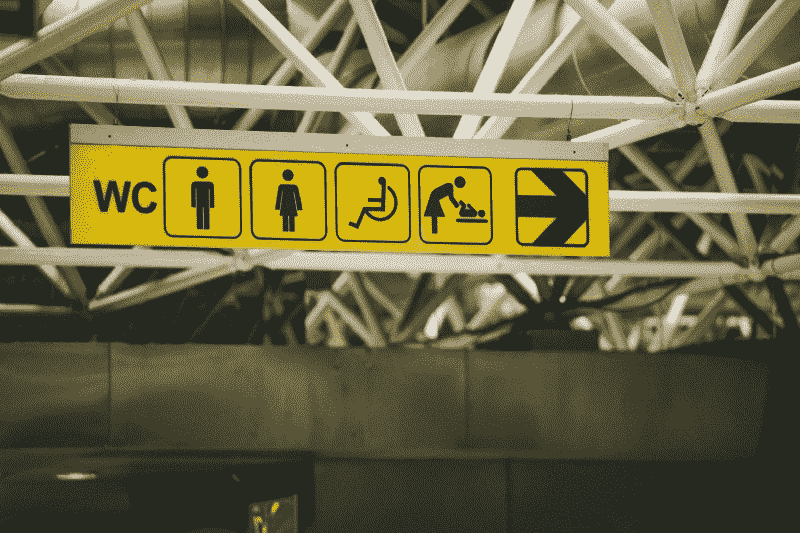

Photo by [Paul Green](https://unsplash.com/@pgreen1983?utm_source=medium&utm_medium=referral) on [Unsplash](https://unsplash.com?utm_source=medium&utm_medium=referral)

#### 黄色——乐观、智慧、快乐

黄色是与太阳联系在一起的颜色，就像红色一样，它非常明亮。用在你的 app logo 或者你的 app 截图设计上会是更好的选择。这种颜色可能会过于强烈，所以尽量少用。

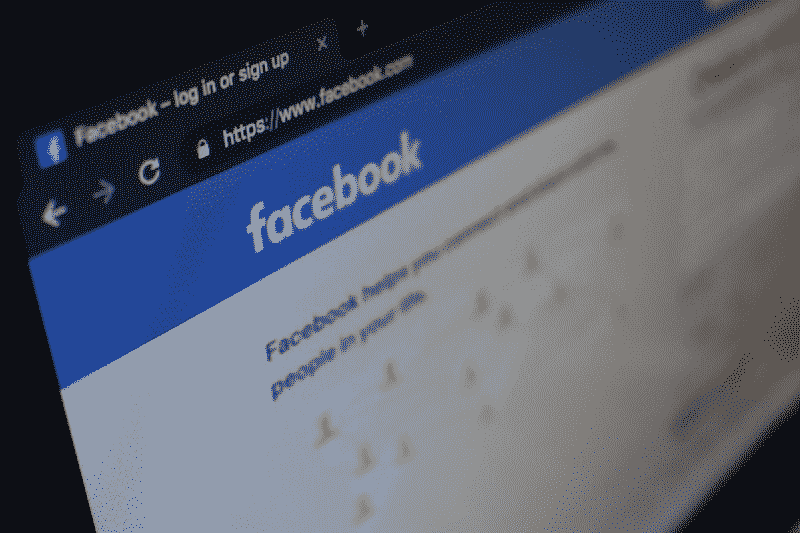

Photo by [Con Karampelas](https://unsplash.com/@conkarampelas?utm_source=medium&utm_medium=referral) on [Unsplash](https://unsplash.com?utm_source=medium&utm_medium=referral)

#### 蓝色——稳定、宁静、信任

蓝色通常表示冷静和沉着，并产生信任感，因此被广泛用于航空公司和医院的标志。你会注意到很多应用程序的标志都使用这种颜色，尤其是那些要求你提供很多私人信息的应用程序。

**二次色**是三原色中两种的混合物。它们是**绿色、紫色和橙色**。

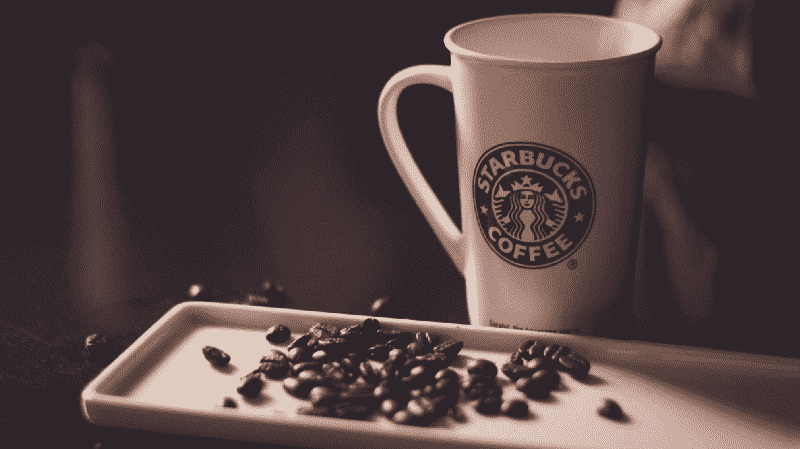

Photo by [Hans Vivek](https://unsplash.com/@oneshotespresso?utm_source=medium&utm_medium=referral) on [Unsplash](https://unsplash.com?utm_source=medium&utm_medium=referral)

#### 绿色——成长、健康、新鲜

绿色是环境的颜色，与金钱紧密相连。它通常被用来宣传健康食品和新鲜产品。你会注意到它在健康和健身相关的应用程序中被广泛使用。

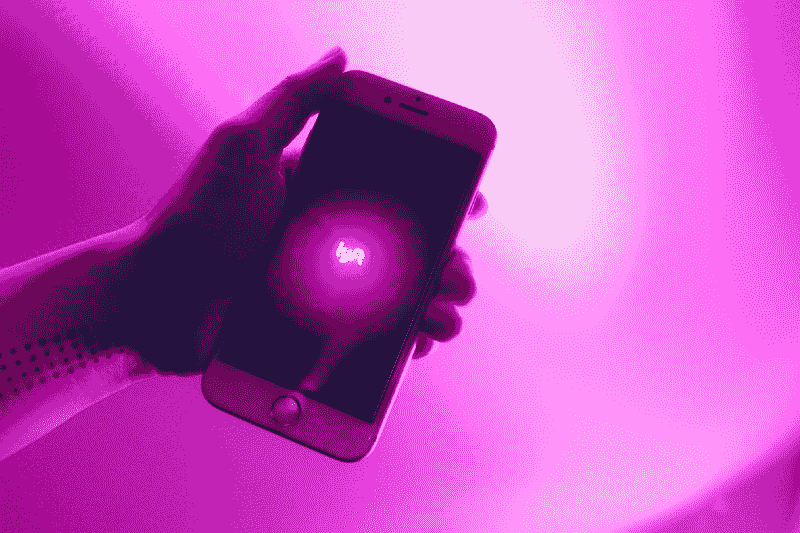

Photo by [Thought Catalog](https://unsplash.com/@thoughtcatalog?utm_source=medium&utm_medium=referral) on [Unsplash](https://unsplash.com?utm_source=medium&utm_medium=referral)

#### 紫色——皇室、贵族、财富

紫色具有红色的能量和蓝色的稳定；传统上，它被认为是女性的颜色，所以你会注意到它在化妆、时尚和奢侈品行业被大量使用。

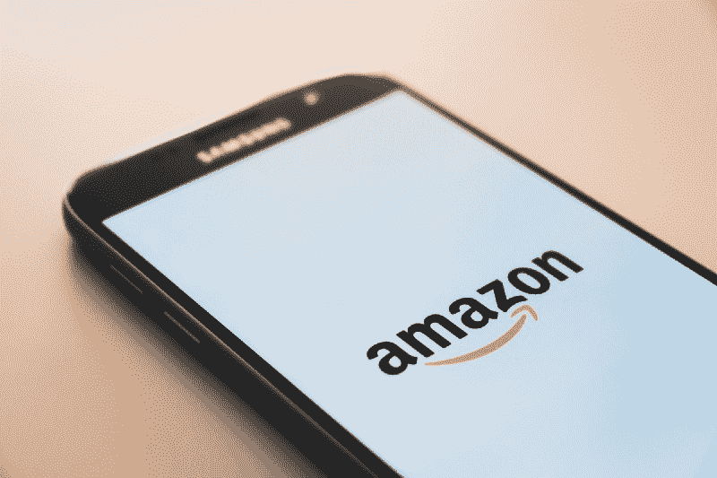

Photo by [Christian Wiediger](https://unsplash.com/@christianw?utm_source=medium&utm_medium=referral) on [Unsplash](https://unsplash.com?utm_source=medium&utm_medium=referral)

#### 橙色——热情、鼓励、快乐

橙色代表红色的活力和黄色的乐观。这是一种不常用的颜色，但通常用于柑橘类产品。它还具有增加大脑中氧气流量的能力。

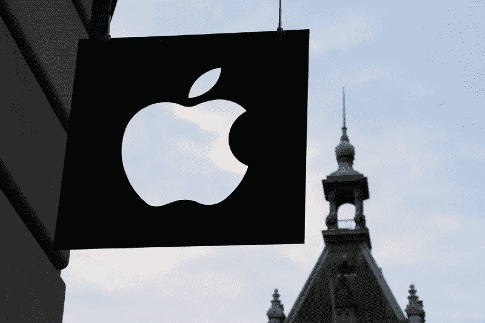

Photo by [Medhat Dawoud](https://unsplash.com/@medhatdawoud?utm_source=medium&utm_medium=referral) on [Unsplash](https://unsplash.com?utm_source=medium&utm_medium=referral)

#### 灰色、白色和黑色

这些通常被称为平淡的颜色，但仍然给人一种非常优雅的感觉，你会注意到它们经常被用在汽车品牌中。灰色通常被认为是没有感情的颜色，它漂浮在中性的一边。黑色通常与权力、优雅、神秘联系在一起，而白色则与安全、纯洁和信仰联系在一起。

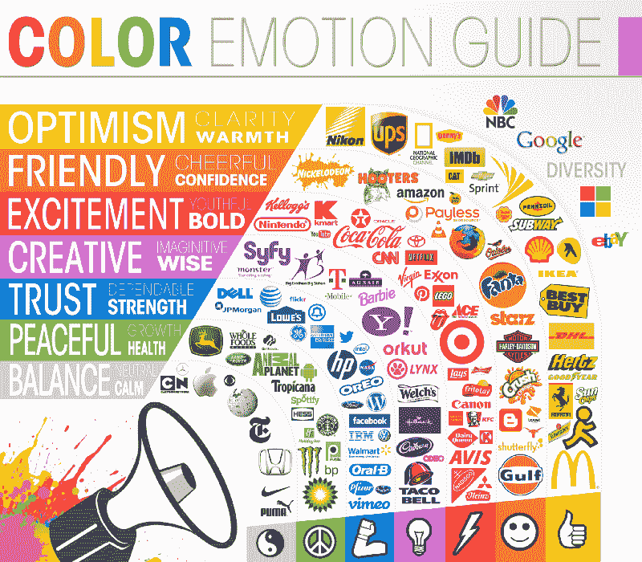

I[mage credits](https://avalaunchmedia.com/services/infographics/)

既然你知道了基本色，你就不仅仅局限于这六种了。使用色轮，你还可以创建许多不同类型的调色板，只要你在整个应用程序中保持色彩和谐。

### **如何使用“色轮”创建调色板**

> 一个**色轮**是一个圆圈周围的色彩的抽象说明性组织，它显示了原色、二次色、三次色等之间的关系。([来源](https://en.wikipedia.org/wiki/Color_wheel)

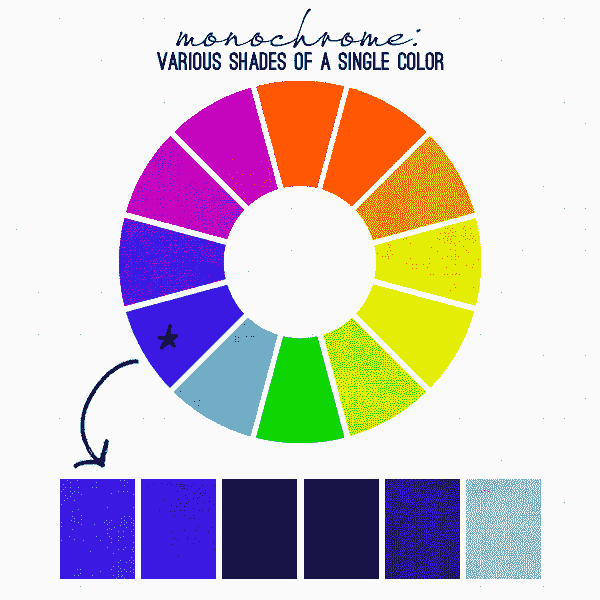

[Image credits](https://oss.adm.ntu.edu.sg/ibrahim001/2015/10/19/color-schemes/)

#### 单色

单色是通过使用相同的颜色，并将其与不同数量的白色或黑色相结合，以创建不同的色调和阴影，彼此突出。

优点:

*   流行的
*   对现代数字设计有用

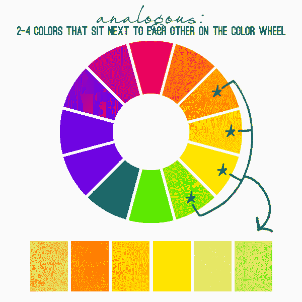

[Image credits](https://oss.adm.ntu.edu.sg/ibrahim001/2015/10/19/color-schemes/)

#### 类似的颜色

当你把色轮上的一种颜色和紧挨着它的颜色组合在一起时，就形成了类似的颜色。

优点:

*   易于查看

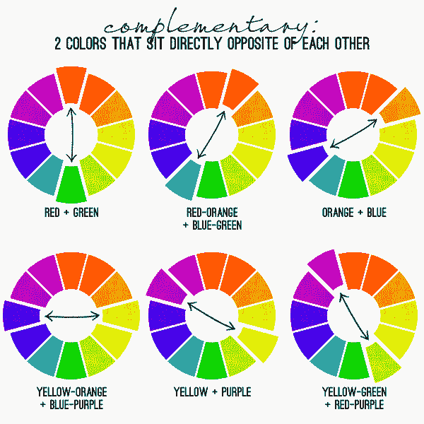

[Image credits](https://oss.adm.ntu.edu.sg/ibrahim001/2015/10/19/color-schemes/)

#### 互补色

互补色是模拟色的反义词。他们的主要目的是抓住用户的注意力，尽管将其用于应用程序的主界面可能并不理想。

优点:

*   用于创建应用程序徽标和应用程序屏幕截图设计。

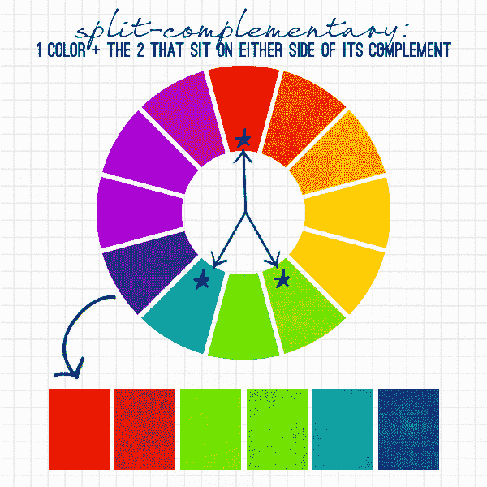

[Image credits](https://oss.adm.ntu.edu.sg/ibrahim001/2015/10/19/color-schemes/)

#### 分裂互补色

这是一种模拟色和补色的结合，你可以选择一种颜色，然后选择两种与相反颜色相邻的颜色。它们是我个人的最爱之一。

优点:

*   吸引注意力
*   易于查看

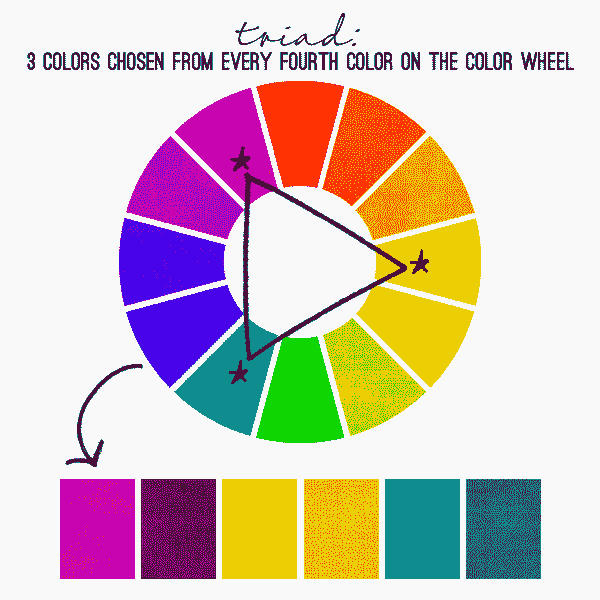

[Image credits](https://oss.adm.ntu.edu.sg/ibrahim001/2015/10/19/color-schemes/)

#### 三原色

您可以通过在调色板上选取一种颜色并在色轮上绘制一个等边三角形来形成三色调色板，从而创建一个三色调色板。

优点:

*   吸引注意力
*   匀称的
*   有一种复古的感觉

[Image credits](https://oss.adm.ntu.edu.sg/ibrahim001/2015/10/19/color-schemes/)

#### 四色(基于正方形)

当所有四种颜色在色轮中均匀分布时，使用基于正方形的四元组。

优点:

*   需要平衡颜色时效果最佳。

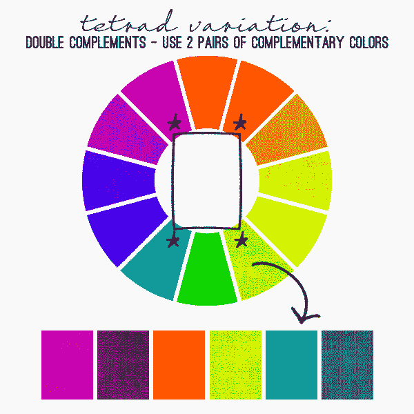

[Image credits](https://oss.adm.ntu.edu.sg/ibrahim001/2015/10/19/color-schemes/)

#### 四色(基于矩形)

基于矩形的四元组使用四种颜色，这四种颜色是色轮上两种互补色的配对。

优点:

*   当只需要一种主色时很有用。

### 使用某种颜色之前要考虑的因素

正如我之前提到的，根据你的目标受众，你对颜色的使用应该有所不同，因为它们可能不总是暗示相同的事情。

#### **文化**

这是在使用任何颜色之前需要考虑的重要因素之一；根据你的应用程序的功能，你应该为你的应用程序选择合适的**主色**。

例如，如果你正在设计一个以红色为主色调的约会应用，它在亚洲的下载量会比在非洲多得多。这里列出了不同国家对不同颜色的看法。

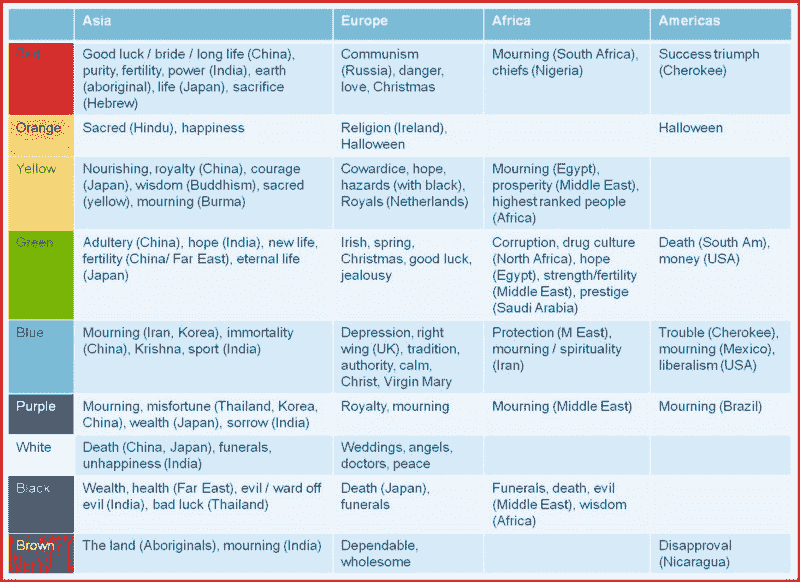

#### **性别**

科学证明，男人和女人更喜欢某些颜色。女性往往偏爱原色，*最爱* **蓝色、紫色和绿色**最多，但*最讨厌* **橙色、棕色和灰色。如果你愿意，你可以查看几乎所有以女性为目标受众的电子商务应用/网站，你会发现这些颜色得到了肯定。同样，男人*爱* **蓝、绿、黑*****恨* **棕、橙、紫**。****

#### **色盲**

**在世界范围内，色盲影响着 1/12 的男性(8%)和 1/200 的女性。这意味着全世界大约有 3 亿人是色盲，这是一个你不应该忽视的群体。大多数人是男性，所以记住上面提到的数据，你应该相应地决定你的肤色。在文章的最后，我提到了一个工具，你可以用它来观察一个色盲者如何根据一个人的色盲类型来看一幅图像。**

**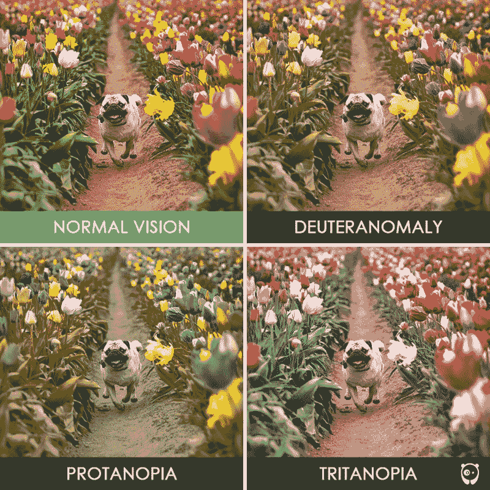

[Image credits](https://www.boredpanda.com/different-types-color-blindness-photos/?utm_source=google&utm_medium=organic&utm_campaign=organic)** 

#### ****相同颜色的阴影****

**这也有相当大的影响，取决于它的强度。例如，明亮的红色可能意味着爱，但另一种颜色的红色，如深红色，可能不意味着同样的事情。**

### **一些伟大的设计工具**

**既然我们已经讨论了色彩理论的主要方面，这里有一个列表，显示了一些我用来创建自己的调色板的网站。**

*   **[color hunt](https://colorhunt.co/)—一个免费开放的色彩灵感平台，提供数千种时尚的手工调色板**
*   **其他一些调色板包括[酷派](http://coolors.co)、[材质设计调色板](https://www.materialpalette.com/)和[平面 UI 颜色 2](https://flatuicolors.com/)**
*   **ColorZilla —一个 chrome 扩展，用于从任何网站查找十六进制颜色代码。**
*   **一个伟大的工具，用来观察一个色盲的人如何看一张照片。**
*   **如果你想从一些使用自己独特调色板的网站中获得灵感，你可以在这里看到它们。**

### **最后要记住的几件事**

*   ****测试各种调色板—** 尝试在你的应用上使用不同的徽标，看看哪一个能让你获得更多下载。谷歌 Play 商店为您提供了一个向人们展示不同徽标的选项，这样您就可以增加下载量。**
*   ****避免使用过多的颜色****——**颜色可以带来很多乐趣，我们在这篇文章中已经看到了这一点。但是不要超过需要使用它们，因为这只会惹恼你的用户，他们可能会从你的手机上删除你的应用程序。**
*   ****在 CTA 的**中使用明亮的颜色——明亮的颜色很容易吸引注意力，所以基本上在你需要用户执行某个动作的时候，就在按钮和徽标中使用明亮的颜色。**
*   ****使用最能推销你的品牌的颜色**——尽管你不必总是墨守成规**，**说到底，你是在推销一种产品，你的主要目的是推销它，让它获得成功。所以，记住所有的因素，使用最适合你的产品的颜色。**

**通过使用本文中提到的所有技术和工具，我希望你能为自己的网站/应用程序设计出一个好的颜色组合。祝你好运！**

**这是我的第一篇文章，所以如果你能留下一些反馈，我将不胜感激！**

### **如果你觉得这篇文章有帮助，给我一些掌声？。**