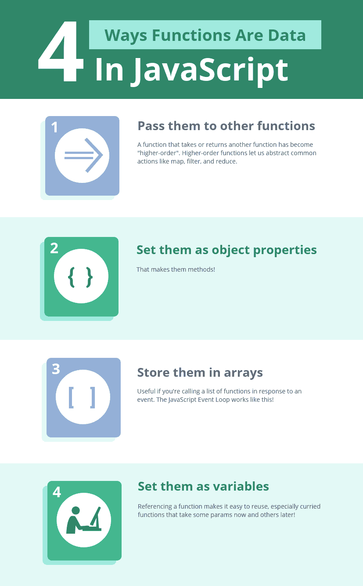
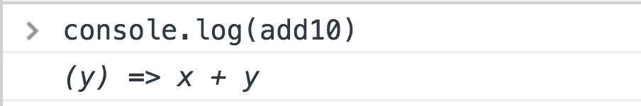
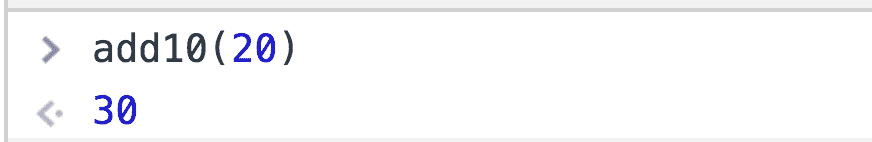

# JavaScript 高阶函数快速介绍

> 原文：<https://www.freecodecamp.org/news/a-quick-intro-to-higher-order-functions-in-javascript-1a014f89c6b/>

### 高阶函数

接受和/或返回另一个函数的函数称为**高阶函数**。

它是更高阶的,因为它不是字符串、数字或布尔值，而是对函数进行操作的*更高阶的*。相当 meta。

使用 JavaScript 中的函数，您可以

*   将它们存储为变量
*   在数组中使用它们
*   将它们指定为对象属性(方法)
*   将它们作为参数传递
*   从其他函数返回它们

*像任何其他数据一样*。这是这里的关键。

### 函数对数据进行操作

#### 字符串是数据

```
sayHi = (name) => `Hi, ${name}!`;
result = sayHi('User');

console.log(result); // 'Hi, User!' 
```

#### 数字是数据

```
double = (x) => x * 2;
result = double(4);

console.log(result); // 8 
```

#### 布尔是数据

```
getClearance = (allowed) => (allowed ? 'Access granted' : 'Access denied');

result1 = getClearance(true);
result2 = getClearance(false);

console.log(result1); // 'Access granted'
console.log(result2); // 'Access denied' 
```

#### 对象是数据

```
getFirstName = (obj) => obj.firstName;

result = getFirstName({
  firstName: 'Yazeed'
});

console.log(result); // 'Yazeed' 
```

#### 数组是数据

```
len = (array) => array.length;
result = len([1, 2, 3]);

console.log(result); // 3 
```

在每一种主流语言中，这 5 种类型都是一等公民。

是什么让他们成为一流的？你可以传递它们，把它们存储在变量和数组中，用它们作为计算的输入。你可以像使用任何数据一样使用它们。

### 函数也可以是数据



#### 作为参数的函数

```
isEven = (num) => num % 2 === 0;
result = [1, 2, 3, 4].filter(isEven);

console.log(result); // [2, 4] 
```

看看`filter`怎么用`isEven`来决定保留哪些数字？`isEven`、*一个函数*，是另一个函数的参数*。*

它由`filter`为每个数字调用，并使用返回值`true`或`false`来确定一个数字是应该保留还是丢弃。

#### 返回函数

```
add = (x) => (y) => x + y; 
```

`add`需要两个参数，但不是一次全部。这是一个只要求`x`的函数，返回一个只要求`y`的函数。

同样，这是因为 JavaScript 允许函数作为返回值——就像字符串、数字、布尔值等。

如果您愿意，您仍然可以通过双重调用立即提供`x`和`y`

```
result = add(10)(20); 
```

```
console.log(result); // 30 
```

或者现在`x`以后`y`:

```
add10 = add(10);
result = add10(20);

console.log(result); // 30 
```

让我们倒回上一个例子。`add10`是用一个参数调用`add`的结果。尝试在控制台中记录它。



`add10`是取`y`并返回`x + y`的函数。当您提供`y`后，它会快速计算并返回您的最终结果。



### 更高的可重用性

大概 HOFs 最大的好处就是更大的可重用性。没有它们，JavaScript 的首要数组方法——`map`、`filter`和`reduce`——就不会存在！

这是用户列表。我们要用他们的信息做一些计算。

```
users = [
  {
    name: 'Yazeed',
    age: 25
  },
  {
    name: 'Sam',
    age: 30
  },
  {
    name: 'Bill',
    age: 20
  }
]; 
```

#### 地图

没有高阶函数，我们总是需要循环来模仿`map`的功能。

```
getName = (user) => user.name;
usernames = [];

for (let i = 0; i < users.length; i++) {
  const name = getName(users[i]);

  usernames.push(name);
}

console.log(usernames);
// ["Yazeed", "Sam", "Bill"] 
```

或者我们可以这样做！

```
usernames = users.map(getName);

console.log(usernames);
// ["Yazeed", "Sam", "Bill"] 
```

#### 过滤器

在一个没有 HOF 的世界里，我们仍然需要循环来重新创建`filter`的功能。

```
startsWithB = (string) => string.toLowerCase().startsWith('b');

namesStartingWithB = [];

for (let i = 0; i < users.length; i++) {
  if (startsWithB(users[i].name)) {
    namesStartingWithB.push(users[i]);
  }
}

console.log(namesStartingWithB);
// [{ "name": "Bill", "age": 20 }] 
```

或者我们可以这样做！

```
namesStartingWithB = users.filter((user) => startsWithB(user.name));

console.log(namesStartingWithB);
// [{ "name": "Bill", "age": 20 }] 
```

#### 减少

是的，reduce 也是…没有高阶函数就做不了多少酷的东西！！？

```
total = 0;

for (let i = 0; i < users.length; i++) {
  total += users[i].age;
}

console.log(total);
// 75 
```

这个怎么样？

```
totalAge = users.reduce((total, user) => user.age + total, 0);

console.log(totalAge);
// 75 
```

### 摘要

*   字符串、数字、布尔值、数组和对象可以存储为变量、数组和属性或方法。
*   JavaScript 以同样的方式对待函数。
*   这允许对其他函数进行操作的函数:**高阶函数**。
*   Map、filter 和 reduce 就是最好的例子——它们使转换、搜索和求和列表等常见模式变得更加容易！

如果你想聊天，我在推特上。下次见！

保重，

亚泽德

【yazeedb.com】T4