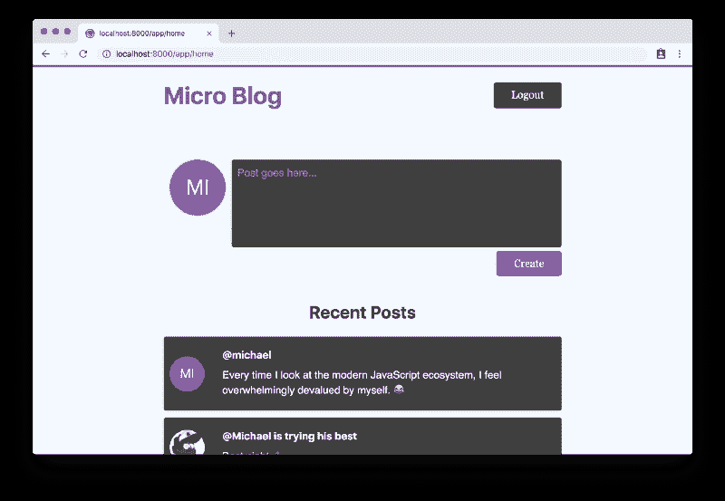
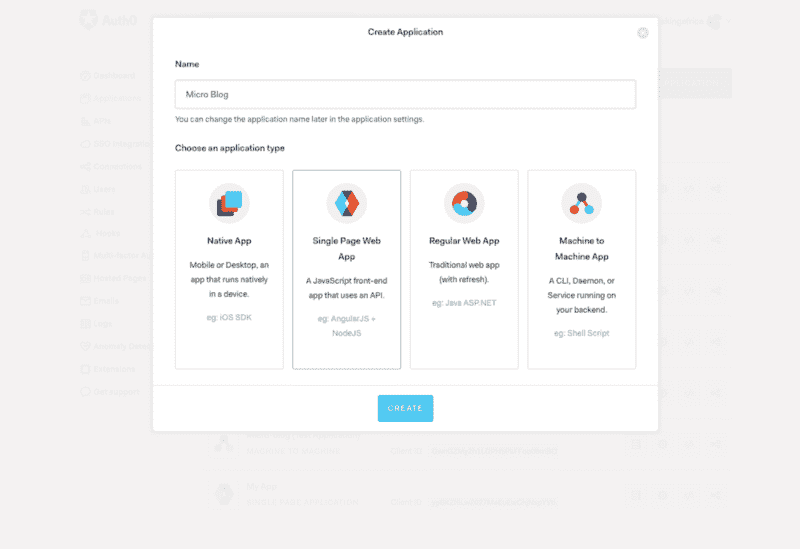
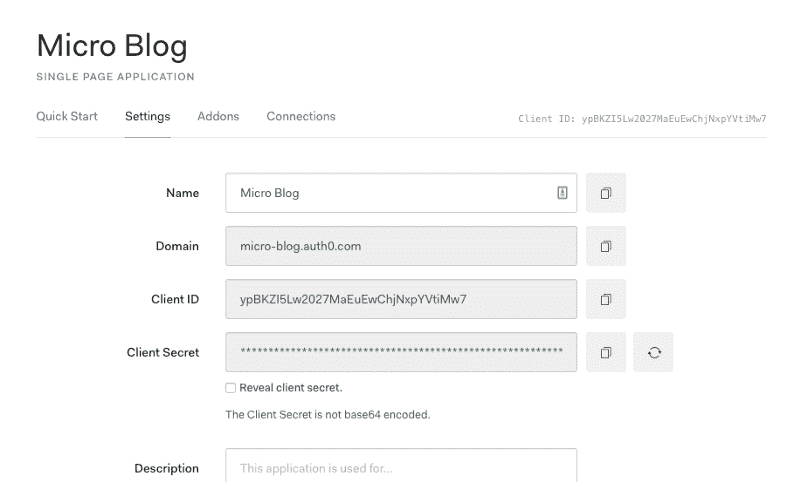
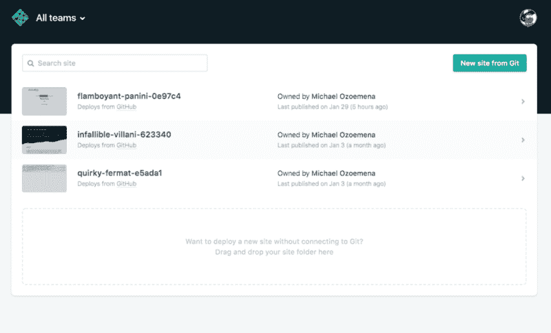
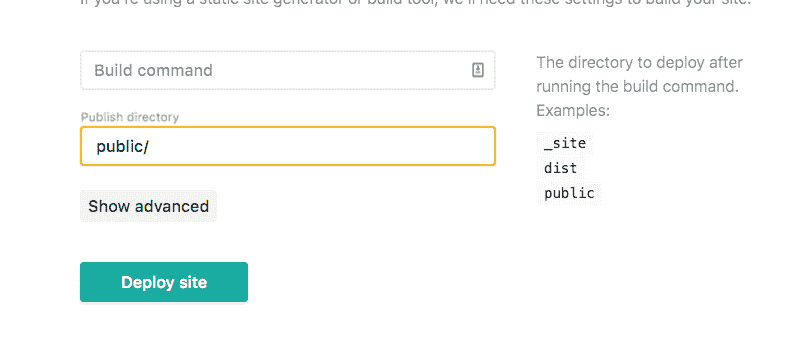
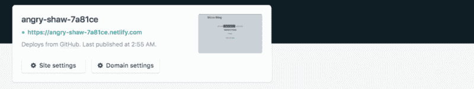

# 如何用 Auth0 设置 GatsbyJS 认证

> 原文：<https://www.freecodecamp.org/news/how-to-set-up-gatsbyjs-authentication-with-auth0-d07abdd5a4f4/>

迈克尔·奥祖梅纳

# 如何用 Auth0 设置 GatsbyJS 认证


#### TL；速度三角形定位法(dead reckoning)

GatsbyJS 是一个使用 GraphQL 和 ReactJS 的框架，使您能够创建功能丰富、速度超快的动态 web 应用程序。它让您能够从几乎任何地方使用数据，并在您的应用程序中使用它们。在本教程中，我将向您展示如何使用 Auth0，它是一个身份验证和授权平台，向您的 GatsbyJS 应用程序和 Netlify 上的无服务器功能添加身份验证。

我假设您至少对 React、Node 和 GraphQL 有基本的了解。

如果你想看看源代码，这里有 Github 库。

#### 输入 GatsbyJS。

创建于 2015 年的 [Gatsby](https://www.gatsbyjs.com) 是一个用 React 建立网站的简单方法。今天，盖茨比被用来建立网站，如博客、作品集页面，甚至电子商务应用程序。Gatsby 站点以其惊人的速度而闻名，这是因为当你使用 Gatsby 构建一个网站时，它提供了大量现成的性能优化，不像其他一些前端框架让你去想办法让你的网站更有性能。盖茨比快速的秘密在于它遵循 PRPL 建筑模式，代表着:

*   **使用`<link prelo` ad >和 http/2 为初始 URL 路由推送**关键资源。
*   **渲染**初始路线。
*   **预缓存**剩余路线。
*   **延迟加载**并按需创建剩余路线。

它是 Google 为构建和服务渐进式网络应用(PWAs)而开发的一种模式，强调应用交付和启动的性能。你可以[在这里](https://developers.google.com/web/fundamentals/performance/prpl-pattern/)阅读更多关于这个模式的内容。

#### 什么是 Auth0？

[Auth0](https://auth0.com) ，读作“Auth Zero”是一个健壮的认证和授权平台。它可以非常轻松地将用户注册、密码检索、登录、社交登录、多因素身份验证、企业登录、单点登录等功能添加到您的生产应用中。

Auth0 通过优秀的博客帖子和强大且易于理解的文档，密切关注开发人员的体验。使用 Auth0，您可以利用各种身份标准:

*   **OAuth 1**
*   **OAuth 2**
*   **打开 ID 连接**
*   **JSON 网络令牌(JWT)**
*   **安全断言标记语言(SAML)**
*   **WS-Federation**

在本教程中，我们将重点关注使用 **JSON Web 令牌**和社交登录与 **OAuth 2** 的组合。

#### 无服务器功能和网络效率。

Netlify 是一个平台，可以让你部署你的项目，而不用担心某些开销，如持续部署、HTTP 证书和更多的，它是作为一种部署和管理没有后端的静态网站的方式而创建的。

现在，因为不是每个人都想部署一个静态网站，需要支持后端，Netlify 增加了一个称为“无服务器功能”的功能，这是后端，你不必担心服务器基础设施。

在幕后，Netlify 函数位于您和所谓的亚马逊 Web 服务(AWS) Lambda 之间，这是真正的“无服务器”发生的地方，它位于亚马逊的 AWS 云平台上。Netlify 函数有助于简化您的工作，因此您不必直接与 AWS 打交道，还可以继续使用 Netlify 的所有其他酷功能，如持续部署。

“无服务器”一词并不意味着没有服务器；这意味着作为开发人员，您不必担心服务器基础设施(物理的和其他的)。

你可以阅读更多关于[网络生活](https://www.netlify.com/)和他们的[无服务器功能](https://www.netlify.com/features/functions/)。

#### 我们的应用:微博。



我们的应用程序叫做“微博”。这是一个允许用户创建简短、频繁的帖子的平台。每个帖子都包含一些文本内容、用户名和发帖人的个人资料图像。

任何人都可以打开 web 应用程序，查看其他人的帖子，但要自己发帖，他们需要登录。该应用程序支持社交登录和电子邮件登录。

如果你已经熟悉了大部分内容，并且想看代码，你可以去 Github 上的[源代码。](https://github.com/THEozmic/micro-blog)

#### 构建前端。

我们的前端是一个 GatsbyJS 应用程序，这意味着我们需要做的第一件事是从 npm 安装 Gatsby CLI 节点包。

**注意:**使用节点版本"> = 6.9.0 < 7.0.0 || > = 8.9.0 "否则当你尝试创建一个新的 Gatsby 站点时会得到一个错误，这是因为依赖项" css-loader@1.0.1 "。

```
# install the Gatsby CLI globallynpm install -g gatsby-cli
```

```
# create a new Gatsby site using the default startergatsby new micro-blog
```

运行完命令后，您应该能够进入名为“微博”的目录，该目录与您执行上述命令的位置相关。

```
cd micro-blog
```

当您查看这个目录的内容时，您会发现大量生成的内容。此时，您可以启动您的 Gatsby 站点并查看它的工作情况。为此，在您的终端中运行以下命令:

```
gatsby develop
```

这将在`[http://localhost:8000/](http://localhost:8000/)`启动你的 Gatsby 网站。

下一步是添加和修改特定于我们的应用程序的内容。

我们从`gatsby-config.js`开始。将文件内容替换为:

您可能想要更新“<your name="">”作者占位符值。</your>

这个文件包含你的 Gatsby 应用程序设置，比如你的站点元数据和插件。这是 Gatsby 在你启动应用程序时寻找的一个非常重要的文件。在应用程序中，我们可以使用 GraphQL 来查询这个文件的内容。

接下来，`src/components/header.js`:

这个文件是我们的共享头组件。现在，这里正在发生一些事情:

*   我们正在从`gatsby`库导入一些东西:`Link`和`navigate`。`Link`是一个 React 组件，用于链接到应用中的其他页面，如“/app/home”，而`navigate`是一个接受 URL 并以编程方式将用户导航到指定 URL 的功能。
*   `isLoggedIn`、`logout`和`getUserNickname`分别是检查用户是否登录、注销用户以及获取登录用户的昵称以供显示的方法。
*   `Button`是一个为用户显示按钮元素的组件。它接受几个帮助我们轻松赋予按钮不同外观的道具。

下面是`Button`的样子:

正如你将看到的，我们将会大量使用[风格的组件](https://emotion.sh/)，特别是`emotion`，它是许多支持 GatsbyJS 的 CSS-in-JS 包之一。

稍后，我们将看一看`src/services/auth.js`。

下一个要查看的重要文件是`/src/components/layout.js`:

这个文件是我们的应用程序的包装文件。它包括页眉、页脚，并呈现传递给它的子级。我们也看到从`gatsby`进口的`graphql`包和`StaticQuery`组件在一起。`StaticQuery`接受一个`query`属性，它是一个 GraphQL 查询。从`query`解析的任何值都可以在`StaticQuery`组件的渲染属性中使用。

仔细看看这个查询，我们可以看到它正在从`gatsby-config.js`文件中获取数据。

我们附带的 CSS `/src/components/layouts.css`与生成的 CSS 几乎相同，唯一的区别是第 8 行:

```
body {
```

```
 margin: 0;
```

```
 background-color: #f2f9ff;
```

```
}
```

让我们暂时离开`/src/components`目录，看看`/src/pages/index.js`:

`/src/pages/`中的所有文件都成为你 Gatsby 应用中的页面。例如，`index.js`成为主页，`/src/pages/app/home.js`成为`[http://yourdomain.com/app/home](http://yourdomain.com/app/home)`。

在我们的主页上，我们希望我们的用户看到最近的帖子，并要求他们登录或注册，如果他们想创建一个帖子。

为了获得我们最近的帖子，我们需要`axios`，这是一个基于 promise 的库，用于用 JavaScript 发出网络请求。通过在您的终端中运行以下命令来安装`axios`:

```
npm install axios
```

当我们的组件挂载时，我们检查用户是否登录，并将他们重定向到`/app/home`,因为如果他们登录了，我们不希望他们出现在这个页面上。不可否认，这是一种相当幼稚的方法，我们可以使用“受保护的路线”来代替。使用“受保护的路径”意味着这个组件根本没有机会被挂载。由于这个项目的规模很小，我决定不使用受保护的路线。

如果你想在你的盖茨比应用程序中实现受保护的路线，请参考盖茨比官方网站上的[本指南](https://www.gatsbyjs.org/docs/authentication-tutorial/#creating-client-only-routes)。

当组件挂载时，我们创建一个请求来获取 posts，然后用返回的数据更新状态。更新状态会导致我们的组件重新呈现子组件`RecentPosts`,因为它使用了所述状态。

注意，获取帖子数据的网络请求中的 URI 是一个环境变量`process.env.API_URI`。这些环境变量不是节点应用程序中常见的典型环境变量。为了创建这些环境变量，在 Gatsby 应用程序根目录中需要两个文件:`env.production`和`env.development`。当您启动应用程序时，Gatsby 会在适当的环境中自动加载这些文件。

正如我前面提到的，这些环境变量与您的节点环境变量不同，它们的不同之处在于它们不是您通常在`.gitignore`文件中排除的私有文件。当您想要部署应用程序时，您必须推送这些文件，因为 GatsbyJS 需要在启动时读取这些文件。

我的看起来像:

```
AUTH0_DOMAIN=micro-blog.auth0.com
```

```
AUTH0_CLIENTID=cIovhIQvYOr6fk3yhDtKjB5EiIvLevxf
```

```
REDIRECT_URI='http://localhost:8000/callback'
```

```
API_URI='http://localhost:9000/.netlify/functions/'
```

在生产中，情况有所不同:

```
AUTH0_DOMAIN=micro-blog.auth0.com
```

```
AUTH0_CLIENTID=cIovhIQvYOr6fk3yhDtKjB5EiIvLevxf
```

```
REDIRECT_URI='https://angry-shaw-7a81ce.netlify.com/callback'
```

```
API_URI='https://angry-shaw-7a81ce.netlify.com/.netlify/functions/'
```

为了给你自己的应用程序获取这些值，你需要[创建一个 Auth0 帐户](https://auth0.com/signup)，如果你还没有的话。

请注意，您可以免费使用 Auth0 的有限功能。

创建帐户后，登录您的 Auth0 [管理仪表板](https://manage.auth0.com/)并创建一个新的 Auth0 应用程序。你可以点击应用菜单项，然后点击**创建应用**按钮。您可以将应用程序名称从“我的应用程序”更新为您想要使用的任何名称。如果您愿意，可以在以后更改它。就我而言，我使用“微博”。

接下来，您选择“单页 Web 应用程序”并点击**创建**。这将立即创建您的应用程序。



一旦你完成创建你的应用程序，你应该导航到“设置”，在那里你会找到你的`**AUTH0_CLIENTID**` 和`**AUTH0_DOMAIN**` 值。



**注:**为你的`.env.production`，此时你还没有`**REDIRECT_URI**`**`**API_URI**`**。稍后，在我们创建 Netlify 应用程序之后，我们将获得应用程序 URL，然后我们可以将它适当地放在那里。****

****现在，我们来看看`src/components/recentPosts.js`:****

****同样，这里我们使用了样式化的组件。我们还利用 React 生命周期方法`shouldComponentUpdate`来防止在另一个组件中使用`RecentPosts`组件时不必要的重新渲染。****

****当用户单击登录按钮时，我们将用户导航到 Auth0 登录页面。在他们通过身份验证后，我们将用户重定向到我们的应用程序中一个名为`/callback`的 URL，在那里我们检查用户是否已经正确登录，然后将他们的详细信息保存在`localStorage`中。下面是`/callback`页面的样子:****

****我们调用`handleAuthentication`方法，该方法将从 URL 获取数据，解析它，将提取的数据保存到`localStorage`，然后调用`() => naviage('/app/hom`e’)方法将用户重定向到主应用程序。****

****现在，我们来看一下`/pages/app/home.js`页面，只有登录的用户才能访问:****

****这里没有多少新东西。我唯一想提的是:****

*   ****我们在`handlePostSubmit`方法中创建新的帖子，在那里，我们进行一个常规的`axios`调用，但是带有一个包含 JWT 令牌“id_token”的`headers`选项。我们这样做是因为，在我们的无服务器功能中，我们将需要头中的值来验证请求，确保只有登录的用户才能创建新的帖子，并且保存在客户端的令牌实际上是有效的，没有被篡改。这大大提高了我们的应用程序的安全性和可靠性。****
*   ****当用户没有正确登录并成功登陆该页面时，我们会将他们重定向到`/`。我们在`componentDidMount`生命周期方法中这样做。同样，[保护路线](https://www.gatsbyjs.org/docs/authentication-tutorial/#creating-client-only-routes)在你的生产应用中是一个更好的选择。****

****最后，我们到了`/src/services/auth.js`。我们已经在整个应用程序中使用了这个文件中的函数，现在是时候来看看它了:****

****在这个文件中，我们使用 Auth0 的 JavaScript 库来处理我们应用程序的认证部分。在您的终端中运行以下命令，将其添加到您的应用中:****

```
**`npm install auth0-js`**
```

****你在这个文件中看到的下一件事是`isBrowser`的创建，它表明我们的文件当前是否正在浏览器的上下文中执行。这很重要，因为在构建过程中，您可能会在尝试调用类似于`window.localStorage`的东西时遇到错误。****

****让我们看看这个文件中的一些方法:****

****在我们的用户登录后，`getUser`方法从先前存储在`localStorage`中的访问令牌获取用户详细信息。它使用`getAccessToken`方法获取存储的访问令牌。****

****当用户试图登录时，调用`handleLogin`方法。它将用户重定向到 Auth0 登录页面，一旦用户登录，该页面又将用户重定向到`/callback`。****

****`isLoggedIn`方法检查在`localStorage`中保存为`expiresAt`的 JWT 令牌“id_token”的截止日期是否已经超过，从而使用户的会话无效。****

****`handleAuthentication`方法就是您在`/callback`页面中看到的方法。这个方法解析 URL 散列并获得重要的值，我们稍后将这些值保存在`setSession`方法的`localStorage`中。****

****最后，`logout`方法通过删除保存的凭证来注销用户。这工作得很好，但是你可以更进一步，在 Auth0 上调用一个端点，这将使会话完全无效。为了这个教程我就说到这里了。****

****最后，我们在`/src/components/seo.js`更新第 6 行:****

```
**`const SEO = ({ description = null, lang = "eng", meta = [], keywords = [], title }) =&gt; {`**
```

****使其使用 ES6 箭头函数和默认值。****

#### ****构建后端。****

****接下来，我们将构建一个 API 来为帖子列表提供服务并收集新帖子。它们是托管在 Netlify 上的无服务器功能。我们的 API 需要做一些事情:****

*   ****有端点服务的帖子列表:`/.netlify/functions/postsRead`。****
*   ****有端点收藏新帖:`/.netlify/functions/postsCreate`。****
*   ****使用 Auth0 验证创建新帖子的请求。****

****首先，我们需要安装几个 npm 软件包:****

```
**`npm install netlify-lambda mongoose jwks-rsa jsonwebtoken dotenv`**
```

****下一步是在 Gatsby 应用程序的根目录下创建一个名为`utils`的目录。在那个目录里面是我们的不完全是 API 的文件所在的地方。其中一个文件是我们的`/utils/db.js`文件:****

****在这个文件中，我们建立了到 MongoDB 数据库的连接。****

****这里缺少的东西是我们的`.env`文件(是的，第三个！).我的看起来像这样:****

```
**`DATABASE_PROD='mongodb://<username>:<password>@<db_url>'DATABASE_DEV='mongodb://localhost:27017/micro-blog'`**
```

****我使用 [mLab](https://mlab.com) 在线托管我的数据库，并且我在我的开发机器上安装了 [MongoDB](https://www.mongodb.com/) 。你也可以按照这个[指南在你的开发机器上安装 MongoDB](https://docs.mongodb.com/v3.2/administration/install-community/) 。****

****下一个要关注的文件是`/utils/index.js`，这个文件包含了一些我们将在网络函数中使用的其他方法。****

****第一种方法`respondWith`是抽象出响应请求的逻辑，这些请求到达我们的网络功能。第二种方法`verifyToken`是验证在请求头中发送的令牌是否有效。****

****最后，进入网络功能。在您的应用程序根目录下创建一个名为`functions`的新目录(或者任何您认为有吸引力的目录)，并在该目录下创建三个文件:****

*   ****`postsCreate.js`****
*   ****`postsRead.js`****
*   ****`postsModel.js`****

****前两个文件将保存我们创建和读取文章的实现，而最后一个文件将描述我们的文章数据库模式。****

****下面是`postsModel.js`的样子:****

****和`postsCreate.js`:****

****最后，`postsRead.js`:****

****现在，为了在本地运行我们的函数，我们首先在我们的`package.json`文件中创建一个新脚本:****

```
**`"scripts": {// other scripts`**
```

```
**`"start:lambda": "NODE_ENV=development netlify-lambda serve functions"`**
```

```
**`}`**
```

****我使用“服务函数”是因为“函数”目录是我放网络函数的地方，你的目录可能不同。****

****创建脚本后，我们在终端中运行它:****

```
**`npm run start:lambda`**
```

#### ******部署应用。******

****我们要做的最后一件事是将我们的应用程序部署到 Netlify，为此我们需要首先在我们的应用程序根目录上创建一个名为`netlify.toml`的文件。该文件是一个配置文件，Netlify 将在尝试构建和部署应用程序时读取该文件。该文件如下所示:****

```
**`[build]  functions = "lambda"  Command = "npm run prod"`**
```

****`functions = lambda`指示 Netlify 将构建的函数放在一个名为“lambda”的文件夹中。而`Command = "npm run prod"`指定运行一个脚本来构建整个应用程序。这非常重要，因为我们需要构建我们的 Gatsby 应用程序和 Netlify 函数。这是我们的`package.json`中的脚本:****

```
**`"scripts": {`**
```

```
**`// previous scripts`**
```

```
**`"build:lambda": "netlify-lambda build functions",`**
```

```
**`"prod": "NODE_ENV=production npm run build; npm run build:lambda"`**
```

****在这里，我们首先运行`npm run build`构建我们的 Gatsby 应用程序，然后运行`npm run build:lambda`构建我们的 Netlify 函数。同样，这里我使用“functions ”,因为这是存放我的网络函数的文件夹的名称。****

****完成所有这些后，我们创建一个新的 Github 库，并将代码放在那里。如果您还没有 Netlify 帐户，请创建一个新的 Netlify 帐户。在这种情况下，我更喜欢使用 Github 注册选项。当你登录后，点击 Git 中的**新网站按钮，这将引导你创建一个新的 Netlify 应用程序。******

********

****如果在创建新的 Netlify 应用程序的过程中，您没有在显示的列表中找到您的存储库，请确保您已经授予 Netlify 对您的所有存储库的访问权限，或者至少是对该存储库的访问权限。****

********

****在部署之前，点击**显示高级**按钮，创建一个名为`DATABASE_PROD`的新变量，将值设置为`.env`文件中的值。请记住，此文件已从您的`.gitignore`中的应用中排除，因此您的应用无法读取此值，除非您这样做。****

****另外，添加`public/`作为发布目录，因为这是 Gatsby 构建和转储文件的目录。****

********

****Netlify 将自动处理这些功能的部署。部署应用程序后，您应该会在仪表盘上看到应用程序的 URL。****

********

****现在您已经有了应用程序的 URL，您可以相应地更新您的`.env.production`文件。****

****感谢阅读！****